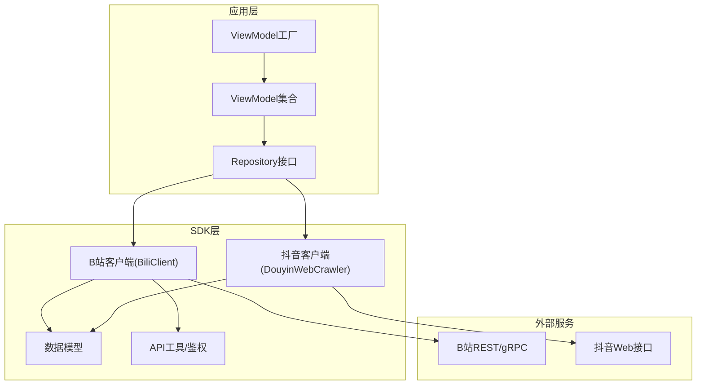
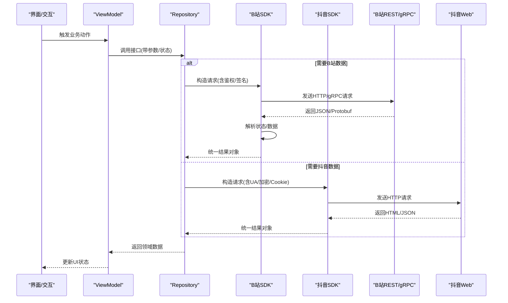
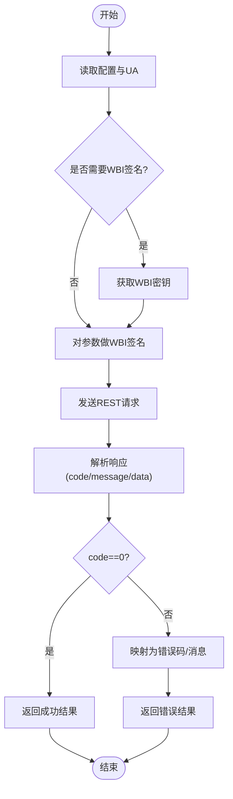
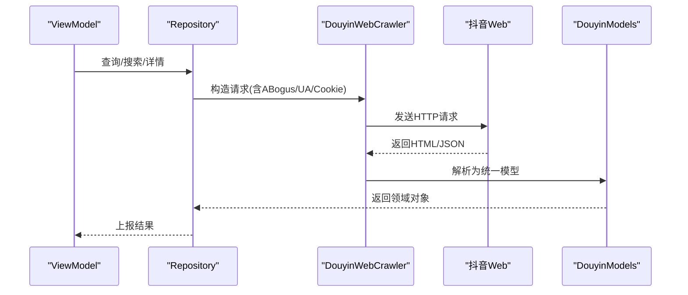
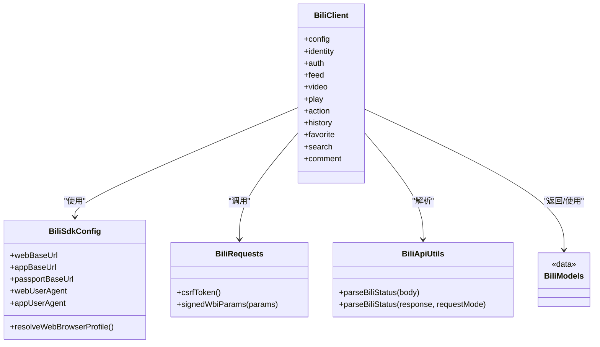
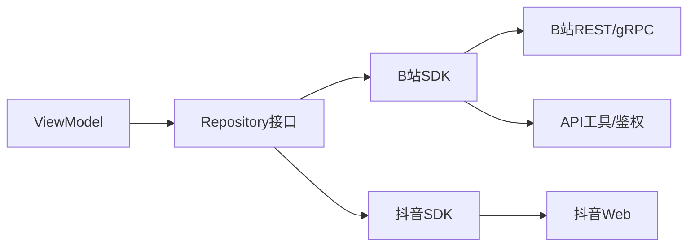

# API参考

<cite>
**本文引用的文件**
- [README.md](file://README.md)
- [bili_error_codes.md](file://docs/bili_error_codes.md)
- [BiliSdkConfig.kt](file://sdk/bili/src/main/java/com/lightningstudio/watchrss/sdk/bili/BiliSdkConfig.kt)
- [BiliClient.kt](file://sdk/bili/src/main/java/com/lightningstudio/watchrss/sdk/bili/BiliClient.kt)
- [BiliRequests.kt](file://sdk/bili/src/main/java/com/lightningstudio/watchrss/sdk/bili/BiliRequests.kt)
- [BiliApiUtils.kt](file://sdk/bili/src/main/java/com/lightningstudio/watchrss/sdk/bili/BiliApiUtils.kt)
- [BiliModels.kt](file://sdk/bili/src/main/java/com/lightningstudio/watchrss/sdk/bili/BiliModels.kt)
- [BiliAccountStore.kt](file://sdk/bili/src/main/java/com/lightningstudio/watchrss/sdk/bili/BiliAccountStore.kt)
- [readme.md](file://docs/BiliBili_API/grpc_api/readme.md)
- [DouyinWebCrawler.kt](file://sdk/douyin/src/main/java/com/lightningstudio/watchrss/sdk/douyin/DouyinWebCrawler.kt)
- [DouyinModels.kt](file://sdk/douyin/src/main/java/com/lightningstudio/watchrss/sdk/douyin/DouyinModels.kt)
- [ABogus.kt](file://sdk/douyin/src/main/java/com/lightningstudio/watchrss/sdk/douyin/ABogus.kt)
- [EncryptedDouyinCookieStore.kt](file://sdk/douyin/src/main/java/com/lightningstudio/watchrss/sdk/douyin/EncryptedDouyinCookieStore.kt)
- [BiliViewModelFactory.kt](file://app/src/main/java/com/lightningstudio/watchrss/ui/viewmodel/BiliViewModelFactory.kt)
- [AppViewModelFactory.kt](file://app/src/main/java/com/lightningstudio/watchrss/ui/viewmodel/AppViewModelFactory.kt)
</cite>

## 目录
1. [简介](#简介)
2. [项目结构](#项目结构)
3. [核心组件](#核心组件)
4. [架构总览](#架构总览)
5. [详细组件分析](#详细组件分析)
6. [依赖分析](#依赖分析)
7. [性能考量](#性能考量)
8. [故障排查指南](#故障排查指南)
9. [结论](#结论)
10. [附录](#附录)

## 简介
本API参考面向Android WatchRSS项目，系统性梳理平台API与内部API设计，覆盖B站REST与gRPC接口、抖音Web爬取接口、内部Repository与ViewModel接口规范、安全与鉴权机制、版本与兼容策略、测试与调试方法，以及性能优化建议。读者可据此快速集成与扩展WatchRSS的多源内容能力。

## 项目结构
- SDK层：封装B站与抖音的网络访问、模型定义与鉴权辅助，提供统一的客户端入口与工具函数。
- 应用层：通过ViewModel与Repository对接SDK，负责UI状态管理与业务编排。
- 文档与协议：B站API文档与gRPC协议定义，提供接口规范与元数据要求。

图表来源
- [BiliClient.kt:1-20](file://sdk/bili/src/main/java/com/lightningstudio/watchrss/sdk/bili/BiliClient.kt#L1-L20)
- [BiliViewModelFactory.kt:1-57](file://app/src/main/java/com/lightningstudio/watchrss/ui/viewmodel/BiliViewModelFactory.kt#L1-L57)
- [AppViewModelFactory.kt:1-63](file://app/src/main/java/com/lightningstudio/watchrss/ui/viewmodel/AppViewModelFactory.kt#L1-L63)

章节来源
- [README.md:1-40](file://README.md#L1-L40)

## 核心组件
- B站SDK核心
  - 客户端入口：BiliClient，聚合identity/auth/feed/video/play/action/history/favorite/search/comment等子域。
  - 配置：BiliSdkConfig，集中管理域名、UA、鉴权参数与默认浏览器配置。
  - 请求工具：BiliRequests，提供CSRF与WBI签名参数构造。
  - 响应解析：BiliApiUtils，统一解析B站返回的状态结构。
  - 数据模型：BiliModels，涵盖视频、动态、分页等核心实体。
  - 账号存储：BiliAccountStore，抽象账号与Cookie的读写与更新。
- 抖音SDK核心
  - Web爬取：DouyinWebCrawler，封装请求与解析流程。
  - 模型与工具：DouyinModels、ABogus、EncryptedDouyinCookieStore，支撑数据结构与反爬策略。
- 应用层ViewModel与Repository
  - ViewModel工厂：BiliViewModelFactory与AppViewModelFactory，按类型注入对应仓库与状态句柄。
  - Repository接口：由应用侧定义契约，供ViewModel调用，屏蔽SDK细节。

章节来源
- [BiliClient.kt:1-20](file://sdk/bili/src/main/java/com/lightningstudio/watchrss/sdk/bili/BiliClient.kt#L1-L20)
- [BiliSdkConfig.kt:1-35](file://sdk/bili/src/main/java/com/lightningstudio/watchrss/sdk/bili/BiliSdkConfig.kt#L1-L35)
- [BiliRequests.kt:1-21](file://sdk/bili/src/main/java/com/lightningstudio/watchrss/sdk/bili/BiliRequests.kt#L1-L21)
- [BiliApiUtils.kt:1-45](file://sdk/bili/src/main/java/com/lightningstudio/watchrss/sdk/bili/BiliApiUtils.kt#L1-L45)
- [BiliModels.kt:1-60](file://sdk/bili/src/main/java/com/lightningstudio/watchrss/sdk/bili/BiliModels.kt#L1-L60)
- [BiliAccountStore.kt:1-8](file://sdk/bili/src/main/java/com/lightningstudio/watchrss/sdk/bili/BiliAccountStore.kt#L1-L8)
- [DouyinWebCrawler.kt](file://sdk/douyin/src/main/java/com/lightningstudio/watchrss/sdk/douyin/DouyinWebCrawler.kt)
- [BiliViewModelFactory.kt:1-57](file://app/src/main/java/com/lightningstudio/watchrss/ui/viewmodel/BiliViewModelFactory.kt#L1-L57)
- [AppViewModelFactory.kt:1-63](file://app/src/main/java/com/lightningstudio/watchrss/ui/viewmodel/AppViewModelFactory.kt#L1-L63)

## 架构总览
下图展示应用层ViewModel如何通过Repository调用SDK，再经由B站REST/gRPC与抖音Web接口获取数据，并统一由API工具解析响应。

图表来源
- [BiliClient.kt:1-20](file://sdk/bili/src/main/java/com/lightningstudio/watchrss/sdk/bili/BiliClient.kt#L1-L20)
- [BiliApiUtils.kt:14-44](file://sdk/bili/src/main/java/com/lightningstudio/watchrss/sdk/bili/BiliApiUtils.kt#L14-L44)
- [DouyinWebCrawler.kt](file://sdk/douyin/src/main/java/com/lightningstudio/watchrss/sdk/douyin/DouyinWebCrawler.kt)

## 详细组件分析

### B站REST与gRPC接口规范
- REST接口
  - 基础地址与UA：通过BiliSdkConfig集中配置，默认HTTPS，携带桌面端UA或移动端UA。
  - 鉴权与签名
    - CSRF：从账号存储读取，用于部分接口。
    - WBI签名：若缺少WBI密钥，先拉取密钥再对参数做签名。
  - 响应解析：统一解析B站返回的code/message/data结构，非2xx时映射为负的HTTP状态码，便于上层判断。
- gRPC接口
  - 主机与元数据：支持grpc.biliapi.net与app.bilibili.com，需在Metadata中设置authorization、user-agent、设备与GAIA等信息。
  - 必填元数据：如x-bili-aurora-eid、x-bili-mid、x-bili-trace-id、authorization、buvid等；二进制字段需按规范编码。
  - 常用接口：播放链接、搜索、动态等，具体以proto定义为准。

图表来源
- [BiliSdkConfig.kt:13-26](file://sdk/bili/src/main/java/com/lightningstudio/watchrss/sdk/bili/BiliSdkConfig.kt#L13-L26)
- [BiliRequests.kt:5-20](file://sdk/bili/src/main/java/com/lightningstudio/watchrss/sdk/bili/BiliRequests.kt#L5-L20)
- [BiliApiUtils.kt:14-44](file://sdk/bili/src/main/java/com/lightningstudio/watchrss/sdk/bili/BiliApiUtils.kt#L14-L44)

章节来源
- [BiliSdkConfig.kt:1-35](file://sdk/bili/src/main/java/com/lightningstudio/watchrss/sdk/bili/BiliSdkConfig.kt#L1-L35)
- [BiliRequests.kt:1-21](file://sdk/bili/src/main/java/com/lightningstudio/watchrss/sdk/bili/BiliRequests.kt#L1-L21)
- [BiliApiUtils.kt:1-45](file://sdk/bili/src/main/java/com/lightningstudio/watchrss/sdk/bili/BiliApiUtils.kt#L1-L45)
- [readme.md:9-57](file://docs/BiliBili_API/grpc_api/readme.md#L9-L57)
- [readme.md:61-70](file://docs/BiliBili_API/grpc_api/readme.md#L61-L70)

### 抖音Web接口规范
- 爬取流程
  - 构造请求：设置合理的User-Agent与必要的头部。
  - 反爬策略：使用ABogus生成必要参数，必要时使用加密Cookie存储。
  - 解析与建模：统一解析返回内容为DouyinModels，便于后续处理。
- 安全与合规
  - 严格遵循robots.txt与网站条款，避免高频请求与敏感数据采集。
  - 对Cookie进行加密存储，防止泄露。

图表来源
- [DouyinWebCrawler.kt](file://sdk/douyin/src/main/java/com/lightningstudio/watchrss/sdk/douyin/DouyinWebCrawler.kt)
- [ABogus.kt](file://sdk/douyin/src/main/java/com/lightningstudio/watchrss/sdk/douyin/ABogus.kt)
- [EncryptedDouyinCookieStore.kt](file://sdk/douyin/src/main/java/com/lightningstudio/watchrss/sdk/douyin/EncryptedDouyinCookieStore.kt)
- [DouyinModels.kt](file://sdk/douyin/src/main/java/com/lightningstudio/watchrss/sdk/douyin/DouyinModels.kt)

章节来源
- [DouyinWebCrawler.kt](file://sdk/douyin/src/main/java/com/lightningstudio/watchrss/sdk/douyin/DouyinWebCrawler.kt)
- [ABogus.kt](file://sdk/douyin/src/main/java/com/lightningstudio/watchrss/sdk/douyin/ABogus.kt)
- [EncryptedDouyinCookieStore.kt](file://sdk/douyin/src/main/java/com/lightningstudio/watchrss/sdk/douyin/EncryptedDouyinCookieStore.kt)
- [DouyinModels.kt](file://sdk/douyin/src/main/java/com/lightningstudio/watchrss/sdk/douyin/DouyinModels.kt)

### 内部API设计与实现
- Repository接口定义
  - 应用层通过接口隔离数据源，ViewModel仅依赖Repository契约，便于替换B站/抖音实现与单元测试。
  - 示例契约：BiliRepositoryContract、RssRepository等，由应用侧定义，SDK侧提供实现。
- ViewModel接口与组件接口
  - ViewModel工厂：BiliViewModelFactory与AppViewModelFactory，按类型创建对应ViewModel并注入SavedStateHandle与仓库实例。
  - 状态与生命周期：ViewModel持有SavedStateHandle，确保配置变更与进程回收后的状态恢复。
- 数据模型与状态
  - B站：BiliModels提供视频、动态、分页等核心实体。
  - 抖音：DouyinModels提供统一的领域模型，便于UI渲染与业务处理。

图表来源
- [BiliClient.kt:1-20](file://sdk/bili/src/main/java/com/lightningstudio/watchrss/sdk/bili/BiliClient.kt#L1-L20)
- [BiliSdkConfig.kt:1-35](file://sdk/bili/src/main/java/com/lightningstudio/watchrss/sdk/bili/BiliSdkConfig.kt#L1-L35)
- [BiliRequests.kt:1-21](file://sdk/bili/src/main/java/com/lightningstudio/watchrss/sdk/bili/BiliRequests.kt#L1-L21)
- [BiliApiUtils.kt:1-45](file://sdk/bili/src/main/java/com/lightningstudio/watchrss/sdk/bili/BiliApiUtils.kt#L1-L45)
- [BiliModels.kt:1-60](file://sdk/bili/src/main/java/com/lightningstudio/watchrss/sdk/bili/BiliModels.kt#L1-L60)

章节来源
- [BiliViewModelFactory.kt:1-57](file://app/src/main/java/com/lightningstudio/watchrss/ui/viewmodel/BiliViewModelFactory.kt#L1-L57)
- [AppViewModelFactory.kt:1-63](file://app/src/main/java/com/lightningstudio/watchrss/ui/viewmodel/AppViewModelFactory.kt#L1-L63)
- [BiliModels.kt:1-60](file://sdk/bili/src/main/java/com/lightningstudio/watchrss/sdk/bili/BiliModels.kt#L1-L60)

### gRPC接口使用
- 主机与元数据
  - 主机：grpc.biliapi.net与app.bilibili.com，后者通常更快但参数配置受限。
  - 元数据：authorization、user-agent、x-bili-aurora-eid、x-bili-mid、x-bili-trace-id、buvid等；二进制字段按规范编码。
- 调用方式
  - 依据proto定义构造请求消息，设置Metadata后发起gRPC调用。
  - 响应解析遵循proto结构，结合应用层进行UI映射。
- 示例接口
  - 播放链接、搜索、动态等常用接口，具体字段以对应proto为准。

章节来源
- [readme.md:9-57](file://docs/BiliBili_API/grpc_api/readme.md#L9-L57)
- [readme.md:61-70](file://docs/BiliBili_API/grpc_api/readme.md#L61-L70)

### API使用示例（请求构建、参数传递、响应处理与错误处理）
- B站REST
  - 参数准备：通过BiliRequests构造带CSRF与WBI签名的参数。
  - 发起请求：使用BiliHttpClient发送请求。
  - 响应处理：使用BiliApiUtils解析状态与数据，非2xx映射为负HTTP码。
- gRPC
  - 元数据设置：按规范填充ASCII与二进制字段。
  - 请求发送：依据proto消息构造请求并发起调用。
  - 响应处理：解析proto消息，映射至领域模型。
- 抖音Web
  - 请求构造：设置UA、必要头部与ABogus参数。
  - 响应解析：统一为DouyinModels，便于后续处理。

章节来源
- [BiliRequests.kt:5-20](file://sdk/bili/src/main/java/com/lightningstudio/watchrss/sdk/bili/BiliRequests.kt#L5-L20)
- [BiliApiUtils.kt:14-44](file://sdk/bili/src/main/java/com/lightningstudio/watchrss/sdk/bili/BiliApiUtils.kt#L14-L44)
- [readme.md:30-57](file://docs/BiliBili_API/grpc_api/readme.md#L30-L57)
- [DouyinWebCrawler.kt](file://sdk/douyin/src/main/java/com/lightningstudio/watchrss/sdk/douyin/DouyinWebCrawler.kt)

### 安全考虑（认证机制、权限控制与数据保护）
- 认证机制
  - B站：支持access_key鉴权（gRPC）、Cookie与CSRF（REST）。
  - 抖音：使用ABogus参数与加密Cookie存储，降低被检测风险。
- 权限控制
  - 通过Repository接口隔离不同数据源，避免越权访问。
- 数据保护
  - 敏感信息（Cookie、access_key、ABogus参数）加密存储与传输。
  - 遵循最小化原则，仅采集必要字段。

章节来源
- [readme.md:20](file://docs/BiliBili_API/grpc_api/readme.md#L20)
- [BiliAccountStore.kt:1-8](file://sdk/bili/src/main/java/com/lightningstudio/watchrss/sdk/bili/BiliAccountStore.kt#L1-L8)
- [EncryptedDouyinCookieStore.kt](file://sdk/douyin/src/main/java/com/lightningstudio/watchrss/sdk/douyin/EncryptedDouyinCookieStore.kt)
- [ABogus.kt](file://sdk/douyin/src/main/java/com/lightningstudio/watchrss/sdk/douyin/ABogus.kt)

### 版本管理（向后兼容、废弃策略与迁移指南）
- 版本策略
  - 以libs.versions.toml为准，统一管理SDK与依赖版本。
  - 对外接口保持稳定，内部实现可迭代演进。
- 兼容性
  - REST接口兼容旧字段，新增字段向后兼容。
  - gRPC接口遵循proto兼容规则，避免破坏性变更。
- 废弃与迁移
  - 旧接口标注废弃，提供迁移指引与替代方案。
  - 迁移期间保留过渡期，逐步引导客户端升级。

章节来源
- [README.md:28-31](file://README.md#L28-L31)

## 依赖分析
- 组件耦合
  - ViewModel依赖Repository接口，Repository依赖SDK客户端，SDK依赖外部API与工具。
  - B站SDK内部模块职责清晰，客户端聚合各子域，便于扩展与维护。
- 外部依赖
  - OkHttp、Kotlinx Coroutines、BouncyCastle等，用于网络、协程与加密。
- 循环依赖
  - 当前结构无明显循环依赖，Repository与ViewModel通过接口解耦。

图表来源
- [BiliClient.kt:1-20](file://sdk/bili/src/main/java/com/lightningstudio/watchrss/sdk/bili/BiliClient.kt#L1-L20)
- [BiliViewModelFactory.kt:10-52](file://app/src/main/java/com/lightningstudio/watchrss/ui/viewmodel/BiliViewModelFactory.kt#L10-L52)
- [AppViewModelFactory.kt:9-62](file://app/src/main/java/com/lightningstudio/watchrss/ui/viewmodel/AppViewModelFactory.kt#L9-L62)

章节来源
- [sdk/bili/build.gradle.kts](file://sdk/bili/build.gradle.kts)
- [sdk/douyin/build.gradle.kts](file://sdk/douyin/build.gradle.kts)

## 性能考量
- 网络优化
  - 复用连接池，合理设置超时与重试策略。
  - 对gRPC优先选择app.bilibili.com以提升速度，必要时使用grpc.biliapi.net以获得更灵活的超时配置。
- 解析与序列化
  - 使用Kotlinx Serialization与Okio优化JSON解析性能。
  - gRPC使用Protobuf，减少序列化开销。
- 内存与电量
  - 抖音单次仅加载1条内容，降低内存占用与功耗。
  - B站动态预览仅展示文字+缩略图，避免视频播放带来的额外开销。

章节来源
- [README.md:22-24](file://README.md#L22-L24)
- [readme.md:16](file://docs/BiliBili_API/grpc_api/readme.md#L16)

## 故障排查指南
- 错误码说明
  - 应用内错误码：网络异常、缺少登录标识、默认收藏夹缺失、二维码失败、Cookie无效、播放参数缺失、播放地址为空等。
  - B站接口错误码：二维码过期等，其他正整数透传自B站或HTTP返回。
- 常见问题定位
  - REST：检查UA、Referer、CSRF与WBI签名是否正确，确认HTTP状态码映射。
  - gRPC：核对Metadata完整性与二进制字段编码，确认主机与超时配置。
  - 抖音：检查ABogus参数生成与Cookie有效性，避免触发风控。
- 日志与调试
  - 使用BiliDebugLog与日志上传功能，收集请求与响应上下文，便于定位问题。

章节来源
- [bili_error_codes.md:1-17](file://docs/bili_error_codes.md#L1-L17)

## 结论
本API参考系统化梳理了WatchRSS的B站与抖音接口、内部Repository与ViewModel设计、gRPC协议与安全机制，并提供了版本管理、性能优化与故障排查建议。建议在集成过程中严格遵循接口规范与安全策略，确保稳定性与可维护性。

## 附录
- API测试与调试
  - 使用日志上传与隐私说明页面，提交问题时附带请求上下文与错误码。
  - 对gRPC接口可借助BloomRPC等工具验证元数据与消息格式。
- 最佳实践
  - 保持对外接口稳定，内部实现持续演进。
  - 严格遵循最小化采集与加密存储原则，保障用户隐私与合规。