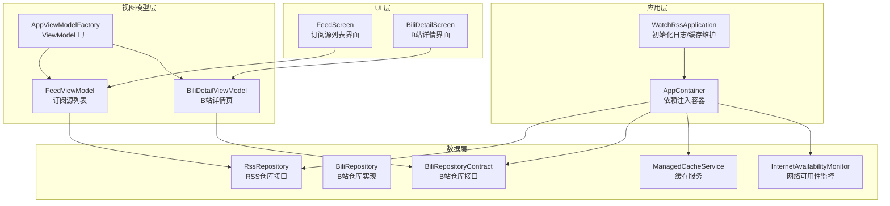
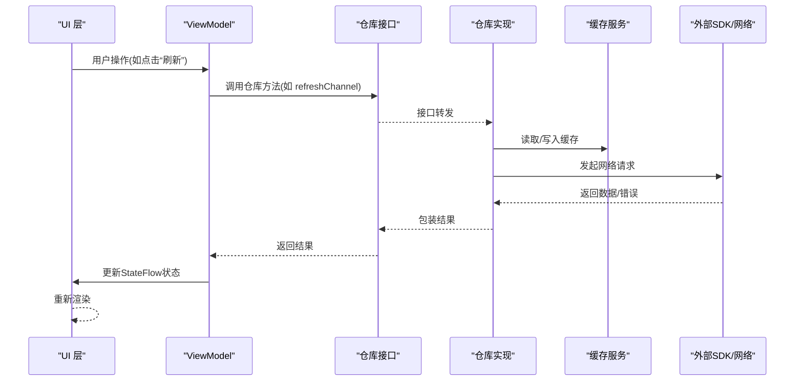
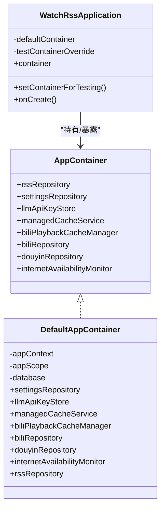
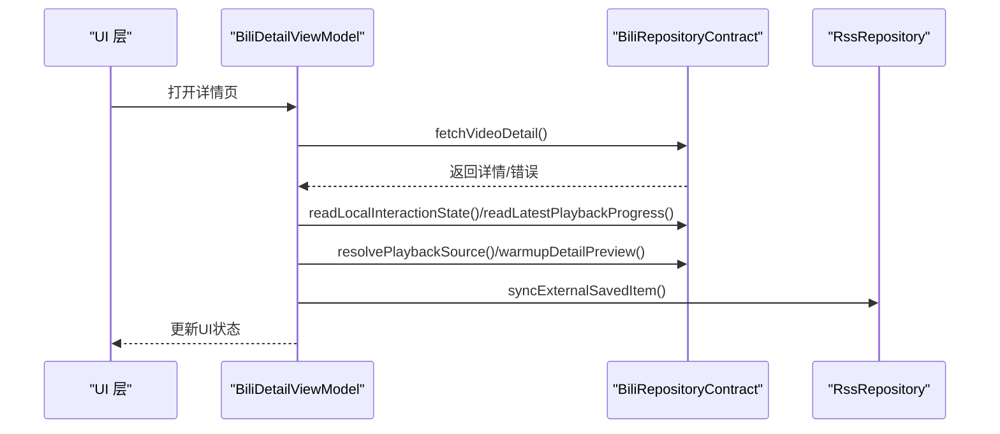
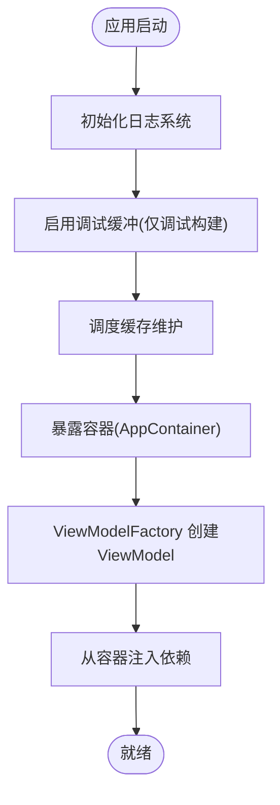
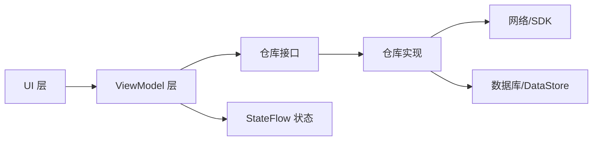

# 内部API

<cite>
**本文引用的文件**
- [WatchRssApplication.kt](file://app/src/main/java/com/lightningstudio/watchrss/WatchRssApplication.kt)
- [AppContainer.kt](file://app/src/main/java/com/lightningstudio/watchrss/data/AppContainer.kt)
- [BiliRepositoryContract.kt](file://app/src/main/java/com/lightningstudio/watchrss/data/bili/BiliRepositoryContract.kt)
- [BiliRepository.kt](file://app/src/main/java/com/lightningstudio/watchrss/data/bili/BiliRepository.kt)
- [FeedViewModel.kt](file://app/src/main/java/com/lightningstudio/watchrss/ui/viewmodel/FeedViewModel.kt)
- [BiliDetailViewModel.kt](file://app/src/main/java/com/lightningstudio/watchrss/ui/viewmodel/BiliDetailViewModel.kt)
- [AppViewModelFactory.kt](file://app/src/main/java/com/lightningstudio/watchrss/ui/viewmodel/AppViewModelFactory.kt)
- [libs.versions.toml](file://gradle/libs.versions.toml)
</cite>

## 目录
1. [简介](#简介)
2. [项目结构](#项目结构)
3. [核心组件](#核心组件)
4. [架构总览](#架构总览)
5. [详细组件分析](#详细组件分析)
6. [依赖关系分析](#依赖关系分析)
7. [性能考量](#性能考量)
8. [故障排查指南](#故障排查指南)
9. [结论](#结论)
10. [附录](#附录)

## 简介
本文件为 Android WatchRSS 项目的内部API文档，聚焦于应用内部的接口规范与实现约定，涵盖以下方面：
- Repository 接口定义与实现边界
- ViewModel 接口与状态管理协议
- UI 组件接口与交互契约
- 各层之间（应用层、仓库层、视图模型层、UI 层）的通信协议与数据流
- 依赖注入接口的使用方法与配置选项
- 内部API的使用示例（数据访问模式、状态管理、事件处理）
- 设计原则、扩展点与集成方式
- 版本兼容性、向后兼容策略与迁移指南
- 测试方法与调试技巧

## 项目结构
应用采用分层架构：
- 应用层：负责初始化与容器装配，暴露全局容器以供上层使用
- 数据层：包含仓库接口与实现、缓存服务、网络监控等
- 视图模型层：封装UI状态与业务逻辑，协调仓库与UI
- UI 层：Compose 组件与屏幕，通过 ViewModel 提供的状态进行渲染与交互

**图表来源**
- [WatchRssApplication.kt:15-46](file://app/src/main/java/com/lightningstudio/watchrss/WatchRssApplication.kt#L15-L46)
- [AppContainer.kt:29-124](file://app/src/main/java/com/lightningstudio/watchrss/data/AppContainer.kt#L29-L124)
- [BiliRepositoryContract.kt:26-123](file://app/src/main/java/com/lightningstudio/watchrss/data/bili/BiliRepositoryContract.kt#L26-L123)
- [BiliRepository.kt:66-124](file://app/src/main/java/com/lightningstudio/watchrss/data/bili/BiliRepository.kt#L66-L124)
- [FeedViewModel.kt:22-127](file://app/src/main/java/com/lightningstudio/watchrss/ui/viewmodel/FeedViewModel.kt#L22-L127)
- [BiliDetailViewModel.kt:40-490](file://app/src/main/java/com/lightningstudio/watchrss/ui/viewmodel/BiliDetailViewModel.kt#L40-L490)
- [AppViewModelFactory.kt:9-68](file://app/src/main/java/com/lightningstudio/watchrss/ui/viewmodel/AppViewModelFactory.kt#L9-L68)

**章节来源**
- [WatchRssApplication.kt:15-46](file://app/src/main/java/com/lightningstudio/watchrss/WatchRssApplication.kt#L15-L46)
- [AppContainer.kt:29-124](file://app/src/main/java/com/lightningstudio/watchrss/data/AppContainer.kt#L29-L124)

## 核心组件
本节概述内部API的核心构件及其职责。

- 依赖注入容器
  - AppContainer：集中声明与构建应用所需的服务实例，包括 RSS 仓库、设置仓库、缓存服务、B站仓库、抖音仓库、网络监控等
  - 默认实现 DefaultAppContainer：在应用上下文中按需懒加载数据库、DataStore、缓存服务、播放缓存管理器、仓库实现等
  - 应用入口 WatchRssApplication：在应用启动时初始化日志、调试开关、缓存维护，并暴露容器给上层使用；支持测试覆盖

- 仓库接口与实现
  - BiliRepositoryContract：定义B站相关操作的统一接口，包含登录态、账号、播放源解析、预览缓存、互动状态、搜索历史、评论等方法
  - BiliRepository：上述接口的具体实现，封装SDK调用、本地持久化、缓存与并发控制、错误处理与调试日志

- 视图模型
  - FeedViewModel：订阅源列表页面的状态与行为，负责分页、刷新、收藏/稍后再看切换、消息提示等
  - BiliDetailViewModel：B站详情页的状态与行为，负责详情加载、分P选择、互动状态同步、预览缓存预热、保存到RSS等

- ViewModel 工厂
  - AppViewModelFactory：根据 ViewModel 类型从容器中注入对应依赖，统一创建流程

**章节来源**
- [AppContainer.kt:29-124](file://app/src/main/java/com/lightningstudio/watchrss/data/AppContainer.kt#L29-L124)
- [BiliRepositoryContract.kt:26-123](file://app/src/main/java/com/lightningstudio/watchrss/data/bili/BiliRepositoryContract.kt#L26-L123)
- [BiliRepository.kt:66-124](file://app/src/main/java/com/lightningstudio/watchrss/data/bili/BiliRepository.kt#L66-L124)
- [FeedViewModel.kt:22-127](file://app/src/main/java/com/lightningstudio/watchrss/ui/viewmodel/FeedViewModel.kt#L22-L127)
- [BiliDetailViewModel.kt:40-490](file://app/src/main/java/com/lightningstudio/watchrss/ui/viewmodel/BiliDetailViewModel.kt#L40-L490)
- [AppViewModelFactory.kt:9-68](file://app/src/main/java/com/lightningstudio/watchrss/ui/viewmodel/AppViewModelFactory.kt#L9-L68)

## 架构总览
下图展示内部API的端到端交互路径，从UI触发到仓库访问再到数据返回与状态更新。

**图表来源**
- [FeedViewModel.kt:62-78](file://app/src/main/java/com/lightningstudio/watchrss/ui/viewmodel/FeedViewModel.kt#L62-L78)
- [BiliRepositoryContract.kt:26-123](file://app/src/main/java/com/lightningstudio/watchrss/data/bili/BiliRepositoryContract.kt#L26-L123)
- [BiliRepository.kt:136-146](file://app/src/main/java/com/lightningstudio/watchrss/data/bili/BiliRepository.kt#L136-L146)

## 详细组件分析

### 依赖注入容器与应用入口
- 容器职责
  - 暴露统一的依赖集合：RSS 仓库、设置仓库、LLM密钥存储、缓存服务、B站播放缓存管理器、B站仓库、抖音仓库、网络可用性监控
  - 在应用上下文中构建数据库、DataStore、协程作用域等基础设施
  - 配置图片加载器与缓存服务联动

- 应用入口
  - 初始化日志系统与调试缓冲
  - 启动时调度缓存维护任务
  - 支持测试环境下的容器替换

**图表来源**
- [AppContainer.kt:29-124](file://app/src/main/java/com/lightningstudio/watchrss/data/AppContainer.kt#L29-L124)
- [WatchRssApplication.kt:15-46](file://app/src/main/java/com/lightningstudio/watchrss/WatchRssApplication.kt#L15-L46)

**章节来源**
- [AppContainer.kt:29-124](file://app/src/main/java/com/lightningstudio/watchrss/data/AppContainer.kt#L29-L124)
- [WatchRssApplication.kt:15-46](file://app/src/main/java/com/lightningstudio/watchrss/WatchRssApplication.kt#L15-L46)

### Repository 接口与实现
- 接口边界
  - BiliRepositoryContract：定义B站相关能力的最小接口集，所有方法均提供默认实现抛出未支持异常，确保调用方必须显式注入具体实现
  - 该设计便于在测试中注入替身或桩件，同时保证运行时不会误用未实现的方法

- 实现细节
  - BiliRepository：实现接口中的全部方法，包含登录态检查、账号读取/清理、Cookie应用、二维码登录轮询、首页推荐、视频详情、互动状态、播放源解析、预览缓存、搜索历史、评论分页、分享链接生成等
  - 并发与缓存：对播放源解析使用互斥锁与LRU缓存，避免重复请求；对预览缓存使用范围下载与文件落盘
  - 错误处理：统一包装为带错误码与HTTP状态的结果类型，便于上层判断

```mermaid
classDiagram
class BiliRepositoryContract {
+isLoggedIn()
+readAccount()
+clearAccount()
+logoutAndClearPreviewCache()
+applyCookieHeader()
+requestWebQrCode()
+pollWebQrCode()
+fetchFeed()
+readFeedCache()
+writeFeedCache()
+fetchVideoDetail()
+fetchRemoteInteractionState()
+readLocalInteractionState()
+writeLocalInteractionState()
+readPlaybackProgress()
+writePlaybackProgress()
+clearPlaybackProgress()
+fetchPlayUrlMp4()
+resolvePlaybackSource()
+warmupDetailPreview()
+ensureInteractionReady()
+like()
+coin()
+triple()
+favorite()
+addToView()
+fetchToView()
+fetchHistory()
+fetchFavoriteFolders()
+fetchFavoriteItems()
+getHotSearch()
+searchAll()
+getSearchHistory()
+addSearchHistory()
+clearSearchHistory()
+getComments()
+getReplies()
+buildPlayHeaders()
+shareLink()
+savedLink()
+cachedPreviewUri()
+cachedPreviewUriAny()
+cachePreviewClip()
+clearCachedPreview()
}
class BiliRepository {
-context
-accountStore
-client
-previewCacheDir
-downloadClient
-playbackSourceCache
-playbackSourceResolutionLocks
+isLoggedIn()
+readAccount()
+clearAccount()
+logoutAndClearPreviewCache()
+applyCookieHeader()
+requestWebQrCode()
+pollWebQrCode()
+fetchFeed()
+readFeedCache()
+writeFeedCache()
+fetchVideoDetail()
+fetchRemoteInteractionState()
+readLocalInteractionState()
+writeLocalInteractionState()
+readPlaybackProgress()
+writePlaybackProgress()
+clearPlaybackProgress()
+fetchPlayUrlMp4()
+resolvePlaybackSource()
+warmupDetailPreview()
+ensureInteractionReady()
+like()
+coin()
+triple()
+favorite()
+addToView()
+fetchToView()
+fetchHistory()
+fetchFavoriteFolders()
+fetchFavoriteItems()
+getHotSearch()
+searchAll()
+getSearchHistory()
+addSearchHistory()
+clearSearchHistory()
+getComments()
+getReplies()
+buildPlayHeaders()
+shareLink()
+savedLink()
+cachedPreviewUri()
+cachedPreviewUriAny()
+cachePreviewClip()
+clearCachedPreview()
}
BiliRepository ..|> BiliRepositoryContract
```

**图表来源**
- [BiliRepositoryContract.kt:26-123](file://app/src/main/java/com/lightningstudio/watchrss/data/bili/BiliRepositoryContract.kt#L26-L123)
- [BiliRepository.kt:66-124](file://app/src/main/java/com/lightningstudio/watchrss/data/bili/BiliRepository.kt#L66-L124)

**章节来源**
- [BiliRepositoryContract.kt:26-123](file://app/src/main/java/com/lightningstudio/watchrss/data/bili/BiliRepositoryContract.kt#L26-L123)
- [BiliRepository.kt:66-124](file://app/src/main/java/com/lightningstudio/watchrss/data/bili/BiliRepository.kt#L66-L124)

### ViewModel 接口与状态管理
- FeedViewModel
  - 关注订阅源列表的分页、刷新、更多内容加载、收藏/稍后再看切换、原始内容请求与暂停、消息提示等
  - 使用 StateFlow 暴露可观察状态，结合协程作用域进行异步处理
  - 通过仓库接口执行业务操作，避免直接依赖实现类

- BiliDetailViewModel
  - 关注B站详情页的状态：加载中、详情数据、选中分P、互动状态（点赞/投币/收藏）、稍后再看、消息提示
  - 负责与仓库交互获取详情、互动状态、播放进度，并在需要时预热预览缓存
  - 将外部保存动作同步到RSS仓库，实现跨渠道的一致性

**图表来源**
- [BiliDetailViewModel.kt:63-138](file://app/src/main/java/com/lightningstudio/watchrss/ui/viewmodel/BiliDetailViewModel.kt#L63-L138)
- [BiliDetailViewModel.kt:249-258](file://app/src/main/java/com/lightningstudio/watchrss/ui/viewmodel/BiliDetailViewModel.kt#L249-L258)

**章节来源**
- [FeedViewModel.kt:22-127](file://app/src/main/java/com/lightningstudio/watchrss/ui/viewmodel/FeedViewModel.kt#L22-L127)
- [BiliDetailViewModel.kt:40-490](file://app/src/main/java/com/lightningstudio/watchrss/ui/viewmodel/BiliDetailViewModel.kt#L40-L490)

### UI 组件接口与交互契约
- UI 层通过 ViewModel 暴露的 StateFlow 订阅状态变化，使用不可变数据结构承载UI状态
- 事件处理通过 ViewModel 的公开方法触发，避免直接访问仓库或数据层
- 组件间通过导航参数传递标识（如频道ID、视频ID），由 ViewModel 解析并驱动数据加载

（本节为概念性说明，不直接分析具体文件）

### 依赖注入接口与配置
- AppViewModelFactory：根据 ViewModel 类型从 AppContainer 注入对应依赖，统一创建流程
- AppContainer：集中声明与构建依赖，支持懒加载与作用域隔离
- WatchRssApplication：在应用启动阶段完成日志、调试与缓存初始化，并暴露容器

**图表来源**
- [WatchRssApplication.kt:26-41](file://app/src/main/java/com/lightningstudio/watchrss/WatchRssApplication.kt#L26-L41)
- [AppViewModelFactory.kt:9-68](file://app/src/main/java/com/lightningstudio/watchrss/ui/viewmodel/AppViewModelFactory.kt#L9-L68)
- [AppContainer.kt:40-124](file://app/src/main/java/com/lightningstudio/watchrss/data/AppContainer.kt#L40-L124)

**章节来源**
- [AppViewModelFactory.kt:9-68](file://app/src/main/java/com/lightningstudio/watchrss/ui/viewmodel/AppViewModelFactory.kt#L9-L68)
- [AppContainer.kt:40-124](file://app/src/main/java/com/lightningstudio/watchrss/data/AppContainer.kt#L40-L124)
- [WatchRssApplication.kt:26-41](file://app/src/main/java/com/lightningstudio/watchrss/WatchRssApplication.kt#L26-L41)

### 内部API使用示例
- 数据访问模式
  - 列表分页：FeedViewModel 通过仓库接口 observeItemsPaged 获取分页数据流，动态增加可见数量以加载更多
  - 详情加载：BiliDetailViewModel 先读取本地互动状态与播放进度，再拉取远程详情与互动状态，最终合并为UI状态
  - 预览缓存：在用户选择分P或进入详情时延迟触发预热，提升首帧播放体验

- 状态管理
  - 使用 StateFlow 暴露只读状态，ViewModel 内部通过 MutableStateFlow 更新
  - 通过 SavedStateHandle 保持页面级状态，避免重建丢失

- 事件处理
  - 刷新/加载更多：ViewModel 内部发起仓库调用，成功后更新状态，失败时显示消息
  - 互动操作：点赞/投币/收藏等先更新本地状态，再异步调用仓库执行远程操作

（本节为使用场景说明，不直接分析具体文件）

### 设计原则、扩展点与集成方式
- 设计原则
  - 单一职责：仓库专注数据访问与缓存；ViewModel 专注状态与业务编排；UI 专注渲染与事件分发
  - 依赖倒置：UI 与 ViewModel 依赖抽象接口，通过容器注入具体实现
  - 可测试性：接口提供默认未实现方法，便于测试替身注入

- 扩展点
  - 新增仓库：实现对应 Contract 接口并在 AppContainer 中注册
  - 新增 ViewModel：在 AppViewModelFactory 中注册创建逻辑
  - 新增UI：通过导航参数与 ViewModel 协作，遵循现有状态与事件协议

- 集成方式
  - 应用启动时由 WatchRssApplication 暴露容器
  - 页面创建时由 AppViewModelFactory 从容器注入依赖
  - 仓库实现通过接口与SDK/网络交互，避免UI直接依赖

（本节为原则与实践总结，不直接分析具体文件）

### 版本兼容性、向后兼容策略与迁移指南
- 版本与依赖
  - 项目使用 Gradle Version Catalog 管理依赖版本，确保多模块一致性
  - 关键库包括 Compose、Lifecycle、Room、DataStore、Paging、OkHttp、Media3 等

- 向后兼容策略
  - 仓库接口采用默认未实现方法，新增方法不影响既有实现
  - ViewModel 通过 StateFlow 暴露稳定状态结构，避免UI频繁适配

- 迁移指南
  - 新增仓库接口方法：为现有实现添加空实现或默认实现，确保编译通过
  - 新增ViewModel字段：在UiState中新增字段并提供默认值，避免破坏现有状态渲染
  - 依赖升级：优先在 Version Catalog 中统一升级，验证编译与测试通过后再推广到其他模块

**章节来源**
- [libs.versions.toml:1-101](file://gradle/libs.versions.toml#L1-L101)

## 依赖关系分析
- 组件耦合
  - UI 仅依赖 ViewModel 的只读状态流
  - ViewModel 依赖仓库接口，避免直接依赖实现
  - 容器集中管理依赖生命周期与作用域

- 外部依赖
  - 网络：OkHttp、gRPC
  - 数据存储：Room、DataStore
  - UI：Compose、Material3、Paging
  - 媒体：ExoPlayer 相关库

**图表来源**
- [FeedViewModel.kt:22-127](file://app/src/main/java/com/lightningstudio/watchrss/ui/viewmodel/FeedViewModel.kt#L22-L127)
- [BiliDetailViewModel.kt:40-490](file://app/src/main/java/com/lightningstudio/watchrss/ui/viewmodel/BiliDetailViewModel.kt#L40-L490)
- [BiliRepositoryContract.kt:26-123](file://app/src/main/java/com/lightningstudio/watchrss/data/bili/BiliRepositoryContract.kt#L26-L123)
- [BiliRepository.kt:66-124](file://app/src/main/java/com/lightningstudio/watchrss/data/bili/BiliRepository.kt#L66-L124)

**章节来源**
- [libs.versions.toml:38-91](file://gradle/libs.versions.toml#L38-L91)

## 性能考量
- 缓存策略
  - 播放源解析缓存：基于时间与容量的LRU缓存，减少重复请求
  - 预览缓存：范围下载与文件落盘，降低首帧等待时间
  - 图片与媒体缓存：与缓存服务联动，按需触发维护

- 分页与背压
  - 使用 Paging 与 StateFlow 结合，限制最大可见项数，避免内存压力
  - 通过 PerfTrace 记录关键路径耗时，辅助定位性能瓶颈

- 网络与I/O
  - OkHttp 超时配置与范围请求，提升弱网与大文件场景体验
  - DataStore 异步读写，避免阻塞主线程

（本节为通用指导，不直接分析具体文件）

## 故障排查指南
- 日志与调试
  - 应用启动时启用调试缓冲，便于收集SDK与内部调试信息
  - ViewModel 中使用格式化错误码输出，便于快速定位问题

- 常见问题
  - 登录态失效：通过 clearAccount 与 logoutAndClearPreviewCache 清理本地状态与缓存
  - 预览缓存异常：检查缓存目录权限、网络连接与下载客户端超时配置
  - 播放源为空：确认账号Cookie有效性与质量参数，查看解析缓存命中情况

**章节来源**
- [WatchRssApplication.kt:29-38](file://app/src/main/java/com/lightningstudio/watchrss/WatchRssApplication.kt#L29-L38)
- [BiliRepository.kt:96-108](file://app/src/main/java/com/lightningstudio/watchrss/data/bili/BiliRepository.kt#L96-L108)
- [BiliRepository.kt:636-700](file://app/src/main/java/com/lightningstudio/watchrss/data/bili/BiliRepository.kt#L636-L700)

## 结论
本内部API文档梳理了 WatchRSS 的分层架构与接口契约，明确了依赖注入、状态管理与事件处理的规范。通过接口抽象与容器装配，项目实现了良好的可测试性与可扩展性。建议在后续迭代中持续完善接口文档与测试覆盖，确保变更的向后兼容与性能稳定性。

## 附录
- 关键文件索引
  - 应用入口与容器：[WatchRssApplication.kt](file://app/src/main/java/com/lightningstudio/watchrss/WatchRssApplication.kt)，[AppContainer.kt](file://app/src/main/java/com/lightningstudio/watchrss/data/AppContainer.kt)
  - 仓库接口与实现：[BiliRepositoryContract.kt](file://app/src/main/java/com/lightningstudio/watchrss/data/bili/BiliRepositoryContract.kt)，[BiliRepository.kt](file://app/src/main/java/com/lightningstudio/watchrss/data/bili/BiliRepository.kt)
  - 视图模型：[FeedViewModel.kt](file://app/src/main/java/com/lightningstudio/watchrss/ui/viewmodel/FeedViewModel.kt)，[BiliDetailViewModel.kt](file://app/src/main/java/com/lightningstudio/watchrss/ui/viewmodel/BiliDetailViewModel.kt)
  - 依赖注入工厂：[AppViewModelFactory.kt](file://app/src/main/java/com/lightningstudio/watchrss/ui/viewmodel/AppViewModelFactory.kt)
  - 依赖版本：[libs.versions.toml](file://gradle/libs.versions.toml)
