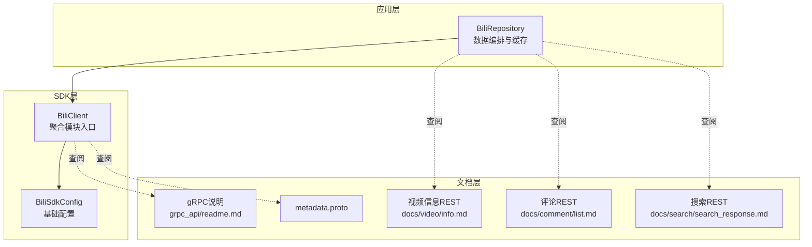
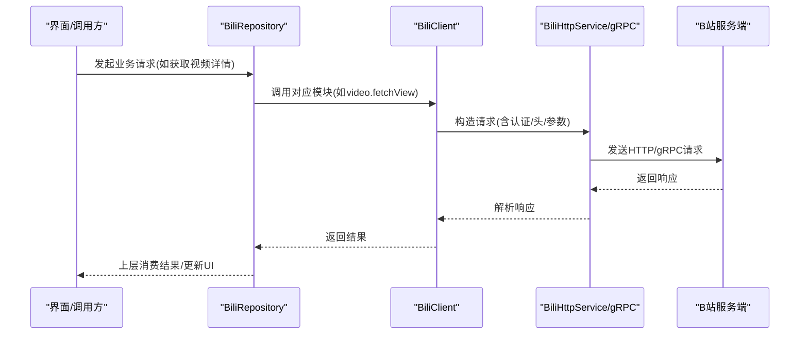
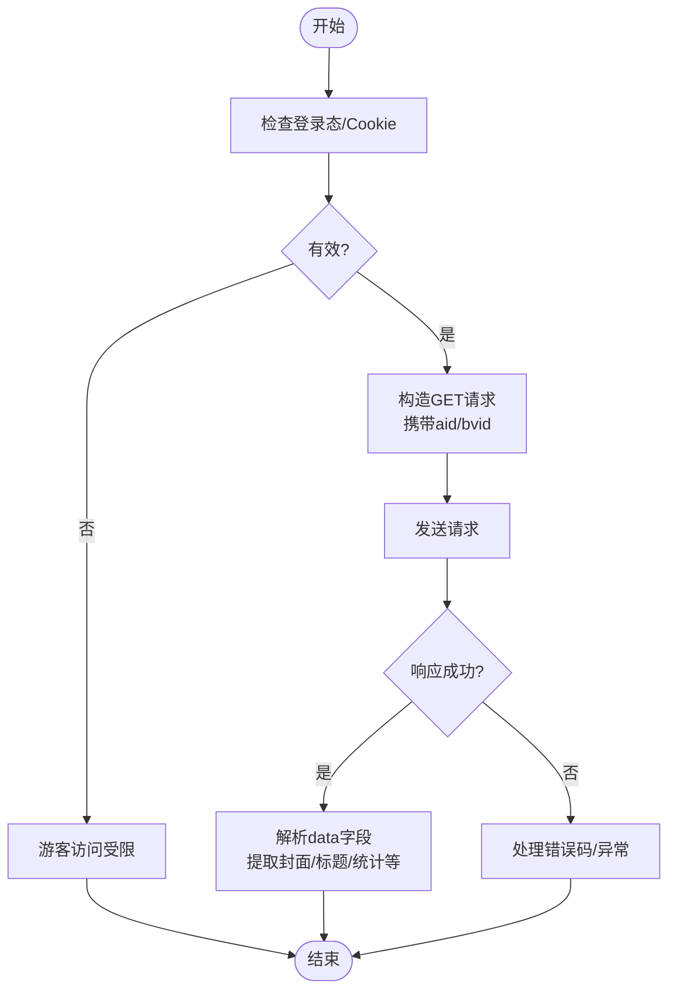
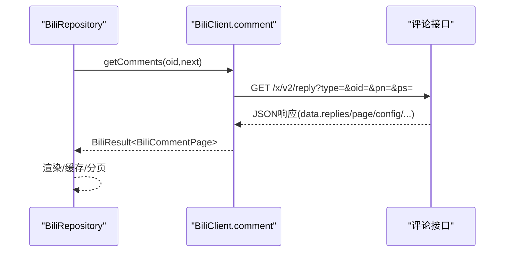
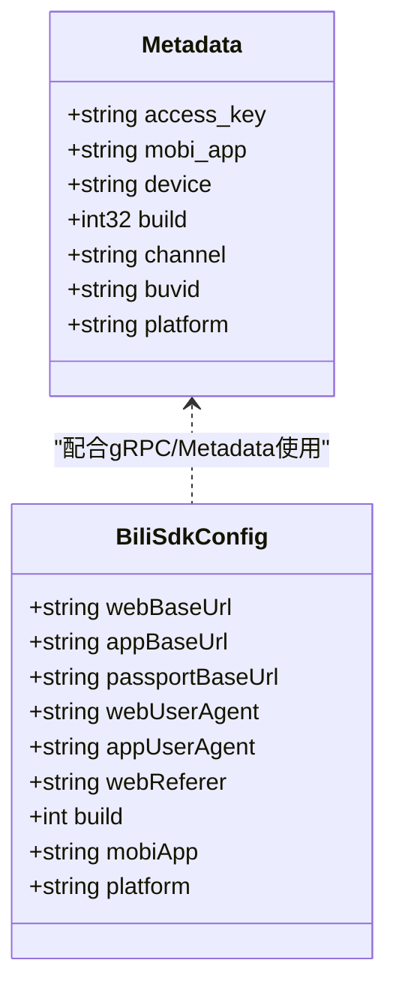
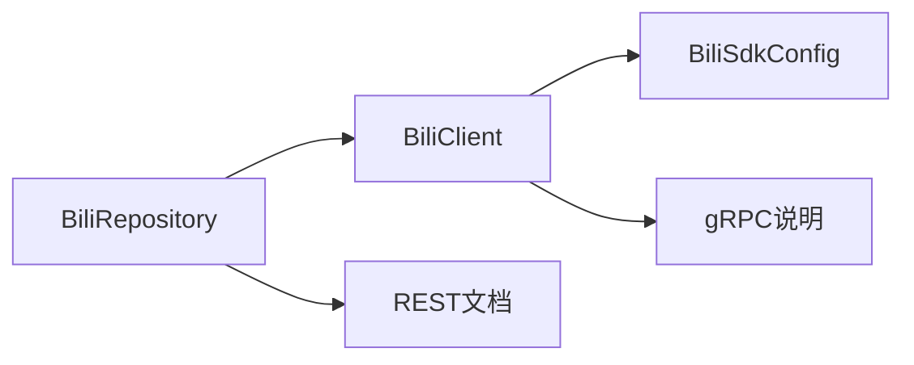

# 平台API

<cite>
**本文引用的文件**
- [README.md](file://README.md)
- [grpc_api/readme.md](file://docs/BiliBili_API/grpc_api/readme.md)
- [metadata.proto](file://docs/BiliBili_API/grpc_api/bilibili/metadata/metadata.proto)
- [bili_error_codes.md](file://docs/bili_error_codes.md)
- [info.md](file://docs/BiliBili_API/docs/video/info.md)
- [list.md](file://docs/BiliBili_API/docs/comment/list.md)
- [search_response.md](file://docs/BiliBili_API/docs/search/search_response.md)
- [BiliRepository.kt](file://app/src/main/java/com/lightningstudio/watchrss/data/bili/BiliRepository.kt)
- [BiliClient.kt](file://sdk/bili/src/main/java/com/lightningstudio/watchrss/sdk/bili/BiliClient.kt)
- [BiliSdkConfig.kt](file://sdk/bili/src/main/java/com/lightningstudio/watchrss/sdk/bili/BiliSdkConfig.kt)
</cite>

## 目录
1. [引言](#引言)
2. [项目结构](#项目结构)
3. [核心组件](#核心组件)
4. [架构总览](#架构总览)
5. [详细组件分析](#详细组件分析)
6. [依赖关系分析](#依赖关系分析)
7. [性能考量](#性能考量)
8. [故障排查指南](#故障排查指南)
9. [结论](#结论)
10. [附录](#附录)

## 引言
本文件面向Android WatchRSS项目的开发者与集成者，系统化梳理平台API，重点覆盖B站REST API与gRPC接口的使用规范、认证机制、请求/响应结构、错误码处理、限流与安全策略、版本管理与兼容性、测试与调试方法。文档以仓库内的官方文档与源码为依据，确保内容准确可追溯。

## 项目结构
- 文档层：位于 docs/BiliBili_API，包含REST API文档与gRPC接口定义说明。
- SDK层：位于 sdk/bili，封装HTTP与gRPC调用、认证、浏览器配置等。
- 应用层：位于 app，通过 BiliRepository 统一编排业务流程，调用SDK完成视频、评论、搜索、播放等能力。

图表来源
- [BiliRepository.kt](file://app/src/main/java/com/lightningstudio/watchrss/data/bili/BiliRepository.kt)
- [BiliClient.kt](file://sdk/bili/src/main/java/com/lightningstudio/watchrss/sdk/bili/BiliClient.kt)
- [BiliSdkConfig.kt](file://sdk/bili/src/main/java/com/lightningstudio/watchrss/sdk/bili/BiliSdkConfig.kt)
- [grpc_api/readme.md](file://docs/BiliBili_API/grpc_api/readme.md)
- [metadata.proto](file://docs/BiliBili_API/grpc_api/bilibili/metadata/metadata.proto)
- [info.md](file://docs/BiliBili_API/docs/video/info.md)
- [list.md](file://docs/BiliBili_API/docs/comment/list.md)
- [search_response.md](file://docs/BiliBili_API/docs/search/search_response.md)

章节来源
- [README.md](file://README.md)
- [BiliRepository.kt](file://app/src/main/java/com/lightningstudio/watchrss/data/bili/BiliRepository.kt)
- [BiliClient.kt](file://sdk/bili/src/main/java/com/lightningstudio/watchrss/sdk/bili/BiliClient.kt)
- [BiliSdkConfig.kt](file://sdk/bili/src/main/java/com/lightningstudio/watchrss/sdk/bili/BiliSdkConfig.kt)

## 核心组件
- BiliSdkConfig：提供Web/APP基础URL、UA、语言、平台、构建号等全局配置，支撑REST与gRPC请求头构造。
- BiliClient：聚合模块入口，包含 identity、auth、feed、video、play、action、history、favorite、search、comment 等子域。
- BiliRepository：应用层数据编排，负责登录态、缓存、预览片段、播放源解析、交互状态、历史与收藏等业务流程。

章节来源
- [BiliSdkConfig.kt](file://sdk/bili/src/main/java/com/lightningstudio/watchrss/sdk/bili/BiliSdkConfig.kt)
- [BiliClient.kt](file://sdk/bili/src/main/java/com/lightningstudio/watchrss/sdk/bili/BiliClient.kt)
- [BiliRepository.kt](file://app/src/main/java/com/lightningstudio/watchrss/data/bili/BiliRepository.kt)

## 架构总览
应用通过 BiliRepository 调用 SDK 的 BiliClient，SDK 再根据配置构造HTTP或gRPC请求，最终访问B站服务端。REST与gRPC在认证、元数据、错误码等方面有统一约束。

图表来源
- [BiliRepository.kt](file://app/src/main/java/com/lightningstudio/watchrss/data/bili/BiliRepository.kt)
- [BiliClient.kt](file://sdk/bili/src/main/java/com/lightningstudio/watchrss/sdk/bili/BiliClient.kt)

## 详细组件分析

### REST API：视频信息获取
- 接口：获取视频详细信息（Web端）
- 方法：GET
- 认证：Cookie（SESSDATA）或登录态
- 请求参数：aid 或 bvid（二选一）
- 响应结构：根对象包含 code/message/ttl/data；data中包含视频基础信息、UP主、统计、分P、字幕、合作成员等字段
- 典型用途：详情页渲染、播放参数准备、封面/标题/简介展示

图表来源
- [info.md](file://docs/BiliBili_API/docs/video/info.md)

章节来源
- [info.md](file://docs/BiliBili_API/docs/video/info.md)
- [BiliRepository.kt](file://app/src/main/java/com/lightningstudio/watchrss/data/bili/BiliRepository.kt)

### REST API：评论系统调用
- 接口：评论区明细（翻页加载）
- 方法：GET
- 认证：Cookie（SESSDATA）或APP access_key
- 请求参数：type（评论区类型）、oid（目标评论区id）、sort/nohot/ps/pn
- 响应结构：data.page、data.config、data.replies、data.hots、data.upper、data.notice 等
- 典型用途：评论列表、热评、置顶、公告、分页控制

图表来源
- [list.md](file://docs/BiliBili_API/docs/comment/list.md)
- [BiliRepository.kt](file://app/src/main/java/com/lightningstudio/watchrss/data/bili/BiliRepository.kt)

章节来源
- [list.md](file://docs/BiliBili_API/docs/comment/list.md)
- [BiliRepository.kt](file://app/src/main/java/com/lightningstudio/watchrss/data/bili/BiliRepository.kt)

### REST API：搜索接口
- 接口：搜索响应条目
- 响应结构：result数组中包含多种类型（视频、番剧、直播间、用户、专栏、话题、相簿等），每种类型字段差异较大
- 典型用途：综合搜索、结果归类、跳转详情

章节来源
- [search_response.md](file://docs/BiliBili_API/docs/search/search_response.md)
- [BiliRepository.kt](file://app/src/main/java/com/lightningstudio/watchrss/data/bili/BiliRepository.kt)

### gRPC 接口与认证
- 主机与回退：grpc.biliapi.net（原生gRPC）、app.bilibili.com（Failover，通常更快）
- 认证：Metadata中添加 authorization: identify_v1 {access_key}
- 关键Metadata（摘录）：
  - user-agent（必需）
  - device_model/device_build/app_ver/mobi_app/app_build/app_build_inner
  - x-bili-gaia-vtoken（暂时留空）
  - x-bili-aurora-eid（UID派生，未登录留空）
  - x-bili-mid（用户UID，未登录默认0）
  - x-bili-aurora-zone（留空）
  - x-bili-trace-id（追踪ID，算法见文档）
  - authorization（登录时设置）
  - buvid（设备唯一标识）
  - bili-http-engine（恒定为cronet，使用grpc.biliapi.net时无需）
  - te（恒定为trailers，使用app.bilibili.com时无需）
  - Binary类：x-bili-fawkes-req-bin、x-bili-metadata-bin、x-bili-device-bin、x-bili-network-bin、x-bili-restriction-bin、x-bili-locale-bin、x-bili-exps-bin
- 常用接口（摘录）：
  - bilibili.app.playeronline.v1.PlayerOnline（视频在线人数）
  - bilibili.app.playerunite.v1.PlayViewUnite（UGC/PGC统一播放页）
  - bilibili.app.playurl.v1.PlayURL（UGC播放链接）
  - bilibili.pgc.gateway.player.v1.PlayView（PGC播放链接V1/V2）
  - bilibili.polymer.app.search.v1.SearchAll（搜索V1）
  - bilibili.app.dynamic.v2.DynAll（动态V2）

图表来源
- [metadata.proto](file://docs/BiliBili_API/grpc_api/bilibili/metadata/metadata.proto)
- [grpc_api/readme.md](file://docs/BiliBili_API/grpc_api/readme.md)
- [BiliSdkConfig.kt](file://sdk/bili/src/main/java/com/lightningstudio/watchrss/sdk/bili/BiliSdkConfig.kt)

章节来源
- [grpc_api/readme.md](file://docs/BiliBili_API/grpc_api/readme.md)
- [metadata.proto](file://docs/BiliBili_API/grpc_api/bilibili/metadata/metadata.proto)
- [BiliSdkConfig.kt](file://sdk/bili/src/main/java/com/lightningstudio/watchrss/sdk/bili/BiliSdkConfig.kt)

### 认证与安全
- REST：Cookie（SESSDATA、bili_jct等）与浏览器UA/Referer组合；部分接口需登录。
- gRPC：Metadata中authorization与多维设备/环境信息；Binary类字段用于设备指纹与环境描述。
- 安全建议：
  - 严格保护Cookie与access_key，避免泄露
  - 使用可信主机与TLS
  - 控制请求频率，遵循限流策略
  - 对敏感字段进行最小化暴露

章节来源
- [grpc_api/readme.md](file://docs/BiliBili_API/grpc_api/readme.md)
- [BiliRepository.kt](file://app/src/main/java/com/lightningstudio/watchrss/data/bili/BiliRepository.kt)

### 错误码与异常处理
- 应用内错误码：统一显示为“RSS解析失败(-xx)”格式，涵盖网络异常、缺少登录标识、默认收藏夹缺失、二维码失败、Cookie无效、播放参数缺失、播放地址为空等。
- B站接口错误码：透传B站返回的HTTP或接口错误码；例如二维码过期等业务错误。
- 建议处理策略：
  - 对网络/超时/证书异常进行重试与降级
  - 对缺失关键参数/登录态失败进行引导修复
  - 对业务错误码进行用户友好提示

章节来源
- [bili_error_codes.md](file://docs/bili_error_codes.md)
- [BiliRepository.kt](file://app/src/main/java/com/lightningstudio/watchrss/data/bili/BiliRepository.kt)

### API使用示例（REST）
- 获取视频详情：携带 aid 或 bvid，解析data字段中的标题、封面、统计、分P等
- 获取评论列表：指定 type/oid/sort/nohot/ps/pn，解析 replies/hots/upper/notice 等
- 搜索：根据关键词与页码获取多类型结果，按类型字段渲染

章节来源
- [info.md](file://docs/BiliBili_API/docs/video/info.md)
- [list.md](file://docs/BiliBili_API/docs/comment/list.md)
- [search_response.md](file://docs/BiliBili_API/docs/search/search_response.md)
- [BiliRepository.kt](file://app/src/main/java/com/lightningstudio/watchrss/data/bili/BiliRepository.kt)

### API使用示例（gRPC）
- 设置Metadata：user-agent、x-bili-*系列头、authorization、Binary类字段
- 调用常用接口：如播放页、在线人数、搜索等
- 注意：Binary字段需按proto定义序列化，必要时Base64编码

章节来源
- [grpc_api/readme.md](file://docs/BiliBili_API/grpc_api/readme.md)
- [metadata.proto](file://docs/BiliBili_API/grpc_api/bilibili/metadata/metadata.proto)

## 依赖关系分析
- BiliRepository 依赖 BiliClient 与 BiliSdkConfig，负责业务编排与缓存
- BiliClient 聚合各功能域（auth/feed/video/play/action/history/favorite/search/comment）
- SDK配置影响HTTP与gRPC请求头构造（UA、Referer、基础URL、平台/构建号）

图表来源
- [BiliRepository.kt](file://app/src/main/java/com/lightningstudio/watchrss/data/bili/BiliRepository.kt)
- [BiliClient.kt](file://sdk/bili/src/main/java/com/lightningstudio/watchrss/sdk/bili/BiliClient.kt)
- [BiliSdkConfig.kt](file://sdk/bili/src/main/java/com/lightningstudio/watchrss/sdk/bili/BiliSdkConfig.kt)
- [grpc_api/readme.md](file://docs/BiliBili_API/grpc_api/readme.md)

章节来源
- [BiliRepository.kt](file://app/src/main/java/com/lightningstudio/watchrss/data/bili/BiliRepository.kt)
- [BiliClient.kt](file://sdk/bili/src/main/java/com/lightningstudio/watchrss/sdk/bili/BiliClient.kt)
- [BiliSdkConfig.kt](file://sdk/bili/src/main/java/com/lightningstudio/watchrss/sdk/bili/BiliSdkConfig.kt)

## 性能考量
- 缓存策略：预览片段缓存、播放源缓存、历史与交互状态本地持久化
- 并发控制：播放源解析使用Mutex避免重复并发请求
- 下载优化：范围请求（Range）裁剪预览片段大小，降低带宽与延迟
- 超时与重试：OkHttp超时配置与业务层重试策略结合

章节来源
- [BiliRepository.kt](file://app/src/main/java/com/lightningstudio/watchrss/data/bili/BiliRepository.kt)

## 故障排查指南
- 常见错误码定位：应用内错误码与B站接口错误码对照，快速定位问题类型
- 登录态问题：检查SESSDATA、bili_jct是否齐全；gRPC需确认authorization与x-bili-*系列头
- 网络异常：区分超时、证书、连接失败，分别采取重试/降级/切换主机
- 预览/播放失败：检查播放参数（aid/bvid/cid/qn）、播放地址为空、缓存命中情况

章节来源
- [bili_error_codes.md](file://docs/bili_error_codes.md)
- [BiliRepository.kt](file://app/src/main/java/com/lightningstudio/watchrss/data/bili/BiliRepository.kt)

## 结论
本项目通过SDK与应用层的清晰分工，实现了对B站REST与gRPC接口的统一接入。依托完善的错误码体系、缓存与并发控制策略，能够在保证稳定性的同时提升用户体验。建议在集成过程中严格遵循认证与安全要求，并结合文档与源码进行充分测试与调试。

## 附录

### API版本管理与兼容性
- SDK配置包含平台、构建号、UA等，便于服务端识别与兼容
- 文档层的proto与REST接口说明体现了接口演进与兼容策略（以官方说明为准）

章节来源
- [BiliSdkConfig.kt](file://sdk/bili/src/main/java/com/lightningstudio/watchrss/sdk/bili/BiliSdkConfig.kt)
- [grpc_api/readme.md](file://docs/BiliBili_API/grpc_api/readme.md)

### 测试与调试方法
- 使用应用内置的调试日志与错误码输出，定位问题
- 通过预览片段缓存与播放源解析流程，验证播放链路
- 对比gRPC与REST在相同场景下的行为差异，辅助问题定位

章节来源
- [BiliRepository.kt](file://app/src/main/java/com/lightningstudio/watchrss/data/bili/BiliRepository.kt)