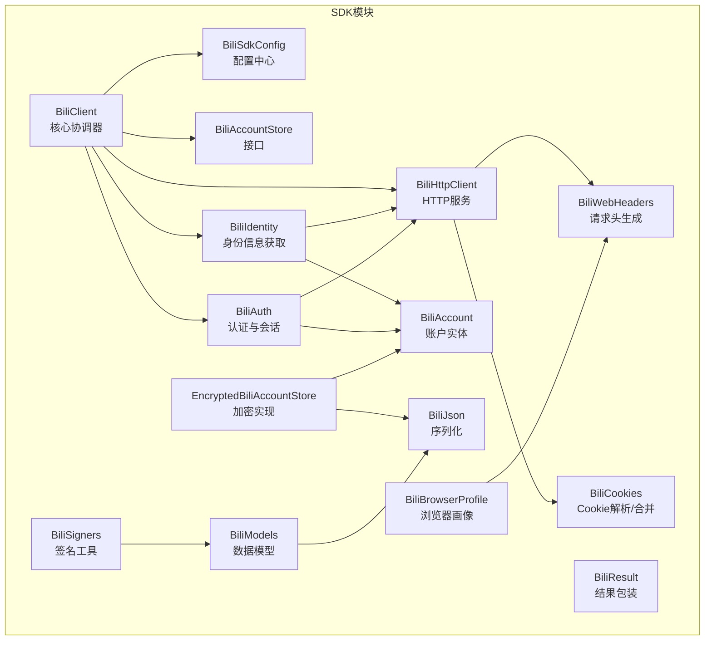
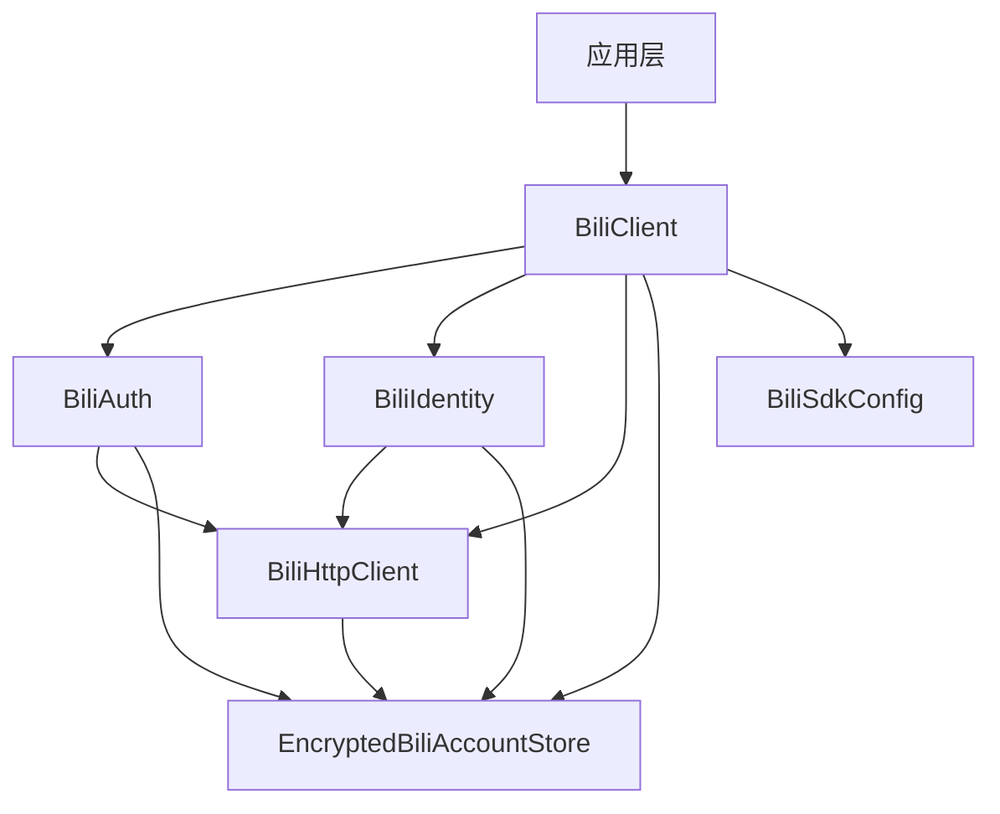
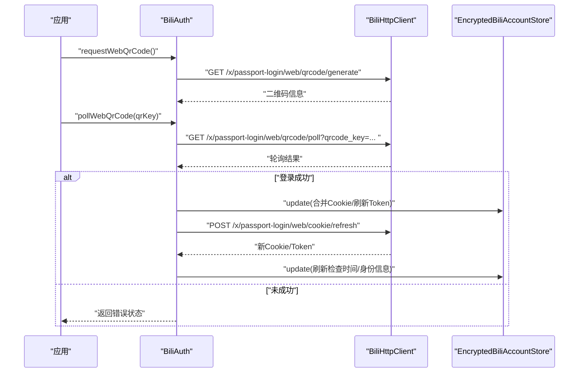
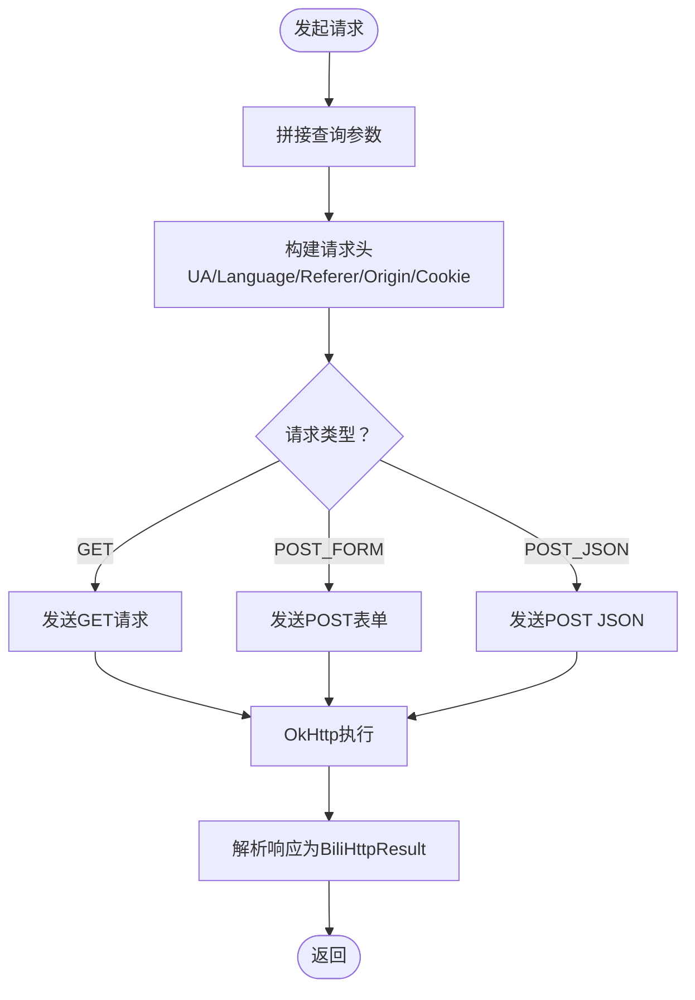
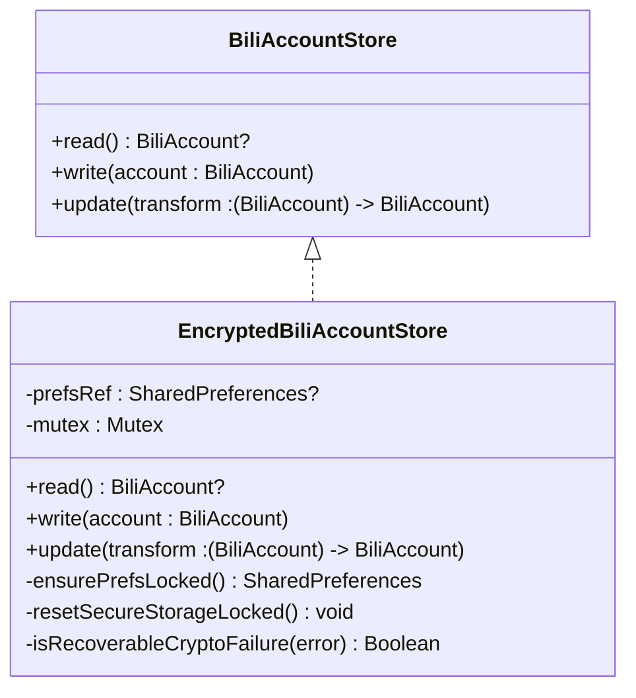
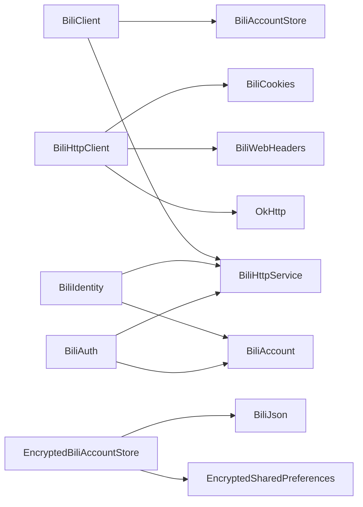

# B站SDK集成

<cite>
**本文引用的文件**
- [BiliClient.kt](file://sdk/bili/src/main/java/com/lightningstudio/watchrss/sdk/bili/BiliClient.kt)
- [BiliAuth.kt](file://sdk/bili/src/main/java/com/lightningstudio/watchrss/sdk/bili/BiliAuth.kt)
- [BiliHttpClient.kt](file://sdk/bili/src/main/java/com/lightningstudio/watchrss/sdk/bili/BiliHttpClient.kt)
- [BiliSdkConfig.kt](file://sdk/bili/src/main/java/com/lightningstudio/watchrss/sdk/bili/BiliSdkConfig.kt)
- [BiliAccountStore.kt](file://sdk/bili/src/main/java/com/lightningstudio/watchrss/sdk/bili/BiliAccountStore.kt)
- [EncryptedBiliAccountStore.kt](file://sdk/bili/src/main/java/com/lightningstudio/watchrss/sdk/bili/EncryptedBiliAccountStore.kt)
- [BiliWebHeaders.kt](file://sdk/bili/src/main/java/com/lightningstudio/watchrss/sdk/bili/BiliWebHeaders.kt)
- [BiliCookies.kt](file://sdk/bili/src/main/java/com/lightningstudio/watchrss/sdk/bili/BiliCookies.kt)
- [BiliIdentity.kt](file://sdk/bili/src/main/java/com/lightningstudio/watchrss/sdk/bili/BiliIdentity.kt)
- [BiliAccount.kt](file://sdk/bili/src/main/java/com/lightningstudio/watchrss/sdk/bili/BiliAccount.kt)
- [BiliBrowserProfile.kt](file://sdk/bili/src/main/java/com/lightningstudio/watchrss/sdk/bili/BiliBrowserProfile.kt)
- [BiliSigners.kt](file://sdk/bili/src/main/java/com/lightningstudio/watchrss/sdk/bili/BiliSigners.kt)
- [BiliJson.kt](file://sdk/bili/src/main/java/com/lightningstudio/watchrss/sdk/bili/BiliJson.kt)
- [BiliResult.kt](file://sdk/bili/src/main/java/com/lightningstudio/watchrss/sdk/bili/BiliResult.kt)
- [build.gradle.kts](file://sdk/bili/build.gradle.kts)
- [TestBiliFakes.kt](file://sdk/bili/src/test/java/com/lightningstudio/watchrss/sdk/bili/TestBiliFakes.kt)
</cite>

## 目录
1. [简介](#简介)
2. [项目结构](#项目结构)
3. [核心组件](#核心组件)
4. [架构总览](#架构总览)
5. [详细组件分析](#详细组件分析)
6. [依赖关系分析](#依赖关系分析)
7. [性能考量](#性能考量)
8. [故障排查指南](#故障排查指南)
9. [结论](#结论)
10. [附录：使用示例与最佳实践](#附录使用示例与最佳实践)

## 简介
本文件面向Android WatchRSS项目，系统性梳理并说明B站SDK的集成方案与实现细节。重点覆盖以下方面：
- 整体架构设计：以BiliClient为核心协调器，按功能域拆分模块（认证、账号、网络、身份、搜索、播放等）。
- 认证机制：基于二维码登录、Cookie刷新与会话保持、Token管理与安全校验。
- HTTP客户端：OkHttp封装、请求头构建、Cookie注入、超时与错误处理。
- 数据模型：统一的实体类、序列化策略与数据转换。
- 账户存储：本地持久化、加密存储、并发安全与容错恢复。
- SDK配置：参数化配置、浏览器画像、域名与密钥管理。
- 使用示例：从初始化到典型API调用流程，以及常见问题的解决方案。

## 项目结构
B站SDK位于独立模块中，采用“按功能域”组织文件，核心入口为BiliClient，围绕其聚合各子域服务；同时提供加密存储与测试桩以支持单元测试与端到端验证。

图表来源
- [BiliClient.kt:1-20](file://sdk/bili/src/main/java/com/lightningstudio/watchrss/sdk/bili/BiliClient.kt#L1-L20)
- [BiliSdkConfig.kt:1-35](file://sdk/bili/src/main/java/com/lightningstudio/watchrss/sdk/bili/BiliSdkConfig.kt#L1-L35)
- [BiliAccountStore.kt:1-8](file://sdk/bili/src/main/java/com/lightningstudio/watchrss/sdk/bili/BiliAccountStore.kt#L1-L8)
- [EncryptedBiliAccountStore.kt:1-128](file://sdk/bili/src/main/java/com/lightningstudio/watchrss/sdk/bili/EncryptedBiliAccountStore.kt#L1-L128)
- [BiliHttpClient.kt:1-129](file://sdk/bili/src/main/java/com/lightningstudio/watchrss/sdk/bili/BiliHttpClient.kt#L1-L129)
- [BiliWebHeaders.kt:1-146](file://sdk/bili/src/main/java/com/lightningstudio/watchrss/sdk/bili/BiliWebHeaders.kt#L1-L146)
- [BiliCookies.kt:1-45](file://sdk/bili/src/main/java/com/lightningstudio/watchrss/sdk/bili/BiliCookies.kt#L1-L45)
- [BiliIdentity.kt:1-251](file://sdk/bili/src/main/java/com/lightningstudio/watchrss/sdk/bili/BiliIdentity.kt#L1-L251)
- [BiliAuth.kt:1-406](file://sdk/bili/src/main/java/com/lightningstudio/watchrss/sdk/bili/BiliAuth.kt#L1-L406)
- [BiliSigners.kt:1-81](file://sdk/bili/src/main/java/com/lightningstudio/watchrss/sdk/bili/BiliSigners.kt#L1-L81)
- [BiliModels.kt:1-60](file://sdk/bili/src/main/java/com/lightningstudio/watchrss/sdk/bili/BiliModels.kt#L1-L60)
- [BiliAccount.kt:1-29](file://sdk/bili/src/main/java/com/lightningstudio/watchrss/sdk/bili/BiliAccount.kt#L1-L29)
- [BiliBrowserProfile.kt:1-43](file://sdk/bili/src/main/java/com/lightningstudio/watchrss/sdk/bili/BiliBrowserProfile.kt#L1-L43)
- [BiliJson.kt:1-9](file://sdk/bili/src/main/java/com/lightningstudio/watchrss/sdk/bili/BiliJson.kt#L1-L9)
- [BiliResult.kt:1-13](file://sdk/bili/src/main/java/com/lightningstudio/watchrss/sdk/bili/BiliResult.kt#L1-L13)

章节来源
- [build.gradle.kts:1-87](file://sdk/bili/build.gradle.kts#L1-L87)

## 核心组件
- BiliClient：SDK入口，聚合配置、HTTP、身份、认证、各业务模块，形成统一的对外接口。
- BiliSdkConfig：集中管理域名、UA、语言、密钥、平台标识等配置，并提供默认浏览器画像解析。
- BiliAccountStore/EncryptedBiliAccountStore：抽象与加密实现，负责账户状态的读写与更新。
- BiliHttpClient：OkHttp封装，统一GET/POST表单/POST JSON，自动注入Cookie与请求头。
- BiliWebHeaders：根据URL与方法推断上下文，动态生成Referer/Origin/Sec-*等头部。
- BiliCookies：解析Set-Cookie与Cookie字符串，合并更新。
- BiliIdentity：获取并维护BUVID、WBI密钥、Web票据等身份信息。
- BiliAuth：二维码登录、Cookie刷新、会话保持、Token管理。
- BiliSigners：APP/WBI签名工具，用于参数签名与w_rid计算。
- BiliModels/BiliAccount/BiliBrowserProfile：数据模型与实体，配合BiliJson进行序列化。
- BiliResult：统一的结果包装，便于上层判断成功与否。

章节来源
- [BiliClient.kt:1-20](file://sdk/bili/src/main/java/com/lightningstudio/watchrss/sdk/bili/BiliClient.kt#L1-L20)
- [BiliSdkConfig.kt:1-35](file://sdk/bili/src/main/java/com/lightningstudio/watchrss/sdk/bili/BiliSdkConfig.kt#L1-L35)
- [BiliAccountStore.kt:1-8](file://sdk/bili/src/main/java/com/lightningstudio/watchrss/sdk/bili/BiliAccountStore.kt#L1-L8)
- [EncryptedBiliAccountStore.kt:1-128](file://sdk/bili/src/main/java/com/lightningstudio/watchrss/sdk/bili/EncryptedBiliAccountStore.kt#L1-L128)
- [BiliHttpClient.kt:1-129](file://sdk/bili/src/main/java/com/lightningstudio/watchrss/sdk/bili/BiliHttpClient.kt#L1-L129)
- [BiliWebHeaders.kt:1-146](file://sdk/bili/src/main/java/com/lightningstudio/watchrss/sdk/bili/BiliWebHeaders.kt#L1-L146)
- [BiliCookies.kt:1-45](file://sdk/bili/src/main/java/com/lightningstudio/watchrss/sdk/bili/BiliCookies.kt#L1-L45)
- [BiliIdentity.kt:1-251](file://sdk/bili/src/main/java/com/lightningstudio/watchrss/sdk/bili/BiliIdentity.kt#L1-L251)
- [BiliAuth.kt:1-406](file://sdk/bili/src/main/java/com/lightningstudio/watchrss/sdk/bili/BiliAuth.kt#L1-L406)
- [BiliSigners.kt:1-81](file://sdk/bili/src/main/java/com/lightningstudio/watchrss/sdk/bili/BiliSigners.kt#L1-L81)
- [BiliModels.kt:1-60](file://sdk/bili/src/main/java/com/lightningstudio/watchrss/sdk/bili/BiliModels.kt#L1-L60)
- [BiliAccount.kt:1-29](file://sdk/bili/src/main/java/com/lightningstudio/watchrss/sdk/bili/BiliAccount.kt#L1-L29)
- [BiliBrowserProfile.kt:1-43](file://sdk/bili/src/main/java/com/lightningstudio/watchrss/sdk/bili/BiliBrowserProfile.kt#L1-L43)
- [BiliJson.kt:1-9](file://sdk/bili/src/main/java/com/lightningstudio/watchrss/sdk/bili/BiliJson.kt#L1-L9)
- [BiliResult.kt:1-13](file://sdk/bili/src/main/java/com/lightningstudio/watchrss/sdk/bili/BiliResult.kt#L1-L13)

## 架构总览
下图展示B站SDK在应用中的角色与交互路径：应用通过BiliClient访问各子域服务，认证与身份信息由BiliAuth与BiliIdentity驱动，HTTP请求经由BiliHttpClient统一发出，并自动携带Cookie与请求头。

图表来源
- [BiliClient.kt:1-20](file://sdk/bili/src/main/java/com/lightningstudio/watchrss/sdk/bili/BiliClient.kt#L1-L20)
- [BiliAuth.kt:1-406](file://sdk/bili/src/main/java/com/lightningstudio/watchrss/sdk/bili/BiliAuth.kt#L1-L406)
- [BiliIdentity.kt:1-251](file://sdk/bili/src/main/java/com/lightningstudio/watchrss/sdk/bili/BiliIdentity.kt#L1-L251)
- [BiliHttpClient.kt:1-129](file://sdk/bili/src/main/java/com/lightningstudio/watchrss/sdk/bili/BiliHttpClient.kt#L1-L129)
- [EncryptedBiliAccountStore.kt:1-128](file://sdk/bili/src/main/java/com/lightningstudio/watchrss/sdk/bili/EncryptedBiliAccountStore.kt#L1-L128)
- [BiliSdkConfig.kt:1-35](file://sdk/bili/src/main/java/com/lightningstudio/watchrss/sdk/bili/BiliSdkConfig.kt#L1-L35)

## 详细组件分析

### 认证机制（BiliAuth）
- 二维码登录流程
  - 生成二维码：向登录页发起请求，获取二维码URL与qrcode_key。
  - 轮询扫码状态：根据qrcode_key轮询，识别不同状态（待扫描/已扫描/已过期/成功）。
  - 成功后：解析Set-Cookie，提取refresh_token，更新账户存储。
- Cookie刷新与会话保持
  - 检查是否需要刷新：调用“cookie/info”接口，依据返回的refresh标记决定是否刷新。
  - 刷新流程：构造对应路径（RSA/OAEP加密时间戳），抓取refresh_csrf，提交刷新请求，更新cookies与refresh_token。
  - 确认刷新：使用旧refresh_token调用“confirm/refresh”，确保会话有效。
  - 同步身份信息：刷新后拉取BUVID、WBI密钥、Web票据，保证后续请求可用。
- Token管理与Cookie处理
  - 提供applyCookies直接注入Cookie的能力。
  - 统一更新账户存储：合并Cookie、清理过期Token、记录更新时间与浏览器画像。
- 错误处理
  - 对HTTP错误、JSON解析失败、缺失字段等情况进行降级与日志记录，避免中断主流程。

图表来源
- [BiliAuth.kt:52-95](file://sdk/bili/src/main/java/com/lightningstudio/watchrss/sdk/bili/BiliAuth.kt#L52-L95)
- [BiliAuth.kt:97-188](file://sdk/bili/src/main/java/com/lightningstudio/watchrss/sdk/bili/BiliAuth.kt#L97-L188)
- [BiliHttpClient.kt:1-129](file://sdk/bili/src/main/java/com/lightningstudio/watchrss/sdk/bili/BiliHttpClient.kt#L1-L129)
- [EncryptedBiliAccountStore.kt:1-128](file://sdk/bili/src/main/java/com/lightningstudio/watchrss/sdk/bili/EncryptedBiliAccountStore.kt#L1-L128)

章节来源
- [BiliAuth.kt:1-406](file://sdk/bili/src/main/java/com/lightningstudio/watchrss/sdk/bili/BiliAuth.kt#L1-L406)

### HTTP客户端（BiliHttpClient）
- 请求封装
  - 支持GET（带查询参数）、POST表单、POST JSON三种常用方式。
  - 自动拼接URL查询参数，构建请求体。
- 头部构建
  - 委托BiliWebHeaders根据URL与方法推断上下文，动态生成User-Agent、Accept-Language、Referer、Origin、Sec-*等。
  - 可选择是否包含Cookie，若包含则从账户存储读取并拼接。
- 超时与执行
  - OkHttp配置连接/读取/调用超时，统一在IO调度器执行，避免阻塞主线程。
- 结果封装
  - 返回BiliHttpResult，包含HTTP状态码、响应体与响应头，便于上层解析与重试。

图表来源
- [BiliHttpClient.kt:47-121](file://sdk/bili/src/main/java/com/lightningstudio/watchrss/sdk/bili/BiliHttpClient.kt#L47-L121)
- [BiliWebHeaders.kt:6-68](file://sdk/bili/src/main/java/com/lightningstudio/watchrss/sdk/bili/BiliWebHeaders.kt#L6-L68)

章节来源
- [BiliHttpClient.kt:1-129](file://sdk/bili/src/main/java/com/lightningstudio/watchrss/sdk/bili/BiliHttpClient.kt#L1-L129)
- [BiliWebHeaders.kt:1-146](file://sdk/bili/src/main/java/com/lightningstudio/watchrss/sdk/bili/BiliWebHeaders.kt#L1-L146)

### 数据模型（BiliModels、BiliAccount、BiliBrowserProfile）
- 实体类
  - BiliItem/BiliOwner/BiliStat/BiliPage/BiliVideoDetail/BiliVideoInteraction/BiliFeedPage等，覆盖视频、统计、分P、互动等信息。
  - BiliAccount：集中保存Cookie、Token、BUVID、WBI密钥、Web票据、浏览器画像及更新时间等。
  - BiliBrowserProfile：浏览器画像版本、UA、语言、Sec-CH等，支持桌面Chrome画像生成。
- 序列化机制
  - 使用kotlinx.serialization，BiliJson忽略未知字段、编码默认值，提升兼容性。
- 数据转换
  - BiliSigners提供APP/WBI签名，BiliCookies提供Cookie解析与合并，BiliWebHeaders根据URL推断上下文生成头部。

章节来源
- [BiliModels.kt:1-60](file://sdk/bili/src/main/java/com/lightningstudio/watchrss/sdk/bili/BiliModels.kt#L1-L60)
- [BiliAccount.kt:1-29](file://sdk/bili/src/main/java/com/lightningstudio/watchrss/sdk/bili/BiliAccount.kt#L1-L29)
- [BiliBrowserProfile.kt:1-43](file://sdk/bili/src/main/java/com/lightningstudio/watchrss/sdk/bili/BiliBrowserProfile.kt#L1-L43)
- [BiliSigners.kt:1-81](file://sdk/bili/src/main/java/com/lightningstudio/watchrss/sdk/bili/BiliSigners.kt#L1-L81)
- [BiliCookies.kt:1-45](file://sdk/bili/src/main/java/com/lightningstudio/watchrss/sdk/bili/BiliCookies.kt#L1-L45)
- [BiliWebHeaders.kt:1-146](file://sdk/bili/src/main/java/com/lightningstudio/watchrss/sdk/bili/BiliWebHeaders.kt#L1-L146)
- [BiliJson.kt:1-9](file://sdk/bili/src/main/java/com/lightningstudio/watchrss/sdk/bili/BiliJson.kt#L1-L9)

### 账户存储系统（BiliAccountStore、EncryptedBiliAccountStore）
- 接口职责
  - read：读取当前账户状态。
  - write：写入完整账户状态。
  - update：基于当前状态进行变换并持久化。
- 加密实现
  - 使用AndroidX Security的EncryptedSharedPreferences，AES256-GCM对称加密。
  - 内部使用Mutex保证并发安全；当遇到可恢复的加密异常（如Keystore损坏）时，主动重建安全存储并重试。
  - 序列化采用BiliJson，确保跨版本兼容。
- 安全考虑
  - 密钥由系统KeyStore托管，避免硬编码。
  - 存储键名固定，减少泄露面。

图表来源
- [BiliAccountStore.kt:1-8](file://sdk/bili/src/main/java/com/lightningstudio/watchrss/sdk/bili/BiliAccountStore.kt#L1-L8)
- [EncryptedBiliAccountStore.kt:1-128](file://sdk/bili/src/main/java/com/lightningstudio/watchrss/sdk/bili/EncryptedBiliAccountStore.kt#L1-L128)

章节来源
- [BiliAccountStore.kt:1-8](file://sdk/bili/src/main/java/com/lightningstudio/watchrss/sdk/bili/BiliAccountStore.kt#L1-L8)
- [EncryptedBiliAccountStore.kt:1-128](file://sdk/bili/src/main/java/com/lightningstudio/watchrss/sdk/bili/EncryptedBiliAccountStore.kt#L1-L128)

### SDK配置（BiliSdkConfig）
- 关键参数
  - appKey/appSec、tvAppKey/tvAppSec：用于APP/WBI签名。
  - mobiApp/platform/build：平台标识与版本号。
  - webUserAgent/webAcceptLanguage：浏览器画像UA与语言。
  - webReferer/webBaseUrl/appBaseUrl/passportBaseUrl：域名与基础路径。
- 默认行为
  - defaultWebBrowserProfile：提供桌面Chrome画像默认值。
  - resolveWebBrowserProfile：校验并回退至默认画像，保证兼容性。

章节来源
- [BiliSdkConfig.kt:1-35](file://sdk/bili/src/main/java/com/lightningstudio/watchrss/sdk/bili/BiliSdkConfig.kt#L1-L35)

### 身份信息（BiliIdentity）
- 获取BUVID：调用指纹接口，合并返回的b_3/b_4/b_nut，必要时激活BUVID。
- 获取WBI密钥：从导航接口提取img/sub key，用于后续WBI签名。
- 获取Web票据：基于HMAC-SHA256生成hexsign，调用Ticket接口获取bili_ticket并写入Cookie。
- 并发与幂等：通过账户存储更新时间戳与标志位，避免重复请求。

章节来源
- [BiliIdentity.kt:1-251](file://sdk/bili/src/main/java/com/lightningstudio/watchrss/sdk/bili/BiliIdentity.kt#L1-L251)

## 依赖关系分析
- 模块内聚与解耦
  - BiliClient作为协调器，仅持有接口（BiliHttpService、BiliAccountStore），降低耦合度。
  - BiliHttpClient依赖OkHttp与BiliWebHeaders，职责单一且可替换。
  - BiliAccountStore抽象出持久化，EncryptedBiliAccountStore提供加密实现。
- 外部依赖
  - OkHttp：HTTP传输。
  - kotlinx.serialization：JSON序列化。
  - AndroidX Security：加密SharedPreferences。
  - protobuf/grpc：协议支持（构建期依赖）。

图表来源
- [BiliClient.kt:1-20](file://sdk/bili/src/main/java/com/lightningstudio/watchrss/sdk/bili/BiliClient.kt#L1-L20)
- [BiliHttpClient.kt:1-129](file://sdk/bili/src/main/java/com/lightningstudio/watchrss/sdk/bili/BiliHttpClient.kt#L1-L129)
- [EncryptedBiliAccountStore.kt:1-128](file://sdk/bili/src/main/java/com/lightningstudio/watchrss/sdk/bili/EncryptedBiliAccountStore.kt#L1-L128)
- [BiliIdentity.kt:1-251](file://sdk/bili/src/main/java/com/lightningstudio/watchrss/sdk/bili/BiliIdentity.kt#L1-L251)
- [BiliAuth.kt:1-406](file://sdk/bili/src/main/java/com/lightningstudio/watchrss/sdk/bili/BiliAuth.kt#L1-L406)

章节来源
- [build.gradle.kts:47-61](file://sdk/bili/build.gradle.kts#L47-L61)

## 性能考量
- 线程模型：HTTP请求在IO调度器执行，避免阻塞UI线程。
- 超时设置：连接/读取/调用超时合理配置，平衡稳定性与响应速度。
- 头部生成：按URL与方法动态推断，减少冗余头部，降低请求开销。
- 加密存储：加锁与一次性初始化SharedPreferences，减少I/O竞争。
- 缓存与复用：身份信息（BUVID/WBI/Web票据）在账户存储中标注获取时间，避免频繁拉取。

## 故障排查指南
- 登录失败
  - 检查二维码轮询状态码与消息，确认是否过期或未扫描。
  - 若刷新Cookie失败，查看“cookie/info”与“cookie/refresh”的返回码与消息。
- Cookie缺失或失效
  - 确认BiliCookies.parseSetCookieHeaders正确解析响应头。
  - 检查BiliWebHeaders是否遗漏Referer/Origin导致风控拦截。
- 加密存储异常
  - 当出现Keystore相关异常时，加密存储会自动重建；若仍失败，请检查设备安全环境。
- 签名错误
  - APP签名需包含appkey并按字典序拼接；WBI签名需正确提取img/sub key并生成w_rid。
- 测试辅助
  - 使用TestBiliFakes提供的TestBiliAccountStore与TestBiliHttpService，模拟请求与断言。

章节来源
- [BiliAuth.kt:74-95](file://sdk/bili/src/main/java/com/lightningstudio/watchrss/sdk/bili/BiliAuth.kt#L74-L95)
- [BiliAuth.kt:228-248](file://sdk/bili/src/main/java/com/lightningstudio/watchrss/sdk/bili/BiliAuth.kt#L228-L248)
- [BiliWebHeaders.kt:70-116](file://sdk/bili/src/main/java/com/lightningstudio/watchrss/sdk/bili/BiliWebHeaders.kt#L70-L116)
- [EncryptedBiliAccountStore.kt:96-116](file://sdk/bili/src/main/java/com/lightningstudio/watchrss/sdk/bili/EncryptedBiliAccountStore.kt#L96-L116)
- [BiliSigners.kt:8-36](file://sdk/bili/src/main/java/com/lightningstudio/watchrss/sdk/bili/BiliSigners.kt#L8-L36)
- [TestBiliFakes.kt:1-104](file://sdk/bili/src/test/java/com/lightningstudio/watchrss/sdk/bili/TestBiliFakes.kt#L1-L104)

## 结论
本SDK以BiliClient为中心，将认证、身份、网络、存储与签名等能力模块化组合，既满足移动端轻量化需求，又具备完善的会话管理与安全机制。通过可插拔的存储与HTTP实现，便于在不同场景下灵活适配；通过严格的序列化与头部生成策略，提升兼容性与稳定性。

## 附录：使用示例与最佳实践
- 初始化
  - 创建BiliSdkConfig，准备密钥与域名。
  - 构造EncryptedBiliAccountStore并注入到BiliClient。
  - 通过BiliClient访问各模块（如auth.feed.video等）。
- 典型流程
  - 登录：调用二维码生成与轮询，成功后刷新Cookie并同步身份信息。
  - 拉取视频详情：先确保Cookie有效，再发起API请求，解析BiliVideoDetail。
  - 播放：结合播放模块与签名工具，生成合法请求参数。
- 最佳实践
  - 在应用启动时预拉取BUVID与WBI密钥，减少首请求延迟。
  - 对于高频接口，建议在上层增加缓存策略与重试逻辑。
  - 使用BiliResult统一处理返回码，避免分散判断。
  - 遇到风控或签名问题，优先检查UA/Referer/Origin与WBI签名参数。