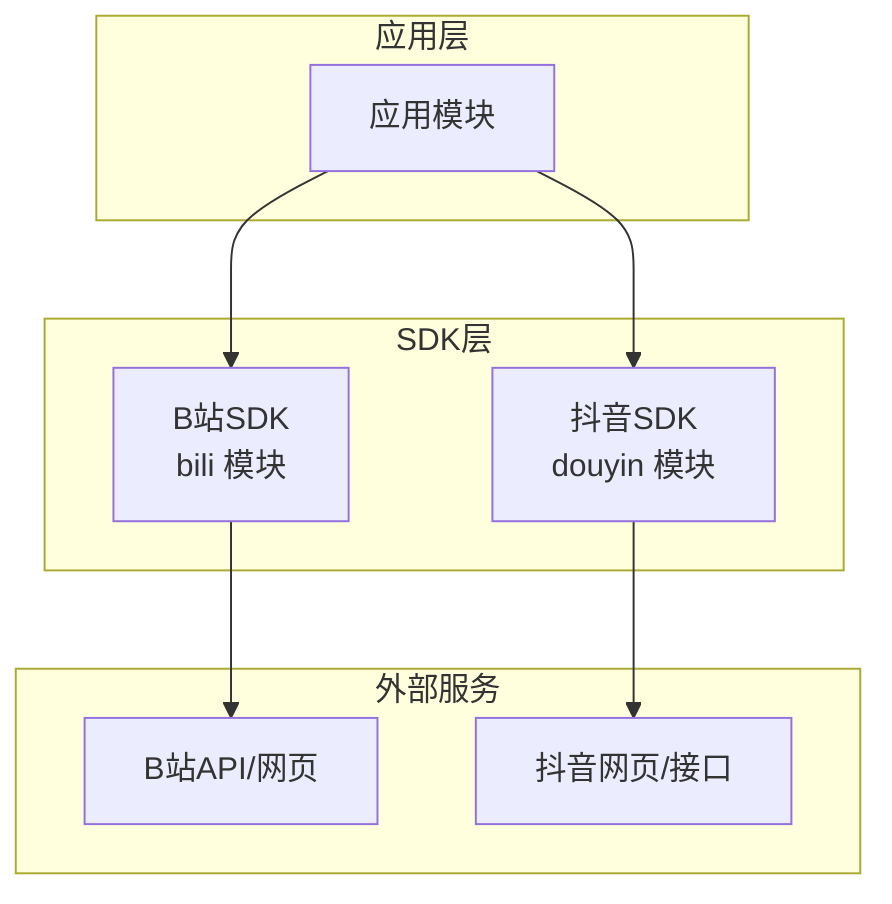
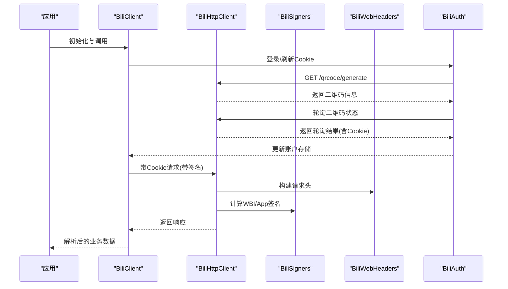
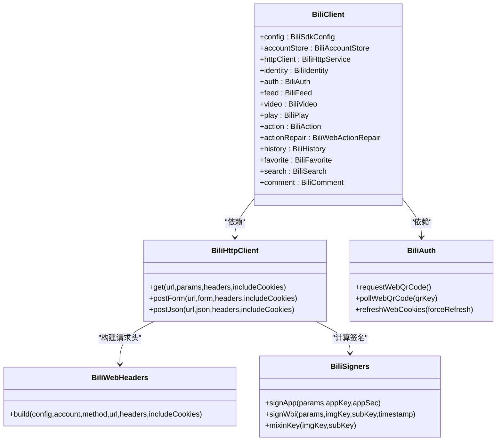
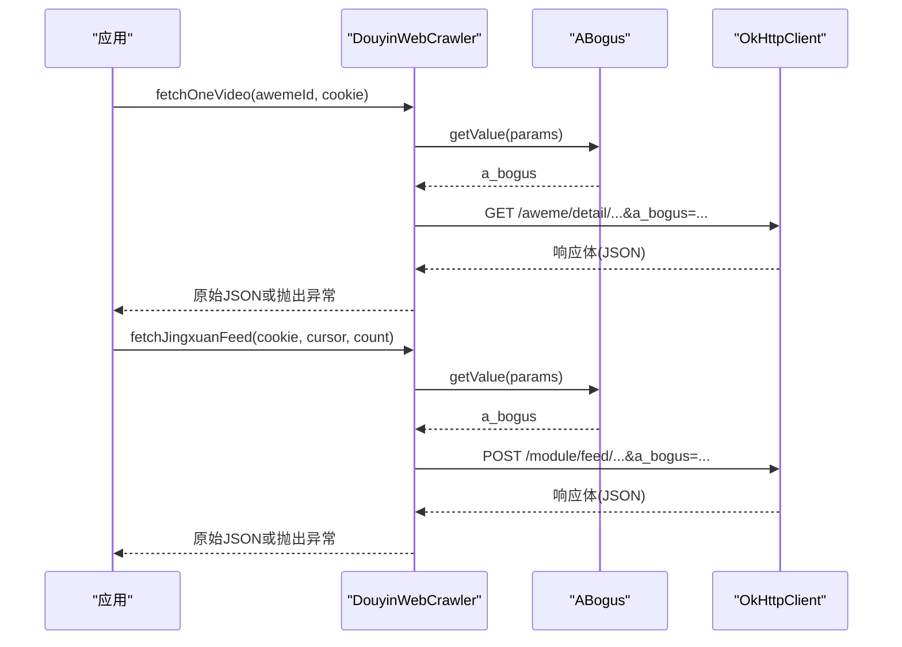
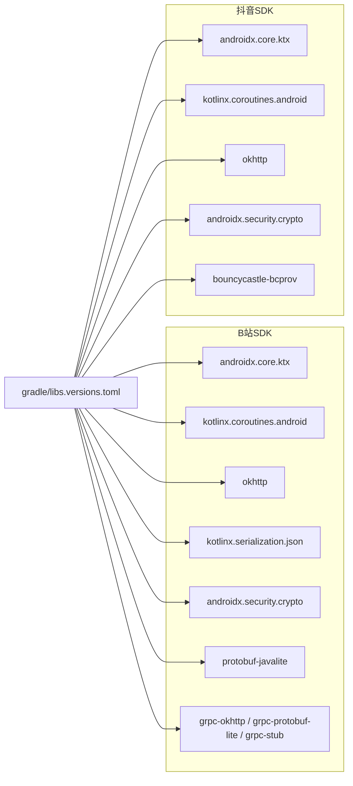

# 平台SDK集成

<cite>
**本文引用的文件**
- [sdk/bili/build.gradle.kts](file://sdk/bili/build.gradle.kts)
- [sdk/douyin/build.gradle.kts](file://sdk/douyin/build.gradle.kts)
- [gradle/libs.versions.toml](file://gradle/libs.versions.toml)
- [sdk/bili/src/main/java/com/lightningstudio/watchrss/sdk/bili/BiliHttpClient.kt](file://sdk/bili/src/main/java/com/lightningstudio/watchrss/sdk/bili/BiliHttpClient.kt)
- [sdk/bili/src/main/java/com/lightningstudio/watchrss/sdk/bili/BiliClient.kt](file://sdk/bili/src/main/java/com/lightningstudio/watchrss/sdk/bili/BiliClient.kt)
- [sdk/bili/src/main/java/com/lightningstudio/watchrss/sdk/bili/BiliAuth.kt](file://sdk/bili/src/main/java/com/lightningstudio/watchrss/sdk/bili/BiliAuth.kt)
- [sdk/bili/src/main/java/com/lightningstudio/watchrss/sdk/bili/BiliSigners.kt](file://sdk/bili/src/main/java/com/lightningstudio/watchrss/sdk/bili/BiliSigners.kt)
- [sdk/bili/src/main/java/com/lightningstudio/watchrss/sdk/bili/BiliWebHeaders.kt](file://sdk/bili/src/main/java/com/lightningstudio/watchrss/sdk/bili/BiliWebHeaders.kt)
- [sdk/bili/src/main/java/com/lightningstudio/watchrss/sdk/bili/BiliSdkConfig.kt](file://sdk/bili/src/main/java/com/lightningstudio/watchrss/sdk/bili/BiliSdkConfig.kt)
- [sdk/bili/src/main/java/com/lightningstudio/watchrss/sdk/bili/BiliModels.kt](file://sdk/bili/src/main/java/com/lightningstudio/watchrss/sdk/bili/BiliModels.kt)
- [sdk/douyin/src/main/java/com/lightningstudio/watchrss/sdk/douyin/DouyinWebCrawler.kt](file://sdk/douyin/src/main/java/com/lightningstudio/watchrss/sdk/douyin/DouyinWebCrawler.kt)
- [sdk/douyin/src/main/java/com/lightningstudio/watchrss/sdk/douyin/ABogus.kt](file://sdk/douyin/src/main/java/com/lightningstudio/watchrss/sdk/douyin/ABogus.kt)
- [sdk/douyin/src/main/java/com/lightningstudio/watchrss/sdk/douyin/CrawlerModels.kt](file://sdk/douyin/src/main/java/com/lightningstudio/watchrss/sdk/douyin/CrawlerModels.kt)
- [sdk/douyin/src/main/java/com/lightningstudio/watchrss/sdk/douyin/DouyinModels.kt](file://sdk/douyin/src/main/java/com/lightningstudio/watchrss/sdk/douyin/DouyinModels.kt)
</cite>

## 目录
1. [简介](#简介)
2. [项目结构](#项目结构)
3. [核心组件](#核心组件)
4. [架构总览](#架构总览)
5. [组件详解](#组件详解)
6. [依赖关系分析](#依赖关系分析)
7. [性能与稳定性](#性能与稳定性)
8. [故障排查指南](#故障排查指南)
9. [结论](#结论)
10. [附录](#附录)

## 简介
本文件面向Android WatchRSS项目的平台SDK集成，系统性阐述B站与抖音两大平台SDK的设计与实现要点，覆盖API客户端架构、认证机制、请求签名、错误处理、响应解析、网页爬虫与反爬策略、Cookie管理、数据模型与模块化设计，并给出扩展性建议、使用示例、配置参数说明与常见问题解决方案。

## 项目结构
- SDK采用模块化组织，B站SDK位于sdk/bili，抖音SDK位于sdk/douyin，分别作为独立Android Library发布。
- 构建脚本通过版本目录统一管理第三方依赖，B站SDK额外启用Protobuf与gRPC插件以支持协议扩展。
- 应用层通过依赖注入方式组合SDK能力，形成清晰的职责边界与可测试性。

**图表来源**
- [sdk/bili/build.gradle.kts:13-18](file://sdk/bili/build.gradle.kts#L13-L18)
- [sdk/douyin/build.gradle.kts:1-4](file://sdk/douyin/build.gradle.kts#L1-L4)

**章节来源**
- [sdk/bili/build.gradle.kts:13-18](file://sdk/bili/build.gradle.kts#L13-L18)
- [sdk/douyin/build.gradle.kts:1-4](file://sdk/douyin/build.gradle.kts#L1-L4)
- [gradle/libs.versions.toml:38-91](file://gradle/libs.versions.toml#L38-L91)

## 核心组件
- B站SDK核心由配置、HTTP客户端、认证、签名器、请求头构建器与业务模块组成，围绕BiliClient聚合对外暴露能力。
- 抖音SDK以OkHttp为基础，结合ABogus生成器与爬虫模型，完成a_bogus参数计算与网页接口调用。

**章节来源**
- [sdk/bili/src/main/java/com/lightningstudio/watchrss/sdk/bili/BiliClient.kt:3-19](file://sdk/bili/src/main/java/com/lightningstudio/watchrss/sdk/bili/BiliClient.kt#L3-L19)
- [sdk/bili/src/main/java/com/lightningstudio/watchrss/sdk/bili/BiliHttpClient.kt:37-122](file://sdk/bili/src/main/java/com/lightningstudio/watchrss/sdk/bili/BiliHttpClient.kt#L37-L122)
- [sdk/bili/src/main/java/com/lightningstudio/watchrss/sdk/bili/BiliAuth.kt:13-406](file://sdk/bili/src/main/java/com/lightningstudio/watchrss/sdk/bili/BiliAuth.kt#L13-L406)
- [sdk/bili/src/main/java/com/lightningstudio/watchrss/sdk/bili/BiliSigners.kt:7-81](file://sdk/bili/src/main/java/com/lightningstudio/watchrss/sdk/bili/BiliSigners.kt#L7-L81)
- [sdk/bili/src/main/java/com/lightningstudio/watchrss/sdk/bili/BiliWebHeaders.kt:5-146](file://sdk/bili/src/main/java/com/lightningstudio/watchrss/sdk/bili/BiliWebHeaders.kt#L5-L146)
- [sdk/bili/src/main/java/com/lightningstudio/watchrss/sdk/bili/BiliSdkConfig.kt:3-34](file://sdk/bili/src/main/java/com/lightningstudio/watchrss/sdk/bili/BiliSdkConfig.kt#L3-L34)
- [sdk/douyin/src/main/java/com/lightningstudio/watchrss/sdk/douyin/DouyinWebCrawler.kt:11-99](file://sdk/douyin/src/main/java/com/lightningstudio/watchrss/sdk/douyin/DouyinWebCrawler.kt#L11-L99)
- [sdk/douyin/src/main/java/com/lightningstudio/watchrss/sdk/douyin/ABogus.kt:8-48](file://sdk/douyin/src/main/java/com/lightningstudio/watchrss/sdk/douyin/ABogus.kt#L8-L48)

## 架构总览
下图展示B站SDK的高层交互：应用通过BiliClient访问各功能模块，底层由BiliHttpClient发起HTTP请求，借助BiliWebHeaders与BiliSigners生成合规请求头与签名，认证流程通过BiliAuth完成二维码登录与Cookie刷新。

**图表来源**
- [sdk/bili/src/main/java/com/lightningstudio/watchrss/sdk/bili/BiliClient.kt:3-19](file://sdk/bili/src/main/java/com/lightningstudio/watchrss/sdk/bili/BiliClient.kt#L3-L19)
- [sdk/bili/src/main/java/com/lightningstudio/watchrss/sdk/bili/BiliHttpClient.kt:47-94](file://sdk/bili/src/main/java/com/lightningstudio/watchrss/sdk/bili/BiliHttpClient.kt#L47-L94)
- [sdk/bili/src/main/java/com/lightningstudio/watchrss/sdk/bili/BiliWebHeaders.kt:6-68](file://sdk/bili/src/main/java/com/lightningstudio/watchrss/sdk/bili/BiliWebHeaders.kt#L6-L68)
- [sdk/bili/src/main/java/com/lightningstudio/watchrss/sdk/bili/BiliSigners.kt:20-36](file://sdk/bili/src/main/java/com/lightningstudio/watchrss/sdk/bili/BiliSigners.kt#L20-L36)
- [sdk/bili/src/main/java/com/lightningstudio/watchrss/sdk/bili/BiliAuth.kt:52-95](file://sdk/bili/src/main/java/com/lightningstudio/watchrss/sdk/bili/BiliAuth.kt#L52-L95)

## 组件详解

### B站SDK：API客户端与认证
- HTTP客户端
  - 支持GET/POST表单/POST JSON三类请求，自动拼接查询参数与构建请求头。
  - 默认超时策略：连接10秒、读写20秒，IO调度执行网络调用。
  - 请求头由BiliWebHeaders根据URL上下文动态决定，包含User-Agent、Accept-Language、Referer、Origin、Cookie等。
- 认证与Cookie管理
  - 提供二维码登录流程：生成二维码键值、轮询状态、成功后解析Set-Cookie并更新账户存储。
  - Cookie刷新：检查是否需要刷新、抓取刷新CSRF、提交刷新请求、确认刷新、同步身份信息（BUVID、WBI密钥、Web Ticket）。
  - RSA公钥加密对应路径，用于生成刷新参数，确保安全传输。
- 请求签名
  - App签名：按参数名排序拼接，追加应用密钥后MD5。
  - WBI签名：基于imgKey与subKey混合生成mixinKey，对参数进行WBI编码后MD5，附加时间戳与w_rid。
- 错误处理
  - 统一解析响应状态与业务码，区分网络错误与业务错误；二维码轮询返回明确的状态枚举。
- 数据模型
  - 定义视频、统计、分页、互动等基础模型，便于上层业务组装。

**图表来源**
- [sdk/bili/src/main/java/com/lightningstudio/watchrss/sdk/bili/BiliClient.kt:3-19](file://sdk/bili/src/main/java/com/lightningstudio/watchrss/sdk/bili/BiliClient.kt#L3-L19)
- [sdk/bili/src/main/java/com/lightningstudio/watchrss/sdk/bili/BiliHttpClient.kt:37-122](file://sdk/bili/src/main/java/com/lightningstudio/watchrss/sdk/bili/BiliHttpClient.kt#L37-L122)
- [sdk/bili/src/main/java/com/lightningstudio/watchrss/sdk/bili/BiliAuth.kt:13-406](file://sdk/bili/src/main/java/com/lightningstudio/watchrss/sdk/bili/BiliAuth.kt#L13-L406)
- [sdk/bili/src/main/java/com/lightningstudio/watchrss/sdk/bili/BiliSigners.kt:7-81](file://sdk/bili/src/main/java/com/lightningstudio/watchrss/sdk/bili/BiliSigners.kt#L7-L81)
- [sdk/bili/src/main/java/com/lightningstudio/watchrss/sdk/bili/BiliWebHeaders.kt:5-146](file://sdk/bili/src/main/java/com/lightningstudio/watchrss/sdk/bili/BiliWebHeaders.kt#L5-L146)

**章节来源**
- [sdk/bili/src/main/java/com/lightningstudio/watchrss/sdk/bili/BiliHttpClient.kt:37-122](file://sdk/bili/src/main/java/com/lightningstudio/watchrss/sdk/bili/BiliHttpClient.kt#L37-L122)
- [sdk/bili/src/main/java/com/lightningstudio/watchrss/sdk/bili/BiliAuth.kt:52-188](file://sdk/bili/src/main/java/com/lightningstudio/watchrss/sdk/bili/BiliAuth.kt#L52-L188)
- [sdk/bili/src/main/java/com/lightningstudio/watchrss/sdk/bili/BiliSigners.kt:7-81](file://sdk/bili/src/main/java/com/lightningstudio/watchrss/sdk/bili/BiliSigners.kt#L7-L81)
- [sdk/bili/src/main/java/com/lightningstudio/watchrss/sdk/bili/BiliWebHeaders.kt:6-146](file://sdk/bili/src/main/java/com/lightningstudio/watchrss/sdk/bili/BiliWebHeaders.kt#L6-L146)
- [sdk/bili/src/main/java/com/lightningstudio/watchrss/sdk/bili/BiliModels.kt:3-60](file://sdk/bili/src/main/java/com/lightningstudio/watchrss/sdk/bili/BiliModels.kt#L3-L60)

### 抖音SDK：网页爬虫与反爬策略
- 爬虫实现
  - 使用OkHttp发起GET/POST请求，设置固定UA与Referer，携带Cookie。
  - 对视频详情与精选内容流两类接口分别构造参数与a_bogus。
  - 统一校验响应状态码与响应体有效性，抛出明确异常。
- 反爬虫对抗
  - a_bogus参数：由ABogus生成器负责字符串1/字符串2拼接、SM3哈希、RC4加密与字符表映射，最终得到稳定有效的a_bogus值。
  - 参数编码：URL参数转码并按字典序拼接，保证签名一致性。
- Cookie管理
  - 通过调用方传入Cookie，爬虫在请求头中携带，避免重复登录逻辑。
- 数据模型
  - 定义视频、笔记等内容类型，封装播放地址、封面、统计字段等。

**图表来源**
- [sdk/douyin/src/main/java/com/lightningstudio/watchrss/sdk/douyin/DouyinWebCrawler.kt:17-74](file://sdk/douyin/src/main/java/com/lightningstudio/watchrss/sdk/douyin/DouyinWebCrawler.kt#L17-L74)
- [sdk/douyin/src/main/java/com/lightningstudio/watchrss/sdk/douyin/ABogus.kt:37-43](file://sdk/douyin/src/main/java/com/lightningstudio/watchrss/sdk/douyin/ABogus.kt#L37-L43)

**章节来源**
- [sdk/douyin/src/main/java/com/lightningstudio/watchrss/sdk/douyin/DouyinWebCrawler.kt:11-99](file://sdk/douyin/src/main/java/com/lightningstudio/watchrss/sdk/douyin/DouyinWebCrawler.kt#L11-L99)
- [sdk/douyin/src/main/java/com/lightningstudio/watchrss/sdk/douyin/ABogus.kt:8-211](file://sdk/douyin/src/main/java/com/lightningstudio/watchrss/sdk/douyin/ABogus.kt#L8-L211)
- [sdk/douyin/src/main/java/com/lightningstudio/watchrss/sdk/douyin/CrawlerModels.kt:4-101](file://sdk/douyin/src/main/java/com/lightningstudio/watchrss/sdk/douyin/CrawlerModels.kt#L4-L101)
- [sdk/douyin/src/main/java/com/lightningstudio/watchrss/sdk/douyin/DouyinModels.kt:3-61](file://sdk/douyin/src/main/java/com/lightningstudio/watchrss/sdk/douyin/DouyinModels.kt#L3-L61)

### 数据模型与接口抽象
- B站模型
  - 视频项、统计、分页、互动等基础模型，支持APP/WEB双源分页结构。
- 抖音模型
  - 视频/笔记两种内容类型，统一字段如awemeId、desc、authorName、diggs等，便于上层统一处理。

**章节来源**
- [sdk/bili/src/main/java/com/lightningstudio/watchrss/sdk/bili/BiliModels.kt:3-60](file://sdk/bili/src/main/java/com/lightningstudio/watchrss/sdk/bili/BiliModels.kt#L3-L60)
- [sdk/douyin/src/main/java/com/lightningstudio/watchrss/sdk/douyin/DouyinModels.kt:3-61](file://sdk/douyin/src/main/java/com/lightningstudio/watchrss/sdk/douyin/DouyinModels.kt#L3-L61)

## 依赖关系分析
- 依赖统一由版本目录管理，B站SDK额外引入Protobuf与gRPC相关库，便于未来扩展二进制协议。
- 抖山SDK引入BCProv用于SM3等加密工具链，满足ABogus生成器需求。

**图表来源**
- [gradle/libs.versions.toml:38-91](file://gradle/libs.versions.toml#L38-L91)
- [sdk/bili/build.gradle.kts:47-61](file://sdk/bili/build.gradle.kts#L47-L61)
- [sdk/douyin/build.gradle.kts:25-31](file://sdk/douyin/build.gradle.kts#L25-L31)

**章节来源**
- [gradle/libs.versions.toml:38-91](file://gradle/libs.versions.toml#L38-L91)
- [sdk/bili/build.gradle.kts:47-61](file://sdk/bili/build.gradle.kts#L47-L61)
- [sdk/douyin/build.gradle.kts:25-31](file://sdk/douyin/build.gradle.kts#L25-L31)

## 性能与稳定性
- 超时与并发
  - B站HTTP客户端设置合理的连接与读写超时，避免阻塞主线程；使用IO调度器执行网络任务。
- 请求头与签名
  - 动态构建请求头，减少不必要的Origin/Referer，降低被拦截概率；WBI/App签名确保参数完整性。
- 反爬策略
  - 固定UA与Referer，参数严格编码与排序，a_bogus生成器稳定输出，提升成功率。
- 错误处理
  - 明确区分网络错误与业务错误，二维码轮询返回状态枚举，便于上层快速判断与重试。

[本节为通用指导，不直接分析具体文件]

## 故障排查指南
- B站二维码登录
  - 若轮询返回过期/扫描/待确认等状态，请重新发起二维码生成并持续轮询；检查网络与服务器返回码。
- Cookie刷新
  - 若刷新失败，检查CSRF、refresh_token与对应路径生成；确认刷新CSRF抓取成功且未为空。
- 抖音爬虫
  - 若响应体为空或为blocked，检查Cookie有效性；确认a_bogus生成正确且参数已按要求编码。
- 通用
  - 打开调试日志，关注SDK内部日志输出，定位问题阶段与原因。

**章节来源**
- [sdk/bili/src/main/java/com/lightningstudio/watchrss/sdk/bili/BiliAuth.kt:64-95](file://sdk/bili/src/main/java/com/lightningstudio/watchrss/sdk/bili/BiliAuth.kt#L64-L95)
- [sdk/bili/src/main/java/com/lightningstudio/watchrss/sdk/bili/BiliAuth.kt:129-188](file://sdk/bili/src/main/java/com/lightningstudio/watchrss/sdk/bili/BiliAuth.kt#L129-L188)
- [sdk/douyin/src/main/java/com/lightningstudio/watchrss/sdk/douyin/DouyinWebCrawler.kt:76-93](file://sdk/douyin/src/main/java/com/lightningstudio/watchrss/sdk/douyin/DouyinWebCrawler.kt#L76-L93)

## 结论
本SDK通过模块化设计与清晰的职责划分，实现了B站与抖音平台的稳定接入。B站侧以配置驱动的请求头与多级签名保障合规性，抖音侧以ABogus生成器与严格参数编码应对反爬挑战。整体具备良好的扩展性与可维护性，适合在应用层进一步封装与复用。

[本节为总结性内容，不直接分析具体文件]

## 附录

### 配置参数说明（B站）
- 基础URL与UA
  - webUserAgent、webAcceptLanguage、webReferer、webBaseUrl、appBaseUrl、passportBaseUrl
- 应用与TV端密钥
  - appKey/appSec、tvAppKey/tvAppSec，通过BuildConfig注入
- 其他
  - mobiApp、platform、build等，用于请求头与签名上下文

**章节来源**
- [sdk/bili/src/main/java/com/lightningstudio/watchrss/sdk/bili/BiliSdkConfig.kt:3-34](file://sdk/bili/src/main/java/com/lightningstudio/watchrss/sdk/bili/BiliSdkConfig.kt#L3-L34)

### 使用示例（步骤说明）
- B站
  - 初始化BiliSdkConfig与BiliAccountStore，创建BiliClient实例。
  - 调用BiliAuth.requestWebQrCode生成二维码，轮询BiliAuth.pollWebQrCode直至成功，随后即可使用带Cookie的HTTP客户端访问业务接口。
- 抖音
  - 准备有效Cookie，构造CrawlerModels参数，调用DouyinWebCrawler.fetchOneVideo或fetchJingxuanFeed获取原始JSON，再交由上层解析。

**章节来源**
- [sdk/bili/src/main/java/com/lightningstudio/watchrss/sdk/bili/BiliClient.kt:3-19](file://sdk/bili/src/main/java/com/lightningstudio/watchrss/sdk/bili/BiliClient.kt#L3-L19)
- [sdk/bili/src/main/java/com/lightningstudio/watchrss/sdk/bili/BiliAuth.kt:52-95](file://sdk/bili/src/main/java/com/lightningstudio/watchrss/sdk/bili/BiliAuth.kt#L52-L95)
- [sdk/douyin/src/main/java/com/lightningstudio/watchrss/sdk/douyin/DouyinWebCrawler.kt:17-74](file://sdk/douyin/src/main/java/com/lightningstudio/watchrss/sdk/douyin/DouyinWebCrawler.kt#L17-L74)

### 扩展性设计与兼容性
- 新接口添加
  - 在各自模块内新增请求模型与业务模块，复用现有HTTP客户端与签名/请求头工具。
- 版本兼容
  - 通过BiliSdkConfig默认值与浏览器配置回退策略，确保旧版配置仍可用。
- 向后兼容
  - 保持数据模型字段可选，避免上游变更导致崩溃；对新增字段做条件解析。

**章节来源**
- [sdk/bili/src/main/java/com/lightningstudio/watchrss/sdk/bili/BiliSdkConfig.kt:23-33](file://sdk/bili/src/main/java/com/lightningstudio/watchrss/sdk/bili/BiliSdkConfig.kt#L23-L33)
- [sdk/bili/src/main/java/com/lightningstudio/watchrss/sdk/bili/BiliModels.kt:3-60](file://sdk/bili/src/main/java/com/lightningstudio/watchrss/sdk/bili/BiliModels.kt#L3-L60)