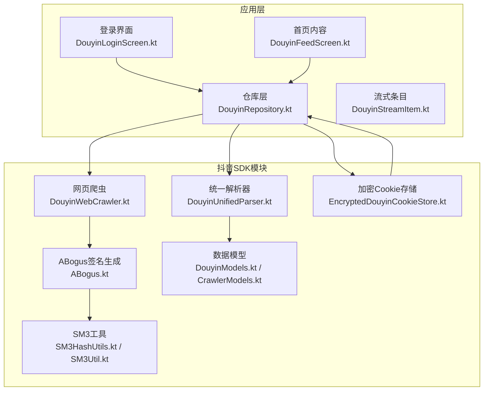
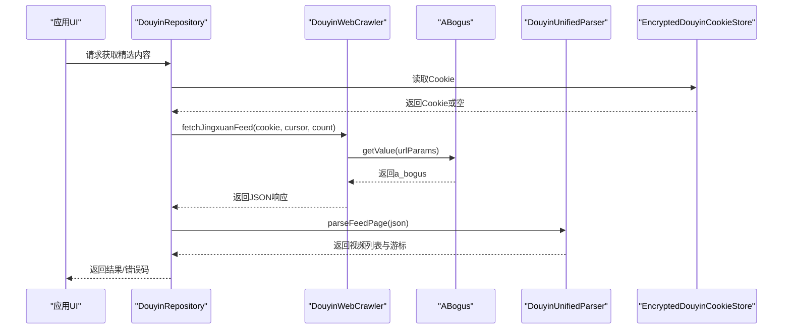
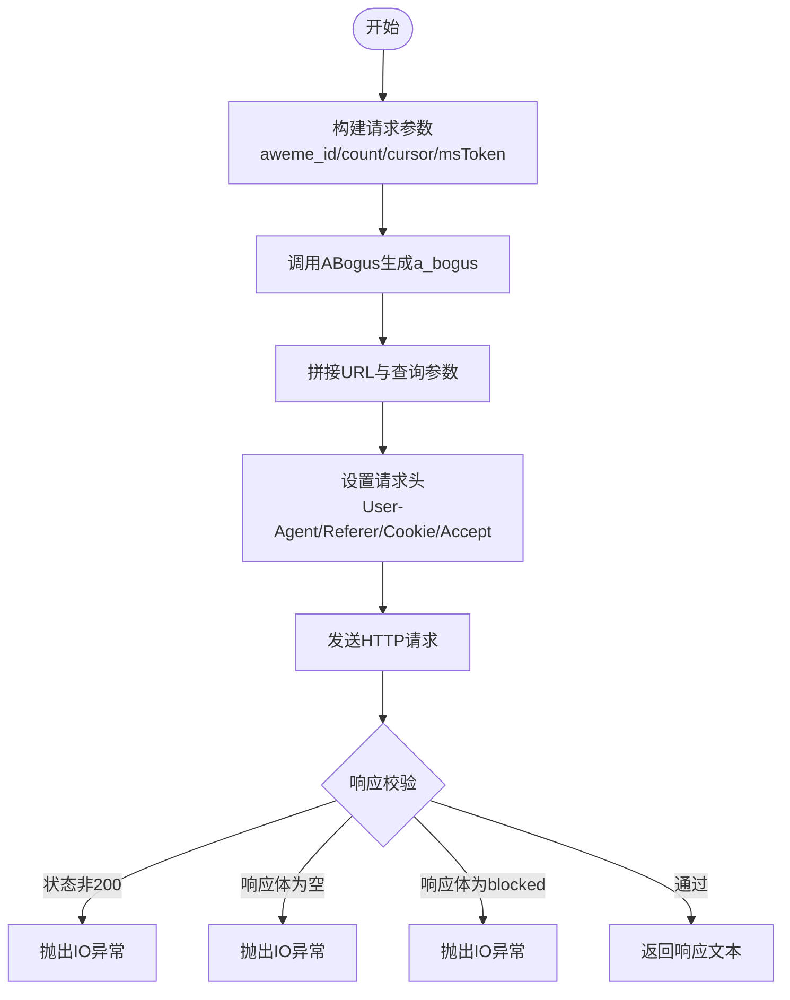
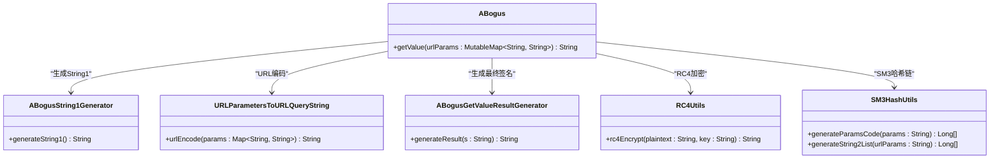
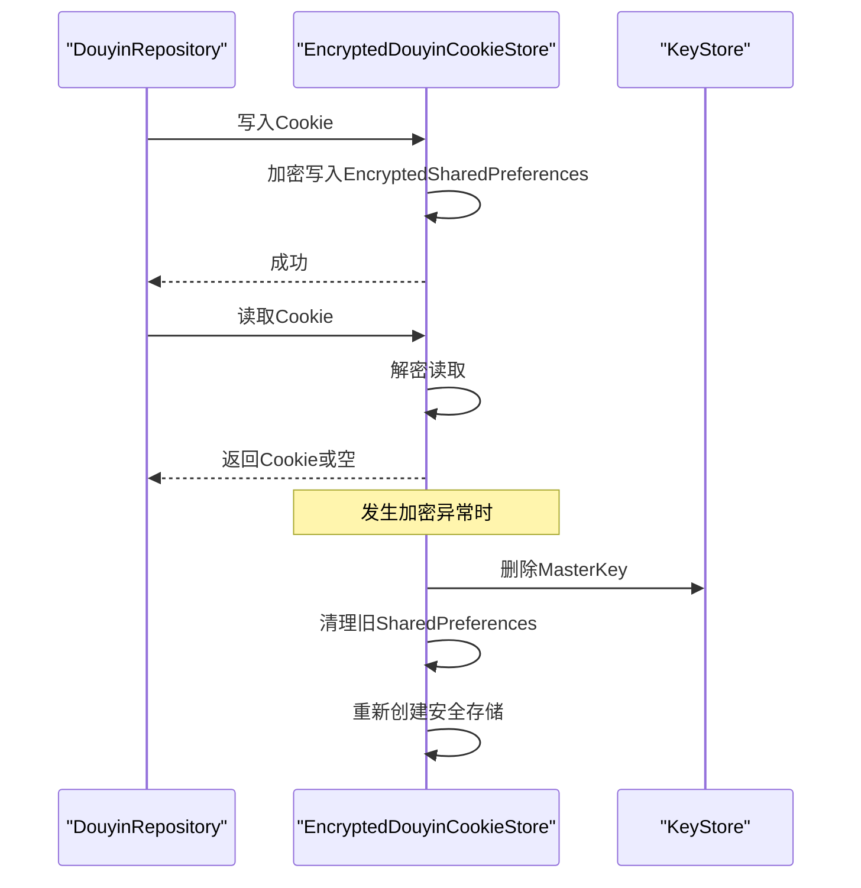
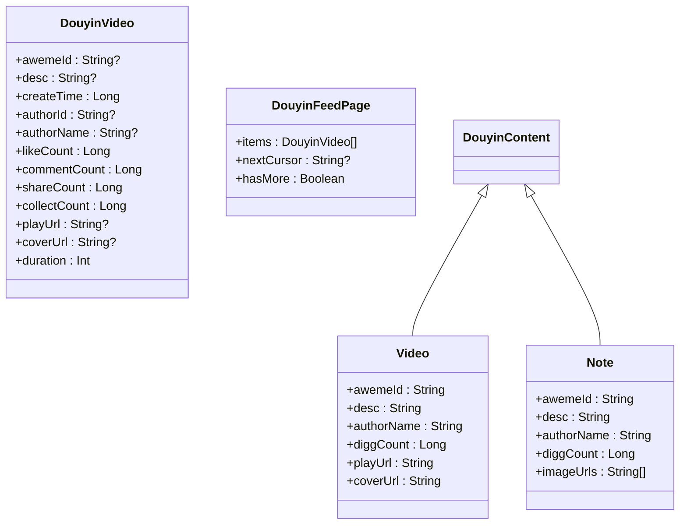
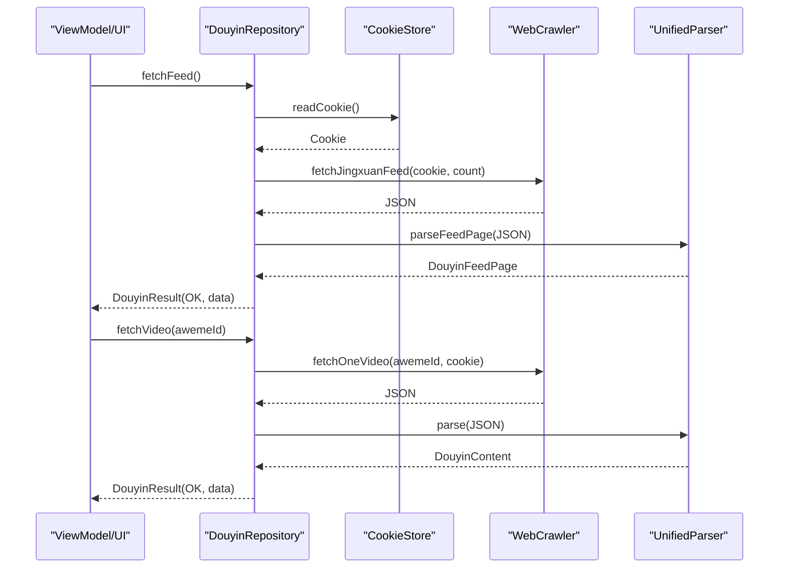
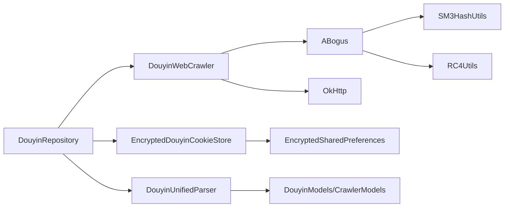

# 抖音SDK集成

<cite>
**本文档引用的文件**
- [DouyinWebCrawler.kt](file://sdk/douyin/src/main/java/com/lightningstudio/watchrss/sdk/douyin/DouyinWebCrawler.kt)
- [ABogus.kt](file://sdk/douyin/src/main/java/com/lightningstudio/watchrss/sdk/douyin/ABogus.kt)
- [EncryptedDouyinCookieStore.kt](file://sdk/douyin/src/main/java/com/lightningstudio/watchrss/sdk/douyin/EncryptedDouyinCookieStore.kt)
- [DouyinModels.kt](file://sdk/douyin/src/main/java/com/lightningstudio/watchrss/sdk/douyin/DouyinModels.kt)
- [CrawlerModels.kt](file://sdk/douyin/src/main/java/com/lightningstudio/watchrss/sdk/douyin/CrawlerModels.kt)
- [DouyinUnifiedParser.kt](file://sdk/douyin/src/main/java/com/lightningstudio/watchrss/sdk/douyin/DouyinUnifiedParser.kt)
- [SM3HashUtils.kt](file://sdk/douyin/src/main/java/com/lightningstudio/watchrss/sdk/douyin/utils/SM3HashUtils.kt)
- [SM3Util.kt](file://sdk/douyin/src/main/java/com/lightningstudio/watchrss/sdk/douyin/utils/SM3Util.kt)
- [DouyinRepository.kt](file://app/src/main/java/com/lightningstudio/watchrss/data/douyin/DouyinRepository.kt)
- [DouyinLoginScreen.kt](file://app/src/main/java/com/lightningstudio/watchrss/ui/screen/douyin/DouyinLoginScreen.kt)
- [DouyinFeedScreen.kt](file://app/src/main/java/com/lightningstudio/watchrss/ui/screen/douyin/DouyinFeedScreen.kt)
- [DouyinStreamItem.kt](file://app/src/main/java/com/lightningstudio/watchrss/data/douyin/DouyinStreamItem.kt)
- [build.gradle.kts](file://sdk/douyin/build.gradle.kts)
</cite>

## 目录
1. [简介](#简介)
2. [项目结构](#项目结构)
3. [核心组件](#核心组件)
4. [架构总览](#架构总览)
5. [详细组件分析](#详细组件分析)
6. [依赖关系分析](#依赖关系分析)
7. [性能考虑](#性能考虑)
8. [故障排查指南](#故障排查指南)
9. [结论](#结论)
10. [附录](#附录)

## 简介
本文件面向Android WatchRSS项目的抖音SDK集成，系统性阐述基于网页爬虫的抖音SDK实现，包括：
- 抖音网页爬虫工作原理与页面抓取策略
- 反爬虫机制ABogus的参数生成、签名计算与动态变化应对
- Cookie管理系统的安全存储、自动刷新与会话维护
- 数据模型定义与解析流程
- SDK稳定性保障（网络异常、重试、降级）
- 实际使用示例（内容获取、用户信息查询、评论数据处理）
- 性能优化建议、调试技巧与常见问题解决方案

## 项目结构
抖音SDK位于独立模块中，应用层通过仓库模式统一接入SDK能力，并在UI层提供登录与内容展示界面。

**图表来源**
- [DouyinRepository.kt:21-28](file://app/src/main/java/com/lightningstudio/watchrss/data/douyin/DouyinRepository.kt#L21-L28)
- [DouyinWebCrawler.kt:11-42](file://sdk/douyin/src/main/java/com/lightningstudio/watchrss/sdk/douyin/DouyinWebCrawler.kt#L11-L42)
- [DouyinUnifiedParser.kt:6-11](file://sdk/douyin/src/main/java/com/lightningstudio/watchrss/sdk/douyin/DouyinUnifiedParser.kt#L6-L11)
- [EncryptedDouyinCookieStore.kt:16-38](file://sdk/douyin/src/main/java/com/lightningstudio/watchrss/sdk/douyin/EncryptedDouyinCookieStore.kt#L16-L38)
- [ABogus.kt:8-43](file://sdk/douyin/src/main/java/com/lightningstudio/watchrss/sdk/douyin/ABogus.kt#L8-L43)
- [SM3HashUtils.kt:13-26](file://sdk/douyin/src/main/java/com/lightningstudio/watchrss/sdk/douyin/utils/SM3HashUtils.kt#L13-L26)

**章节来源**
- [DouyinRepository.kt:21-28](file://app/src/main/java/com/lightningstudio/watchrss/data/douyin/DouyinRepository.kt#L21-L28)
- [build.gradle.kts:25-31](file://sdk/douyin/build.gradle.kts#L25-L31)

## 核心组件
- 抖音网页爬虫（DouyinWebCrawler）：封装OkHttp请求，负责构建带ABogus签名的请求并进行基础有效性校验。
- ABogus签名生成（ABogus）：实现参数编码、SM3哈希链、RC4加密与最终签名生成，确保a_bogus参数动态且不可预测。
- 加密Cookie存储（EncryptedDouyinCookieStore）：基于AndroidX Security的EncryptedSharedPreferences，提供安全持久化与异常恢复。
- 统一解析器（DouyinUnifiedParser）：将抖音接口返回的JSON解析为统一的数据模型，支持视频与图文内容。
- 数据模型（DouyinModels/CrawlerModels）：定义视频、图文、请求参数等结构，保证上层消费的一致性。
- 应用仓库（DouyinRepository）：组合CookieStore、Crawler、Parser，提供业务API与错误码封装。

**章节来源**
- [DouyinWebCrawler.kt:11-42](file://sdk/douyin/src/main/java/com/lightningstudio/watchrss/sdk/douyin/DouyinWebCrawler.kt#L11-L42)
- [ABogus.kt:8-43](file://sdk/douyin/src/main/java/com/lightningstudio/watchrss/sdk/douyin/ABogus.kt#L8-L43)
- [EncryptedDouyinCookieStore.kt:16-38](file://sdk/douyin/src/main/java/com/lightningstudio/watchrss/sdk/douyin/EncryptedDouyinCookieStore.kt#L16-L38)
- [DouyinUnifiedParser.kt:6-11](file://sdk/douyin/src/main/java/com/lightningstudio/watchrss/sdk/douyin/DouyinUnifiedParser.kt#L6-L11)
- [DouyinModels.kt:3-36](file://sdk/douyin/src/main/java/com/lightningstudio/watchrss/sdk/douyin/DouyinModels.kt#L3-L36)
- [CrawlerModels.kt:4-76](file://sdk/douyin/src/main/java/com/lightningstudio/watchrss/sdk/douyin/CrawlerModels.kt#L4-L76)
- [DouyinRepository.kt:21-28](file://app/src/main/java/com/lightningstudio/watchrss/data/douyin/DouyinRepository.kt#L21-L28)

## 架构总览
抖音SDK采用“仓库+爬虫+解析+存储”的分层架构，应用层通过仓库统一调度，内部依赖OkHttp与自研ABogus签名生成器，解析器负责跨接口一致性输出。

**图表来源**
- [DouyinRepository.kt:66-87](file://app/src/main/java/com/lightningstudio/watchrss/data/douyin/DouyinRepository.kt#L66-L87)
- [DouyinWebCrawler.kt:44-74](file://sdk/douyin/src/main/java/com/lightningstudio/watchrss/sdk/douyin/DouyinWebCrawler.kt#L44-L74)
- [ABogus.kt:37-43](file://sdk/douyin/src/main/java/com/lightningstudio/watchrss/sdk/douyin/ABogus.kt#L37-L43)
- [DouyinUnifiedParser.kt:11-59](file://sdk/douyin/src/main/java/com/lightningstudio/watchrss/sdk/douyin/DouyinUnifiedParser.kt#L11-L59)

## 详细组件分析

### 抖音网页爬虫（DouyinWebCrawler）
- 功能职责
  - 构建视频详情与精选内容请求，注入必要请求头与Cookie。
  - 通过ABogus生成a_bogus参数，拼接到URL查询参数。
  - 统一响应校验：状态码、空响应体、特定屏蔽字符串等。
- 页面抓取策略
  - 视频详情：GET请求，参数含aweme_id与msToken占位。
  - 精选内容：POST请求（空体），参数含count与可选cursor/max_cursor。
- 反爬虫对抗
  - a_bogus参数由ABogus动态生成，避免固定签名。
  - User-Agent与Referer固定，模拟浏览器环境。
- 错误处理
  - 非200状态抛出IO异常；空响应体或"blocked"视为Cookie无效。

**图表来源**
- [DouyinWebCrawler.kt:17-42](file://sdk/douyin/src/main/java/com/lightningstudio/watchrss/sdk/douyin/DouyinWebCrawler.kt#L17-L42)
- [DouyinWebCrawler.kt:44-74](file://sdk/douyin/src/main/java/com/lightningstudio/watchrss/sdk/douyin/DouyinWebCrawler.kt#L44-L74)
- [DouyinWebCrawler.kt:76-93](file://sdk/douyin/src/main/java/com/lightningstudio/watchrss/sdk/douyin/DouyinWebCrawler.kt#L76-L93)

**章节来源**
- [DouyinWebCrawler.kt:11-99](file://sdk/douyin/src/main/java/com/lightningstudio/watchrss/sdk/douyin/DouyinWebCrawler.kt#L11-L99)

### ABogus反爬虫机制
- 参数生成
  - 将请求参数映射为字符串并进行URL编码。
  - 生成String1与String2两段字符串，拼接后经RC4加密得到中间结果。
  - 使用自定义字符表进行三字一组的Base64风格编码，得到最终a_bogus。
- 动态变化应对
  - String1包含随机片段与浏览器特征编码，降低复用概率。
  - String2基于SM3哈希链与时间偏移，确保每次请求参数不同。
- 工具依赖
  - SM3HashUtils：严格对齐Python实现的SM3行为，生成参数编码与哈希链。
  - RC4Utils：实现RC4加密算法，作为签名生成的关键步骤之一。

**图表来源**
- [ABogus.kt:8-43](file://sdk/douyin/src/main/java/com/lightningstudio/watchrss/sdk/douyin/ABogus.kt#L8-L43)
- [ABogus.kt:50-121](file://sdk/douyin/src/main/java/com/lightningstudio/watchrss/sdk/douyin/ABogus.kt#L50-L121)
- [ABogus.kt:125-136](file://sdk/douyin/src/main/java/com/lightningstudio/watchrss/sdk/douyin/ABogus.kt#L125-L136)
- [ABogus.kt:138-176](file://sdk/douyin/src/main/java/com/lightningstudio/watchrss/sdk/douyin/ABogus.kt#L138-L176)
- [ABogus.kt:178-210](file://sdk/douyin/src/main/java/com/lightningstudio/watchrss/sdk/douyin/ABogus.kt#L178-L210)
- [SM3HashUtils.kt:13-88](file://sdk/douyin/src/main/java/com/lightningstudio/watchrss/sdk/douyin/utils/SM3HashUtils.kt#L13-L88)

**章节来源**
- [ABogus.kt:8-211](file://sdk/douyin/src/main/java/com/lightningstudio/watchrss/sdk/douyin/ABogus.kt#L8-L211)
- [SM3HashUtils.kt:13-205](file://sdk/douyin/src/main/java/com/lightningstudio/watchrss/sdk/douyin/utils/SM3HashUtils.kt#L13-L205)

### Cookie管理系统（EncryptedDouyinCookieStore）
- 安全存储
  - 基于EncryptedSharedPreferences与AES256-GCM，确保Cookie明文安全。
  - 使用Mutex串行化读写，避免并发冲突。
- 自动刷新与会话维护
  - 提供读取与写入接口；写入空值用于登出清理。
  - 异常恢复：捕获加密相关异常后重置安全存储并重建SharedPreferences。
- 会话清理
  - 仓库层在登出时同步清理WebView会话与本地缓存桶。

**图表来源**
- [EncryptedDouyinCookieStore.kt:24-53](file://sdk/douyin/src/main/java/com/lightningstudio/watchrss/sdk/douyin/EncryptedDouyinCookieStore.kt#L24-L53)
- [EncryptedDouyinCookieStore.kt:69-80](file://sdk/douyin/src/main/java/com/lightningstudio/watchrss/sdk/douyin/EncryptedDouyinCookieStore.kt#L69-L80)
- [EncryptedDouyinCookieStore.kt:82-102](file://sdk/douyin/src/main/java/com/lightningstudio/watchrss/sdk/douyin/EncryptedDouyinCookieStore.kt#L82-L102)

**章节来源**
- [EncryptedDouyinCookieStore.kt:16-114](file://sdk/douyin/src/main/java/com/lightningstudio/watchrss/sdk/douyin/EncryptedDouyinCookieStore.kt#L16-L114)
- [DouyinRepository.kt:34-46](file://app/src/main/java/com/lightningstudio/watchrss/data/douyin/DouyinRepository.kt#L34-L46)

### 数据模型与解析（DouyinModels / CrawlerModels / DouyinUnifiedParser）
- 模型定义
  - DouyinVideo：视频基础字段（ID、标题、作者、统计数据、播放/封面地址、时长）。
  - DouyinFeedPage：精选内容分页（items、nextCursor、hasMore）。
  - DouyinContent：内容类型密封类（Video/Note），统一对外暴露必要字段。
  - BaseRequestModel/Crawler参数模型：封装设备、浏览器、版本等通用请求参数。
- 解析流程
  - parseFeedPage：解析aweme_list，抽取视频元数据与统计信息，生成分页对象。
  - parse：根据aweme_type区分视频与图文，提取播放地址或图片URL列表。
- 错误处理
  - 缺失aweme_detail或类型不匹配时抛出JSON异常，便于上层识别。

**图表来源**
- [DouyinModels.kt:3-60](file://sdk/douyin/src/main/java/com/lightningstudio/watchrss/sdk/douyin/DouyinModels.kt#L3-L60)
- [CrawlerModels.kt:4-101](file://sdk/douyin/src/main/java/com/lightningstudio/watchrss/sdk/douyin/CrawlerModels.kt#L4-L101)
- [DouyinUnifiedParser.kt:6-99](file://sdk/douyin/src/main/java/com/lightningstudio/watchrss/sdk/douyin/DouyinUnifiedParser.kt#L6-L99)

**章节来源**
- [DouyinModels.kt:3-61](file://sdk/douyin/src/main/java/com/lightningstudio/watchrss/sdk/douyin/DouyinModels.kt#L3-L61)
- [CrawlerModels.kt:4-101](file://sdk/douyin/src/main/java/com/lightningstudio/watchrss/sdk/douyin/CrawlerModels.kt#L4-L101)
- [DouyinUnifiedParser.kt:6-101](file://sdk/douyin/src/main/java/com/lightningstudio/watchrss/sdk/douyin/DouyinUnifiedParser.kt#L6-L101)

### 应用仓库与使用示例（DouyinRepository）
- 登录状态判定与Cookie管理
  - 提供isLoggedIn/readCookie/clearCookie/logoutAndClearMediaCache等接口。
  - 登出时清理Cookie与预加载缓存桶。
- 内容获取
  - fetchFeed：获取精选内容列表（封装为结果对象）。
  - fetchFeedPage：支持游标分页，返回分页对象。
  - fetchVideo：获取单个视频详情，返回统一内容模型。
- 头部构建
  - buildPlayHeaders：生成播放所需的User-Agent、Referer与Cookie头部。
- 错误码
  - OK/NOT_LOGGED_IN/REQUEST_FAILED/PARSE_FAILED，便于UI与日志定位问题。

**图表来源**
- [DouyinRepository.kt:57-112](file://app/src/main/java/com/lightningstudio/watchrss/data/douyin/DouyinRepository.kt#L57-L112)

**章节来源**
- [DouyinRepository.kt:21-204](file://app/src/main/java/com/lightningstudio/watchrss/data/douyin/DouyinRepository.kt#L21-L204)

## 依赖关系分析
- 外部依赖
  - OkHttp：网络请求与重定向跟随。
  - AndroidX Security Crypto：加密SharedPreferences。
  - BouncyCastle：SM3摘要与RC4加密。
- 模块内耦合
  - DouyinRepository聚合CookieStore、Crawler、Parser，形成稳定的业务入口。
  - ABogus依赖SM3HashUtils与RC4Utils，保持签名生成的可测试性。
  - Crawler依赖ABogus与OkHttp，职责单一，便于替换与扩展。

**图表来源**
- [build.gradle.kts:25-31](file://sdk/douyin/build.gradle.kts#L25-L31)
- [DouyinRepository.kt:8-14](file://app/src/main/java/com/lightningstudio/watchrss/data/douyin/DouyinRepository.kt#L8-L14)
- [ABogus.kt:8-43](file://sdk/douyin/src/main/java/com/lightningstudio/watchrss/sdk/douyin/ABogus.kt#L8-L43)
- [SM3HashUtils.kt:13-26](file://sdk/douyin/src/main/java/com/lightningstudio/watchrss/sdk/douyin/utils/SM3HashUtils.kt#L13-L26)

**章节来源**
- [build.gradle.kts:25-31](file://sdk/douyin/build.gradle.kts#L25-L31)

## 性能考虑
- 网络层
  - 启用重定向跟随，减少中间跳转开销。
  - 使用POST空体请求获取精选内容，避免冗余负载。
- 签名生成
  - SM3哈希与RC4加密在移动端具备足够性能，建议避免重复计算相同参数集。
- 存储与会话
  - Cookie加密读写使用IO调度器，避免阻塞主线程。
  - 登出时清理WebView会话与缓存，防止过期数据影响后续请求。
- UI与分页
  - 列表滚动与下拉刷新结合，合理设置分页大小与游标复用。

[本节为通用指导，无需特定文件引用]

## 故障排查指南
- 常见错误与定位
  - Cookie无效：响应体为空或"blocked"，触发NOT_LOGGED_IN错误码。
  - 网络请求失败：IOException，检查网络状态与代理配置。
  - 解析失败：JSONException，检查JSON结构是否符合预期。
- 调试技巧
  - 在WebView登录页中记录加载阶段时长与错误码，辅助定位登录失败原因。
  - 在ABogus生成过程中打印关键输入（如参数编码、时间戳、随机偏移），便于对比Python实现差异。
- 降级策略
  - 当Cookie异常时，优先提示用户重新登录并清理会话。
  - 分页加载失败时，保留已加载数据并提示重试。

**章节来源**
- [DouyinRepository.kt:76-87](file://app/src/main/java/com/lightningstudio/watchrss/data/douyin/DouyinRepository.kt#L76-L87)
- [DouyinWebCrawler.kt:76-93](file://sdk/douyin/src/main/java/com/lightningstudio/watchrss/sdk/douyin/DouyinWebCrawler.kt#L76-L93)
- [DouyinLoginScreen.kt:406-438](file://app/src/main/java/com/lightningstudio/watchrss/ui/screen/douyin/DouyinLoginScreen.kt#L406-L438)

## 结论
本SDK以“仓库+爬虫+解析+存储”为核心架构，通过ABogus动态签名与加密Cookie存储有效应对抖音反爬虫策略，配合统一的数据模型与错误码体系，为应用层提供稳定的内容获取能力。建议在实际集成中关注Cookie生命周期、网络异常处理与性能优化，确保在手表端的流畅体验。

[本节为总结性内容，无需特定文件引用]

## 附录

### SDK使用示例（路径指引）
- 获取精选内容
  - 路径：[fetchFeedPage:66-87](file://app/src/main/java/com/lightningstudio/watchrss/data/douyin/DouyinRepository.kt#L66-L87)
  - 流程：读取Cookie → 调用爬虫 → 解析JSON → 返回分页对象
- 获取单个视频详情
  - 路径：[fetchVideo:90-112](file://app/src/main/java/com/lightningstudio/watchrss/data/douyin/DouyinRepository.kt#L90-L112)
  - 流程：读取Cookie → 调用爬虫 → 解析JSON → 返回统一内容模型
- 登录与Cookie管理
  - 登录页：[DouyinLoginScreen.kt:167-182](file://app/src/main/java/com/lightningstudio/watchrss/ui/screen/douyin/DouyinLoginScreen.kt#L167-L182)
  - Cookie写入：[applyCookieHeader:48-55](file://app/src/main/java/com/lightningstudio/watchrss/data/douyin/DouyinRepository.kt#L48-L55)
  - 登出清理：[logoutAndClearMediaCache:39-46](file://app/src/main/java/com/lightningstudio/watchrss/data/douyin/DouyinRepository.kt#L39-L46)

**章节来源**
- [DouyinRepository.kt:48-112](file://app/src/main/java/com/lightningstudio/watchrss/data/douyin/DouyinRepository.kt#L48-L112)
- [DouyinLoginScreen.kt:167-182](file://app/src/main/java/com/lightningstudio/watchrss/ui/screen/douyin/DouyinLoginScreen.kt#L167-L182)