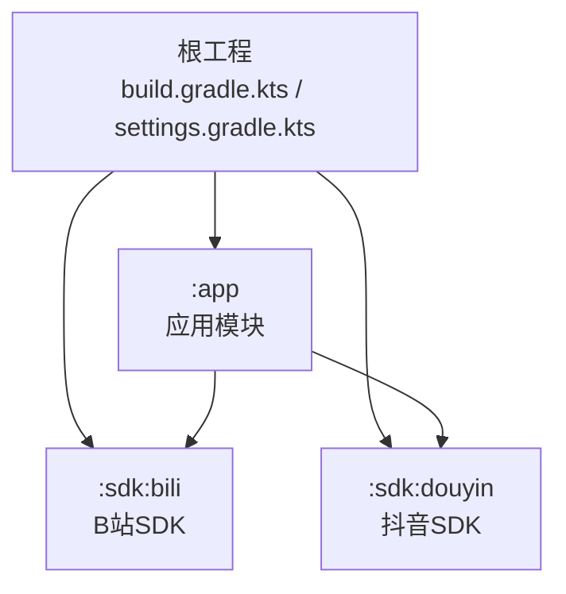
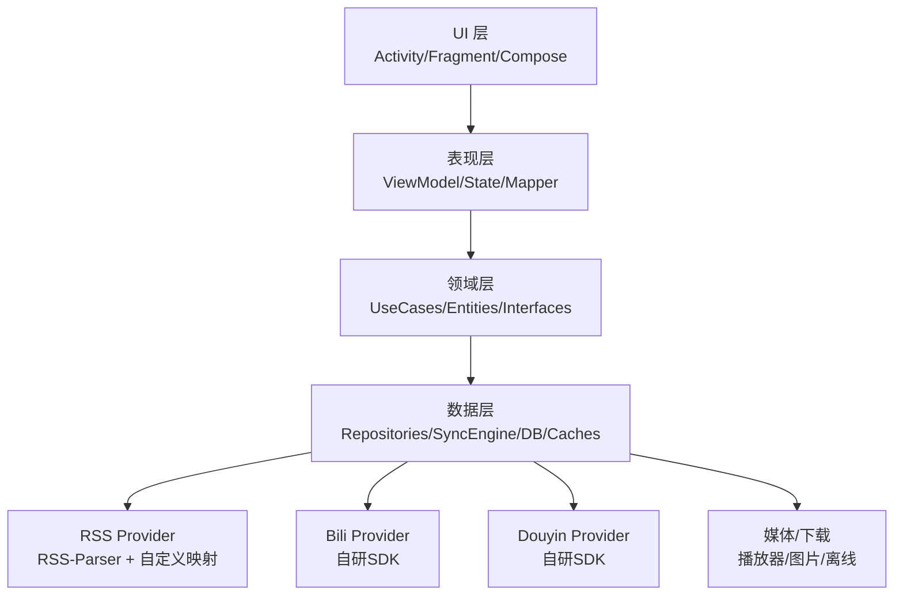
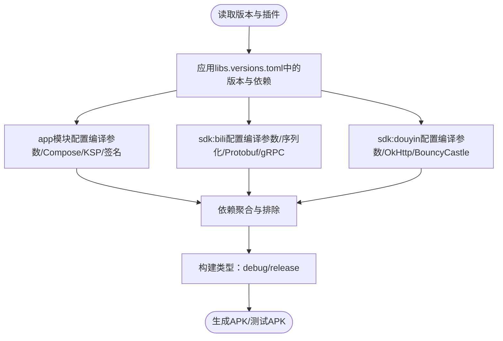
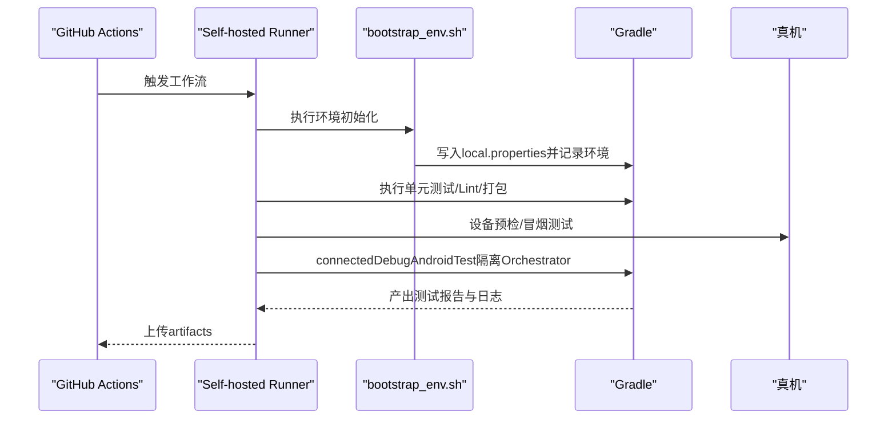
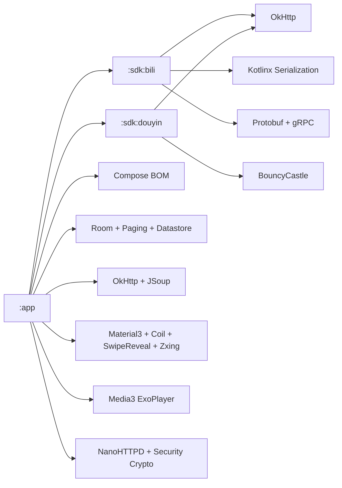

# 开发指南

<cite>
**本文引用的文件**
- [README.md](file://README.md)
- [build.gradle.kts](file://build.gradle.kts)
- [settings.gradle.kts](file://settings.gradle.kts)
- [gradle/libs.versions.toml](file://gradle/libs.versions.toml)
- [gradle.properties](file://gradle.properties)
- [gradle.properties.example](file://gradle.properties.example)
- [app/build.gradle.kts](file://app/build.gradle.kts)
- [sdk/bili/build.gradle.kts](file://sdk/bili/build.gradle.kts)
- [sdk/douyin/build.gradle.kts](file://sdk/douyin/build.gradle.kts)
- [.github/workflows/android-real-device.yml](file://.github/workflows/android-real-device.yml)
- [docs/ci_real_device_workflow.md](file://docs/ci_real_device_workflow.md)
- [scripts/ci/bootstrap_env.sh](file://scripts/ci/bootstrap_env.sh)
- [docs/engineering.md](file://docs/engineering.md)
- [TODO.md](file://TODO.md)
</cite>

## 目录
1. [简介](#简介)
2. [项目结构](#项目结构)
3. [核心组件](#核心组件)
4. [架构总览](#架构总览)
5. [详细组件分析](#详细组件分析)
6. [依赖分析](#依赖分析)
7. [性能考虑](#性能考虑)
8. [故障排除指南](#故障排除指南)
9. [结论](#结论)
10. [附录](#附录)

## 简介
本指南面向Android WatchRSS项目的开发者，提供从环境搭建、构建配置、代码规范与架构约束、开发工作流、IDE配置建议、调试与故障排除，到贡献指南与常见问题解决的全流程说明。项目聚焦可穿戴设备上的轻量化内容消费，涵盖B站、抖音与RSS三大内容通道，采用Jetpack Compose主UI、Kotlin多平台解析与SDK封装、Room数据库与分页加载等技术栈。

## 项目结构
项目采用多模块结构，根工程统一管理插件与依赖版本，app为主应用模块，sdk目录下分别封装B站与抖音SDK，便于模块化演进与复用。

图表来源
- [settings.gradle.kts:30-34](file://settings.gradle.kts#L30-L34)
- [app/build.gradle.kts:102-103](file://app/build.gradle.kts#L102-L103)

章节来源
- [settings.gradle.kts:1-35](file://settings.gradle.kts#L1-L35)
- [README.md:33-40](file://README.md#L33-L40)

## 核心组件
- 构建系统与版本管理
  - 顶层构建脚本声明插件别名，避免在子模块重复声明。
  - 依赖版本集中管理在libs.versions.toml，统一Android Gradle Plugin、Kotlin、Compose、Room、Navigation、Paging、Coil、OkHttp、RSS-Parser等版本。
- 应用模块(app)
  - 配置compileSdk、minSdk、targetSdk与Compose、KSP等特性开关。
  - 通过keystore.properties进行签名配置，支持debug/release签名一致性。
  - 依赖sdk:bili与sdk:douyin，以及Compose、Room、Paging、Datastore、JSoup、SwipeReveal、Zxing、Media3、NanoHTTPD、Security Crypto等。
- SDK模块
  - sdk:bili：集成Kotlin序列化、Protobuf与gRPC，通过local.properties注入平台密钥常量。
  - sdk:douyin：集成OkHttp与BouncyCastle，提供抖音相关工具与爬虫模型。
- CI与测试
  - GitHub Actions工作流在真实设备上执行端到端测试，包含环境准备、预检、冒烟测试、仪器测试与产物收集。

章节来源
- [build.gradle.kts:1-10](file://build.gradle.kts#L1-L10)
- [gradle/libs.versions.toml:1-101](file://gradle/libs.versions.toml#L1-L101)
- [app/build.gradle.kts:1-152](file://app/build.gradle.kts#L1-L152)
- [sdk/bili/build.gradle.kts:1-87](file://sdk/bili/build.gradle.kts#L1-L87)
- [sdk/douyin/build.gradle.kts:1-32](file://sdk/douyin/build.gradle.kts#L1-L32)
- [.github/workflows/android-real-device.yml:1-110](file://.github/workflows/android-real-device.yml#L1-L110)

## 架构总览
整体采用“分层 + 可插拔Provider”的架构，UI层通过Presentation层与Domain层交互，Data层负责Repository、SyncEngine与缓存策略，并为RSS、B站、抖音提供各自的Provider。

图表来源
- [docs/engineering.md:44-70](file://docs/engineering.md#L44-L70)

章节来源
- [docs/engineering.md:1-430](file://docs/engineering.md#L1-L430)

## 详细组件分析

### 构建配置与依赖管理
- 版本集中管理
  - libs.versions.toml统一声明版本号与依赖坐标，app与sdk模块通过alias引用，避免版本漂移。
- 插件与特性
  - app模块启用Compose、KSP；sdk:bili启用Protobuf与gRPC；均配置compileOptions与kotlinOptions为Java 11。
- 签名与混淆
  - 通过keystore.properties动态注入签名配置；release类型开启代码压缩与资源收缩，并指定混淆规则。
- 依赖关系
  - app依赖sdk模块与Compose、Room、Paging、Datastore、JSoup、SwipeReveal、Zxing、Media3、NanoHTTPD、Security Crypto等；sdk:bili依赖OkHttp、Kotlin序列化、Protobuf与gRPC；sdk:douyin依赖OkHttp与BouncyCastle。

图表来源
- [gradle/libs.versions.toml:1-101](file://gradle/libs.versions.toml#L1-L101)
- [app/build.gradle.kts:28-91](file://app/build.gradle.kts#L28-L91)
- [sdk/bili/build.gradle.kts:20-45](file://sdk/bili/build.gradle.kts#L20-L45)
- [sdk/douyin/build.gradle.kts:6-23](file://sdk/douyin/build.gradle.kts#L6-L23)

章节来源
- [gradle/libs.versions.toml:1-101](file://gradle/libs.versions.toml#L1-L101)
- [app/build.gradle.kts:1-152](file://app/build.gradle.kts#L1-L152)
- [sdk/bili/build.gradle.kts:1-87](file://sdk/bili/build.gradle.kts#L1-L87)
- [sdk/douyin/build.gradle.kts:1-32](file://sdk/douyin/build.gradle.kts#L1-L32)

### CI与真机测试工作流
- 工作流步骤
  - checkout → setup-java → setup-gradle → bootstrap_env.sh → 单元测试/Lint/打包 → 设备预检 → 冒烟测试 → 仪器测试 → 收集产物。
- 环境准备
  - 通过bootstrap_env.sh生成local.properties，记录Java/adb/Gradle/runner环境信息。
- 设备要求
  - self-hosted + linux + android-real-device标签；JDK 17、Android SDK、platform-tools、platforms;android-36、build-tools;36.1.0；adb可用。
- 仪器测试策略
  - 通过Gradle属性启用Android Test Orchestrator与清包数据，保障真机稳定性。
- 产物与归档
  - artifacts目录包含环境信息、设备诊断、日志与测试报告。

图表来源
- [.github/workflows/android-real-device.yml:43-101](file://.github/workflows/android-real-device.yml#L43-L101)
- [scripts/ci/bootstrap_env.sh:1-33](file://scripts/ci/bootstrap_env.sh#L1-L33)
- [docs/ci_real_device_workflow.md:1-193](file://docs/ci_real_device_workflow.md#L1-L193)

章节来源
- [.github/workflows/android-real-device.yml:1-110](file://.github/workflows/android-real-device.yml#L1-L110)
- [docs/ci_real_device_workflow.md:1-193](file://docs/ci_real_device_workflow.md#L1-L193)
- [scripts/ci/bootstrap_env.sh:1-33](file://scripts/ci/bootstrap_env.sh#L1-L33)

### 代码规范与架构约束
- 语言与框架
  - Kotlin为主，Java用于必要桥接；UI采用Jetpack Compose；数据层采用Room、Paging、Datastore；网络与序列化采用OkHttp与Kotlinx Serialization；RSS解析采用RSS-Parser。
- 架构分层
  - UI/Presentation/Domain/Data四层分离，数据层为RSS、B站、抖音提供Provider，统一抽象Repository接口。
- 缓存与离线
  - 列表预加载策略、磁盘/内存缓存、RSS离线下载（正文抽取与媒体封面下载）。
- 安全与隐私
  - Cookie/Token加密存储；全站HTTPS；日志脱敏；遵循平台API条款。

章节来源
- [docs/engineering.md:28-430](file://docs/engineering.md#L28-L430)

### 开发工作流
- 分支管理
  - 建议采用Git Flow或GitHub Flow，主分支保护，功能分支从develop或main切出，合并前要求CI通过与代码审查。
- 功能开发
  - 从需求到设计（工程文档）、模块拆分、接口定义、实现与单元测试、集成测试、性能测试。
- 测试验证
  - 单元测试覆盖去重/映射/加密等；集成测试Mock平台响应；真机性能测试（冷启动、滚动帧率、功耗）。
- 发布流程
  - 通过CI在真机上执行端到端回归，产物归档，必要时进行灰度发布。

章节来源
- [docs/engineering.md:379-388](file://docs/engineering.md#L379-L388)
- [docs/ci_real_device_workflow.md:1-193](file://docs/ci_real_device_workflow.md#L1-L193)

### IDE配置建议
- Android Studio
  - 使用JDK 17或与Gradle兼容的版本；启用Kotlin官方代码风格；开启Compose预览与性能面板。
- 插件与模板
  - 推荐插件：Kotlin序列化、Protobuf、KSP；使用Compose/Activity/Fragment模板快速生成样板代码。
- 快捷键
  - 自定义常用快捷键：运行/调试、构建、测试、Logcat、设备窗口、性能分析。

（本节为通用建议，不直接分析具体文件）

### 调试技巧与故障排除
- 日志分析
  - 应用内性能监控：perf与frame日志；系统级gfxinfo帧统计；adb命令获取设备属性与活动栈。
- 性能调试
  - 列表滚动帧率、详情页超长文本渲染、图片解码与缓存策略、分页加载与索引优化。
- 内存泄漏检测
  - 使用LeakCanary或Infer代码分析；关注协程作用域与生命周期绑定；避免持有Activity上下文。
- 常见问题
  - 真机找不到设备：检查ANDROID_SERIAL、adb devices状态；确认授权与在线。
  - 应用启动即崩：查看smoke日志与致命异常；核对签名与混淆配置。
  - 仪器测试缓慢：隔离Orchestrator模式带来稳定性提升，适合真机场景。

章节来源
- [docs/engineering.md:360-376](file://docs/engineering.md#L360-L376)
- [docs/ci_real_device_workflow.md:151-193](file://docs/ci_real_device_workflow.md#L151-L193)

### 贡献指南
- 参与方式
  - 提交Issue描述问题或需求；创建PR并关联Issue；遵循代码风格与提交规范。
- 提交规范
  - 标题简洁明确；正文说明动机、变更点与测试验证；附带性能对比或截图。
- 代码审查
  - 关注架构一致性、性能影响、安全与隐私、测试覆盖率与可维护性。

章节来源
- [TODO.md:1-44](file://TODO.md#L1-L44)

## 依赖分析
- 版本与依赖来源
  - libs.versions.toml集中声明版本与坐标，app与sdk模块通过alias引用，确保一致性。
- 模块间依赖
  - app依赖sdk:bili与sdk:douyin；sdk:bili依赖OkHttp、序列化、Protobuf与gRPC；sdk:douyin依赖OkHttp与BouncyCastle。
- 外部依赖与集成点
  - RSS-Parser用于RSS解析；Compose UI与Material3用于界面；Room与Paging用于数据访问；Datastore用于偏好存储；JSoup用于HTML抽取；SwipeReveal与Zxing用于交互与扫码；Media3用于播放；NanoHTTPD用于本地服务；Security Crypto用于加密存储。

图表来源
- [gradle/libs.versions.toml:38-91](file://gradle/libs.versions.toml#L38-L91)
- [app/build.gradle.kts:93-147](file://app/build.gradle.kts#L93-L147)
- [sdk/bili/build.gradle.kts:47-61](file://sdk/bili/build.gradle.kts#L47-L61)
- [sdk/douyin/build.gradle.kts:25-31](file://sdk/douyin/build.gradle.kts#L25-L31)

章节来源
- [gradle/libs.versions.toml:1-101](file://gradle/libs.versions.toml#L1-L101)
- [app/build.gradle.kts:1-152](file://app/build.gradle.kts#L1-L152)
- [sdk/bili/build.gradle.kts:1-87](file://sdk/bili/build.gradle.kts#L1-L87)
- [sdk/douyin/build.gradle.kts:1-32](file://sdk/douyin/build.gradle.kts#L1-L32)

## 性能考虑
- 目标与验收
  - 关键滚动场景60fps（单帧耗时≤16.6ms），连续卡顿≤1%，Jank≤5%；在手表真机上验证。
- 优化路径
  - 内容解析与缓存下沉、列表渲染链路优化、详情页超长正文优化、数据层与分页策略、回归验证与门禁。
- 工具与指标
  - JankStats/FrameMetrics、Macrobenchmark、gfxinfo帧统计、adb命令辅助分析。

章节来源
- [TODO.md:9-44](file://TODO.md#L9-L44)
- [docs/engineering.md:360-376](file://docs/engineering.md#L360-L376)

## 故障排除指南
- 真机设备问题
  - 设备未授权/离线：确认adb授权弹窗与设备在线；查看artifacts/device/adb-devices.txt。
  - 设备不可用：检查ANDROID_SERIAL与selected-serial.txt；确保runner独享设备。
- 应用启动即崩
  - 查看smoke日志与致命异常；核对签名与混淆配置；确认设备解锁状态。
- 仪器测试慢
  - 隔离Orchestrator模式带来稳定性提升；可通过过滤类或包加速定位问题。
- Gradle找不到SDK
  - 检查ANDROID_SDK_ROOT/ANDROID_HOME；bootstrap_env.sh会写入local.properties。

章节来源
- [docs/ci_real_device_workflow.md:151-193](file://docs/ci_real_device_workflow.md#L151-L193)

## 结论
本指南从环境搭建、构建配置、架构约束、开发流程、IDE配置、调试与故障排除到贡献指南，为Android WatchRSS项目提供了系统性的开发参考。建议团队在日常开发中严格遵循版本与依赖管理、分层架构与缓存策略、真机回归与性能门禁，确保在可穿戴设备上提供流畅、稳定、可维护的用户体验。

## 附录
- 本地构建配置
  - 首次拉取后复制示例配置文件至本地配置，按需设置JVM与临时目录参数。
- 工程文档与路线图
  - 工程设计文档明确了模块划分、数据模型、去重与未读策略、缓存与离线、播放器与媒体页、UI约定与风险对策。
- 性能优化专题
  - 包含目标与验收、测量与回放、内容解析与缓存下沉、列表渲染链路优化、详情页优化、数据层与分页、回归验证与门禁。

章节来源
- [README.md:33-40](file://README.md#L33-L40)
- [docs/engineering.md:1-430](file://docs/engineering.md#L1-L430)
- [TODO.md:1-44](file://TODO.md#L1-L44)