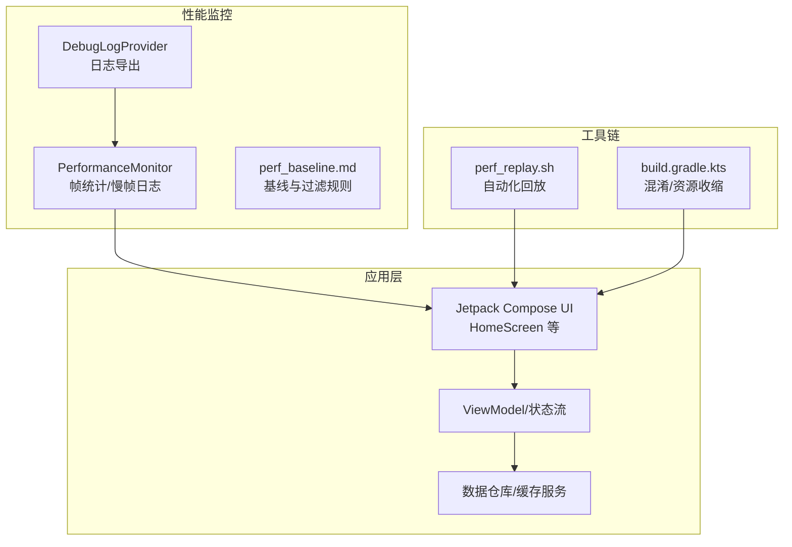
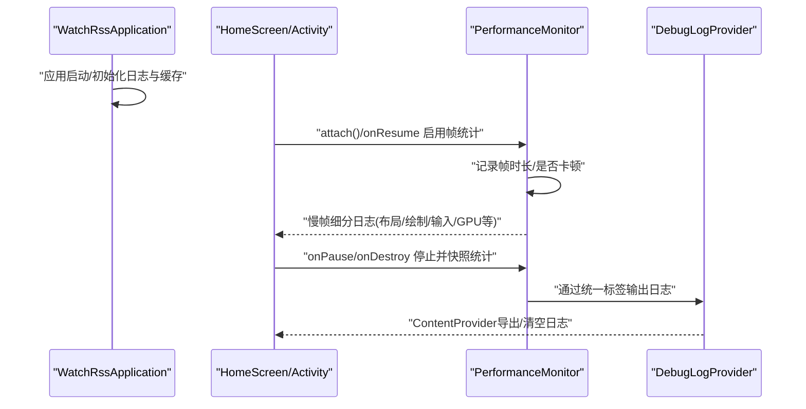
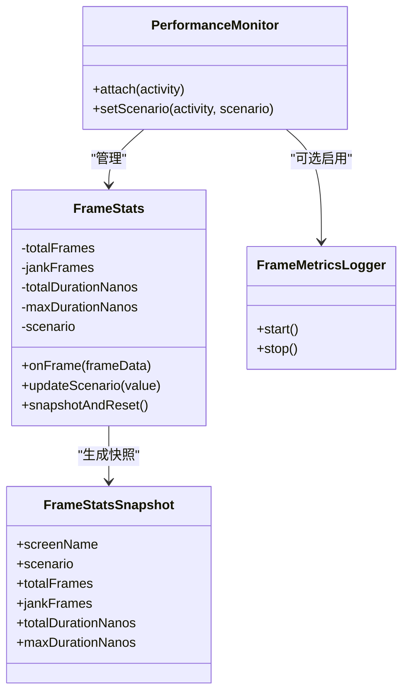
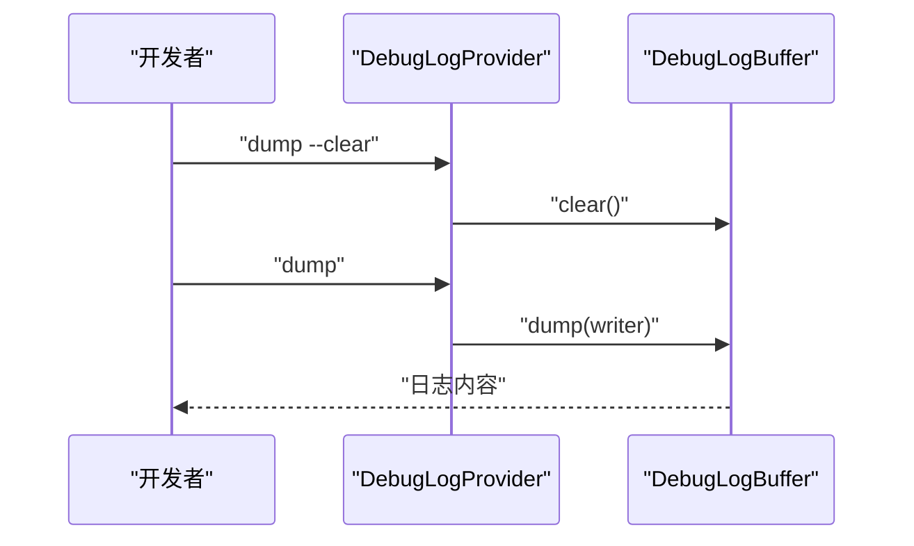
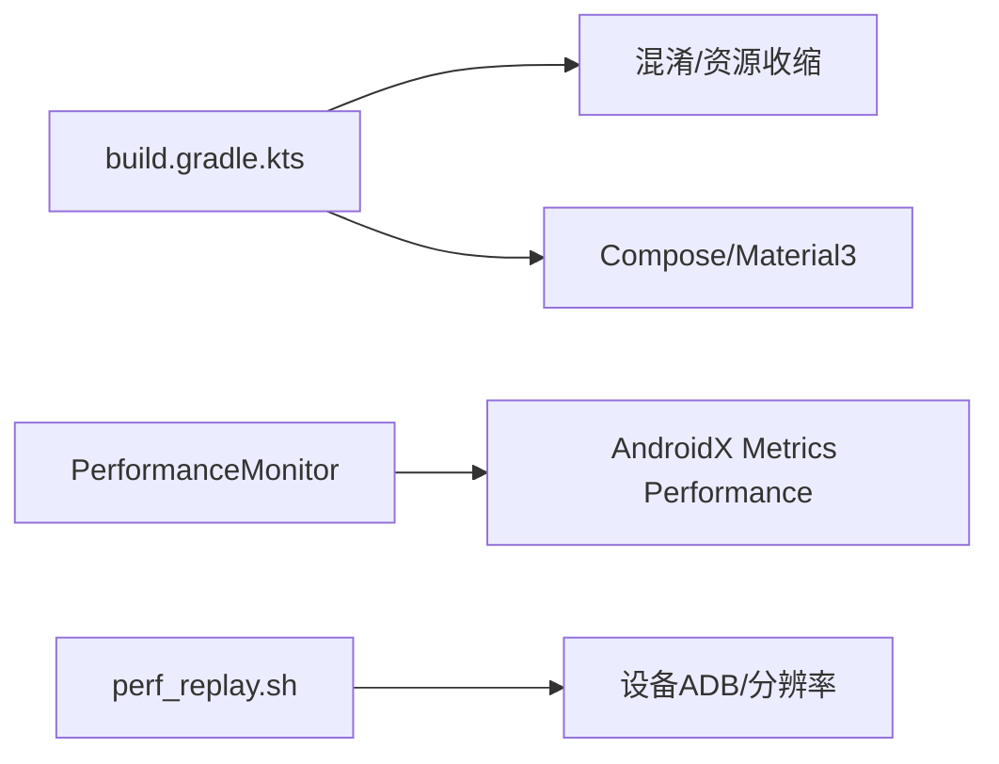

# 性能优化

<cite>
**本文引用的文件**
- [README.md](file://README.md)
- [docs/perf_baseline.md](file://docs/perf_baseline.md)
- [scripts/perf_replay.sh](file://scripts/perf_replay.sh)
- [app/build.gradle.kts](file://app/build.gradle.kts)
- [app/src/main/java/com/lightningstudio/watchrss/debug/PerformanceMonitor.kt](file://app/src/main/java/com/lightningstudio/watchrss/debug/PerformanceMonitor.kt)
- [app/src/main/java/com/lightningstudio/watchrss/debug/DebugLogProvider.kt](file://app/src/main/java/com/lightningstudio/watchrss/debug/DebugLogProvider.kt)
- [app/src/main/java/com/lightningstudio/watchrss/WatchRssApplication.kt](file://app/src/main/java/com/lightningstudio/watchrss/WatchRssApplication.kt)
- [app/src/main/java/com/lightningstudio/watchrss/ui/screen/rss/HomeScreen.kt](file://app/src/main/java/com/lightningstudio/watchrss/ui/screen/rss/HomeScreen.kt)
</cite>

## 目录
1. [简介](#简介)
2. [项目结构](#项目结构)
3. [核心组件](#核心组件)
4. [架构总览](#架构总览)
5. [详细组件分析](#详细组件分析)
6. [依赖分析](#依赖分析)
7. [性能考量](#性能考量)
8. [故障排查指南](#故障排查指南)
9. [结论](#结论)
10. [附录](#附录)

## 简介
本指南面向Android WatchRSS项目，聚焦于在资源受限的可穿戴手表设备上实现高性能与良好用户体验。文档从性能监控体系、手表端特有优化策略、工具链使用、瓶颈识别与解决、性能测试实施到最佳实践与常见陷阱进行系统性阐述，并结合仓库现有实现给出落地建议。

## 项目结构
- 应用层：采用Jetpack Compose作为UI框架，配合Room、Paging、DataStore等库支撑数据与状态管理。
- 性能监控：内置基于AndroidX Metrics Performance的帧统计与慢帧日志采集，配合自定义日志缓冲与过滤标签。
- 基准脚本：提供自动化滑动回放脚本，便于重复性性能测试。
- 构建配置：开启混淆与资源收缩，有助于减小体积与提升运行时效率。

图表来源
- [app/src/main/java/com/lightningstudio/watchrss/ui/screen/rss/HomeScreen.kt:1-211](file://app/src/main/java/com/lightningstudio/watchrss/ui/screen/rss/HomeScreen.kt#L1-L211)
- [app/src/main/java/com/lightningstudio/watchrss/debug/PerformanceMonitor.kt:1-196](file://app/src/main/java/com/lightningstudio/watchrss/debug/PerformanceMonitor.kt#L1-L196)
- [app/src/main/java/com/lightningstudio/watchrss/debug/DebugLogProvider.kt:1-47](file://app/src/main/java/com/lightningstudio/watchrss/debug/DebugLogProvider.kt#L1-L47)
- [docs/perf_baseline.md:1-47](file://docs/perf_baseline.md#L1-L47)
- [scripts/perf_replay.sh:1-43](file://scripts/perf_replay.sh#L1-L43)
- [app/build.gradle.kts:1-152](file://app/build.gradle.kts#L1-L152)

章节来源
- [README.md:1-40](file://README.md#L1-L40)
- [app/build.gradle.kts:1-152](file://app/build.gradle.kts#L1-L152)
- [docs/perf_baseline.md:1-47](file://docs/perf_baseline.md#L1-L47)
- [scripts/perf_replay.sh:1-43](file://scripts/perf_replay.sh#L1-L43)

## 核心组件
- 性能监控与帧统计：通过PerformanceMonitor在调试构建中启用帧统计与慢帧细分日志，输出统一的性能追踪标签，便于分类定位问题。
- 日志导出与缓冲：DebugLogProvider提供ContentProvider接口导出/清空调试日志缓冲，便于在设备侧快速收集与清理日志。
- 应用生命周期集成：WatchRssApplication在应用启动时触发缓存维护任务，减少冷启动后的抖动。
- UI与滚动优化：HomeScreen使用LazyColumn与数字冠输入处理，结合下拉刷新与列表状态管理，降低不必要的重组与绘制开销。

章节来源
- [app/src/main/java/com/lightningstudio/watchrss/debug/PerformanceMonitor.kt:1-196](file://app/src/main/java/com/lightningstudio/watchrss/debug/PerformanceMonitor.kt#L1-L196)
- [app/src/main/java/com/lightningstudio/watchrss/debug/DebugLogProvider.kt:1-47](file://app/src/main/java/com/lightningstudio/watchrss/debug/DebugLogProvider.kt#L1-L47)
- [app/src/main/java/com/lightningstudio/watchrss/WatchRssApplication.kt:1-47](file://app/src/main/java/com/lightningstudio/watchrss/WatchRssApplication.kt#L1-L47)
- [app/src/main/java/com/lightningstudio/watchrss/ui/screen/rss/HomeScreen.kt:1-211](file://app/src/main/java/com/lightningstudio/watchrss/ui/screen/rss/HomeScreen.kt#L1-L211)

## 架构总览
下图展示了性能监控在应用中的位置与交互关系：应用启动时初始化日志与缓存；UI层在可见生命周期内启用帧统计；慢帧细节通过帧度量监听器输出；最终由日志提供者统一导出。

图表来源
- [app/src/main/java/com/lightningstudio/watchrss/WatchRssApplication.kt:1-47](file://app/src/main/java/com/lightningstudio/watchrss/WatchRssApplication.kt#L1-L47)
- [app/src/main/java/com/lightningstudio/watchrss/debug/PerformanceMonitor.kt:1-196](file://app/src/main/java/com/lightningstudio/watchrss/debug/PerformanceMonitor.kt#L1-L196)
- [app/src/main/java/com/lightningstudio/watchrss/debug/DebugLogProvider.kt:1-47](file://app/src/main/java/com/lightningstudio/watchrss/debug/DebugLogProvider.kt#L1-L47)

## 详细组件分析

### 组件一：性能监控与帧统计（PerformanceMonitor）
- 功能要点
  - 在调试构建中启用帧统计与慢帧日志，按屏幕名与场景名聚合指标。
  - 提供帧度量监听器，拆解总时长到布局、绘制、同步、命令、交换缓冲、动画、输入、GPU等分项，辅助定位瓶颈。
  - 生命周期感知：在onResume启用、onPause/.onDestroy停止并输出快照。
- 数据结构与复杂度
  - 帧统计对象记录总帧数、卡顿帧数、总时长与最大时长，快照时重置，避免累积误差。
  - 使用弱引用映射保存每个Activity的统计实例，避免泄漏。
- 错误处理与边界
  - 仅在DEBUG构建生效；低版本系统或未显式启用时不会输出详细帧日志。
- 性能影响
  - 帧统计与日志输出对主线程有一定开销，建议仅在调试与专项测试时启用。

图表来源
- [app/src/main/java/com/lightningstudio/watchrss/debug/PerformanceMonitor.kt:1-196](file://app/src/main/java/com/lightningstudio/watchrss/debug/PerformanceMonitor.kt#L1-L196)

章节来源
- [app/src/main/java/com/lightningstudio/watchrss/debug/PerformanceMonitor.kt:1-196](file://app/src/main/java/com/lightningstudio/watchrss/debug/PerformanceMonitor.kt#L1-L196)

### 组件二：日志导出与缓冲（DebugLogProvider）
- 功能要点
  - 通过ContentProvider暴露日志缓冲区，支持清空与导出，便于在设备侧快速收集调试信息。
  - 与调试开关联动，仅在调试构建启用。
- 使用建议
  - 在性能采样前清空历史日志，采样后导出并分析特定类别日志。

图表来源
- [app/src/main/java/com/lightningstudio/watchrss/debug/DebugLogProvider.kt:1-47](file://app/src/main/java/com/lightningstudio/watchrss/debug/DebugLogProvider.kt#L1-L47)

章节来源
- [app/src/main/java/com/lightningstudio/watchrss/debug/DebugLogProvider.kt:1-47](file://app/src/main/java/com/lightningstudio/watchrss/debug/DebugLogProvider.kt#L1-L47)

### 组件三：应用启动与缓存维护（WatchRssApplication）
- 功能要点
  - 应用启动时初始化日志系统与调试开关，必要时注入SDK调试日志。
  - 启动即调度缓存维护任务，降低后续UI卡顿风险。
- 性能影响
  - 将一次性重任务前置到启动阶段，有利于平滑后续滚动与加载。

章节来源
- [app/src/main/java/com/lightningstudio/watchrss/WatchRssApplication.kt:1-47](file://app/src/main/java/com/lightningstudio/watchrss/WatchRssApplication.kt#L1-L47)

### 组件四：UI与滚动优化（HomeScreen）
- 功能要点
  - 使用LazyColumn与rememberLazyListState，减少重组范围与绘制压力。
  - 下拉刷新与顶部条件判断，确保仅在首项可见时允许刷新，避免无效手势。
  - 数字冠输入处理集成，提升手表端滚动体验。
- 性能影响
  - 列表虚拟化与状态记忆显著降低大列表滚动成本；延迟提示自动清除避免长期占用UI。

章节来源
- [app/src/main/java/com/lightningstudio/watchrss/ui/screen/rss/HomeScreen.kt:1-211](file://app/src/main/java/com/lightningstudio/watchrss/ui/screen/rss/HomeScreen.kt#L1-L211)

## 依赖分析
- 构建与优化
  - 开启混淆与资源收缩，有助于减小包体与运行时开销。
  - Compose与Material3等UI栈提供现代渲染能力，需结合懒加载与状态最小化使用。
- 性能监控依赖
  - AndroidX Metrics Performance提供帧统计与JankStats；与自定义日志标签协同工作。
- 工具链依赖
  - 自动化脚本依赖adb与设备分辨率，确保回放路径一致。

图表来源
- [app/build.gradle.kts:1-152](file://app/build.gradle.kts#L1-L152)
- [app/src/main/java/com/lightningstudio/watchrss/debug/PerformanceMonitor.kt:1-196](file://app/src/main/java/com/lightningstudio/watchrss/debug/PerformanceMonitor.kt#L1-L196)
- [scripts/perf_replay.sh:1-43](file://scripts/perf_replay.sh#L1-L43)

章节来源
- [app/build.gradle.kts:1-152](file://app/build.gradle.kts#L1-L152)
- [docs/perf_baseline.md:1-47](file://docs/perf_baseline.md#L1-L47)

## 性能考量
- 监控体系
  - 帧统计：关注平均帧时长、最大帧时长与卡顿百分比，结合屏幕名与场景名定位页面与场景。
  - 慢帧细分：优先检查布局/绘制/输入/GPU等分项，定位具体渲染瓶颈。
  - 日志过滤：使用统一标签与类别过滤，快速聚焦仓库、图片、帧等热点路径。
- 基准与回归
  - 使用perf_replay.sh在相同设备与分辨率下重复回放，形成可对比的基准曲线。
  - 结合perf_baseline.md中的采集清单与过滤规则，确保采样一致性。
- 手表端优化策略
  - 异步加载：列表与详情页均应异步加载与解码，避免阻塞主线程。
  - 图片优化：优先使用Coil等现代图片库，合理设置尺寸与格式，启用渐进式加载与占位。
  - 内存管理：利用缓存维护与LRU策略，避免频繁GC与OOM；在后台或暂停时释放非必要资源。
  - 网络优化：复用连接、限制并发、启用压缩与缓存策略；对大图与视频采用按需加载。
- 工具链实战
  - Android Profiler：CPU/内存/网络采样，结合帧统计定位热点。
  - Systrace/Perfetto：捕获系统级渲染与调度轨迹，分析GPU与VSYNC问题。
  - adb命令：按perf_baseline.md清单执行日志与帧统计采集。
- 瓶颈识别与解决
  - UI渲染：减少重组、避免深层嵌套、使用LazyColumn与合适的item key。
  - 数据加载：分页与预取、离线缓存、去重与合并策略。
  - 后台任务：限制后台IO与计算，使用WorkManager或协程调度，避免唤醒频率过高。
- 平衡功能与性能
  - 在手表端优先保证核心路径（列表滚动、详情加载、通知提醒）的流畅性。
  - 对非关键功能采用延迟初始化与懒加载，避免启动时一次性加载所有资源。

章节来源
- [docs/perf_baseline.md:1-47](file://docs/perf_baseline.md#L1-L47)
- [scripts/perf_replay.sh:1-43](file://scripts/perf_replay.sh#L1-L43)
- [app/src/main/java/com/lightningstudio/watchrss/debug/PerformanceMonitor.kt:1-196](file://app/src/main/java/com/lightningstudio/watchrss/debug/PerformanceMonitor.kt#L1-L196)

## 故障排查指南
- 快速诊断步骤
  - 清理运行时日志与帧统计：按perf_baseline.md执行清屏与重置。
  - 启动目标页面并执行回放脚本：确保滑动路径与次数一致。
  - 导出日志并按类别过滤：优先查看帧与仓库相关日志。
  - 导出日志缓冲：通过DebugLogProvider导出/清空，避免历史干扰。
- 常见问题定位
  - 卡顿集中在布局/绘制：检查复杂组合与深层嵌套，减少重组。
  - GPU时间偏高：检查过度绘制、大图解码与动画。
  - 仓库写入频繁：检查重复写入与去重逻辑，必要时增加写入节流。
- 工具使用建议
  - Android Profiler：关注CPU火焰图与内存分配热点。
  - Perfetto：查看vsync、swap、gpu等系统事件序列。
  - logcat：使用perf_baseline.md提供的过滤规则，快速定位问题。

章节来源
- [docs/perf_baseline.md:1-47](file://docs/perf_baseline.md#L1-L47)
- [app/src/main/java/com/lightningstudio/watchrss/debug/DebugLogProvider.kt:1-47](file://app/src/main/java/com/lightningstudio/watchrss/debug/DebugLogProvider.kt#L1-L47)

## 结论
通过在应用层集成帧统计与日志导出、在构建层启用优化配置、在工具链层面建立自动化基准与过滤规则，WatchRSS项目形成了可重复、可对比的性能保障体系。结合手表端特性进行异步加载、图片优化、内存与网络优化，可在有限资源下实现流畅体验。建议持续完善基准与回归测试，将性能纳入日常迭代质量门禁。

## 附录
- 性能基线与采集清单
  - 设备与构建：按perf_baseline.md说明准备环境。
  - 场景与指标：按Large list/Large article等场景采集帧统计与慢帧日志。
  - 采集清单：截图、logcat、帧统计与日志缓冲导出。
- 自动化回放
  - 使用perf_replay.sh在相同分辨率与滑动参数下重复回放，确保结果可比性。

章节来源
- [docs/perf_baseline.md:1-47](file://docs/perf_baseline.md#L1-L47)
- [scripts/perf_replay.sh:1-43](file://scripts/perf_replay.sh#L1-L43)