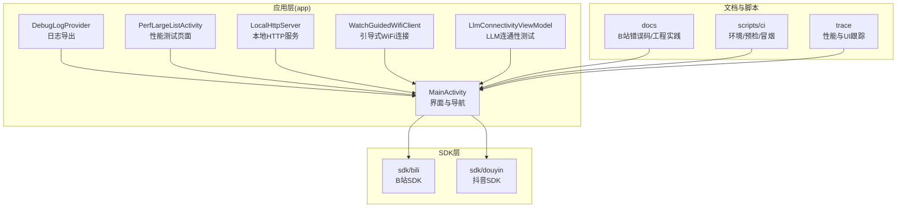
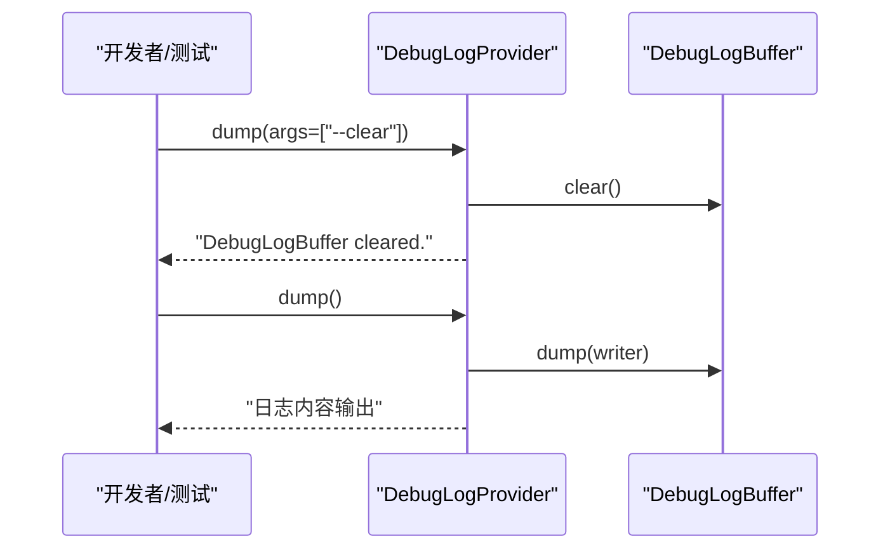
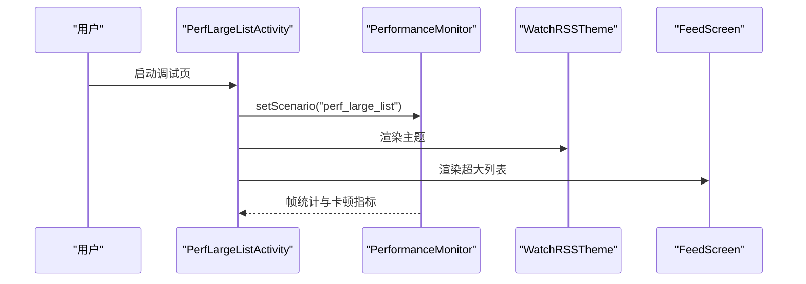
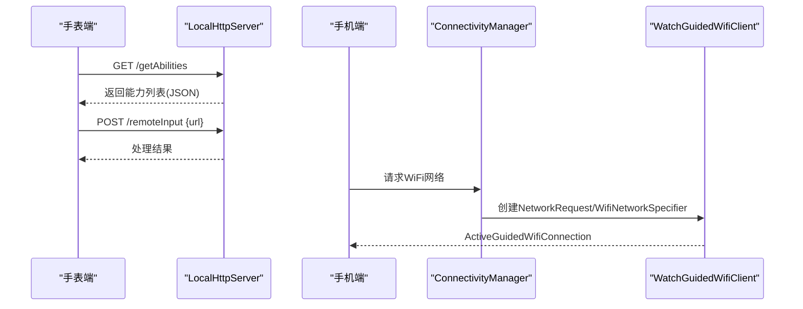
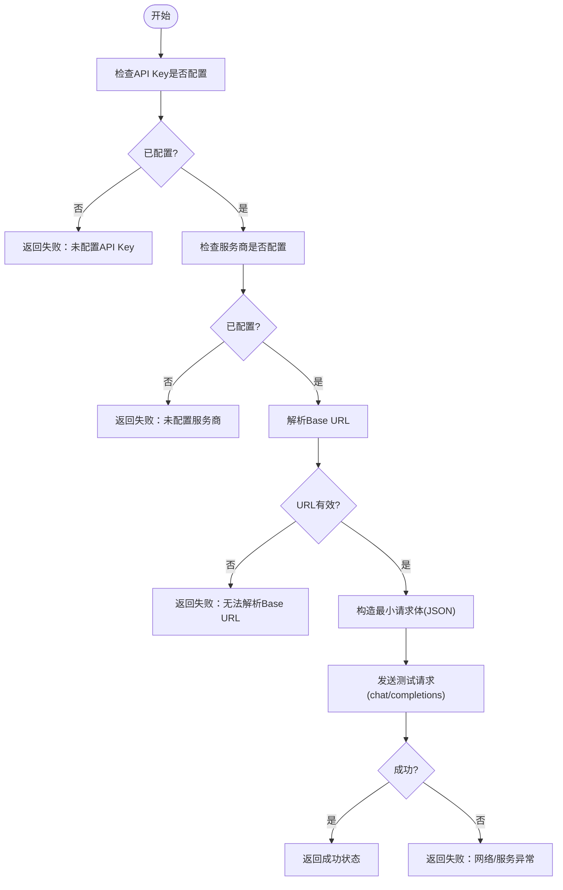
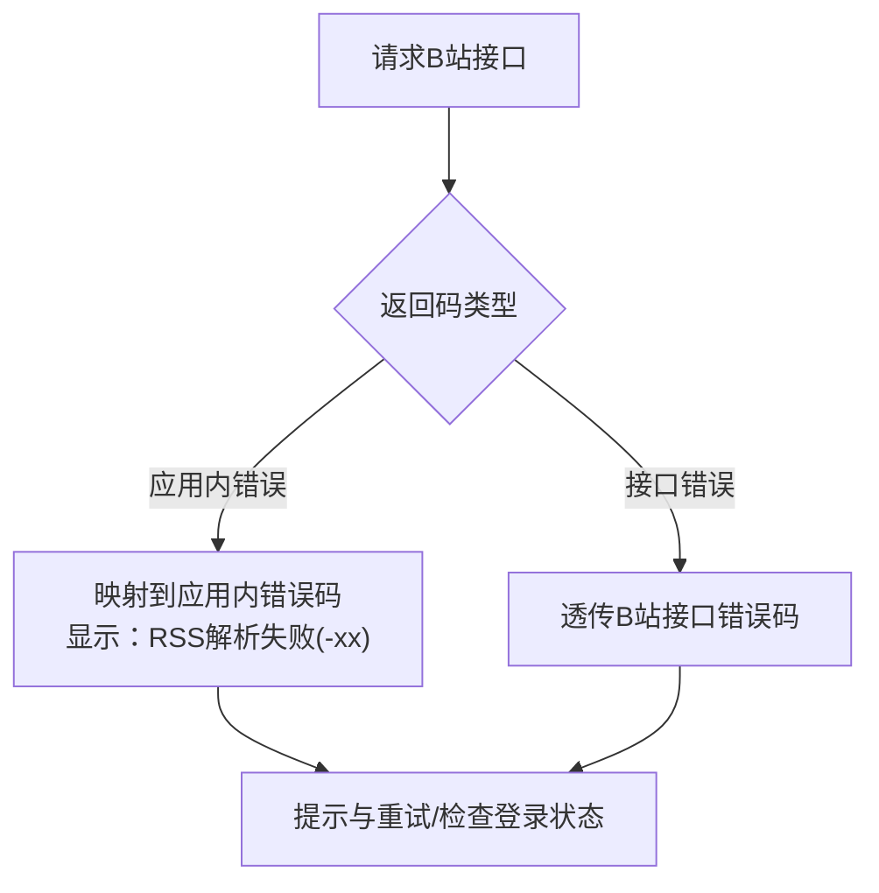
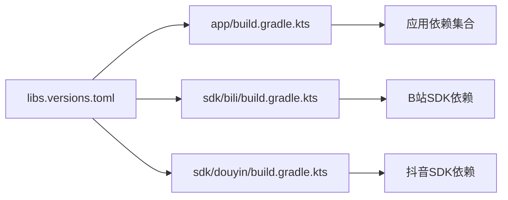

# 故障排除

<cite>
**本文引用的文件**
- [README.md](file://README.md)
- [gradle/libs.versions.toml](file://gradle/libs.versions.toml)
- [app/build.gradle.kts](file://app/build.gradle.kts)
- [app/src/main/AndroidManifest.xml](file://app/src/main/AndroidManifest.xml)
- [sdk/bili/build.gradle.kts](file://sdk/bili/build.gradle.kts)
- [sdk/douyin/build.gradle.kts](file://sdk/douyin/build.gradle.kts)
- [docs/bili_error_codes.md](file://docs/bili_error_codes.md)
- [app/src/main/java/com/lightningstudio/watchrss/debug/DebugLogProvider.kt](file://app/src/main/java/com/lightningstudio/watchrss/debug/DebugLogProvider.kt)
- [app/src/main/java/com/lightningstudio/watchrss/debug/PerfLargeListActivity.kt](file://app/src/main/java/com/lightningstudio/watchrss/debug/PerfLargeListActivity.kt)
- [app/src/main/java/com/lightningstudio/watchrss/debug/PerformanceMonitor.kt](file://app/src/main/java/com/lightningstudio/watchrss/debug/PerformanceMonitor.kt)
- [app/src/main/java/com/lightningstudio/watchrss/phoneconnection/LocalHttpServer.kt](file://app/src/main/java/com/lightningstudio/watchrss/phoneconnection/LocalHttpServer.kt)
- [app/src/main/java/com/lightningstudio/watchrss/phoneconnection/guided/WatchGuidedWifiClient.kt](file://app/src/main/java/com/lightningstudio/watchrss/phoneconnection/guided/WatchGuidedWifiClient.kt)
- [app/src/main/java/com/lightningstudio/watchrss/ui/viewmodel/LlmConnectivityViewModel.kt](file://app/src/main/java/com/lightningstudio/watchrss/ui/viewmodel/LlmConnectivityViewModel.kt)
- [scripts/ci/bootstrap_env.sh](file://scripts/ci/bootstrap_env.sh)
- [scripts/ci/device_preflight.sh](file://scripts/ci/device_preflight.sh)
- [scripts/ci/device_smoke.sh](file://scripts/ci/device_smoke.sh)
- [trace/gfxinfo_framestats_20260126.txt](file://trace/gfxinfo_framestats_20260126.txt)
- [trace/rss_detail.perfetto-trace.b64](file://trace/rss_detail.perfetto-trace.b64)
- [trace/rss_detail_trace_20260126.atrace](file://trace/rss_detail_trace_20260126.atrace)
- [trace/ui_detail_20260126.xml](file://trace/ui_detail_20260126.xml)
</cite>

## 目录
1. [简介](#简介)
2. [项目结构](#项目结构)
3. [核心组件](#核心组件)
4. [架构总览](#架构总览)
5. [详细组件分析](#详细组件分析)
6. [依赖分析](#依赖分析)
7. [性能注意事项](#性能注意事项)
8. [故障排除指南](#故障排除指南)
9. [结论](#结论)
10. [附录](#附录)

## 简介
本指南面向Android WatchRSS项目的开发者与测试人员，聚焦于构建问题、运行时错误、性能问题与兼容性问题的诊断与解决。文档覆盖以下方面：
- 构建与打包：版本与依赖、签名与混淆、CI设备准备与冒烟测试
- 运行时错误：日志采集与分析、崩溃与异常定位、网络与权限问题
- 性能问题：帧统计与卡顿监控、内存与电量分析、UI渲染与后台任务优化
- 平台特定问题：B站API限制与错误码、抖音反爬虫机制、RSS解析与内容加载
- 用户反馈处理：崩溃报告、用户行为追踪、问题复现步骤
- 预防与最佳实践：安全与健壮性建议、应急响应流程

## 项目结构
项目采用多模块结构，核心模块与职责如下：
- app：应用主体，包含UI、业务逻辑、调试与性能监控、网络与文件提供者、权限声明
- sdk/bili：B站SDK，封装网络、序列化、加密与gRPC/Proto配置
- sdk/douyin：抖音SDK，封装网络、加解密与爬虫模型
- docs：文档与API说明，含B站错误码、工程实践、性能基线等
- scripts/ci：CI脚本，负责环境引导、设备预检与冒烟测试
- trace：性能与UI结构跟踪数据，便于离线分析



**图表来源**
- [app/src/main/AndroidManifest.xml:1-265](file://app/src/main/AndroidManifest.xml#L1-L265)
- [sdk/bili/build.gradle.kts:1-87](file://sdk/bili/build.gradle.kts#L1-L87)
- [sdk/douyin/build.gradle.kts:1-32](file://sdk/douyin/build.gradle.kts#L1-L32)
- [app/src/main/java/com/lightningstudio/watchrss/debug/DebugLogProvider.kt:1-47](file://app/src/main/java/com/lightningstudio/watchrss/debug/DebugLogProvider.kt#L1-L47)
- [app/src/main/java/com/lightningstudio/watchrss/debug/PerfLargeListActivity.kt:1-77](file://app/src/main/java/com/lightningstudio/watchrss/debug/PerfLargeListActivity.kt#L1-L77)
- [app/src/main/java/com/lightningstudio/watchrss/phoneconnection/LocalHttpServer.kt:145-395](file://app/src/main/java/com/lightningstudio/watchrss/phoneconnection/LocalHttpServer.kt#L145-L395)
- [app/src/main/java/com/lightningstudio/watchrss/phoneconnection/guided/WatchGuidedWifiClient.kt:1-33](file://app/src/main/java/com/lightningstudio/watchrss/phoneconnection/guided/WatchGuidedWifiClient.kt#L1-L33)
- [app/src/main/java/com/lightningstudio/watchrss/ui/viewmodel/LlmConnectivityViewModel.kt:83-118](file://app/src/main/java/com/lightningstudio/watchrss/ui/viewmodel/LlmConnectivityViewModel.kt#L83-L118)

**章节来源**
- [README.md:1-40](file://README.md#L1-L40)
- [app/build.gradle.kts:1-152](file://app/build.gradle.kts#L1-L152)
- [gradle/libs.versions.toml:1-101](file://gradle/libs.versions.toml#L1-L101)

## 核心组件
- 应用清单与权限：声明网络、位置、录音、近场WiFi设备访问等权限，并启用明文流量与FileProvider，便于日志与文件分享。
- SDK模块：B站SDK注入应用密钥字段；抖音SDK集成加密库与网络栈。
- 调试与性能：DebugLogProvider通过ContentProvider导出缓冲日志；PerfLargeListActivity与PerformanceMonitor用于UI渲染与帧统计监控。
- 本地HTTP服务：LocalHttpServer提供能力查询与远程输入等接口，配合引导式WiFi连接实现手表与手机协同。
- LLM连通性：LlmConnectivityViewModel进行基础连通性测试，校验API Key、服务商与URL解析。

**章节来源**
- [app/src/main/AndroidManifest.xml:5-26](file://app/src/main/AndroidManifest.xml#L5-L26)
- [sdk/bili/build.gradle.kts:25-32](file://sdk/bili/build.gradle.kts#L25-L32)
- [app/src/main/java/com/lightningstudio/watchrss/debug/DebugLogProvider.kt:33-45](file://app/src/main/java/com/lightningstudio/watchrss/debug/DebugLogProvider.kt#L33-L45)
- [app/src/main/java/com/lightningstudio/watchrss/debug/PerfLargeListActivity.kt:18-76](file://app/src/main/java/com/lightningstudio/watchrss/debug/PerfLargeListActivity.kt#L18-L76)
- [app/src/main/java/com/lightningstudio/watchrss/debug/PerformanceMonitor.kt:34-70](file://app/src/main/java/com/lightningstudio/watchrss/debug/PerformanceMonitor.kt#L34-L70)
- [app/src/main/java/com/lightningstudio/watchrss/phoneconnection/LocalHttpServer.kt:354-375](file://app/src/main/java/com/lightningstudio/watchrss/phoneconnection/LocalHttpServer.kt#L354-L375)
- [app/src/main/java/com/lightningstudio/watchrss/phoneconnection/guided/WatchGuidedWifiClient.kt:19-26](file://app/src/main/java/com/lightningstudio/watchrss/phoneconnection/guided/WatchGuidedWifiClient.kt#L19-L26)
- [app/src/main/java/com/lightningstudio/watchrss/ui/viewmodel/LlmConnectivityViewModel.kt:83-118](file://app/src/main/java/com/lightningstudio/watchrss/ui/viewmodel/LlmConnectivityViewModel.kt#L83-L118)

## 架构总览
下图展示应用与SDK、调试与性能工具、本地HTTP服务之间的交互关系，以及关键数据流。

```mermaid
graph TB
subgraph "应用(app)"
M["MainActivity"]
DBG["DebugLogProvider"]
PERF["PerfLargeListActivity"]
PM["PerformanceMonitor"]
HTTP["LocalHttpServer"]
WIFI["WatchGuidedWifiClient"]
LLM["LlmConnectivityViewModel"]
end
subgraph "SDK"
BILI["B站SDK"]
DY["抖音SDK"]
end
M --> BILI
M --> DY
M --> DBG
M --> PERF
PERF --> PM
M --> HTTP
M --> WIFI
M --> LLM
subgraph "外部"
SYS["Android系统/网络"]
PHONE["手机/PC"]
end
SYS --> M
PHONE <- --> HTTP
WIFI --> SYS
```

**图表来源**
- [app/src/main/AndroidManifest.xml:15-265](file://app/src/main/AndroidManifest.xml#L15-L265)
- [sdk/bili/build.gradle.kts:1-87](file://sdk/bili/build.gradle.kts#L1-L87)
- [sdk/douyin/build.gradle.kts:1-32](file://sdk/douyin/build.gradle.kts#L1-L32)
- [app/src/main/java/com/lightningstudio/watchrss/debug/DebugLogProvider.kt:1-47](file://app/src/main/java/com/lightningstudio/watchrss/debug/DebugLogProvider.kt#L1-L47)
- [app/src/main/java/com/lightningstudio/watchrss/debug/PerfLargeListActivity.kt:1-77](file://app/src/main/java/com/lightningstudio/watchrss/debug/PerfLargeListActivity.kt#L1-L77)
- [app/src/main/java/com/lightningstudio/watchrss/debug/PerformanceMonitor.kt:34-70](file://app/src/main/java/com/lightningstudio/watchrss/debug/PerformanceMonitor.kt#L34-L70)
- [app/src/main/java/com/lightningstudio/watchrss/phoneconnection/LocalHttpServer.kt:145-395](file://app/src/main/java/com/lightningstudio/watchrss/phoneconnection/LocalHttpServer.kt#L145-L395)
- [app/src/main/java/com/lightningstudio/watchrss/phoneconnection/guided/WatchGuidedWifiClient.kt:28-33](file://app/src/main/java/com/lightningstudio/watchrss/phoneconnection/guided/WatchGuidedWifiClient.kt#L28-L33)
- [app/src/main/java/com/lightningstudio/watchrss/ui/viewmodel/LlmConnectivityViewModel.kt:83-118](file://app/src/main/java/com/lightningstudio/watchrss/ui/viewmodel/LlmConnectivityViewModel.kt#L83-L118)

## 详细组件分析

### 组件A：日志与调试（DebugLogProvider）
- 功能：通过ContentProvider暴露DebugLogBuffer，支持清空与转储，便于在设备上导出调试日志。
- 使用场景：应用内日志收集、问题复现场景下的日志导出。
- 注意事项：仅在调试构建中启用，避免在发布版本暴露敏感信息。



**图表来源**
- [app/src/main/java/com/lightningstudio/watchrss/debug/DebugLogProvider.kt:33-45](file://app/src/main/java/com/lightningstudio/watchrss/debug/DebugLogProvider.kt#L33-L45)

**章节来源**
- [app/src/main/java/com/lightningstudio/watchrss/debug/DebugLogProvider.kt:1-47](file://app/src/main/java/com/lightningstudio/watchrss/debug/DebugLogProvider.kt#L1-L47)

### 组件B：性能监控（PerfLargeListActivity 与 PerformanceMonitor）
- 功能：在调试页构造超大列表数据，结合PerformanceMonitor记录帧统计与卡顿指标，评估UI渲染性能。
- 使用场景：UI滚动、分页加载、动画与手势交互的性能回归测试。
- 注意事项：仅在DEBUG构建可见，避免影响用户侧性能。



**图表来源**
- [app/src/main/java/com/lightningstudio/watchrss/debug/PerfLargeListActivity.kt:18-76](file://app/src/main/java/com/lightningstudio/watchrss/debug/PerfLargeListActivity.kt#L18-L76)
- [app/src/main/java/com/lightningstudio/watchrss/debug/PerformanceMonitor.kt:34-70](file://app/src/main/java/com/lightningstudio/watchrss/debug/PerformanceMonitor.kt#L34-L70)

**章节来源**
- [app/src/main/java/com/lightningstudio/watchrss/debug/PerfLargeListActivity.kt:1-77](file://app/src/main/java/com/lightningstudio/watchrss/debug/PerfLargeListActivity.kt#L1-L77)
- [app/src/main/java/com/lightningstudio/watchrss/debug/PerformanceMonitor.kt:34-70](file://app/src/main/java/com/lightningstudio/watchrss/debug/PerformanceMonitor.kt#L34-L70)

### 组件C：本地HTTP服务与引导式WiFi（LocalHttpServer 与 WatchGuidedWifiClient）
- 功能：LocalHttpServer提供能力查询、远程输入等接口；WatchGuidedWifiClient基于ConnectivityManager与WiFi网络规范建立引导式连接。
- 使用场景：手表与手机协同、远程输入与能力协商。
- 注意事项：确保网络权限与明文流量配置正确，避免握手失败。



**图表来源**
- [app/src/main/java/com/lightningstudio/watchrss/phoneconnection/LocalHttpServer.kt:354-375](file://app/src/main/java/com/lightningstudio/watchrss/phoneconnection/LocalHttpServer.kt#L354-L375)
- [app/src/main/java/com/lightningstudio/watchrss/phoneconnection/LocalHttpServer.kt:377-395](file://app/src/main/java/com/lightningstudio/watchrss/phoneconnection/LocalHttpServer.kt#L377-L395)
- [app/src/main/java/com/lightningstudio/watchrss/phoneconnection/guided/WatchGuidedWifiClient.kt:19-26](file://app/src/main/java/com/lightningstudio/watchrss/phoneconnection/guided/WatchGuidedWifiClient.kt#L19-L26)

**章节来源**
- [app/src/main/java/com/lightningstudio/watchrss/phoneconnection/LocalHttpServer.kt:145-395](file://app/src/main/java/com/lightningstudio/watchrss/phoneconnection/LocalHttpServer.kt#L145-L395)
- [app/src/main/java/com/lightningstudio/watchrss/phoneconnection/guided/WatchGuidedWifiClient.kt:1-33](file://app/src/main/java/com/lightningstudio/watchrss/phoneconnection/guided/WatchGuidedWifiClient.kt#L1-L33)

### 组件D：LLM连通性测试（LlmConnectivityViewModel）
- 功能：校验API Key、服务商与Base URL解析，构造最小化请求体进行连通性测试。
- 使用场景：集成第三方LLM服务前的快速验证。
- 注意事项：确保网络可达、URL末尾斜杠处理与JSON载荷格式正确。



**图表来源**
- [app/src/main/java/com/lightningstudio/watchrss/ui/viewmodel/LlmConnectivityViewModel.kt:83-118](file://app/src/main/java/com/lightningstudio/watchrss/ui/viewmodel/LlmConnectivityViewModel.kt#L83-L118)

**章节来源**
- [app/src/main/java/com/lightningstudio/watchrss/ui/viewmodel/LlmConnectivityViewModel.kt:83-118](file://app/src/main/java/com/lightningstudio/watchrss/ui/viewmodel/LlmConnectivityViewModel.kt#L83-L118)

### 组件E：平台特定问题（B站、抖音、RSS）
- B站错误码：应用内错误统一显示为“RSS解析失败(-xx)”，涵盖网络异常、登录标识缺失、二维码过期等。
- 抖音反爬虫：SDK集成加密与网络栈，注意UA、加密参数与风控策略变化。
- RSS解析：依赖RSS-Parser，关注编码、命名空间与内容结构差异。



**图表来源**
- [docs/bili_error_codes.md:1-17](file://docs/bili_error_codes.md#L1-L17)

**章节来源**
- [docs/bili_error_codes.md:1-17](file://docs/bili_error_codes.md#L1-L17)
- [README.md:28-31](file://README.md#L28-L31)

## 依赖分析
- 版本与插件：AGP、Kotlin、Compose、KSP、Protobuf等版本集中管理，确保一致性。
- 应用依赖：核心KTX、Lifecycle、Compose、Room、Navigation、DataStore、OkHttp、RSS-Parser、Jsoup、Media3、Coil、Paging、ZXing、安全加密等。
- SDK依赖：B站SDK引入gRPC/Proto与安全加密；抖音SDK引入加密库与网络栈。



**图表来源**
- [gradle/libs.versions.toml:1-101](file://gradle/libs.versions.toml#L1-L101)
- [app/build.gradle.kts:93-147](file://app/build.gradle.kts#L93-L147)
- [sdk/bili/build.gradle.kts:47-61](file://sdk/bili/build.gradle.kts#L47-L61)
- [sdk/douyin/build.gradle.kts:25-31](file://sdk/douyin/build.gradle.kts#L25-L31)

**章节来源**
- [gradle/libs.versions.toml:1-101](file://gradle/libs.versions.toml#L1-L101)
- [app/build.gradle.kts:1-152](file://app/build.gradle.kts#L1-L152)
- [sdk/bili/build.gradle.kts:1-87](file://sdk/bili/build.gradle.kts#L1-L87)
- [sdk/douyin/build.gradle.kts:1-32](file://sdk/douyin/build.gradle.kts#L1-L32)

## 性能注意事项
- 帧统计与卡顿：使用PerformanceMonitor记录帧统计与卡顿事件，结合调试页渲染超大列表评估UI性能。
- 图形与UI跟踪：利用trace目录中的gfxinfo、perfetto与UI结构XML进行离线分析，定位卡顿与布局问题。
- 网络与I/O：避免主线程阻塞，合理使用协程调度器；对图片与媒体资源使用异步加载与缓存。
- 内存与电量：减少不必要的对象分配与持有，及时释放监听与资源；控制后台任务频率与唤醒策略。

**章节来源**
- [app/src/main/java/com/lightningstudio/watchrss/debug/PerformanceMonitor.kt:34-70](file://app/src/main/java/com/lightningstudio/watchrss/debug/PerformanceMonitor.kt#L34-L70)
- [trace/gfxinfo_framestats_20260126.txt](file://trace/gfxinfo_framestats_20260126.txt)
- [trace/rss_detail.perfetto-trace.b64](file://trace/rss_detail.perfetto-trace.b64)
- [trace/rss_detail_trace_20260126.atrace](file://trace/rss_detail_trace_20260126.atrace)
- [trace/ui_detail_20260126.xml](file://trace/ui_detail_20260126.xml)

## 故障排除指南

### 构建问题
- 症状：编译失败、依赖冲突、签名错误、混淆导致的运行时异常。
- 排查步骤：
  - 检查本地属性与签名配置是否存在且正确。
  - 对齐AGP、Kotlin、Compose与KSP版本，避免不兼容。
  - 确认混淆规则与资源压缩配置不影响关键类与元数据。
  - 使用CI脚本进行设备预检与冒烟测试，确保环境一致。
- 相关文件：
  - [app/build.gradle.kts:10-15](file://app/build.gradle.kts#L10-L15)
  - [gradle/libs.versions.toml:1-101](file://gradle/libs.versions.toml#L1-L101)
  - [scripts/ci/bootstrap_env.sh](file://scripts/ci/bootstrap_env.sh)
  - [scripts/ci/device_preflight.sh](file://scripts/ci/device_preflight.sh)
  - [scripts/ci/device_smoke.sh](file://scripts/ci/device_smoke.sh)

**章节来源**
- [app/build.gradle.kts:10-15](file://app/build.gradle.kts#L10-L15)
- [gradle/libs.versions.toml:1-101](file://gradle/libs.versions.toml#L1-L101)
- [scripts/ci/bootstrap_env.sh](file://scripts/ci/bootstrap_env.sh)
- [scripts/ci/device_preflight.sh](file://scripts/ci/device_preflight.sh)
- [scripts/ci/device_smoke.sh](file://scripts/ci/device_smoke.sh)

### 运行时错误
- 权限与网络：
  - 症状：网络请求失败、无法打开网页、录音或位置权限被拒。
  - 排查：确认清单中权限声明齐全；检查明文流量配置；在设备上授予必要权限。
- 日志与崩溃：
  - 症状：应用闪退、UI无响应、功能异常。
  - 排查：使用DebugLogProvider导出日志；结合系统日志与网络日志定位异常点。
- 平台特定错误：
  - B站：根据错误码提示检查登录状态、二维码有效性、播放参数与收藏夹状态。
  - 抖音：关注反爬虫策略变化，检查加密参数与UA设置。
  - RSS：检查编码、命名空间与内容结构，必要时降级解析或清理异常内容。

**章节来源**
- [app/src/main/AndroidManifest.xml:5-26](file://app/src/main/AndroidManifest.xml#L5-L26)
- [app/src/main/java/com/lightningstudio/watchrss/debug/DebugLogProvider.kt:33-45](file://app/src/main/java/com/lightningstudio/watchrss/debug/DebugLogProvider.kt#L33-L45)
- [docs/bili_error_codes.md:1-17](file://docs/bili_error_codes.md#L1-L17)

### 性能问题
- 卡顿与掉帧：
  - 使用PerformanceMonitor与调试页渲染超大列表，观察帧统计与卡顿事件。
  - 结合trace目录中的gfxinfo与perfetto trace，定位CPU/GPU热点与布局开销。
- 内存泄漏：
  - 检查生命周期注册的监听与回调是否及时注销；避免持有Activity/Context长生命周期。
- 电量消耗：
  - 控制网络请求频率与并发度；避免频繁唤醒；合理使用后台任务与定时器。

**章节来源**
- [app/src/main/java/com/lightningstudio/watchrss/debug/PerfLargeListActivity.kt:18-76](file://app/src/main/java/com/lightningstudio/watchrss/debug/PerfLargeListActivity.kt#L18-L76)
- [app/src/main/java/com/lightningstudio/watchrss/debug/PerformanceMonitor.kt:34-70](file://app/src/main/java/com/lightningstudio/watchrss/debug/PerformanceMonitor.kt#L34-L70)
- [trace/gfxinfo_framestats_20260126.txt](file://trace/gfxinfo_framestats_20260126.txt)
- [trace/rss_detail.perfetto-trace.b64](file://trace/rss_detail.perfetto-trace.b64)

### 兼容性问题
- 设备与系统版本：
  - 症状：部分机型UI错位、功能不可用。
  - 排查：检查minSdk/targetSdk配置；针对不同屏幕密度与圆形表盘做适配。
- 网络与运营商：
  - 症状：部分地区无法访问B站/Douyin或RSS。
  - 排查：检查网络策略、DNS与代理设置；必要时切换网络或使用VPN。

**章节来源**
- [app/build.gradle.kts:34-36](file://app/build.gradle.kts#L34-L36)
- [app/src/main/AndroidManifest.xml:22-26](file://app/src/main/AndroidManifest.xml#L22-L26)

### 用户反馈处理
- 崩溃报告：
  - 使用DebugLogProvider导出日志；结合系统日志与网络日志，提取时间线与调用栈。
- 用户行为追踪：
  - 在关键路径埋点（如点击、滑动、加载完成），结合性能监控指标评估用户体验。
- 问题复现：
  - 提供最小复现场景与数据源；记录设备型号、系统版本与网络环境。

**章节来源**
- [app/src/main/java/com/lightningstudio/watchrss/debug/DebugLogProvider.kt:33-45](file://app/src/main/java/com/lightningstudio/watchrss/debug/DebugLogProvider.kt#L33-L45)

### 平台特定问题
- B站API限制：
  - 登录与二维码：检查登录状态与二维码有效期；必要时重新登录。
  - 播放参数与收藏夹：确保播放参数完整与收藏夹非空。
- 抖音反爬虫：
  - 加密参数与UA：保持与最新策略一致；增加随机化与节流。
- RSS解析：
  - 编码与命名空间：统一编码与清理异常字符；对未知命名空间进行降级处理。

**章节来源**
- [docs/bili_error_codes.md:1-17](file://docs/bili_error_codes.md#L1-L17)
- [README.md:28-31](file://README.md#L28-L31)

### 预防性措施与最佳实践
- 安全与健壮性：
  - 严格区分DEBUG与RELEASE构建；避免在发布版本暴露调试接口。
  - 对网络请求增加超时与重试策略；对敏感数据进行加密存储。
- 性能基线：
  - 建立UI滚动与加载的性能基线；定期回归测试。
- 文档与脚本：
  - 维护CI脚本与设备预检流程，确保环境一致性。

**章节来源**
- [README.md:33-40](file://README.md#L33-L40)
- [scripts/ci/bootstrap_env.sh](file://scripts/ci/bootstrap_env.sh)
- [scripts/ci/device_preflight.sh](file://scripts/ci/device_preflight.sh)

### 紧急情况处理流程与应急响应
- 快速隔离：立即回滚最近变更；关闭受影响的功能开关。
- 证据收集：导出应用日志、系统日志与网络日志；保留trace数据。
- 修复与验证：修复后在CI设备上进行冒烟测试与回归测试。
- 通知与补偿：向用户公告问题与修复进度；必要时提供补偿措施。

**章节来源**
- [scripts/ci/device_smoke.sh](file://scripts/ci/device_smoke.sh)

## 结论
本指南从构建、运行、性能与兼容性四个维度梳理了WatchRSS的常见问题与解决路径，并提供了调试工具与平台特定问题的应对策略。建议团队在日常开发中坚持：
- 使用统一的版本与构建配置
- 强化日志与性能监控
- 建立CI与设备预检流程
- 针对平台特性制定专项预案

## 附录
- 调试工具与命令
  - Android Studio调试器：断点、变量检查、线程与堆栈查看
  - ADB命令：日志抓取、包信息、网络状态、性能数据导出
  - 日志分析：应用日志、系统日志、网络日志三者联动
  - 性能分析：帧统计、GPU渲染、CPU使用率、电量消耗
- 性能分析工具
  - gfxinfo、perfetto、systrace、布局与UI结构XML
- 用户反馈处理模板
  - 设备信息、系统版本、网络环境、复现场景、日志与trace附件