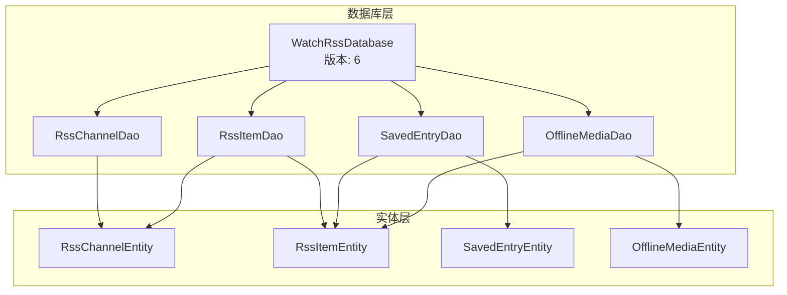
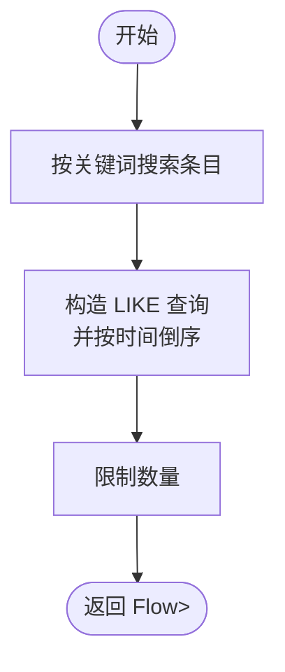
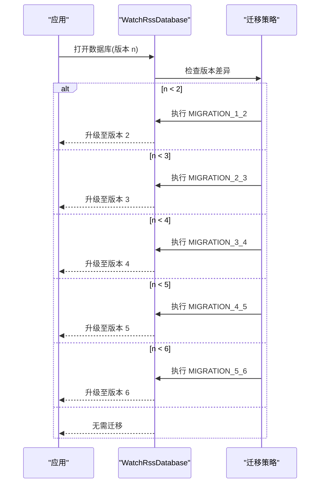
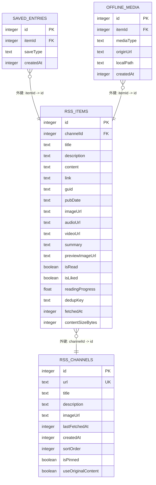
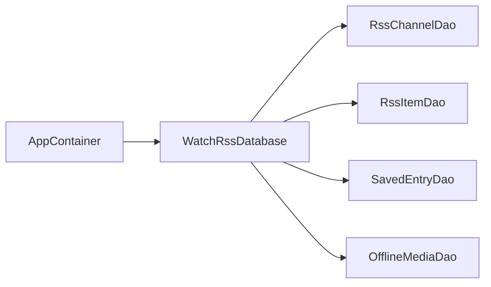

# 数据库设计

<cite>
**本文引用的文件**
- [WatchRssDatabase.kt](file://app/src/main/java/com/lightningstudio/watchrss/data/db/WatchRssDatabase.kt)
- [RssChannelEntity.kt](file://app/src/main/java/com/lightningstudio/watchrss/data/db/RssChannelEntity.kt)
- [RssItemEntity.kt](file://app/src/main/java/com/lightningstudio/watchrss/data/db/RssItemEntity.kt)
- [SavedEntryEntity.kt](file://app/src/main/java/com/lightningstudio/watchrss/data/db/SavedEntryEntity.kt)
- [OfflineMediaEntity.kt](file://app/src/main/java/com/lightningstudio/watchrss/data/db/OfflineMediaEntity.kt)
- [RssChannelDao.kt](file://app/src/main/java/com/lightningstudio/watchrss/data/db/RssChannelDao.kt)
- [RssItemDao.kt](file://app/src/main/java/com/lightningstudio/watchrss/data/db/RssItemDao.kt)
- [SavedEntryDao.kt](file://app/src/main/java/com/lightningstudio/watchrss/data/db/SavedEntryDao.kt)
- [OfflineMediaDao.kt](file://app/src/main/java/com/lightningstudio/watchrss/data/db/OfflineMediaDao.kt)
- [AppContainer.kt](file://app/src/main/java/com/lightningstudio/watchrss/data/AppContainer.kt)
</cite>

## 目录
1. [简介](#简介)
2. [项目结构](#项目结构)
3. [核心组件](#核心组件)
4. [架构总览](#架构总览)
5. [详细组件分析](#详细组件分析)
6. [依赖分析](#依赖分析)
7. [性能考虑](#性能考虑)
8. [故障排查指南](#故障排查指南)
9. [结论](#结论)
10. [附录](#附录)

## 简介
本文件系统性梳理 WatchRSS 项目中基于 Room 的数据库设计与实现，覆盖数据库架构、实体模型、DAO 接口、版本迁移策略、索引与约束、性能优化以及实际操作示例与最佳实践。目标是帮助开发者快速理解并高效维护该数据库层。

## 项目结构
数据库相关代码集中于 data/db 包内，采用“实体 + DAO + 数据库类”的标准 Room 分层组织：
- 实体：RssChannelEntity、RssItemEntity、SavedEntryEntity、OfflineMediaEntity
- DAO：RssChannelDao、RssItemDao、SavedEntryDao、OfflineMediaDao
- 数据库：WatchRssDatabase（声明实体、暴露 DAO 访问器，并内置多版本迁移）



**图表来源**
- [WatchRssDatabase.kt:9-24](file://app/src/main/java/com/lightningstudio/watchrss/data/db/WatchRssDatabase.kt#L9-L24)
- [RssChannelEntity.kt:7-23](file://app/src/main/java/com/lightningstudio/watchrss/data/db/RssChannelEntity.kt#L7-L23)
- [RssItemEntity.kt:8-23](file://app/src/main/java/com/lightningstudio/watchrss/data/db/RssItemEntity.kt#L8-L23)
- [SavedEntryEntity.kt:8-22](file://app/src/main/java/com/lightningstudio/watchrss/data/db/SavedEntryEntity.kt#L8-L22)
- [OfflineMediaEntity.kt:8-22](file://app/src/main/java/com/lightningstudio/watchrss/data/db/OfflineMediaEntity.kt#L8-L22)

**章节来源**
- [WatchRssDatabase.kt:9-24](file://app/src/main/java/com/lightningstudio/watchrss/data/db/WatchRssDatabase.kt#L9-L24)

## 核心组件
- WatchRssDatabase：Room 数据库入口，声明实体集合、版本号、DAO 暴露器，并在伴生对象中定义迁移策略。
- 四大实体：分别承载 RSS 频道、条目、收藏记录、离线媒体的数据结构与约束。
- 四大 DAO：提供 CRUD、条件查询、聚合统计、分页检索等能力，返回 Flow 或挂起函数形式。

**章节来源**
- [WatchRssDatabase.kt:9-24](file://app/src/main/java/com/lightningstudio/watchrss/data/db/WatchRssDatabase.kt#L9-L24)
- [RssChannelEntity.kt:7-23](file://app/src/main/java/com/lightningstudio/watchrss/data/db/RssChannelEntity.kt#L7-L23)
- [RssItemEntity.kt:8-23](file://app/src/main/java/com/lightningstudio/watchrss/data/db/RssItemEntity.kt#L8-L23)
- [SavedEntryEntity.kt:8-22](file://app/src/main/java/com/lightningstudio/watchrss/data/db/SavedEntryEntity.kt#L8-L22)
- [OfflineMediaEntity.kt:8-22](file://app/src/main/java/com/lightningstudio/watchrss/data/db/OfflineMediaEntity.kt#L8-L22)
- [RssChannelDao.kt:10-32](file://app/src/main/java/com/lightningstudio/watchrss/data/db/RssChannelDao.kt#L10-L32)
- [RssItemDao.kt:9-149](file://app/src/main/java/com/lightningstudio/watchrss/data/db/RssItemDao.kt#L9-L149)
- [SavedEntryDao.kt:10-39](file://app/src/main/java/com/lightningstudio/watchrss/data/db/SavedEntryDao.kt#L10-L39)
- [OfflineMediaDao.kt:9-43](file://app/src/main/java/com/lightningstudio/watchrss/data/db/OfflineMediaDao.kt#L9-L43)

## 架构总览
Room 数据库通过 WatchRssDatabase 统一管理，DAO 层负责 SQL 语义与查询优化，实体层定义表结构与外键/索引约束。应用通过 AppContainer 注入数据库实例，向各仓库模块提供 DAO 访问。

```mermaid
classDiagram
class WatchRssDatabase {
+version : int
+rssChannelDao()
+rssItemDao()
+savedEntryDao()
+offlineMediaDao()
+MIGRATION_1_2
+MIGRATION_2_3
+MIGRATION_3_4
+MIGRATION_4_5
+MIGRATION_5_6
}
class RssChannelDao
class RssItemDao
class SavedEntryDao
class OfflineMediaDao
class RssChannelEntity
class RssItemEntity
class SavedEntryEntity
class OfflineMediaEntity
WatchRssDatabase --> RssChannelDao
WatchRssDatabase --> RssItemDao
WatchRssDatabase --> SavedEntryDao
WatchRssDatabase --> OfflineMediaDao
RssItemEntity --> RssChannelEntity : "外键 : channelId -> id"
SavedEntryEntity --> RssItemEntity : "外键 : itemId -> id"
OfflineMediaEntity --> RssItemEntity : "外键 : itemId -> id"
```

**图表来源**
- [WatchRssDatabase.kt:9-24](file://app/src/main/java/com/lightningstudio/watchrss/data/db/WatchRssDatabase.kt#L9-L24)
- [RssItemEntity.kt:10-16](file://app/src/main/java/com/lightningstudio/watchrss/data/db/RssItemEntity.kt#L10-L16)
- [SavedEntryEntity.kt:10-16](file://app/src/main/java/com/lightningstudio/watchrss/data/db/SavedEntryEntity.kt#L10-L16)
- [OfflineMediaEntity.kt:10-16](file://app/src/main/java/com/lightningstudio/watchrss/data/db/OfflineMediaEntity.kt#L10-L16)

## 详细组件分析

### WatchRssDatabase 设计理念与配置
- 实体清单：包含频道、条目、收藏、离线媒体四类实体。
- 版本号：当前版本为 6。
- 查询验证跳过：使用注解跳过查询验证，便于复杂 SQL 的灵活编写。
- DAO 暴露：提供四个 DAO 的访问器，供上层仓库使用。
- 迁移策略：内置从 1→2、2→3、3→4、4→5、5→6 的迁移对象，按顺序执行。

**章节来源**
- [WatchRssDatabase.kt:9-24](file://app/src/main/java/com/lightningstudio/watchrss/data/db/WatchRssDatabase.kt#L9-L24)
- [WatchRssDatabase.kt:26-114](file://app/src/main/java/com/lightningstudio/watchrss/data/db/WatchRssDatabase.kt#L26-L114)

### 实体模型设计

#### RssChannelEntity（RSS 频道）
- 表名：rss_channels
- 主键：自增 id
- 唯一索引：url
- 字段要点：
  - 排序与置顶：sortOrder、isPinned
  - 内容策略：useOriginalContent
  - 时间戳：createdAt、lastFetchedAt
- 业务含义：用于存储订阅源元信息与展示排序控制。

**章节来源**
- [RssChannelEntity.kt:7-23](file://app/src/main/java/com/lightningstudio/watchrss/data/db/RssChannelEntity.kt#L7-L23)

#### RssItemEntity（RSS 条目）
- 表名：rss_items
- 外键：channelId → rss_channels(id)，级联删除
- 唯一索引：(channelId, dedupKey)
- 普通索引：channelId、(channelId, fetchedAt)
- 字段要点：
  - 去重键：dedupKey
  - 内容与多媒体：title/description/content/link/guid/pubDate/imageUrl/audioUrl/videoUrl
  - 阅读状态：isRead、readingProgress
  - 收藏标记：isLiked
  - 缓存大小：contentSizeBytes
  - 新增摘要与预览：summary、previewImageUrl
- 业务含义：承载单条内容的完整信息，支持去重、阅读进度、缓存清理等。

**章节来源**
- [RssItemEntity.kt:8-23](file://app/src/main/java/com/lightningstudio/watchrss/data/db/RssItemEntity.kt#L8-L23)

#### SavedEntryEntity（收藏记录）
- 表名：saved_entries
- 外键：itemId → rss_items(id)，级联删除
- 唯一索引：(itemId, saveType)
- 字段要点：itemId、saveType、createdAt
- 业务含义：记录某条目在不同保存类型下的收藏信息。

**章节来源**
- [SavedEntryEntity.kt:8-22](file://app/src/main/java/com/lightningstudio/watchrss/data/db/SavedEntryEntity.kt#L8-L22)

#### OfflineMediaEntity（离线媒体）
- 表名：offline_media
- 外键：itemId → rss_items(id)，级联删除
- 唯一索引：(itemId, originUrl)
- 字段要点：itemId、mediaType、originUrl、localPath、createdAt
- 业务含义：记录条目关联的离线媒体资源及其本地路径。

**章节来源**
- [OfflineMediaEntity.kt:8-22](file://app/src/main/java/com/lightningstudio/watchrss/data/db/OfflineMediaEntity.kt#L8-L22)

### DAO 接口设计模式与查询优化

#### RssChannelDao
- 观察与查询：按置顶/排序/创建时间排序；按 id/url 查询单条频道。
- 插入与更新：忽略冲突插入；更新频道信息。
- 删除：按 id 删除。

**章节来源**
- [RssChannelDao.kt:10-32](file://app/src/main/java/com/lightningstudio/watchrss/data/db/RssChannelDao.kt#L10-L32)

#### RssItemDao
- 分页观察：按 fetchedAt/id 降序分页获取条目列表。
- 关键词搜索：对标题/描述/正文/摘要进行模糊匹配并分页。
- 更新操作：标记已读、点赞、阅读进度、按去重键更新内容、补充摘要与预览、更新原始内容。
- 聚合统计：按频道统计总数、未读数；统计总缓存字节；按最早 fetchedAt 排序列出待清理项；排除已收藏的条目。
- 删除：按 id 列表或频道删除。



**图表来源**
- [RssItemDao.kt:30-43](file://app/src/main/java/com/lightningstudio/watchrss/data/db/RssItemDao.kt#L30-L43)

**章节来源**
- [RssItemDao.kt:9-149](file://app/src/main/java/com/lightningstudio/watchrss/data/db/RssItemDao.kt#L9-L149)

#### SavedEntryDao
- 按 itemId 观察与查询；按 itemId 统计数量。
- 插入：忽略冲突。
- 删除：按 itemId+saveType 删除。
- 联合查询：返回包含条目、频道标题、保存时间与类型的组合视图。

**章节来源**
- [SavedEntryDao.kt:10-39](file://app/src/main/java/com/lightningstudio/watchrss/data/db/SavedEntryDao.kt#L10-L39)

#### OfflineMediaDao
- 按 itemId 观察与查询；按 itemId+originUrl 查询唯一记录。
- 批量插入：忽略冲突。
- 更新本地路径；按 itemId 删除。

**章节来源**
- [OfflineMediaDao.kt:9-43](file://app/src/main/java/com/lightningstudio/watchrss/data/db/OfflineMediaDao.kt#L9-L43)

### 数据库版本管理与迁移策略



**图表来源**
- [WatchRssDatabase.kt:26-114](file://app/src/main/java/com/lightningstudio/watchrss/data/db/WatchRssDatabase.kt#L26-L114)

- MIGRATION_1_2：为 rss_channels 添加排序与置顶列，并用创建时间初始化排序值。
- MIGRATION_2_3：为 rss_items 添加点赞标记；创建 saved_entries 与 offline_media 表并建立索引；建立外键约束。
- MIGRATION_3_4：为 rss_channels 添加 useOriginalContent 标记。
- MIGRATION_4_5：为 rss_items 添加阅读进度字段。
- MIGRATION_5_6：为 rss_items 添加摘要与预览图字段，并新增 (channelId, fetchedAt) 复合索引。

**章节来源**
- [WatchRssDatabase.kt:26-114](file://app/src/main/java/com/lightningstudio/watchrss/data/db/WatchRssDatabase.kt#L26-L114)

### 数据模型与关系图



**图表来源**
- [RssChannelEntity.kt:11-23](file://app/src/main/java/com/lightningstudio/watchrss/data/db/RssChannelEntity.kt#L11-L23)
- [RssItemEntity.kt:24-45](file://app/src/main/java/com/lightningstudio/watchrss/data/db/RssItemEntity.kt#L24-L45)
- [SavedEntryEntity.kt:23-29](file://app/src/main/java/com/lightningstudio/watchrss/data/db/SavedEntryEntity.kt#L23-L29)
- [OfflineMediaEntity.kt:23-31](file://app/src/main/java/com/lightningstudio/watchrss/data/db/OfflineMediaEntity.kt#L23-L31)

## 依赖分析
- WatchRssDatabase 作为容器，统一注入 DAO。
- AppContainer 在构建仓库时注入数据库提供的 DAO，形成清晰的依赖链。
- 实体间通过外键建立强约束，DAO 查询利用索引提升性能。



**图表来源**
- [AppContainer.kt:100-122](file://app/src/main/java/com/lightningstudio/watchrss/data/AppContainer.kt#L100-L122)
- [WatchRssDatabase.kt:20-24](file://app/src/main/java/com/lightningstudio/watchrss/data/db/WatchRssDatabase.kt#L20-L24)

**章节来源**
- [AppContainer.kt:100-122](file://app/src/main/java/com/lightningstudio/watchrss/data/AppContainer.kt#L100-L122)

## 性能考虑
- 索引设计
  - rss_channels.url 唯一索引：加速按 URL 去重与查找。
  - rss_items.channelId、(channelId, dedupKey)、(channelId, fetchedAt)：支撑分页、去重、时间序检索。
  - saved_entries(itemId, saveType)、offline_media(itemId, originUrl)：支撑快速定位与去重。
- 外键与级联删除：保证数据一致性，避免悬挂引用。
- Flow 观察：UI 层可响应式订阅，减少不必要的全量刷新。
- 缓存清理：按 fetchedAt 升序选择最早条目，结合排除已收藏项，提升清理效率。
- 查询优化建议
  - 使用带索引的过滤条件（如 channelId、dedupKey）。
  - 搜索使用 ESCAPE 转义与 LIKE，避免全表扫描。
  - 聚合查询（COUNT/SUM）配合索引，降低计算成本。

[本节为通用性能指导，不直接分析具体文件]

## 故障排查指南
- 插入冲突
  - DAO 插入采用 IGNORE 策略，若出现重复主键或唯一约束冲突，需检查去重键或唯一索引设计。
- 查询无结果
  - 确认索引是否命中；核对过滤条件（如 dedupKey、channelId、时间范围）。
- 迁移失败
  - 检查迁移脚本是否与现有表结构一致；确保版本号连续且顺序正确。
- 外键约束错误
  - 删除父表记录前，确认子表已清理或依赖级联删除生效。
- 缓存清理异常
  - 核查 contentSizeBytes 是否正确更新；确认排除收藏项的子查询逻辑。

**章节来源**
- [RssChannelDao.kt:24](file://app/src/main/java/com/lightningstudio/watchrss/data/db/RssChannelDao.kt#L24)
- [RssItemDao.kt:45](file://app/src/main/java/com/lightningstudio/watchrss/data/db/RssItemDao.kt#L45)
- [WatchRssDatabase.kt:26-114](file://app/src/main/java/com/lightningstudio/watchrss/data/db/WatchRssDatabase.kt#L26-L114)

## 结论
该数据库层以 Room 为核心，采用清晰的实体-DAO-数据库三层结构，配合完善的索引与外键约束，满足 RSS 内容管理、收藏与离线媒体存储的核心需求。迁移策略覆盖主要演进阶段，具备良好的向前兼容性。建议在后续迭代中持续关注查询性能与缓存策略，确保在资源受限的可穿戴设备上保持流畅体验。

## 附录

### 实际操作示例与最佳实践
- 插入频道（忽略冲突）
  - 使用 RssChannelDao.insertChannel，避免重复 URL 导致的冲突。
- 分页加载条目
  - 使用 RssItemDao.observeItemsPaged，按 fetchedAt/id 降序并设置合理 limit。
- 搜索条目
  - 使用 RssItemDao.searchItems，注意 ESCAPE 转义与 LIKE 模糊匹配。
- 标记已读/点赞/进度
  - 使用 RssItemDao.markRead、updateLiked、updateReadingProgress。
- 收藏与取消收藏
  - 使用 SavedEntryDao.insert/delete，saveType 作为去重键。
- 离线媒体下载
  - 使用 OfflineMediaDao.insertAll，完成后通过 updateLocalPath 更新本地路径。
- 清理缓存
  - 使用 RssItemDao.loadOldestItems 或 loadOldestItemsExcludingSaved，结合删除接口清理。

**章节来源**
- [RssChannelDao.kt:24-25](file://app/src/main/java/com/lightningstudio/watchrss/data/db/RssChannelDao.kt#L24-L25)
- [RssItemDao.kt:19](file://app/src/main/java/com/lightningstudio/watchrss/data/db/RssItemDao.kt#L19)
- [RssItemDao.kt:43](file://app/src/main/java/com/lightningstudio/watchrss/data/db/RssItemDao.kt#L43)
- [RssItemDao.kt:48-58](file://app/src/main/java/com/lightningstudio/watchrss/data/db/RssItemDao.kt#L48-L58)
- [SavedEntryDao.kt:21-25](file://app/src/main/java/com/lightningstudio/watchrss/data/db/SavedEntryDao.kt#L21-L25)
- [OfflineMediaDao.kt:29-39](file://app/src/main/java/com/lightningstudio/watchrss/data/db/OfflineMediaDao.kt#L29-L39)
- [RssItemDao.kt:133-143](file://app/src/main/java/com/lightningstudio/watchrss/data/db/RssItemDao.kt#L133-L143)