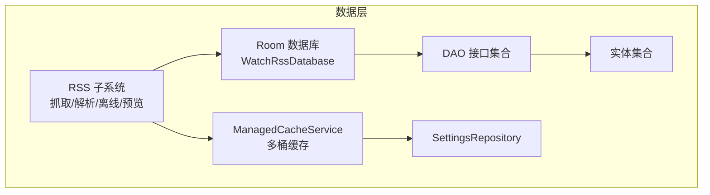
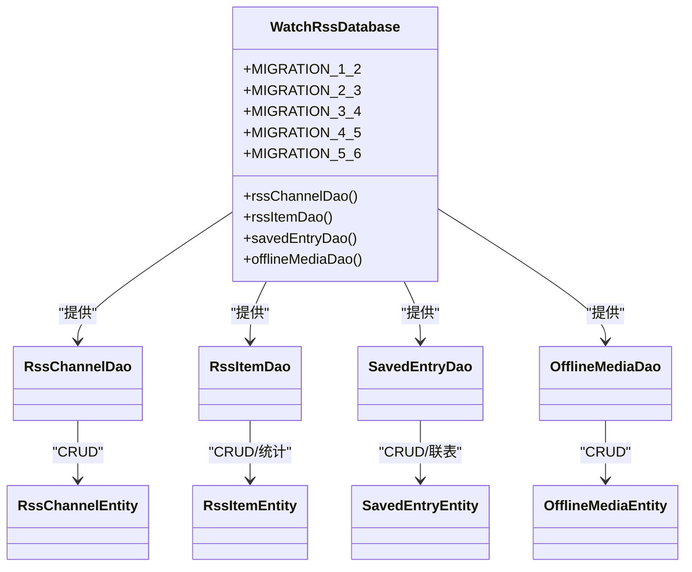
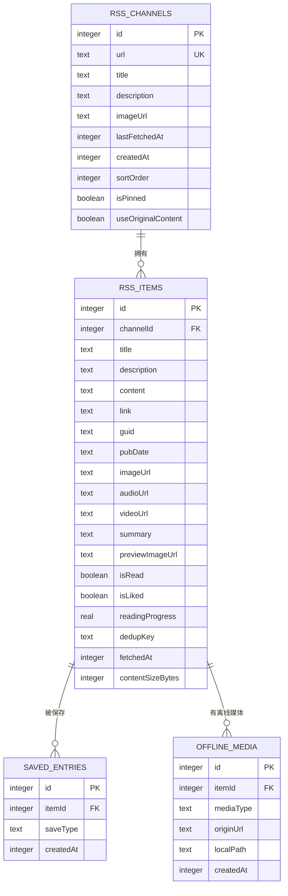
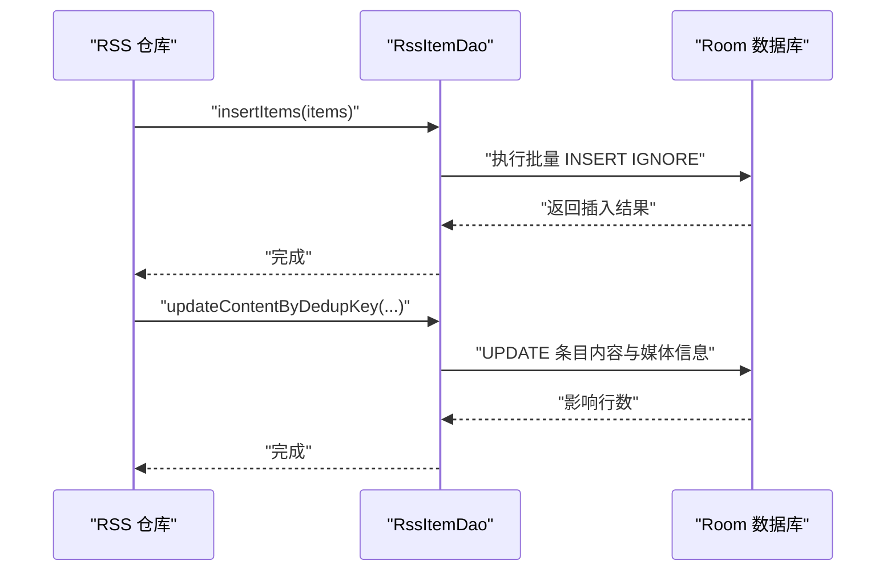
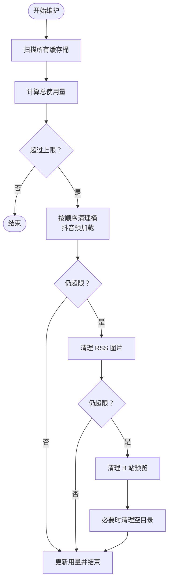
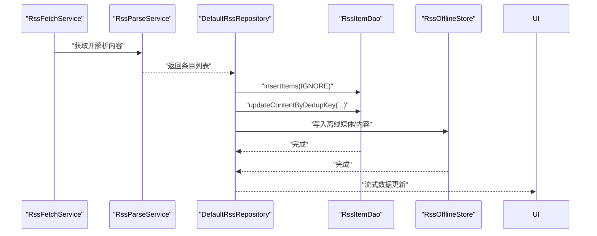
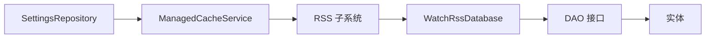

# 数据管理

<cite>
**本文引用的文件**
- [WatchRssDatabase.kt](file://app/src/main/java/com/lightningstudio/watchrss/data/db/WatchRssDatabase.kt)
- [RssChannelEntity.kt](file://app/src/main/java/com/lightningstudio/watchrss/data/db/RssChannelEntity.kt)
- [RssItemEntity.kt](file://app/src/main/java/com/lightningstudio/watchrss/data/db/RssItemEntity.kt)
- [SavedEntryEntity.kt](file://app/src/main/java/com/lightningstudio/watchrss/data/db/SavedEntryEntity.kt)
- [OfflineMediaEntity.kt](file://app/src/main/java/com/lightningstudio/watchrss/data/db/OfflineMediaEntity.kt)
- [RssChannelDao.kt](file://app/src/main/java/com/lightningstudio/watchrss/data/db/RssChannelDao.kt)
- [RssItemDao.kt](file://app/src/main/java/com/lightningstudio/watchrss/data/db/RssItemDao.kt)
- [SavedEntryDao.kt](file://app/src/main/java/com/lightningstudio/watchrss/data/db/SavedEntryDao.kt)
- [OfflineMediaDao.kt](file://app/src/main/java/com/lightningstudio/watchrss/data/db/OfflineMediaDao.kt)
- [ManagedCacheService.kt](file://app/src/main/java/com/lightningstudio/watchrss/data/cache/ManagedCacheService.kt)
- [RssOfflineStore.kt](file://app/src/main/java/com/lightningstudio/watchrss/data/rss/RssOfflineStore.kt)
- [RssRepository.kt](file://app/src/main/java/com/lightningstudio/watchrss/data/rss/RssRepository.kt)
- [DefaultRssRepository.kt](file://app/src/main/java/com/lightningstudio/watchrss/data/rss/DefaultRssRepository.kt)
- [RssFetchService.kt](file://app/src/main/java/com/lightningstudio/watchrss/data/rss/RssFetchService.kt)
- [RssParseService.kt](file://app/src/main/java/com/lightningstudio/watchrss/data/rss/RssParseService.kt)
- [RssRemoteRequestPolicy.kt](file://app/src/main/java/com/lightningstudio/watchrss/data/rss/RssRemoteRequestPolicy.kt)
- [RssPreviewUpdatePlanner.kt](file://app/src/main/java/com/lightningstudio/watchrss/data/rss/RssPreviewUpdatePlanner.kt)
- [RssReadableService.kt](file://app/src/main/java/com/lightningstudio/watchrss/data/rss/RssReadableService.kt)
- [SettingsRepository.kt](file://app/src/main/java/com/lightningstudio/watchrss/data/settings/SettingsRepository.kt)
- [AppContainer.kt](file://app/src/main/java/com/lightningstudio/watchrss/data/AppContainer.kt)
</cite>

## 目录
1. [简介](#简介)
2. [项目结构](#项目结构)
3. [核心组件](#核心组件)
4. [架构总览](#架构总览)
5. [详细组件分析](#详细组件分析)
6. [依赖分析](#依赖分析)
7. [性能考量](#性能考量)
8. [故障排查指南](#故障排查指南)
9. [结论](#结论)
10. [附录](#附录)

## 简介
本文件系统性梳理 WatchRSS 的数据管理系统，重点覆盖基于 Room 的数据库架构（实体、DAO、迁移）、缓存体系（多级缓存与清理策略）、数据同步与离线能力、查询与事务优化、以及数据安全与完整性保障。文档同时提供使用示例与最佳实践，帮助开发者在不深入源码的前提下高效理解并正确使用数据层。

## 项目结构
数据层主要位于 app/src/main/java/com/lightningstudio/watchrss/data 下，按功能域划分为：
- db：Room 数据库与实体/DAO
- rss：RSS 抓取、解析、预览、离线存储与远程策略
- cache：应用级缓存服务（多桶管理、容量控制、维护）
- bili / douyin：对应平台的仓库与缓存策略
- settings：设置仓库（含缓存上限等配置）
- 其他：网络可用性监控、应用容器装配等

图表来源
- [WatchRssDatabase.kt:1-116](file://app/src/main/java/com/lightningstudio/watchrss/data/db/WatchRssDatabase.kt#L1-L116)
- [ManagedCacheService.kt:1-295](file://app/src/main/java/com/lightningstudio/watchrss/data/cache/ManagedCacheService.kt#L1-L295)

章节来源
- [WatchRssDatabase.kt:1-116](file://app/src/main/java/com/lightningstudio/watchrss/data/db/WatchRssDatabase.kt#L1-L116)
- [ManagedCacheService.kt:1-295](file://app/src/main/java/com/lightningstudio/watchrss/data/cache/ManagedCacheService.kt#L1-L295)

## 核心组件
- Room 数据库与版本管理
  - 数据库类集中声明实体与版本号，并内置多步迁移策略，确保升级时数据安全与兼容。
- 实体模型
  - RssChannelEntity：RSS 频道元信息与排序、置顶、原始内容开关等。
  - RssItemEntity：文章条目，含去重键、时间戳、阅读状态、点赞、阅读进度、摘要与预览图等。
  - SavedEntryEntity：收藏/保存记录，支持多保存类型。
  - OfflineMediaEntity：离线媒体映射，记录来源 URL 与本地路径。
- DAO 接口
  - 提供基于 Flow 的响应式查询、分页查询、搜索、统计与批量操作。
- 缓存服务
  - 多桶缓存（抖音预加载、RSS 图片、B 站预览、RSS 离线），统一容量限制与清理策略，带维护任务与互斥保护。

章节来源
- [WatchRssDatabase.kt:9-25](file://app/src/main/java/com/lightningstudio/watchrss/data/db/WatchRssDatabase.kt#L9-L25)
- [RssChannelEntity.kt:7-24](file://app/src/main/java/com/lightningstudio/watchrss/data/db/RssChannelEntity.kt#L7-L24)
- [RssItemEntity.kt:8-46](file://app/src/main/java/com/lightningstudio/watchrss/data/db/RssItemEntity.kt#L8-L46)
- [SavedEntryEntity.kt:8-30](file://app/src/main/java/com/lightningstudio/watchrss/data/db/SavedEntryEntity.kt#L8-L30)
- [OfflineMediaEntity.kt:8-32](file://app/src/main/java/com/lightningstudio/watchrss/data/db/OfflineMediaEntity.kt#L8-L32)
- [RssChannelDao.kt:10-33](file://app/src/main/java/com/lightningstudio/watchrss/data/db/RssChannelDao.kt#L10-L33)
- [RssItemDao.kt:9-161](file://app/src/main/java/com/lightningstudio/watchrss/data/db/RssItemDao.kt#L9-L161)
- [SavedEntryDao.kt:10-47](file://app/src/main/java/com/lightningstudio/watchrss/data/db/SavedEntryDao.kt#L10-L47)
- [OfflineMediaDao.kt:9-44](file://app/src/main/java/com/lightningstudio/watchrss/data/db/OfflineMediaDao.kt#L9-L44)
- [ManagedCacheService.kt:23-45](file://app/src/main/java/com/lightningstudio/watchrss/data/cache/ManagedCacheService.kt#L23-L45)

## 架构总览
下图展示数据层核心组件交互：Room 负责持久化；DAO 提供查询与写入；缓存服务负责磁盘缓存的容量与清理；RSS 子系统协调抓取、解析、离线与预览。

图表来源
- [WatchRssDatabase.kt:9-25](file://app/src/main/java/com/lightningstudio/watchrss/data/db/WatchRssDatabase.kt#L9-L25)
- [RssChannelDao.kt:10-33](file://app/src/main/java/com/lightningstudio/watchrss/data/db/RssChannelDao.kt#L10-L33)
- [RssItemDao.kt:9-161](file://app/src/main/java/com/lightningstudio/watchrss/data/db/RssItemDao.kt#L9-L161)
- [SavedEntryDao.kt:10-47](file://app/src/main/java/com/lightningstudio/watchrss/data/db/SavedEntryDao.kt#L10-L47)
- [OfflineMediaDao.kt:9-44](file://app/src/main/java/com/lightningstudio/watchrss/data/db/OfflineMediaDao.kt#L9-L44)

## 详细组件分析

### Room 数据库与迁移
- 版本与实体
  - 当前数据库版本为 6，包含四个实体：RssChannel、RssItem、SavedEntry、OfflineMedia。
- 迁移策略
  - 1→2：新增排序与置顶字段，并回填默认值。
  - 2→3：新增“点赞”字段；创建收藏表与索引；创建离线媒体表与索引。
  - 3→4：新增频道“使用原文内容”标志。
  - 4→5：新增阅读进度字段。
  - 5→6：新增摘要与预览图字段，并建立复合索引以优化频道+抓取时间查询。
- 设计要点
  - 使用外键约束保证级联删除，避免悬挂数据。
  - 通过唯一索引与去重键防止重复条目。
  - 迁移脚本显式创建索引，确保后续查询性能。

章节来源
- [WatchRssDatabase.kt:9-116](file://app/src/main/java/com/lightningstudio/watchrss/data/db/WatchRssDatabase.kt#L9-L116)

### 实体模型与关系
- RssChannelEntity
  - 字段：主键、URL（唯一索引）、标题、描述、图标、最后抓取时间、创建时间、排序、置顶、是否使用原文内容。
  - 用途：标识一个 RSS 源，支持排序与置顶。
- RssItemEntity
  - 字段：频道外键、标题、描述、正文、链接、GUID、发布时间、图片/音频/视频 URL、摘要、预览图、已读/点赞/阅读进度、去重键、抓取时间、内容大小字节。
  - 关系：通过外键关联频道；复合索引优化去重与时间序查询。
- SavedEntryEntity
  - 字段：条目 ID、保存类型、创建时间。
  - 关系：外键指向条目，支持多类型保存。
- OfflineMediaEntity
  - 字段：条目 ID、媒体类型、来源 URL、本地路径、创建时间。
  - 关系：外键指向条目，唯一索引保证来源 URL 唯一。

图表来源
- [RssChannelEntity.kt:7-24](file://app/src/main/java/com/lightningstudio/watchrss/data/db/RssChannelEntity.kt#L7-L24)
- [RssItemEntity.kt:8-46](file://app/src/main/java/com/lightningstudio/watchrss/data/db/RssItemEntity.kt#L8-L46)
- [SavedEntryEntity.kt:8-30](file://app/src/main/java/com/lightningstudio/watchrss/data/db/SavedEntryEntity.kt#L8-L30)
- [OfflineMediaEntity.kt:8-32](file://app/src/main/java/com/lightningstudio/watchrss/data/db/OfflineMediaEntity.kt#L8-L32)

章节来源
- [RssChannelEntity.kt:7-24](file://app/src/main/java/com/lightningstudio/watchrss/data/db/RssChannelEntity.kt#L7-L24)
- [RssItemEntity.kt:8-46](file://app/src/main/java/com/lightningstudio/watchrss/data/db/RssItemEntity.kt#L8-L46)
- [SavedEntryEntity.kt:8-30](file://app/src/main/java/com/lightningstudio/watchrss/data/db/SavedEntryEntity.kt#L8-L30)
- [OfflineMediaEntity.kt:8-32](file://app/src/main/java/com/lightningstudio/watchrss/data/db/OfflineMediaEntity.kt#L8-L32)

### DAO 接口与查询优化
- RssChannelDao
  - 观察频道列表（置顶优先、排序降序、创建时间降序）。
  - 按 ID/URL 查询单条频道。
  - 插入忽略冲突，更新与删除。
- RssItemDao
  - 分页观察（按抓取时间与 ID 倒序）。
  - 搜索关键词（标题/描述/正文/摘要），支持 ESCAPE 转义。
  - 批量插入（忽略冲突）。
  - 标记已读、点赞、阅读进度更新。
  - 基于去重键的增量更新（正文、媒体 URL、摘要、预览图、内容大小）。
  - 统计：条目总数、各频道未读数、总缓存字节。
  - 清理：按 ID 列表或频道删除。
- SavedEntryDao
  - 按条目 ID 观察/查询保存记录，计数。
  - 插入忽略冲突。
  - 删除指定类型的保存。
  - 联表查询保存的条目（嵌入条目、频道标题、保存时间与类型）。
- OfflineMediaDao
  - 按条目 ID 观察/查询。
  - 按频道查询离线媒体。
  - 按来源 URL 查找。
  - 批量插入、更新本地路径、按条目删除。

图表来源
- [RssItemDao.kt:45-85](file://app/src/main/java/com/lightningstudio/watchrss/data/db/RssItemDao.kt#L45-L85)

章节来源
- [RssChannelDao.kt:10-33](file://app/src/main/java/com/lightningstudio/watchrss/data/db/RssChannelDao.kt#L10-L33)
- [RssItemDao.kt:9-161](file://app/src/main/java/com/lightningstudio/watchrss/data/db/RssItemDao.kt#L9-L161)
- [SavedEntryDao.kt:10-47](file://app/src/main/java/com/lightningstudio/watchrss/data/db/SavedEntryDao.kt#L10-L47)
- [OfflineMediaDao.kt:9-44](file://app/src/main/java/com/lightningstudio/watchrss/data/db/OfflineMediaDao.kt#L9-L44)

### 缓存系统：多级缓存与清理
- 缓存桶
  - 抖音预加载、RSS 图片、B 站预览、RSS 离线。
- 容量与维护
  - 依据设置仓库中的缓存上限进行裁剪。
  - 维护任务带防抖与互斥锁，避免并发问题。
  - 清理顺序：先清空无效临时文件，再按桶依次清理，保留最小保护数量（如抖音预加载）。
- 清理触发场景
  - 应用启动、缓存写入、删除、设置变更、手动清理、登出、频道删除。
- 离线清理
  - 在特定清理原因后，递归清理 RSS 离线目录中空目录，保持整洁。

图表来源
- [ManagedCacheService.kt:88-165](file://app/src/main/java/com/lightningstudio/watchrss/data/cache/ManagedCacheService.kt#L88-L165)

章节来源
- [ManagedCacheService.kt:1-295](file://app/src/main/java/com/lightningstudio/watchrss/data/cache/ManagedCacheService.kt#L1-L295)

### 数据同步与离线支持
- 离线存储
  - RSS 离线存储模块负责将媒体与内容落盘，配合 DAO 的离线媒体表实现来源 URL 与本地路径映射。
- 增量更新
  - 基于去重键（dedupKey）进行幂等更新，避免重复与覆盖错误。
  - 支持仅更新正文与内容大小，或补充摘要与预览图。
- 冲突解决
  - 写入采用 IGNORE 策略，结合去重键与唯一索引，保证幂等性。
  - 删除采用级联策略，确保删除频道或条目时清理关联数据。
- 预览与可读性
  - 预览更新计划器与可读性服务协同，按策略生成摘要与预览图，提升离线体验。

图表来源
- [RssFetchService.kt:1-200](file://app/src/main/java/com/lightningstudio/watchrss/data/rss/RssFetchService.kt#L1-L200)
- [RssParseService.kt:1-200](file://app/src/main/java/com/lightningstudio/watchrss/data/rss/RssParseService.kt#L1-L200)
- [DefaultRssRepository.kt:1-300](file://app/src/main/java/com/lightningstudio/watchrss/data/rss/DefaultRssRepository.kt#L1-L300)
- [RssItemDao.kt:45-85](file://app/src/main/java/com/lightningstudio/watchrss/data/db/RssItemDao.kt#L45-L85)
- [RssOfflineStore.kt:1-200](file://app/src/main/java/com/lightningstudio/watchrss/data/rss/RssOfflineStore.kt#L1-L200)

章节来源
- [RssOfflineStore.kt:1-200](file://app/src/main/java/com/lightningstudio/watchrss/data/rss/RssOfflineStore.kt#L1-L200)
- [DefaultRssRepository.kt:1-300](file://app/src/main/java/com/lightningstudio/watchrss/data/rss/DefaultRssRepository.kt#L1-L300)
- [RssItemDao.kt:9-161](file://app/src/main/java/com/lightningstudio/watchrss/data/db/RssItemDao.kt#L9-L161)

### 数据访问模式、查询优化与事务
- 访问模式
  - 以 Flow 驱动的响应式查询为主，支持分页与搜索。
  - 批量写入使用 IGNORE，降低重复写入成本。
- 查询优化
  - 复合索引：频道+去重键（唯一）、频道+抓取时间，显著提升去重与时间序查询性能。
  - 唯一索引：频道 URL、收藏项（条目+保存类型）、离线媒体（条目+来源 URL）。
- 事务管理
  - Room 默认在单个 DAO 方法内进行原子性操作；复杂流程建议在仓库层组合多个 DAO 操作，必要时使用 Room 的事务 API 进行跨表原子写入。

章节来源
- [RssItemDao.kt:18-22](file://app/src/main/java/com/lightningstudio/watchrss/data/db/RssItemDao.kt#L18-L22)
- [RssItemDao.kt:118-129](file://app/src/main/java/com/lightningstudio/watchrss/data/db/RssItemDao.kt#L118-L129)
- [WatchRssDatabase.kt:101-113](file://app/src/main/java/com/lightningstudio/watchrss/data/db/WatchRssDatabase.kt#L101-L113)

### 数据安全、备份与完整性
- 安全与权限
  - 离线媒体路径位于应用私有目录，受系统权限保护。
- 备份与恢复
  - Room 数据库位于应用私有存储；可通过系统备份策略或应用内导出/导入流程（需在上层实现）进行备份。
- 完整性保证
  - 外键级联删除、唯一索引、去重键与 IGNORE 写入共同确保数据一致性。
  - 迁移脚本显式创建索引，避免升级后性能退化。

章节来源
- [WatchRssDatabase.kt:26-113](file://app/src/main/java/com/lightningstudio/watchrss/data/db/WatchRssDatabase.kt#L26-L113)
- [RssItemDao.kt:18-22](file://app/src/main/java/com/lightningstudio/watchrss/data/db/RssItemDao.kt#L18-L22)

## 依赖分析
- 数据库依赖
  - WatchRssDatabase 依赖四个实体与四个 DAO 接口。
- 仓库依赖
  - DefaultRssRepository 依赖 DAO 与 RSS 子系统组件（抓取、解析、离线、预览、可读性、远程策略）。
- 缓存依赖
  - ManagedCacheService 依赖设置仓库与各子系统缓存目录（抖音预加载、RSS 图片、B 站预览、RSS 离线）。
- 设置依赖
  - SettingsRepository 提供缓存上限等配置，驱动缓存维护策略。

图表来源
- [SettingsRepository.kt:1-200](file://app/src/main/java/com/lightningstudio/watchrss/data/settings/SettingsRepository.kt#L1-L200)
- [ManagedCacheService.kt:1-295](file://app/src/main/java/com/lightningstudio/watchrss/data/cache/ManagedCacheService.kt#L1-L295)
- [WatchRssDatabase.kt:1-116](file://app/src/main/java/com/lightningstudio/watchrss/data/db/WatchRssDatabase.kt#L1-L116)

章节来源
- [AppContainer.kt:1-200](file://app/src/main/java/com/lightningstudio/watchrss/data/AppContainer.kt#L1-L200)
- [SettingsRepository.kt:1-200](file://app/src/main/java/com/lightningstudio/watchrss/data/settings/SettingsRepository.kt#L1-L200)

## 性能考量
- 索引与查询
  - 频道+去重键唯一索引与频道+抓取时间索引是热点查询的关键。
  - Flow 观察与分页查询减少一次性加载压力。
- 写入策略
  - 批量插入 IGNORE 降低重复写入开销。
  - 增量更新仅修改必要字段，避免全量更新。
- 缓存管理
  - 维护任务防抖与互斥锁避免频繁 IO。
  - 桶级清理与最小保护数量平衡空间与体验。
- 离线与预览
  - 预览更新计划器与可读性服务按策略生成摘要与预览图，减少网络依赖。

## 故障排查指南
- 常见问题
  - 升级后查询变慢：确认迁移脚本是否成功创建索引。
  - 重复条目：检查去重键与唯一索引是否生效。
  - 缓存占用过高：检查缓存上限设置与清理触发频率。
- 定位方法
  - 使用 DAO 的统计查询（未读数、总缓存字节）定位异常。
  - 通过日志与断点观察仓库层写入流程。
- 修复建议
  - 重新运行迁移或重建索引。
  - 调整缓存上限或触发一次强制清理。
  - 对外键删除与 IGNORE 写入进行单元测试验证。

章节来源
- [WatchRssDatabase.kt:26-113](file://app/src/main/java/com/lightningstudio/watchrss/data/db/WatchRssDatabase.kt#L26-L113)
- [RssItemDao.kt:118-134](file://app/src/main/java/com/lightningstudio/watchrss/data/db/RssItemDao.kt#L118-L134)
- [ManagedCacheService.kt:88-165](file://app/src/main/java/com/lightningstudio/watchrss/data/cache/ManagedCacheService.kt#L88-L165)

## 结论
本数据系统以 Room 为核心，结合多级缓存与严格的迁移策略，实现了 RSS 数据的可靠持久化、高性能查询与良好的离线体验。通过去重键、唯一索引与 IGNORE 写入，系统在保证数据完整性的同时兼顾了性能与扩展性。建议在后续迭代中持续关注查询热点与缓存策略，配合自动化测试与监控，确保系统稳定运行。

## 附录
- 使用示例与最佳实践
  - 插入与去重：使用 DAO 的批量插入（IGNORE）与基于去重键的增量更新，避免重复与覆盖。
  - 分页与搜索：利用频道 ID 与关键字参数进行分页与搜索，注意 ESCAPE 转义。
  - 统计与清理：定期调用统计接口（未读数、总缓存字节），结合设置仓库调整缓存上限。
  - 离线媒体：在下载完成后更新本地路径，删除条目时同步清理离线媒体。
  - 迁移与升级：遵循现有迁移脚本风格，显式创建索引并验证查询性能。