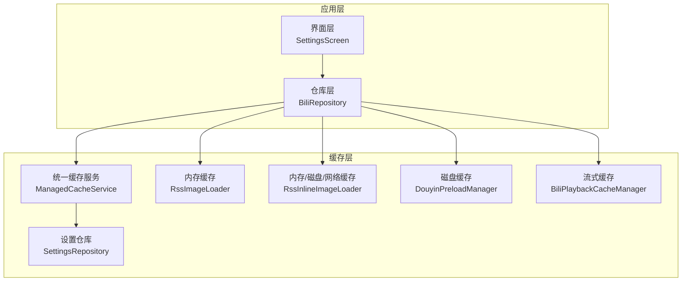
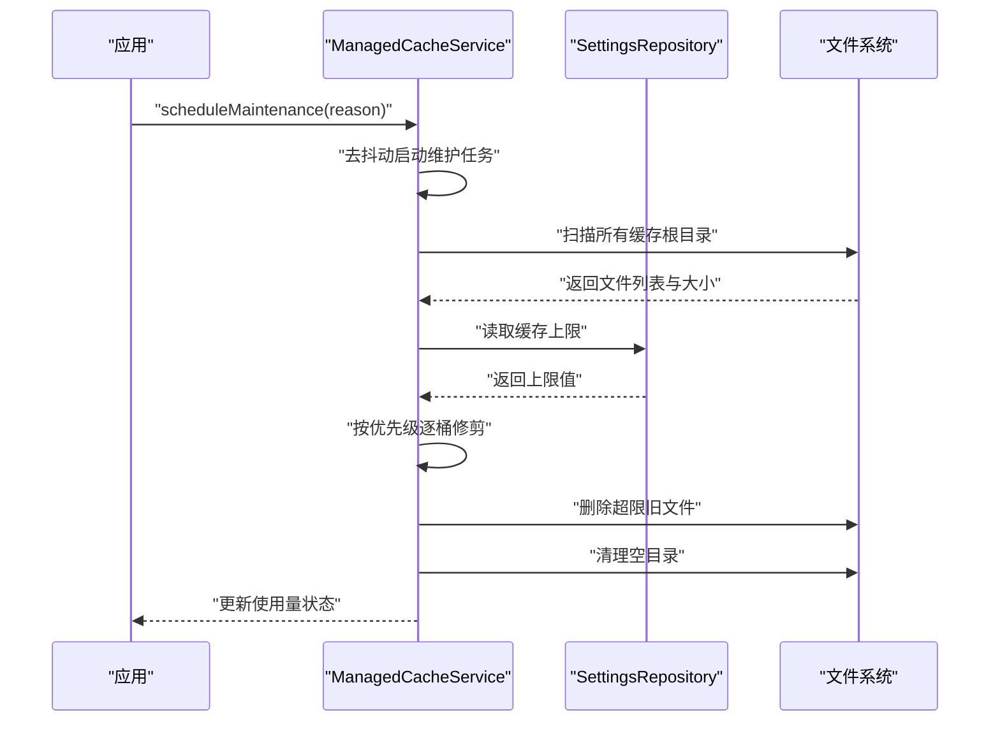
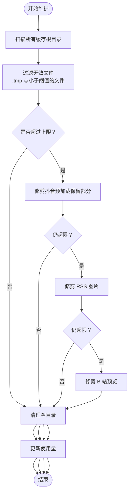
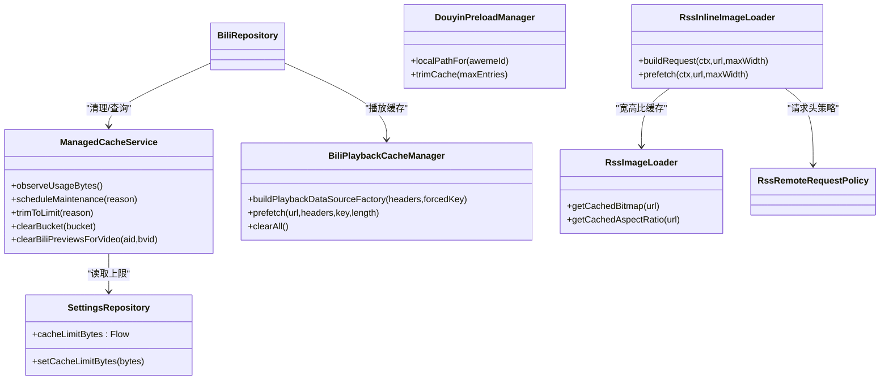

# 缓存系统

<cite>
**本文引用的文件**
- [ManagedCacheService.kt](file://app/src/main/java/com/lightningstudio/watchrss/data/cache/ManagedCacheService.kt)
- [ManagedCacheServiceTest.kt](file://app/src/test/java/com/lightningstudio/watchrss/data/cache/ManagedCacheServiceTest.kt)
- [SettingsRepository.kt](file://app/src/main/java/com/lightningstudio/watchrss/data/settings/SettingsRepository.kt)
- [RssImageLoader.kt](file://app/src/main/java/com/lightningstudio/watchrss/ui/util/RssImageLoader.kt)
- [RssInlineImageLoader.kt](file://app/src/main/java/com/lightningstudio/watchrss/ui/util/RssInlineImageLoader.kt)
- [DouyinPreloadManager.kt](file://app/src/main/java/com/lightningstudio/watchrss/data/douyin/DouyinPreloadManager.kt)
- [BiliPlaybackCacheManager.kt](file://app/src/main/java/com/lightningstudio/watchrss/data/bili/BiliPlaybackCacheManager.kt)
- [BiliRepository.kt](file://app/src/main/java/com/lightningstudio/watchrss/data/bili/BiliRepository.kt)
- [SettingsScreen.kt](file://app/src/main/java/com/lightningstudio/watchrss/ui/screen/rss/SettingsScreen.kt)
</cite>

## 目录
1. [简介](#简介)
2. [项目结构](#项目结构)
3. [核心组件](#核心组件)
4. [架构总览](#架构总览)
5. [详细组件分析](#详细组件分析)
6. [依赖关系分析](#依赖关系分析)
7. [性能考量](#性能考量)
8. [故障排查指南](#故障排查指南)
9. [结论](#结论)
10. [附录](#附录)

## 简介
本文件面向 Android WatchRSS 项目的缓存系统，重点围绕 ManagedCacheService 的设计与实现进行系统化说明。内容涵盖多级缓存（内存、磁盘、网络）的协调机制、缓存生命周期与容量控制、缓存一致性与并发控制、性能优化策略、配置参数与调优建议、监控与调试方法，以及在实际场景中的应用示例与性能对比思路。

## 项目结构
缓存体系由“统一缓存服务 + 多源子缓存”构成：
- 统一缓存服务：ManagedCacheService 负责多目录缓存的扫描、统计、修剪与清理，并通过 SettingsRepository 提供容量限制配置。
- 子缓存：
  - 内存缓存：RssImageLoader 使用 LruCache 缓存位图与宽高比；RssInlineImageLoader 配置 Coil 的内存/磁盘/网络缓存策略。
  - 磁盘缓存：DouyinPreloadManager 独立目录缓存短视频；BiliPlaybackCacheManager 使用 ExoPlayer SimpleCache 实现流式缓存；RssImageLoader 的磁盘缓存目录由 RssImageLoader.DISK_CACHE_DIR_NAME 定义。
  - 网络缓存：RssInlineImageLoader 通过 Coil 的网络缓存策略与请求头策略协同工作。

图表来源
- [ManagedCacheService.kt:47-95](file://app/src/main/java/com/lightningstudio/watchrss/data/cache/ManagedCacheService.kt#L47-L95)
- [SettingsRepository.kt:38-41](file://app/src/main/java/com/lightningstudio/watchrss/data/settings/SettingsRepository.kt#L38-L41)
- [RssImageLoader.kt:22-37](file://app/src/main/java/com/lightningstudio/watchrss/ui/util/RssImageLoader.kt#L22-L37)
- [RssInlineImageLoader.kt:65-94](file://app/src/main/java/com/lightningstudio/watchrss/ui/util/RssInlineImageLoader.kt#L65-L94)
- [DouyinPreloadManager.kt:13-23](file://app/src/main/java/com/lightningstudio/watchrss/data/douyin/DouyinPreloadManager.kt#L13-L23)
- [BiliPlaybackCacheManager.kt:20-59](file://app/src/main/java/com/lightningstudio/watchrss/data/bili/BiliPlaybackCacheManager.kt#L20-L59)

章节来源
- [ManagedCacheService.kt:47-95](file://app/src/main/java/com/lightningstudio/watchrss/data/cache/ManagedCacheService.kt#L47-L95)
- [SettingsRepository.kt:38-41](file://app/src/main/java/com/lightningstudio/watchrss/data/settings/SettingsRepository.kt#L38-L41)

## 核心组件
- 统一缓存服务（ManagedCacheService）
  - 负责四大缓存根目录的维护、扫描、统计与修剪。
  - 通过调度去抖动的维护任务，按优先级逐桶清理，确保总用量不超过设置上限。
  - 支持按桶清空、按视频清理预览片段等精细化操作。
- 设置仓库（SettingsRepository）
  - 提供缓存上限字节的 Flow，支持最小/最大值钳制与默认值。
- 图片加载与缓存
  - RssImageLoader：内存 LruCache + 磁盘文件缓存（URL 哈希命名），用于通用图片加载与宽高比缓存。
  - RssInlineImageLoader：基于 Coil 的内存/磁盘/网络三级缓存，可预取并缓存宽高比。
- 短视频预加载（DouyinPreloadManager）
  - 单独目录缓存抖音短视频，带最小有效字节数校验与最近最少使用裁剪。
- 流式播放缓存（BiliPlaybackCacheManager）
  - 基于 ExoPlayer SimpleCache 的 LRU 淘汰，支持强制缓存键与预取写入。

章节来源
- [ManagedCacheService.kt:47-95](file://app/src/main/java/com/lightningstudio/watchrss/data/cache/ManagedCacheService.kt#L47-L95)
- [SettingsRepository.kt:38-41](file://app/src/main/java/com/lightningstudio/watchrss/data/settings/SettingsRepository.kt#L38-L41)
- [RssImageLoader.kt:22-37](file://app/src/main/java/com/lightningstudio/watchrss/ui/util/RssImageLoader.kt#L22-L37)
- [RssInlineImageLoader.kt:65-94](file://app/src/main/java/com/lightningstudio/watchrss/ui/util/RssInlineImageLoader.kt#L65-L94)
- [DouyinPreloadManager.kt:13-23](file://app/src/main/java/com/lightningstudio/watchrss/data/douyin/DouyinPreloadManager.kt#L13-L23)
- [BiliPlaybackCacheManager.kt:20-59](file://app/src/main/java/com/lightningstudio/watchrss/data/bili/BiliPlaybackCacheManager.kt#L20-L59)

## 架构总览
统一缓存服务作为“总控”，负责：
- 维护四个缓存根目录：抖音预加载、RSS 图片、B 站预览、RSS 离线。
- 统计总用量并根据设置上限执行修剪，优先清理抖音预加载，其次 RSS 图片，再其次 B 站预览。
- 清理无效文件与空目录，保障磁盘整洁。
- 通过调度器延迟维护任务，避免频繁 IO。

图表来源
- [ManagedCacheService.kt:79-95](file://app/src/main/java/com/lightningstudio/watchrss/data/cache/ManagedCacheService.kt#L79-L95)
- [ManagedCacheService.kt:128-165](file://app/src/main/java/com/lightningstudio/watchrss/data/cache/ManagedCacheService.kt#L128-L165)
- [SettingsRepository.kt:38-41](file://app/src/main/java/com/lightningstudio/watchrss/data/settings/SettingsRepository.kt#L38-L41)

## 详细组件分析

### 统一缓存服务（ManagedCacheService）
- 缓存桶与优先级
  - 抖音预加载（最低优先级，保留若干最新文件）、RSS 图片、B 站预览、RSS 离线。
- 维护流程
  - 扫描所有根目录，过滤无效文件（临时文件、小于最小阈值的文件）。
  - 逐桶修剪：先抖音预加载（保留固定数量），再 RSS 图片，最后 B 站预览；若仍超限则继续。
  - 修剪后清理空目录，更新总使用量。
- 关键能力
  - 按桶清空、按视频清理预览片段、观察总使用量、维护互斥与去抖动。

图表来源
- [ManagedCacheService.kt:128-195](file://app/src/main/java/com/lightningstudio/watchrss/data/cache/ManagedCacheService.kt#L128-L195)
- [ManagedCacheService.kt:225-246](file://app/src/main/java/com/lightningstudio/watchrss/data/cache/ManagedCacheService.kt#L225-L246)
- [ManagedCacheService.kt:262-271](file://app/src/main/java/com/lightningstudio/watchrss/data/cache/ManagedCacheService.kt#L262-L271)

章节来源
- [ManagedCacheService.kt:47-95](file://app/src/main/java/com/lightningstudio/watchrss/data/cache/ManagedCacheService.kt#L47-L95)
- [ManagedCacheService.kt:128-195](file://app/src/main/java/com/lightningstudio/watchrss/data/cache/ManagedCacheService.kt#L128-L195)
- [ManagedCacheService.kt:225-273](file://app/src/main/java/com/lightningstudio/watchrss/data/cache/ManagedCacheService.kt#L225-L273)

### 设置与容量控制（SettingsRepository）
- 缓存上限字节
  - 默认值、最小值、最大值与可选范围。
  - 读取时自动钳制到合法区间；写入时同样钳制。
- UI 集成
  - 设置界面提供增减按钮与当前使用量显示，便于用户直观调整与监控。

章节来源
- [SettingsRepository.kt:31-35](file://app/src/main/java/com/lightningstudio/watchrss/data/settings/SettingsRepository.kt#L31-L35)
- [SettingsRepository.kt:38-41](file://app/src/main/java/com/lightningstudio/watchrss/data/settings/SettingsRepository.kt#L38-L41)
- [SettingsRepository.kt:76-80](file://app/src/main/java/com/lightningstudio/watchrss/data/settings/SettingsRepository.kt#L76-L80)
- [SettingsScreen.kt:520-547](file://app/src/main/java/com/lightningstudio/watchrss/ui/screen/rss/SettingsScreen.kt#L520-L547)

### 内存缓存（RssImageLoader 与 RssInlineImageLoader）
- RssImageLoader
  - 内存 LruCache：缓存位图与宽高比，降低重复解码与计算开销。
  - 磁盘缓存：以 URL 的 SHA-256 哈希命名，避免重复下载与解码。
- RssInlineImageLoader
  - 基于 Coil 的内存/磁盘/网络三级缓存，支持预取与宽高比缓存。
  - 请求头策略来自远程请求策略，确保网络缓存命中与合规访问。

章节来源
- [RssImageLoader.kt:22-37](file://app/src/main/java/com/lightningstudio/watchrss/ui/util/RssImageLoader.kt#L22-L37)
- [RssImageLoader.kt:284-297](file://app/src/main/java/com/lightningstudio/watchrss/ui/util/RssImageLoader.kt#L284-L297)
- [RssInlineImageLoader.kt:32-45](file://app/src/main/java/com/lightningstudio/watchrss/ui/util/RssInlineImageLoader.kt#L32-L45)
- [RssInlineImageLoader.kt:65-94](file://app/src/main/java/com/lightningstudio/watchrss/ui/util/RssInlineImageLoader.kt#L65-L94)

### 磁盘缓存（DouyinPreloadManager 与 BiliPlaybackCacheManager）
- DouyinPreloadManager
  - 独立目录缓存短视频，最小有效字节数校验，超过阈值才视为有效。
  - 最大条目数限制，超出按最近最少使用淘汰。
- BiliPlaybackCacheManager
  - 使用 ExoPlayer SimpleCache，LRU 淘汰策略，最大容量 256MB。
  - 支持强制缓存键，便于跨页面/会话复用同一视频片段。

章节来源
- [DouyinPreloadManager.kt:13-23](file://app/src/main/java/com/lightningstudio/watchrss/data/douyin/DouyinPreloadManager.kt#L13-L23)
- [DouyinPreloadManager.kt:143-151](file://app/src/main/java/com/lightningstudio/watchrss/data/douyin/DouyinPreloadManager.kt#L143-L151)
- [BiliPlaybackCacheManager.kt:20-59](file://app/src/main/java/com/lightningstudio/watchrss/data/bili/BiliPlaybackCacheManager.kt#L20-L59)
- [BiliPlaybackCacheManager.kt:106-119](file://app/src/main/java/com/lightningstudio/watchrss/data/bili/BiliPlaybackCacheManager.kt#L106-L119)

### 网络缓存（RssInlineImageLoader 与 BiliPlaybackCacheManager）
- RssInlineImageLoader
  - 启用网络缓存策略，结合请求头策略，提升网络命中率与稳定性。
- BiliPlaybackCacheManager
  - 通过 CacheDataSource.Factory 将上游数据源与本地缓存桥接，支持错误忽略与强制缓存键。

章节来源
- [RssInlineImageLoader.kt:65-94](file://app/src/main/java/com/lightningstudio/watchrss/ui/util/RssInlineImageLoader.kt#L65-L94)
- [BiliPlaybackCacheManager.kt:35-59](file://app/src/main/java/com/lightningstudio/watchrss/data/bili/BiliPlaybackCacheManager.kt#L35-L59)

### 缓存一致性与并发控制
- 并发控制
  - 维护任务使用 Mutex 串行化，避免并发修剪导致的统计不一致。
  - 维护任务内部使用去抖动延迟，合并多次触发。
- 一致性保障
  - 修剪前先扫描统计，修剪后立即更新使用量。
  - 清理无效文件与空目录，避免脏数据影响后续判断。

章节来源
- [ManagedCacheService.kt:53-56](file://app/src/main/java/com/lightningstudio/watchrss/data/cache/ManagedCacheService.kt#L53-L56)
- [ManagedCacheService.kt:79-86](file://app/src/main/java/com/lightningstudio/watchrss/data/cache/ManagedCacheService.kt#L79-L86)
- [ManagedCacheService.kt:88-95](file://app/src/main/java/com/lightningstudio/watchrss/data/cache/ManagedCacheService.kt#L88-L95)

### 性能优化策略
- 预加载策略
  - RssInlineImageLoader 支持 prefetch，提前缓存即将展示的图片。
  - BiliPlaybackCacheManager 支持预取指定长度，提升首帧与拖拽体验。
- 懒加载实现
  - RssImageLoader 仅在首次访问时解码并缓存，避免无谓资源占用。
- 命中率提升
  - Coil 内存/磁盘/网络三级缓存与请求头策略配合，提高缓存复用。
  - 强制缓存键（B 站播放缓存）确保相同资源跨请求复用。

章节来源
- [RssInlineImageLoader.kt:47-51](file://app/src/main/java/com/lightningstudio/watchrss/ui/util/RssInlineImageLoader.kt#L47-L51)
- [BiliPlaybackCacheManager.kt:61-91](file://app/src/main/java/com/lightningstudio/watchrss/data/bili/BiliPlaybackCacheManager.kt#L61-L91)
- [RssImageLoader.kt:36-37](file://app/src/main/java/com/lightningstudio/watchrss/ui/util/RssImageLoader.kt#L36-L37)

### 配置参数与调优指南
- 缓存上限（MB）
  - 可选项：512、768、1024、1536、2048、2560、3072、4096。
  - 默认值与钳制范围：最小 512MB，最大 4096MB。
- 抖音预加载
  - 最小有效字节数：64KB；最大条目数：36。
- B 站播放缓存
  - 最大容量：256MB；LRU 淘汰。
- 图片缓存
  - RssImageLoader 内存缓存大小与宽高比缓存容量可调。
  - Coil 磁盘缓存最大字节与清理调度器可配置。

章节来源
- [SettingsRepository.kt:31-35](file://app/src/main/java/com/lightningstudio/watchrss/data/settings/SettingsRepository.kt#L31-L35)
- [SettingsRepository.kt:38-41](file://app/src/main/java/com/lightningstudio/watchrss/data/settings/SettingsRepository.kt#L38-L41)
- [DouyinPreloadManager.kt:157-161](file://app/src/main/java/com/lightningstudio/watchrss/data/douyin/DouyinPreloadManager.kt#L157-L161)
- [BiliPlaybackCacheManager.kt:121-123](file://app/src/main/java/com/lightningstudio/watchrss/data/bili/BiliPlaybackCacheManager.kt#L121-L123)
- [RssImageLoader.kt:22-26](file://app/src/main/java/com/lightningstudio/watchrss/ui/util/RssImageLoader.kt#L22-L26)
- [RssInlineImageLoader.kt:77-83](file://app/src/main/java/com/lightningstudio/watchrss/ui/util/RssInlineImageLoader.kt#L77-L83)

### 监控与调试
- 使用量监控
  - 通过 ManagedCacheService.observeUsageBytes() 订阅使用量变化，界面实时显示。
- 日志与调试
  - BiliRepository 中包含调试日志记录点，可用于定位缓存相关问题。
- 测试验证
  - 单元测试覆盖修剪顺序、保护桶、预览清理等关键行为，确保逻辑正确性。

章节来源
- [ManagedCacheService.kt](file://app/src/main/java/com/lightningstudio/watchrss/data/cache/ManagedCacheService.kt#L77)
- [SettingsScreen.kt:543-547](file://app/src/main/java/com/lightningstudio/watchrss/ui/screen/rss/SettingsScreen.kt#L543-L547)
- [ManagedCacheServiceTest.kt:27-101](file://app/src/test/java/com/lightningstudio/watchrss/data/cache/ManagedCacheServiceTest.kt#L27-L101)
- [ManagedCacheServiceTest.kt:103-143](file://app/src/test/java/com/lightningstudio/watchrss/data/cache/ManagedCacheServiceTest.kt#L103-L143)

## 依赖关系分析
- 组件耦合
  - BiliRepository 依赖 ManagedCacheService 进行预览缓存清理与播放缓存管理。
  - RssInlineImageLoader 依赖 RssRemoteRequestPolicy 提供请求头策略。
  - ManagedCacheService 依赖 SettingsRepository 获取缓存上限。
- 外部依赖
  - Coil：内存/磁盘/网络缓存与预取。
  - ExoPlayer SimpleCache：流式缓存与预取写入。
  - OkHttp：网络请求与超时配置。

图表来源
- [ManagedCacheService.kt:47-95](file://app/src/main/java/com/lightningstudio/watchrss/data/cache/ManagedCacheService.kt#L47-L95)
- [SettingsRepository.kt:38-41](file://app/src/main/java/com/lightningstudio/watchrss/data/settings/SettingsRepository.kt#L38-L41)
- [RssImageLoader.kt:22-37](file://app/src/main/java/com/lightningstudio/watchrss/ui/util/RssImageLoader.kt#L22-L37)
- [RssInlineImageLoader.kt:32-45](file://app/src/main/java/com/lightningstudio/watchrss/ui/util/RssInlineImageLoader.kt#L32-L45)
- [DouyinPreloadManager.kt:13-23](file://app/src/main/java/com/lightningstudio/watchrss/data/douyin/DouyinPreloadManager.kt#L13-L23)
- [BiliPlaybackCacheManager.kt:20-59](file://app/src/main/java/com/lightningstudio/watchrss/data/bili/BiliPlaybackCacheManager.kt#L20-L59)
- [BiliRepository.kt:66-108](file://app/src/main/java/com/lightningstudio/watchrss/data/bili/BiliRepository.kt#L66-L108)

## 性能考量
- 修剪策略
  - 四个桶按优先级修剪，避免同时对多个目录进行昂贵的 IO 操作。
  - 保护桶策略（抖音预加载保留若干最新文件）兼顾可用性与空间。
- 缓存粒度
  - 内存缓存降低解码成本；磁盘缓存降低网络与解码成本；流式缓存提升播放体验。
- 预取与懒加载
  - 预取显著提升首屏与拖拽命中率；懒加载避免无效资源占用。
- 参数调优
  - 合理设置缓存上限与各子缓存容量，平衡内存占用与命中率。
  - 对网络超时与磁盘清理调度器进行适配，提升稳定性。

## 故障排查指南
- 缓存异常膨胀
  - 检查是否频繁触发维护任务或未及时清理无效文件。
  - 核对缓存上限设置是否过低或过高。
- 预览清理无效
  - 确认视频标识（aid/bvid）是否正确传递至清理函数。
- 图片加载失败
  - 检查请求头策略与网络缓存开关；确认 Coil 磁盘缓存目录权限与容量。
- 播放卡顿
  - 检查流式缓存预取长度与缓存键是否稳定；确认 LRU 淘汰是否过激。

章节来源
- [ManagedCacheService.kt:111-126](file://app/src/main/java/com/lightningstudio/watchrss/data/cache/ManagedCacheService.kt#L111-L126)
- [RssInlineImageLoader.kt:47-51](file://app/src/main/java/com/lightningstudio/watchrss/ui/util/RssInlineImageLoader.kt#L47-L51)
- [BiliPlaybackCacheManager.kt:61-91](file://app/src/main/java/com/lightningstudio/watchrss/data/bili/BiliPlaybackCacheManager.kt#L61-L91)

## 结论
ManagedCacheService 通过统一的扫描、统计与修剪机制，实现了对多级缓存的集中治理。结合 SettingsRepository 的容量控制、RssImageLoader/RssInlineImageLoader 的内存/磁盘/网络缓存策略、DouyinPreloadManager 的短视频缓存与 BiliPlaybackCacheManager 的流式缓存，形成了从内存到磁盘再到网络的完整缓存链路。通过去抖动维护、互斥修剪与保护桶策略，系统在保证用户体验的同时，有效控制了存储占用与 IO 开销。

## 附录
- 实际场景应用示例
  - 首次进入详情页：RssInlineImageLoader 预取缩略图，BiliPlaybackCacheManager 预取首段视频，提升首帧速度。
  - 列表滚动：RssImageLoader 懒加载与内存缓存，减少重复解码。
  - 用户切换频道/退出登录：按需清理对应桶，释放空间。
- 性能对比思路
  - 以“缓存命中率、首帧时间、平均 CPU 占用、存储占用”为指标，对比不同缓存上限与预取策略下的表现。
  - 使用单元测试模拟不同文件分布与修剪场景，评估修剪策略的有效性。