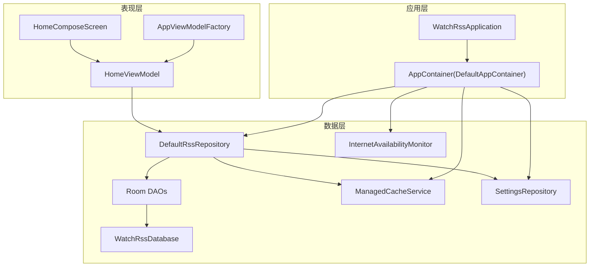
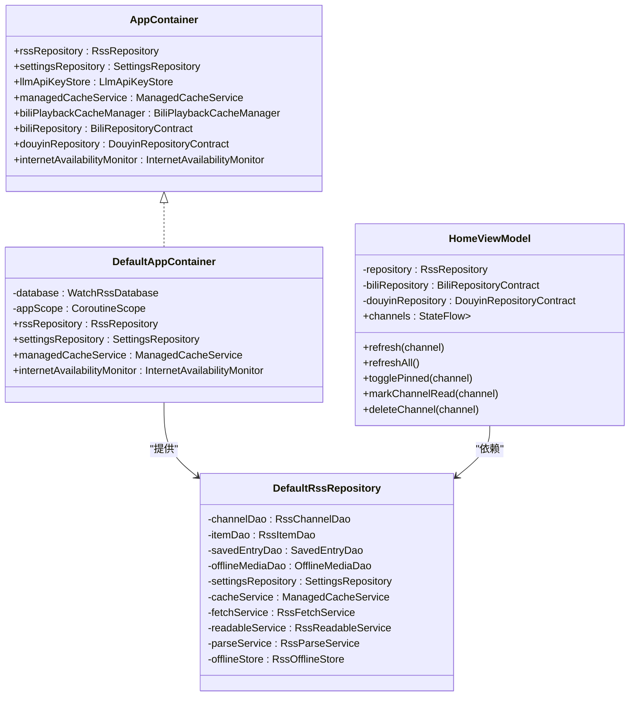
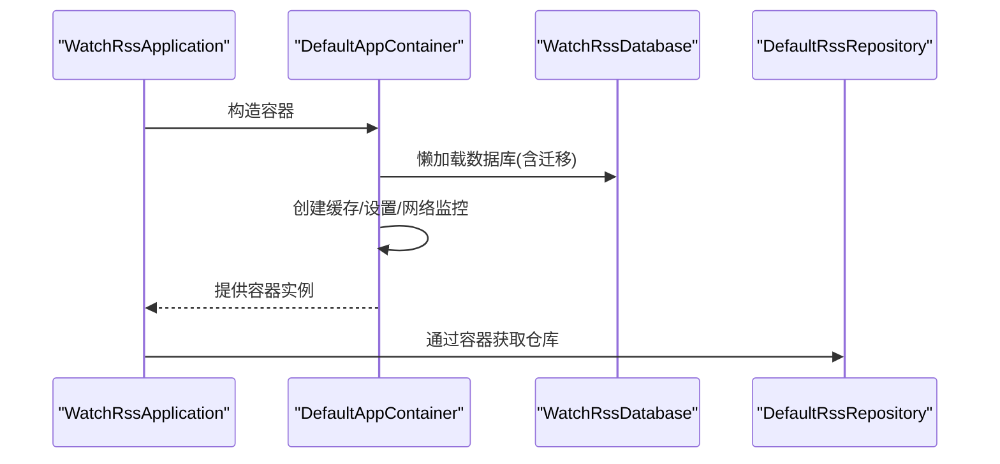
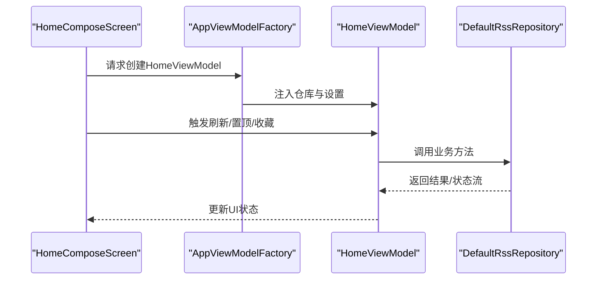
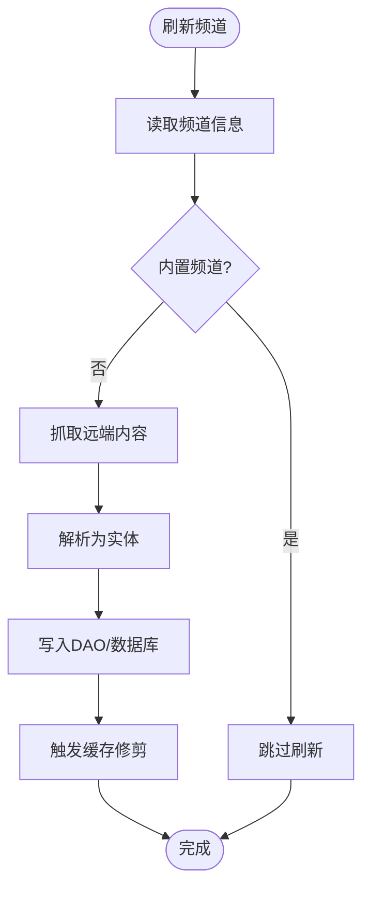
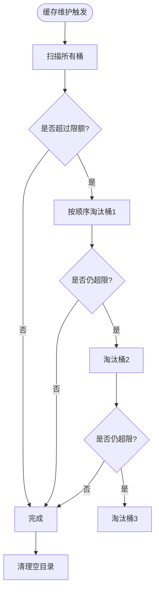
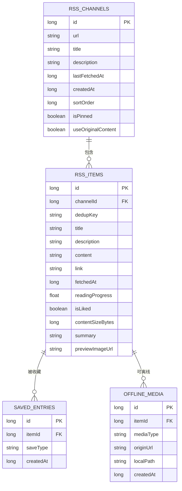
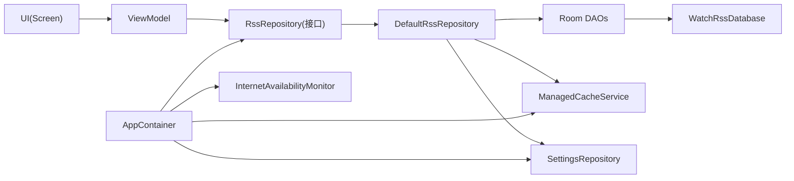

# 整体架构概览

<cite>
**本文档引用的文件**
- [README.md](file://README.md)
- [WatchRssApplication.kt](file://app/src/main/java/com/lightningstudio/watchrss/WatchRssApplication.kt)
- [AppContainer.kt](file://app/src/main/java/com/lightningstudio/watchrss/data/AppContainer.kt)
- [TestAppContainer.kt](file://app/src/androidTest/java/com/lightningstudio/watchrss/testutil/TestAppContainer.kt)
- [ManagedCacheService.kt](file://app/src/main/java/com/lightningstudio/watchrss/data/cache/ManagedCacheService.kt)
- [WatchRssDatabase.kt](file://app/src/main/java/com/lightningstudio/watchrss/data/db/WatchRssDatabase.kt)
- [AppViewModelFactory.kt](file://app/src/main/java/com/lightningstudio/watchrss/ui/viewmodel/AppViewModelFactory.kt)
- [HomeViewModel.kt](file://app/src/main/java/com/lightningstudio/watchrss/ui/viewmodel/HomeViewModel.kt)
- [DefaultRssRepository.kt](file://app/src/main/java/com/lightningstudio/watchrss/data/rss/DefaultRssRepository.kt)
- [HomeComposeScreen.kt](file://app/src/main/java/com/lightningstudio/watchrss/ui/screen/home/HomeComposeScreen.kt)
- [SettingsRepository.kt](file://app/src/main/java/com/lightningstudio/watchrss/data/settings/SettingsRepository.kt)
- [InternetAvailabilityMonitor.kt](file://app/src/main/java/com/lightningstudio/watchrss/data/network/InternetAvailabilityMonitor.kt)
- [RssRepository.kt](file://app/src/main/java/com/lightningstudio/watchrss/data/rss/RssRepository.kt)
</cite>

## 目录
1. [简介](#简介)
2. [项目结构](#项目结构)
3. [核心组件](#核心组件)
4. [架构总览](#架构总览)
5. [详细组件分析](#详细组件分析)
6. [依赖分析](#依赖分析)
7. [性能考量](#性能考量)
8. [故障排查指南](#故障排查指南)
9. [结论](#结论)
10. [附录](#附录)

## 简介
本项目为专为可穿戴智能手表设计的“腕上RSS”应用，整合B站、抖音与通用RSS阅读功能，强调轻量化与碎片化场景下的高效内容消费。项目采用MVVM架构与分层设计，结合依赖注入中心（AppContainer）实现组件解耦，并通过Room数据库、DataStore与协程流实现稳定的数据持久化与状态管理。

## 项目结构
项目采用按功能域分层的组织方式：
- 应用入口与全局容器：Application、AppContainer
- 数据层：Repository、DAO、数据库、缓存与设置
- 表现层：Compose UI、ViewModel、工厂类
- 网络与平台：网络可用性监控、SDK封装（B站/抖音）

图表来源
- [WatchRssApplication.kt:15-46](file://app/src/main/java/com/lightningstudio/watchrss/WatchRssApplication.kt#L15-L46)
- [AppContainer.kt:40-124](file://app/src/main/java/com/lightningstudio/watchrss/data/AppContainer.kt#L40-L124)
- [AppViewModelFactory.kt:9-68](file://app/src/main/java/com/lightningstudio/watchrss/ui/viewmodel/AppViewModelFactory.kt#L9-L68)
- [HomeViewModel.kt:22-114](file://app/src/main/java/com/lightningstudio/watchrss/ui/viewmodel/HomeViewModel.kt#L22-L114)
- [DefaultRssRepository.kt:32-44](file://app/src/main/java/com/lightningstudio/watchrss/data/rss/DefaultRssRepository.kt#L32-L44)
- [WatchRssDatabase.kt:9-25](file://app/src/main/java/com/lightningstudio/watchrss/data/db/WatchRssDatabase.kt#L9-L25)
- [ManagedCacheService.kt:47-71](file://app/src/main/java/com/lightningstudio/watchrss/data/cache/ManagedCacheService.kt#L47-L71)
- [SettingsRepository.kt:38-74](file://app/src/main/java/com/lightningstudio/watchrss/data/settings/SettingsRepository.kt#L38-L74)
- [InternetAvailabilityMonitor.kt:19-89](file://app/src/main/java/com/lightningstudio/watchrss/data/network/InternetAvailabilityMonitor.kt#L19-L89)

章节来源
- [README.md:1-40](file://README.md#L1-L40)
- [WatchRssApplication.kt:15-46](file://app/src/main/java/com/lightningstudio/watchrss/WatchRssApplication.kt#L15-L46)
- [AppContainer.kt:40-124](file://app/src/main/java/com/lightningstudio/watchrss/data/AppContainer.kt#L40-L124)

## 核心组件
- 应用容器（AppContainer）：集中管理Repository、缓存、设置、网络监控等服务实例，提供统一依赖注入入口。
- 数据仓库（DefaultRssRepository）：封装RSS频道、条目、离线媒体、收藏等业务逻辑，协调DAO与服务。
- 视图模型（HomeViewModel）：暴露UI所需的状态流与交互方法，协调仓库与设置。
- 缓存服务（ManagedCacheService）：多桶式缓存管理与维护，自动清理与限额控制。
- 数据库（WatchRssDatabase + Room DAOs）：持久化RSS频道、条目、收藏与离线媒体。
- 设置仓库（SettingsRepository）：基于DataStore的偏好存储与流式读写。
- 网络监控（InternetAvailabilityMonitor）：基于ConnectivityManager的网络可用性流。

章节来源
- [AppContainer.kt:29-38](file://app/src/main/java/com/lightningstudio/watchrss/data/AppContainer.kt#L29-L38)
- [DefaultRssRepository.kt:32-44](file://app/src/main/java/com/lightningstudio/watchrss/data/rss/DefaultRssRepository.kt#L32-L44)
- [HomeViewModel.kt:22-114](file://app/src/main/java/com/lightningstudio/watchrss/ui/viewmodel/HomeViewModel.kt#L22-L114)
- [ManagedCacheService.kt:47-95](file://app/src/main/java/com/lightningstudio/watchrss/data/cache/ManagedCacheService.kt#L47-L95)
- [WatchRssDatabase.kt:9-25](file://app/src/main/java/com/lightningstudio/watchrss/data/db/WatchRssDatabase.kt#L9-L25)
- [SettingsRepository.kt:38-74](file://app/src/main/java/com/lightningstudio/watchrss/data/settings/SettingsRepository.kt#L38-L74)
- [InternetAvailabilityMonitor.kt:19-89](file://app/src/main/java/com/lightningstudio/watchrss/data/network/InternetAvailabilityMonitor.kt#L19-L89)

## 架构总览
本项目采用MVVM与分层架构：
- 表现层（UI + ViewModel）：负责用户交互与状态展示，通过工厂类注入仓库与设置。
- 领域层（Repository）：封装业务规则与数据编排，协调DAO、缓存与外部服务。
- 基础设施层（Database + Cache + Settings + Network Monitor）：提供数据持久化、缓存与平台能力。

图表来源
- [AppContainer.kt:29-38](file://app/src/main/java/com/lightningstudio/watchrss/data/AppContainer.kt#L29-L38)
- [AppContainer.kt:40-124](file://app/src/main/java/com/lightningstudio/watchrss/data/AppContainer.kt#L40-L124)
- [DefaultRssRepository.kt:32-44](file://app/src/main/java/com/lightningstudio/watchrss/data/rss/DefaultRssRepository.kt#L32-L44)
- [HomeViewModel.kt:22-114](file://app/src/main/java/com/lightningstudio/watchrss/ui/viewmodel/HomeViewModel.kt#L22-L114)

## 详细组件分析

### 应用容器（AppContainer）与依赖注入
- 统一注册：在DefaultAppContainer中集中创建并缓存数据库、缓存服务、仓库与监控器。
- 解耦策略：通过接口隔离具体实现，便于测试替换（TestAppContainer）。
- 生命周期：使用独立的IO协程作用域与SupervisorJob，确保后台任务稳定运行。

图表来源
- [WatchRssApplication.kt:15-46](file://app/src/main/java/com/lightningstudio/watchrss/WatchRssApplication.kt#L15-L46)
- [AppContainer.kt:40-124](file://app/src/main/java/com/lightningstudio/watchrss/data/AppContainer.kt#L40-L124)
- [WatchRssDatabase.kt:26-114](file://app/src/main/java/com/lightningstudio/watchrss/data/db/WatchRssDatabase.kt#L26-L114)

章节来源
- [AppContainer.kt:40-124](file://app/src/main/java/com/lightningstudio/watchrss/data/AppContainer.kt#L40-L124)
- [TestAppContainer.kt:21-48](file://app/src/androidTest/java/com/lightningstudio/watchrss/testutil/TestAppContainer.kt#L21-L48)

### MVVM与视图模型工厂
- 工厂注入：AppViewModelFactory根据ViewModel类型注入对应仓库与设置。
- HomeViewModel：负责频道列表、刷新、置顶、收藏、离线等操作的状态与命令。
- 状态流：使用StateFlow与stateIn共享状态，避免UI重复订阅。

图表来源
- [AppViewModelFactory.kt:9-68](file://app/src/main/java/com/lightningstudio/watchrss/ui/viewmodel/AppViewModelFactory.kt#L9-L68)
- [HomeViewModel.kt:22-114](file://app/src/main/java/com/lightningstudio/watchrss/ui/viewmodel/HomeViewModel.kt#L22-L114)
- [DefaultRssRepository.kt:32-44](file://app/src/main/java/com/lightningstudio/watchrss/data/rss/DefaultRssRepository.kt#L32-L44)

章节来源
- [AppViewModelFactory.kt:9-68](file://app/src/main/java/com/lightningstudio/watchrss/ui/viewmodel/AppViewModelFactory.kt#L9-L68)
- [HomeViewModel.kt:22-114](file://app/src/main/java/com/lightningstudio/watchrss/ui/viewmodel/HomeViewModel.kt#L22-L114)

### 数据仓库与数据流
- 仓库职责：频道/条目的增删改查、预览生成、原始内容抓取、离线媒体下载、收藏与点赞等。
- 数据流：结合Room DAO与协程Flow，实现响应式数据更新；通过预览格式化与缓存修剪保障性能。
- 缓存联动：仓库调用缓存服务进行限额维护与桶级清理。

图表来源
- [DefaultRssRepository.kt:312-405](file://app/src/main/java/com/lightningstudio/watchrss/data/rss/DefaultRssRepository.kt#L312-L405)
- [ManagedCacheService.kt:88-165](file://app/src/main/java/com/lightningstudio/watchrss/data/cache/ManagedCacheService.kt#L88-L165)

章节来源
- [DefaultRssRepository.kt:312-405](file://app/src/main/java/com/lightningstudio/watchrss/data/rss/DefaultRssRepository.kt#L312-L405)
- [RssRepository.kt:5-43](file://app/src/main/java/com/lightningstudio/watchrss/data/rss/RssRepository.kt#L5-L43)

### 缓存管理与离线能力
- 多桶缓存：抖音预加载、RSS图片、B站预览、RSS离线媒体四类桶，分别管理与清理。
- 维护机制：定时维护与事件触发维护（APP启动、写入、删除、设置变更、手动、登出、删除频道）。
- 清理策略：按桶淘汰最旧且非保护文件，保证限额内运行。

图表来源
- [ManagedCacheService.kt:88-165](file://app/src/main/java/com/lightningstudio/watchrss/data/cache/ManagedCacheService.kt#L88-L165)

章节来源
- [ManagedCacheService.kt:23-95](file://app/src/main/java/com/lightningstudio/watchrss/data/cache/ManagedCacheService.kt#L23-L95)

### 数据持久化与设置
- Room数据库：集中管理频道、条目、收藏、离线媒体实体与DAO。
- DataStore设置：以流式方式读写缓存限额、主题、字体、LLM配置等偏好项。
- 网络监控：基于系统ConnectivityManager监听网络可用性变化。

图表来源
- [WatchRssDatabase.kt:9-25](file://app/src/main/java/com/lightningstudio/watchrss/data/db/WatchRssDatabase.kt#L9-L25)

章节来源
- [WatchRssDatabase.kt:9-25](file://app/src/main/java/com/lightningstudio/watchrss/data/db/WatchRssDatabase.kt#L9-L25)
- [SettingsRepository.kt:38-74](file://app/src/main/java/com/lightningstudio/watchrss/data/settings/SettingsRepository.kt#L38-L74)
- [InternetAvailabilityMonitor.kt:19-89](file://app/src/main/java/com/lightningstudio/watchrss/data/network/InternetAvailabilityMonitor.kt#L19-L89)

## 依赖分析
- 容器耦合：AppContainer集中创建与提供服务，降低上层对具体实现的依赖。
- 仓库内聚：DefaultRssRepository聚合DAO与服务，形成高内聚的领域逻辑。
- UI解耦：通过工厂注入仓库，UI仅依赖抽象接口，便于单元测试与替换。

图表来源
- [AppContainer.kt:40-124](file://app/src/main/java/com/lightningstudio/watchrss/data/AppContainer.kt#L40-L124)
- [DefaultRssRepository.kt:32-44](file://app/src/main/java/com/lightningstudio/watchrss/data/rss/DefaultRssRepository.kt#L32-L44)
- [HomeViewModel.kt:22-114](file://app/src/main/java/com/lightningstudio/watchrss/ui/viewmodel/HomeViewModel.kt#L22-L114)

章节来源
- [AppContainer.kt:40-124](file://app/src/main/java/com/lightningstudio/watchrss/data/AppContainer.kt#L40-L124)
- [DefaultRssRepository.kt:32-44](file://app/src/main/java/com/lightningstudio/watchrss/data/rss/DefaultRssRepository.kt#L32-L44)

## 性能考量
- 协程与流：大量使用协程与Flow，避免阻塞主线程，提升响应速度与资源利用率。
- 缓存策略：多桶缓存与定期维护，配合限额控制，平衡存储与性能。
- 预览与原始内容：延迟生成预览与按需请求原始内容，减少首屏负载。
- 数据库索引：针对高频查询建立索引，优化分页与搜索性能。

## 故障排查指南
- 网络不可用：通过InternetAvailabilityMonitor观察状态流，确认网络回调注册与能力检测逻辑。
- 刷新失败：检查仓库的刷新流程与错误映射，关注内置频道跳过与异常捕获。
- 缓存异常：查看缓存维护日志与桶清理策略，确认限额设置与保护计数。
- 数据库迁移：核对迁移脚本与版本号，确保升级过程中数据完整性。

章节来源
- [InternetAvailabilityMonitor.kt:28-89](file://app/src/main/java/com/lightningstudio/watchrss/data/network/InternetAvailabilityMonitor.kt#L28-L89)
- [DefaultRssRepository.kt:312-405](file://app/src/main/java/com/lightningstudio/watchrss/data/rss/DefaultRssRepository.kt#L312-L405)
- [ManagedCacheService.kt:88-165](file://app/src/main/java/com/lightningstudio/watchrss/data/cache/ManagedCacheService.kt#L88-L165)
- [WatchRssDatabase.kt:26-114](file://app/src/main/java/com/lightningstudio/watchrss/data/db/WatchRssDatabase.kt#L26-L114)

## 结论
本项目通过MVVM与分层架构、统一的AppContainer依赖注入、以及完善的缓存与数据库策略，实现了可穿戴设备场景下高效、稳定的RSS与平台内容聚合体验。容器化服务注册与工厂注入有效降低了组件耦合，配合Room与DataStore提供了可靠的数据持久化基础。

## 附录
- 技术选型说明：UI采用Jetpack Compose，数据解析使用RSS-Parser，缓存与设置分别由自研缓存服务与DataStore提供。
- 测试支持：通过TestAppContainer与规则类在测试环境中替换容器与仓库，确保单元测试的可控性。

章节来源
- [README.md:28-40](file://README.md#L28-L40)
- [TestAppContainer.kt:50-66](file://app/src/androidTest/java/com/lightningstudio/watchrss/testutil/TestAppContainer.kt#L50-L66)