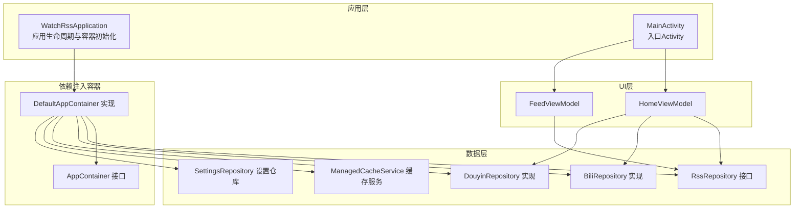
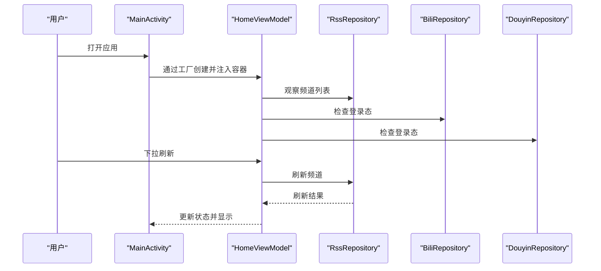
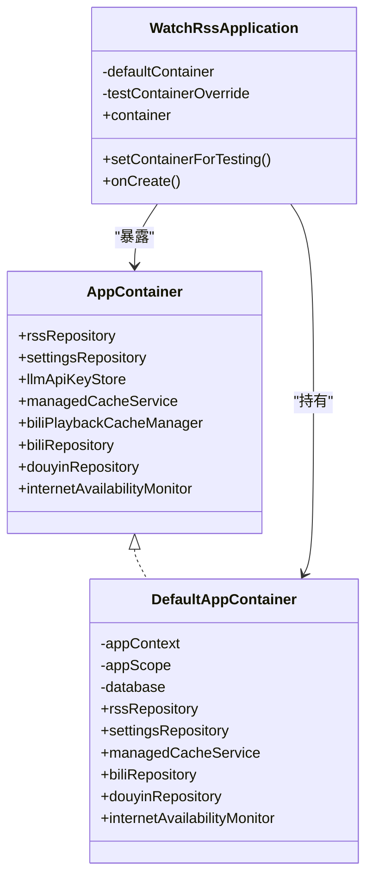
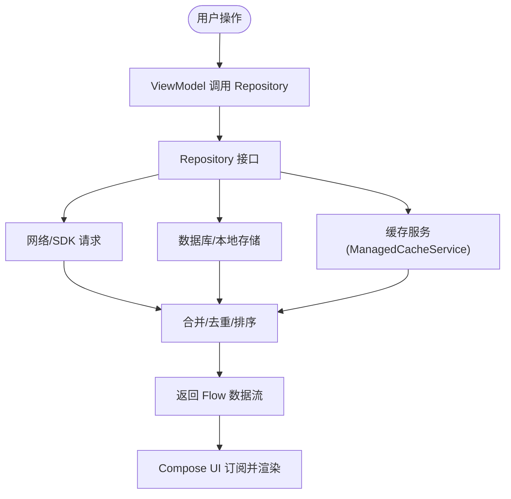
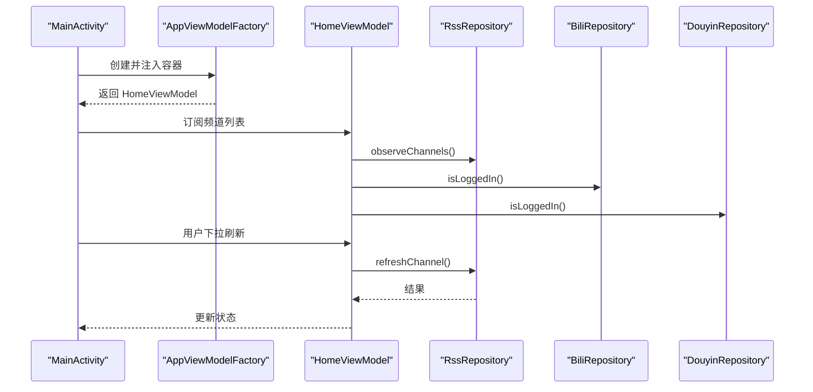
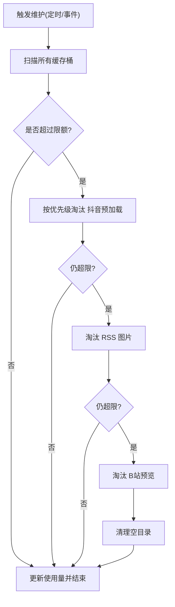
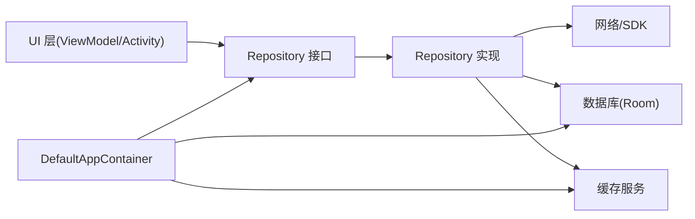
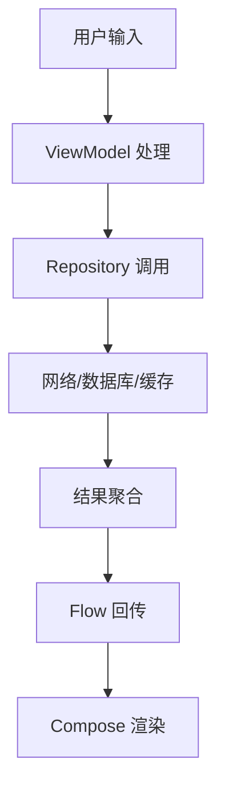

# 架构设计

<cite>
**本文引用的文件**
- [WatchRssApplication.kt](file://app/src/main/java/com/lightningstudio/watchrss/WatchRssApplication.kt)
- [AppContainer.kt](file://app/src/main/java/com/lightningstudio/watchrss/data/AppContainer.kt)
- [TestAppContainer.kt](file://app/src/androidTest/java/com/lightningstudio/watchrss/testutil/TestAppContainer.kt)
- [RssRepository.kt](file://app/src/main/java/com/lightningstudio/watchrss/data/rss/RssRepository.kt)
- [BiliRepository.kt](file://app/src/main/java/com/lightningstudio/watchrss/data/bili/BiliRepository.kt)
- [DouyinRepository.kt](file://app/src/main/java/com/lightningstudio/watchrss/data/douyin/DouyinRepository.kt)
- [ManagedCacheService.kt](file://app/src/main/java/com/lightningstudio/watchrss/data/cache/ManagedCacheService.kt)
- [HomeViewModel.kt](file://app/src/main/java/com/lightningstudio/watchrss/ui/viewmodel/HomeViewModel.kt)
- [FeedViewModel.kt](file://app/src/main/java/com/lightningstudio/watchrss/ui/viewmodel/FeedViewModel.kt)
- [MainActivity.kt](file://app/src/main/java/com/lightningstudio/watchrss/MainActivity.kt)
</cite>

## 目录
1. [引言](#引言)
2. [项目结构](#项目结构)
3. [核心组件](#核心组件)
4. [架构总览](#架构总览)
5. [详细组件分析](#详细组件分析)
6. [依赖关系分析](#依赖关系分析)
7. [性能考量](#性能考量)
8. [故障排查指南](#故障排查指南)
9. [结论](#结论)
10. [附录](#附录)

## 引言
本文件面向Android WatchRSS项目的架构设计与实现，围绕MVVM设计模式、分层架构、依赖注入系统、数据流与Repository模式、UI架构（含ViewModel职责与状态管理）、Compose组织方式等维度进行系统化说明，并给出架构决策的技术考量、权衡与约束条件。目标是帮助开发者快速理解系统边界与组件交互，指导日常开发与维护。

## 项目结构
项目采用以功能域与层次相结合的组织方式：
- 应用入口与全局容器：Application负责初始化日志与缓存维护；全局容器AppContainer统一暴露各子系统依赖。
- 数据层：按领域拆分，包含RSS、B站、抖音、设置、缓存等模块，Repository接口抽象数据访问，具体实现封装网络/存储细节。
- UI层：基于Jetpack Compose，使用ViewModel承载业务状态与交互逻辑，通过状态流驱动界面更新。
- 测试支持：提供测试专用AppContainer，便于替换真实依赖并隔离测试环境。

图表来源
- [WatchRssApplication.kt:15-46](file://app/src/main/java/com/lightningstudio/watchrss/WatchRssApplication.kt#L15-L46)
- [AppContainer.kt:29-124](file://app/src/main/java/com/lightningstudio/watchrss/data/AppContainer.kt#L29-L124)
- [MainActivity.kt:27-90](file://app/src/main/java/com/lightningstudio/watchrss/MainActivity.kt#L27-L90)
- [HomeViewModel.kt:22-44](file://app/src/main/java/com/lightningstudio/watchrss/ui/viewmodel/HomeViewModel.kt#L22-L44)
- [FeedViewModel.kt:22-46](file://app/src/main/java/com/lightningstudio/watchrss/ui/viewmodel/FeedViewModel.kt#L22-L46)

章节来源
- [WatchRssApplication.kt:15-46](file://app/src/main/java/com/lightningstudio/watchrss/WatchRssApplication.kt#L15-L46)
- [AppContainer.kt:29-124](file://app/src/main/java/com/lightningstudio/watchrss/data/AppContainer.kt#L29-L124)
- [MainActivity.kt:27-90](file://app/src/main/java/com/lightningstudio/watchrss/MainActivity.kt#L27-L90)

## 核心组件
- 应用容器与依赖注入
  - AppContainer定义了应用所需的核心依赖集合，包括RssRepository、B站/Douyin仓库、缓存服务、设置仓库等。
  - DefaultAppContainer在首次访问时惰性构建数据库、DataStore、缓存服务与各Repository实例，并配置图片加载器。
  - WatchRssApplication持有默认容器并在应用启动时触发缓存维护任务。
  - 测试场景可通过setContainerForTesting注入TestAppContainer以替换真实依赖。
- 数据层
  - RssRepository接口定义频道、条目、收藏、离线媒体等观察与操作方法。
  - BiliRepository封装B站登录态、播放源解析、预览缓存、互动状态与历史记录等。
  - DouyinRepository封装抖音Cookie管理、爬取与解析、播放头信息构造等。
  - ManagedCacheService统一管理多桶缓存（抖音预加载、RSS图片、B站预览、RSS离线），提供清理与限额维护。
- UI层
  - HomeViewModel负责首页频道列表、刷新控制、平台登录态与消息提示的状态管理。
  - FeedViewModel负责频道内条目的分页加载、刷新、原始内容请求、收藏/稍后等操作。
  - MainActivity作为入口，通过AppViewModelFactory注入容器，创建ViewModel并渲染Compose界面。

章节来源
- [AppContainer.kt:29-124](file://app/src/main/java/com/lightningstudio/watchrss/data/AppContainer.kt#L29-L124)
- [WatchRssApplication.kt:15-46](file://app/src/main/java/com/lightningstudio/watchrss/WatchRssApplication.kt#L15-L46)
- [TestAppContainer.kt:21-48](file://app/src/androidTest/java/com/lightningstudio/watchrss/testutil/TestAppContainer.kt#L21-L48)
- [RssRepository.kt:5-43](file://app/src/main/java/com/lightningstudio/watchrss/data/rss/RssRepository.kt#L5-L43)
- [BiliRepository.kt:66-108](file://app/src/main/java/com/lightningstudio/watchrss/data/bili/BiliRepository.kt#L66-L108)
- [DouyinRepository.kt:21-46](file://app/src/main/java/com/lightningstudio/watchrss/data/douyin/DouyinRepository.kt#L21-L46)
- [ManagedCacheService.kt:47-109](file://app/src/main/java/com/lightningstudio/watchrss/data/cache/ManagedCacheService.kt#L47-L109)
- [HomeViewModel.kt:22-114](file://app/src/main/java/com/lightningstudio/watchrss/ui/viewmodel/HomeViewModel.kt#L22-L114)
- [FeedViewModel.kt:22-127](file://app/src/main/java/com/lightningstudio/watchrss/ui/viewmodel/FeedViewModel.kt#L22-L127)
- [MainActivity.kt:27-90](file://app/src/main/java/com/lightningstudio/watchrss/MainActivity.kt#L27-L90)

## 架构总览
系统采用MVVM+分层+依赖注入的组合架构：
- 分层
  - 表现层：Activity/Fragment + Compose + ViewModel
  - 领域层：Repository接口与实现
  - 基础设施层：数据库(Room)、网络(OkHttp/SDK)、缓存(ManagedCacheService)、设置(DataStore)
- 依赖注入
  - AppContainer集中声明依赖契约，DefaultAppContainer提供生产实现；测试可注入TestAppContainer替换部分实现。
- 数据流
  - 用户交互触发ViewModel方法，ViewModel调用Repository接口，Repository内部协调网络/数据库/缓存，最终通过Flow回传UI。

图表来源
- [MainActivity.kt:27-90](file://app/src/main/java/com/lightningstudio/watchrss/MainActivity.kt#L27-L90)
- [HomeViewModel.kt:22-84](file://app/src/main/java/com/lightningstudio/watchrss/ui/viewmodel/HomeViewModel.kt#L22-L84)
- [RssRepository.kt:5-43](file://app/src/main/java/com/lightningstudio/watchrss/data/rss/RssRepository.kt#L5-L43)
- [BiliRepository.kt:85-88](file://app/src/main/java/com/lightningstudio/watchrss/data/bili/BiliRepository.kt#L85-L88)
- [DouyinRepository.kt:30-31](file://app/src/main/java/com/lightningstudio/watchrss/data/douyin/DouyinRepository.kt#L30-L31)

## 详细组件分析

### 应用容器与依赖注入系统
- 设计要点
  - AppContainer以接口形式暴露所有跨模块共享依赖，避免上层直接感知具体实现。
  - DefaultAppContainer在首次访问时构建Room数据库、DataStore、缓存服务与各Repository，确保延迟与单例特性。
  - WatchRssApplication在onCreate中初始化日志与调试开关，并调度缓存维护任务。
  - 测试通过setContainerForTesting注入TestAppContainer，可替换B站/Douyin仓库、网络监控等依赖。
- 解耦与可测性
  - 通过接口隔离具体实现，便于单元测试与集成测试替换依赖。
  - 容器对外仅暴露契约，内部实现细节对上层不可见。

图表来源
- [AppContainer.kt:29-124](file://app/src/main/java/com/lightningstudio/watchrss/data/AppContainer.kt#L29-L124)
- [WatchRssApplication.kt:15-46](file://app/src/main/java/com/lightningstudio/watchrss/WatchRssApplication.kt#L15-L46)
- [TestAppContainer.kt:21-48](file://app/src/androidTest/java/com/lightningstudio/watchrss/testutil/TestAppContainer.kt#L21-L48)

章节来源
- [AppContainer.kt:29-124](file://app/src/main/java/com/lightningstudio/watchrss/data/AppContainer.kt#L29-L124)
- [WatchRssApplication.kt:15-46](file://app/src/main/java/com/lightningstudio/watchrss/WatchRssApplication.kt#L15-L46)
- [TestAppContainer.kt:21-48](file://app/src/androidTest/java/com/lightningstudio/watchrss/testutil/TestAppContainer.kt#L21-L48)

### 数据流架构与Repository模式
- Repository职责
  - RssRepository：统一暴露频道/条目/收藏/离线媒体的观察与操作接口，屏蔽底层数据源差异。
  - BiliRepository：封装B站登录态、播放源解析、预览缓存、互动状态与历史记录，提供幂等与缓存策略。
  - DouyinRepository：封装抖音Cookie管理、爬取与解析、播放头信息构造，提供错误码与状态转换。
- 数据流路径
  - 用户交互 → ViewModel → Repository接口 → 具体实现（网络/数据库/缓存） → Flow回传UI。
  - 离线与缓存：通过ManagedCacheService统一管理，支持按桶清理与限额维护。
- 统一接口的优势
  - UI无需关心数据来源（网络/本地/离线），只需订阅Flow即可获得最新状态。
  - Repository内部可灵活组合缓存、网络与数据库，保证一致性与性能。

图表来源
- [RssRepository.kt:5-43](file://app/src/main/java/com/lightningstudio/watchrss/data/rss/RssRepository.kt#L5-L43)
- [BiliRepository.kt:136-146](file://app/src/main/java/com/lightningstudio/watchrss/data/bili/BiliRepository.kt#L136-L146)
- [DouyinRepository.kt:66-88](file://app/src/main/java/com/lightningstudio/watchrss/data/douyin/DouyinRepository.kt#L66-L88)
- [ManagedCacheService.kt:79-95](file://app/src/main/java/com/lightningstudio/watchrss/data/cache/ManagedCacheService.kt#L79-L95)

章节来源
- [RssRepository.kt:5-43](file://app/src/main/java/com/lightningstudio/watchrss/data/rss/RssRepository.kt#L5-L43)
- [BiliRepository.kt:136-146](file://app/src/main/java/com/lightningstudio/watchrss/data/bili/BiliRepository.kt#L136-L146)
- [DouyinRepository.kt:66-88](file://app/src/main/java/com/lightningstudio/watchrss/data/douyin/DouyinRepository.kt#L66-L88)
- [ManagedCacheService.kt:79-95](file://app/src/main/java/com/lightningstudio/watchrss/data/cache/ManagedCacheService.kt#L79-L95)

### UI架构与ViewModel设计
- HomeViewModel
  - 负责首页频道列表观察、刷新控制、平台登录态检查、消息提示与频道操作（置顶、置顶切换、标记已读、删除）。
  - 使用stateIn与WhileSubscribed策略，确保订阅生命周期友好与内存安全。
- FeedViewModel
  - 负责频道内条目分页加载、刷新、原始内容请求、收藏/稍后切换、消息提示。
  - 通过flatMapLatest动态调整可见数量，结合combine计算“是否还有更多”。
- MainActivity
  - 通过AppViewModelFactory注入容器，创建HomeViewModel并渲染HomeComposeScreen。
  - 处理OOBE引导、启动恢复、系统栏与手势等。

图表来源
- [MainActivity.kt:27-90](file://app/src/main/java/com/lightningstudio/watchrss/MainActivity.kt#L27-L90)
- [HomeViewModel.kt:22-84](file://app/src/main/java/com/lightningstudio/watchrss/ui/viewmodel/HomeViewModel.kt#L22-L84)
- [RssRepository.kt:5-43](file://app/src/main/java/com/lightningstudio/watchrss/data/rss/RssRepository.kt#L5-L43)
- [BiliRepository.kt:85-88](file://app/src/main/java/com/lightningstudio/watchrss/data/bili/BiliRepository.kt#L85-L88)
- [DouyinRepository.kt:30-31](file://app/src/main/java/com/lightningstudio/watchrss/data/douyin/DouyinRepository.kt#L30-L31)

章节来源
- [HomeViewModel.kt:22-114](file://app/src/main/java/com/lightningstudio/watchrss/ui/viewmodel/HomeViewModel.kt#L22-L114)
- [FeedViewModel.kt:22-127](file://app/src/main/java/com/lightningstudio/watchrss/ui/viewmodel/FeedViewModel.kt#L22-L127)
- [MainActivity.kt:27-90](file://app/src/main/java/com/lightningstudio/watchrss/MainActivity.kt#L27-L90)

### 缓存与离线能力
- 缓存桶与维护策略
  - 支持抖音预加载、RSS图片、B站预览、RSS离线四类缓存桶。
  - 通过定时维护与事件触发（写入/删除/设置变更/登出/删除频道）进行清理。
  - 清理时按优先级逐桶淘汰，保留最小保护数量，最后清理空目录。
- 性能与可靠性
  - 预览缓存与播放源解析缓存减少重复网络请求。
  - 离线媒体与图片缓存提升弱网与无网场景体验。

图表来源
- [ManagedCacheService.kt:88-165](file://app/src/main/java/com/lightningstudio/watchrss/data/cache/ManagedCacheService.kt#L88-L165)

章节来源
- [ManagedCacheService.kt:23-109](file://app/src/main/java/com/lightningstudio/watchrss/data/cache/ManagedCacheService.kt#L23-L109)

## 依赖关系分析
- 组件耦合与内聚
  - 上层UI仅依赖Repository接口，降低对具体实现的耦合。
  - AppContainer集中管理依赖，提高内聚性与可替换性。
- 外部依赖与集成点
  - Room数据库迁移版本明确，避免升级风险。
  - OkHttp用于下载预览片段，配合缓存服务与临时文件处理。
  - DataStore用于设置与本地偏好存储，保障线程安全与序列化。
- 循环依赖规避
  - 通过接口与工厂注入避免循环引用；容器仅暴露契约，不反向依赖UI。

图表来源
- [AppContainer.kt:40-123](file://app/src/main/java/com/lightningstudio/watchrss/data/AppContainer.kt#L40-L123)
- [HomeViewModel.kt:22-26](file://app/src/main/java/com/lightningstudio/watchrss/ui/viewmodel/HomeViewModel.kt#L22-L26)
- [FeedViewModel.kt:22-25](file://app/src/main/java/com/lightningstudio/watchrss/ui/viewmodel/FeedViewModel.kt#L22-L25)

章节来源
- [AppContainer.kt:40-123](file://app/src/main/java/com/lightningstudio/watchrss/data/AppContainer.kt#L40-L123)
- [HomeViewModel.kt:22-26](file://app/src/main/java/com/lightningstudio/watchrss/ui/viewmodel/HomeViewModel.kt#L22-L26)
- [FeedViewModel.kt:22-25](file://app/src/main/java/com/lightningstudio/watchrss/ui/viewmodel/FeedViewModel.kt#L22-L25)

## 性能考量
- 协程与背压
  - ViewModel使用stateIn与WhileSubscribed策略，避免过度订阅与内存泄漏。
  - FeedViewModel通过flatMapLatest动态调整可见数量，减少一次性加载压力。
- 缓存与离线
  - 预览缓存与播放源解析缓存显著降低重复请求。
  - 离线媒体与图片缓存提升弱网/无网体验。
- IO与调度
  - 缓存维护与网络请求均在IO调度器执行，避免阻塞主线程。
- 可观测性
  - FeedViewModel对刷新过程进行性能追踪，便于定位瓶颈。

章节来源
- [HomeViewModel.kt:27-44](file://app/src/main/java/com/lightningstudio/watchrss/ui/viewmodel/HomeViewModel.kt#L27-L44)
- [FeedViewModel.kt:33-46](file://app/src/main/java/com/lightningstudio/watchrss/ui/viewmodel/FeedViewModel.kt#L33-L46)
- [ManagedCacheService.kt:79-95](file://app/src/main/java/com/lightningstudio/watchrss/data/cache/ManagedCacheService.kt#L79-L95)

## 故障排查指南
- 登录态问题
  - B站/Douyin登录态检查与错误提示需结合仓库返回的错误码与消息。
- 缓存异常
  - 若出现缓存占用异常或无法清理，检查缓存维护任务是否被取消或阻塞。
  - 清理后确认usageBytes是否正确更新。
- 网络请求失败
  - 查看仓库方法中的错误码映射与异常分支，确认是否为Cookie失效、解析失败或网络异常。
- UI无响应
  - 检查ViewModel是否正确订阅Flow，确认stateIn的SharingStarted参数与生命周期匹配。

章节来源
- [BiliRepository.kt:128-134](file://app/src/main/java/com/lightningstudio/watchrss/data/bili/BiliRepository.kt#L128-L134)
- [DouyinRepository.kt:66-88](file://app/src/main/java/com/lightningstudio/watchrss/data/douyin/DouyinRepository.kt#L66-L88)
- [ManagedCacheService.kt:88-109](file://app/src/main/java/com/lightningstudio/watchrss/data/cache/ManagedCacheService.kt#L88-L109)

## 结论
本项目通过MVVM+分层+依赖注入的架构，实现了清晰的职责分离与良好的可测试性。AppContainer集中管理依赖，Repository统一抽象数据访问，ViewModel专注状态与交互，Compose负责高效渲染。配合统一的缓存与离线策略，系统在性能、稳定性与用户体验方面取得平衡。建议在后续迭代中持续完善错误码体系与可观测性埋点，进一步提升可维护性。

## 附录
- 关键流程图（概念示意）
