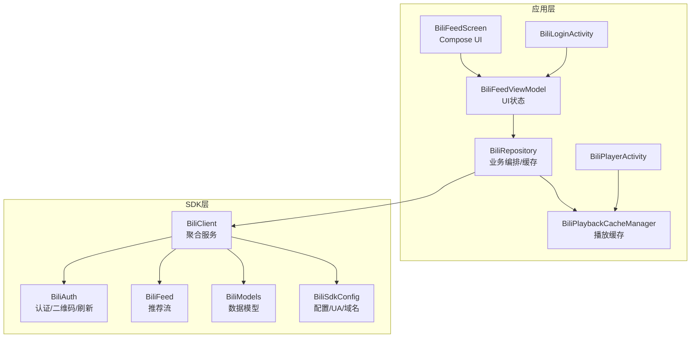
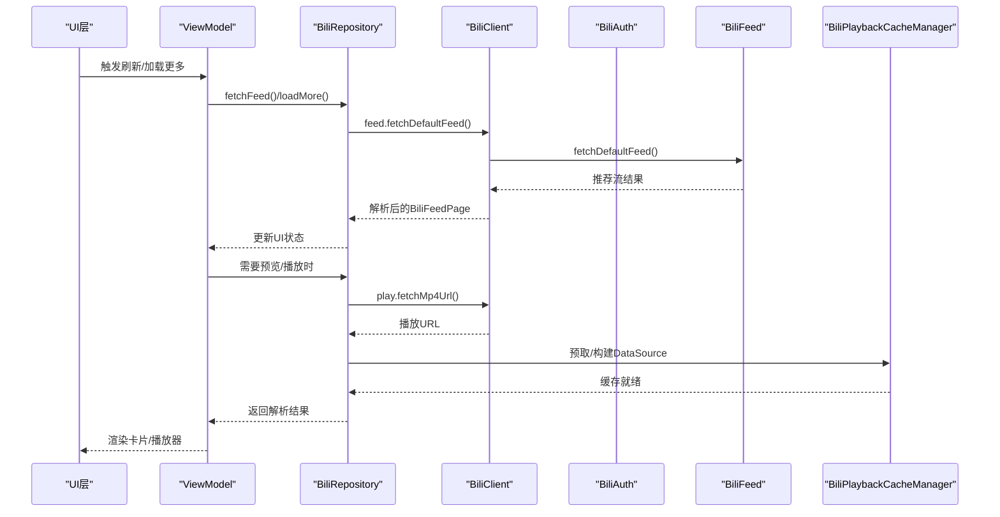
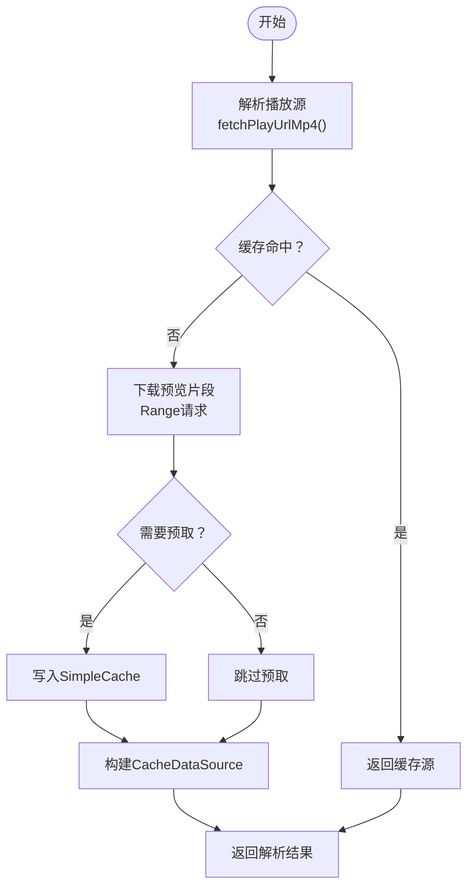
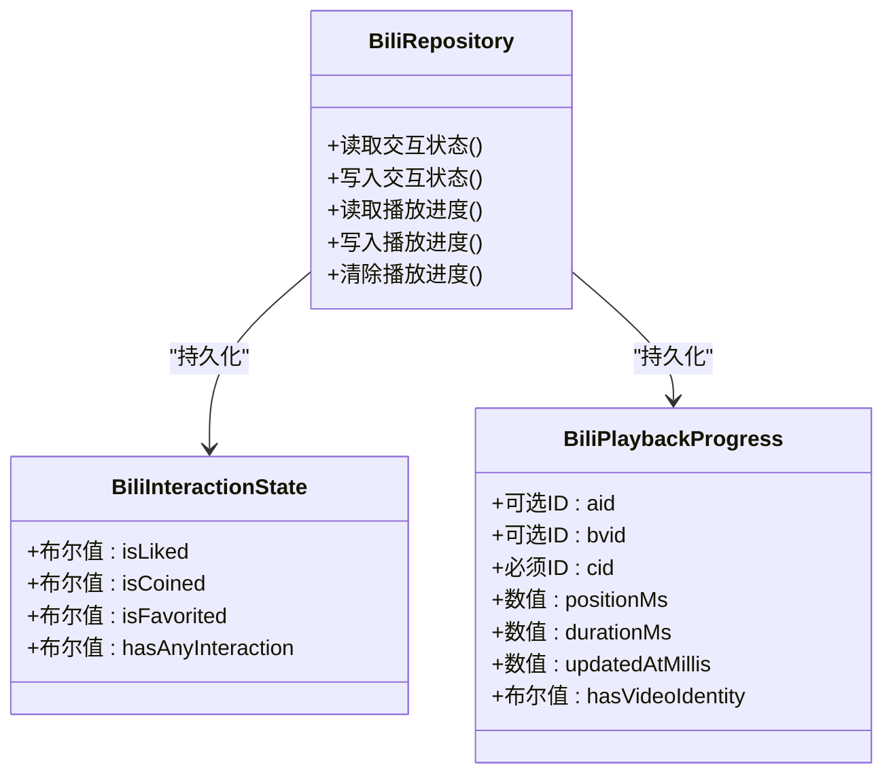
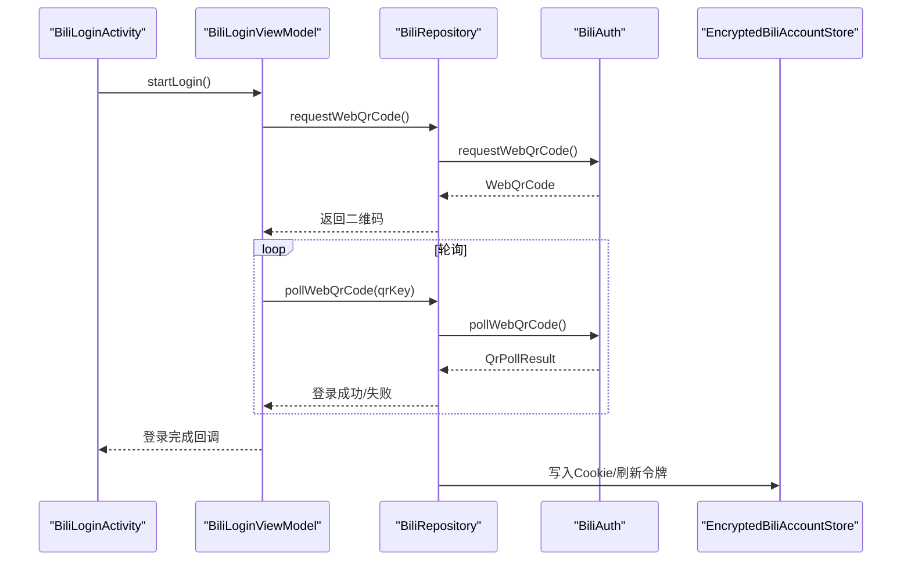
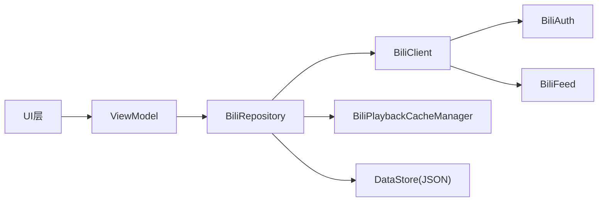

# B站轻量化浏览模块

<cite>
**本文档引用的文件**
- [BiliClient.kt](file://sdk/bili/src/main/java/com/lightningstudio/watchrss/sdk/bili/BiliClient.kt)
- [BiliAuth.kt](file://sdk/bili/src/main/java/com/lightningstudio/watchrss/sdk/bili/BiliAuth.kt)
- [BiliSdkConfig.kt](file://sdk/bili/src/main/java/com/lightningstudio/watchrss/sdk/bili/BiliSdkConfig.kt)
- [BiliFeed.kt](file://sdk/bili/src/main/java/com/lightningstudio/watchrss/sdk/bili/BiliFeed.kt)
- [BiliModels.kt](file://sdk/bili/src/main/java/com/lightningstudio/watchrss/sdk/bili/BiliModels.kt)
- [BiliRepository.kt](file://app/src/main/java/com/lightningstudio/watchrss/data/bili/BiliRepository.kt)
- [BiliPlaybackCacheManager.kt](file://app/src/main/java/com/lightningstudio/watchrss/data/bili/BiliPlaybackCacheManager.kt)
- [BiliInteractionState.kt](file://app/src/main/java/com/lightningstudio/watchrss/data/bili/BiliInteractionState.kt)
- [BiliPlaybackProgress.kt](file://app/src/main/java/com/lightningstudio/watchrss/data/bili/BiliPlaybackProgress.kt)
- [BiliFeedScreen.kt](file://app/src/main/java/com/lightningstudio/watchrss/ui/screen/bili/BiliFeedScreen.kt)
- [BiliFeedViewModel.kt](file://app/src/main/java/com/lightningstudio/watchrss/ui/viewmodel/BiliFeedViewModel.kt)
- [BiliLoginActivity.kt](file://app/src/main/java/com/lightningstudio/watchrss/BiliLoginActivity.kt)
- [BiliPlayerActivity.kt](file://app/src/main/java/com/lightningstudio/watchrss/BiliPlayerActivity.kt)
</cite>

## 目录
1. [简介](#简介)
2. [项目结构](#项目结构)
3. [核心组件](#核心组件)
4. [架构总览](#架构总览)
5. [详细组件分析](#详细组件分析)
6. [依赖关系分析](#依赖关系分析)
7. [性能考量](#性能考量)
8. [故障排查指南](#故障排查指南)
9. [结论](#结论)
10. [附录](#附录)

## 简介
本模块面向Android手表端，提供轻量化的B站内容浏览体验。其设计理念是在资源受限的可穿戴设备上，通过精简的数据流、本地缓存与预取策略、以及UI层面的轻量化交互，实现流畅的内容发现、播放与互动。重点能力包括：
- 动态预览：基于播放URL解析与分段下载，生成短时长预览片段，降低首帧等待时间
- 播放源解析与缓存：对播放地址进行解析与本地缓存，支持Media3 DataSource与LRU淘汰
- 用户交互状态管理：本地持久化点赞/投币/收藏状态与播放进度，保证离线可用性
- 认证与Cookie管理：提供二维码登录、Cookie刷新与安全存储方案
- 收藏夹同步：拉取默认收藏夹与收藏项列表，支持收藏/取消收藏
- 错误处理与日志：统一的状态码映射与调试日志输出

## 项目结构
模块由两部分组成：
- SDK层（sdk/bili）：封装B站API调用、认证、签名、请求与响应解析
- 应用层（app/data + app/ui）：业务编排、本地缓存、UI状态与用户交互

图表来源
- [BiliRepository.kt:66-1116](file://app/src/main/java/com/lightningstudio/watchrss/data/bili/BiliRepository.kt#L66-L1116)
- [BiliClient.kt:3-19](file://sdk/bili/src/main/java/com/lightningstudio/watchrss/sdk/bili/BiliClient.kt#L3-L19)
- [BiliAuth.kt:13-406](file://sdk/bili/src/main/java/com/lightningstudio/watchrss/sdk/bili/BiliAuth.kt#L13-L406)
- [BiliFeed.kt:5-81](file://sdk/bili/src/main/java/com/lightningstudio/watchrss/sdk/bili/BiliFeed.kt#L5-L81)
- [BiliModels.kt:1-60](file://sdk/bili/src/main/java/com/lightningstudio/watchrss/sdk/bili/BiliModels.kt#L1-L60)
- [BiliSdkConfig.kt:3-35](file://sdk/bili/src/main/java/com/lightningstudio/watchrss/sdk/bili/BiliSdkConfig.kt#L3-L35)

章节来源
- [BiliRepository.kt:66-1116](file://app/src/main/java/com/lightningstudio/watchrss/data/bili/BiliRepository.kt#L66-L1116)
- [BiliClient.kt:3-19](file://sdk/bili/src/main/java/com/lightningstudio/watchrss/sdk/bili/BiliClient.kt#L3-L19)
- [BiliAuth.kt:13-406](file://sdk/bili/src/main/java/com/lightningstudio/watchrss/sdk/bili/BiliAuth.kt#L13-L406)
- [BiliFeed.kt:5-81](file://sdk/bili/src/main/java/com/lightningstudio/watchrss/sdk/bili/BiliFeed.kt#L5-L81)
- [BiliModels.kt:1-60](file://sdk/bili/src/main/java/com/lightningstudio/watchrss/sdk/bili/BiliModels.kt#L1-L60)
- [BiliSdkConfig.kt:3-35](file://sdk/bili/src/main/java/com/lightningstudio/watchrss/sdk/bili/BiliSdkConfig.kt#L3-L35)

## 核心组件
- BiliClient：聚合认证、推荐流、视频详情、播放、互动、历史、收藏、搜索、评论等服务
- BiliAuth：二维码登录、轮询、Cookie刷新与确认、浏览器配置注入
- BiliRepository：应用层业务编排，负责缓存、预览、播放源解析、交互状态与播放进度持久化
- BiliPlaybackCacheManager：基于Media3的播放缓存，支持预取与LRU淘汰
- UI层：BiliFeedScreen与BiliFeedViewModel负责推荐流展示与用户交互；BiliLoginActivity与BiliPlayerActivity分别承载登录与播放场景

章节来源
- [BiliClient.kt:3-19](file://sdk/bili/src/main/java/com/lightningstudio/watchrss/sdk/bili/BiliClient.kt#L3-L19)
- [BiliAuth.kt:13-406](file://sdk/bili/src/main/java/com/lightningstudio/watchrss/sdk/bili/BiliAuth.kt#L13-L406)
- [BiliRepository.kt:66-1116](file://app/src/main/java/com/lightningstudio/watchrss/data/bili/BiliRepository.kt#L66-L1116)
- [BiliPlaybackCacheManager.kt:20-154](file://app/src/main/java/com/lightningstudio/watchrss/data/bili/BiliPlaybackCacheManager.kt#L20-L154)
- [BiliFeedScreen.kt:71-578](file://app/src/main/java/com/lightningstudio/watchrss/ui/screen/bili/BiliFeedScreen.kt#L71-L578)
- [BiliFeedViewModel.kt:31-257](file://app/src/main/java/com/lightningstudio/watchrss/ui/viewmodel/BiliFeedViewModel.kt#L31-L257)
- [BiliLoginActivity.kt:20-67](file://app/src/main/java/com/lightningstudio/watchrss/BiliLoginActivity.kt#L20-L67)
- [BiliPlayerActivity.kt:18-112](file://app/src/main/java/com/lightningstudio/watchrss/BiliPlayerActivity.kt#L18-L112)

## 架构总览
模块采用“SDK层API封装 + 应用层业务编排”的分层设计。UI通过ViewModel驱动Repository，Repository通过BiliClient访问SDK服务，并结合本地缓存与预取策略提升性能。

图表来源
- [BiliFeedViewModel.kt:52-141](file://app/src/main/java/com/lightningstudio/watchrss/ui/viewmodel/BiliFeedViewModel.kt#L52-L141)
- [BiliRepository.kt:136-146](file://app/src/main/java/com/lightningstudio/watchrss/data/bili/BiliRepository.kt#L136-L146)
- [BiliFeed.kt:38-40](file://sdk/bili/src/main/java/com/lightningstudio/watchrss/sdk/bili/BiliFeed.kt#L38-L40)
- [BiliPlaybackCacheManager.kt:35-59](file://app/src/main/java/com/lightningstudio/watchrss/data/bili/BiliPlaybackCacheManager.kt#L35-L59)

## 详细组件分析

### 动态预览与播放源解析
- 播放源解析：Repository根据aid/bvid/cid与qn解析播放URL，提取首个durl的url与质量，构建BiliResolvedPlaybackSource
- 预览缓存策略：按视频标识与清晰度生成缓存键，估算预览字节数，使用OkHttp Range请求下载指定长度的片段
- 播放缓存：通过BiliPlaybackCacheManager构建CacheDataSource，配合SimpleCache与LRU淘汰，支持预取与命中
- 首帧优化：在详情页预热预览，缩短首次播放等待时间

图表来源
- [BiliRepository.kt:329-426](file://app/src/main/java/com/lightningstudio/watchrss/data/bili/BiliRepository.kt#L329-L426)
- [BiliRepository.kt:605-700](file://app/src/main/java/com/lightningstudio/watchrss/data/bili/BiliRepository.kt#L605-L700)
- [BiliPlaybackCacheManager.kt:61-91](file://app/src/main/java/com/lightningstudio/watchrss/data/bili/BiliPlaybackCacheManager.kt#L61-L91)
- [BiliPlaybackCacheManager.kt:106-119](file://app/src/main/java/com/lightningstudio/watchrss/data/bili/BiliPlaybackCacheManager.kt#L106-L119)

章节来源
- [BiliRepository.kt:315-426](file://app/src/main/java/com/lightningstudio/watchrss/data/bili/BiliRepository.kt#L315-L426)
- [BiliRepository.kt:594-700](file://app/src/main/java/com/lightningstudio/watchrss/data/bili/BiliRepository.kt#L594-L700)
- [BiliPlaybackCacheManager.kt:20-154](file://app/src/main/java/com/lightningstudio/watchrss/data/bili/BiliPlaybackCacheManager.kt#L20-L154)

### 用户交互状态管理
- 交互状态：本地持久化点赞/投币/收藏状态，支持按aid/bvid查找与更新，限制条目数量
- 播放进度：按cid维度记录位置与总时长，支持按视频唯一标识查询最新进度
- 同步策略：收藏/稍后再看成功后同步到外部RSS保存系统，并触发预览缓存或清理

图表来源
- [BiliInteractionState.kt:6-13](file://app/src/main/java/com/lightningstudio/watchrss/data/bili/BiliInteractionState.kt#L6-L13)
- [BiliPlaybackProgress.kt:6-16](file://app/src/main/java/com/lightningstudio/watchrss/data/bili/BiliPlaybackProgress.kt#L6-L16)
- [BiliRepository.kt:219-313](file://app/src/main/java/com/lightningstudio/watchrss/data/bili/BiliRepository.kt#L219-L313)

章节来源
- [BiliInteractionState.kt:1-111](file://app/src/main/java/com/lightningstudio/watchrss/data/bili/BiliInteractionState.kt#L1-L111)
- [BiliPlaybackProgress.kt:1-136](file://app/src/main/java/com/lightningstudio/watchrss/data/bili/BiliPlaybackProgress.kt#L1-L136)
- [BiliRepository.kt:219-313](file://app/src/main/java/com/lightningstudio/watchrss/data/bili/BiliRepository.kt#L219-L313)

### 认证流程与Cookie管理
- 二维码登录：生成二维码与qrcode_key，轮询登录状态，成功后写入Cookie与刷新令牌
- Cookie刷新：检查是否需要刷新，从网页对应路径抓取refresh_csrf，发起刷新请求并确认
- 浏览器配置：根据配置注入UA与语言，确保请求合法性
- 安全存储：账户信息通过加密存储，避免明文泄露

图表来源
- [BiliLoginActivity.kt:26-59](file://app/src/main/java/com/lightningstudio/watchrss/BiliLoginActivity.kt#L26-L59)
- [BiliRepository.kt:126-134](file://app/src/main/java/com/lightningstudio/watchrss/data/bili/BiliRepository.kt#L126-L134)
- [BiliAuth.kt:52-95](file://sdk/bili/src/main/java/com/lightningstudio/watchrss/sdk/bili/BiliAuth.kt#L52-L95)

章节来源
- [BiliAuth.kt:13-406](file://sdk/bili/src/main/java/com/lightningstudio/watchrss/sdk/bili/BiliAuth.kt#L13-L406)
- [BiliSdkConfig.kt:3-35](file://sdk/bili/src/main/java/com/lightningstudio/watchrss/sdk/bili/BiliSdkConfig.kt#L3-L35)
- [BiliRepository.kt:110-124](file://app/src/main/java/com/lightningstudio/watchrss/data/bili/BiliRepository.kt#L110-L124)

### 收藏夹同步机制
- 获取默认收藏夹：若存在则用于后续收藏/取消收藏操作
- 列表拉取：按mid与分页参数获取收藏夹内资源
- 本地同步：收藏成功后同步至外部保存系统，并按需预热预览

章节来源
- [BiliRepository.kt:494-501](file://app/src/main/java/com/lightningstudio/watchrss/data/bili/BiliRepository.kt#L494-L501)
- [BiliRepository.kt:718-723](file://app/src/main/java/com/lightningstudio/watchrss/data/bili/BiliRepository.kt#L718-L723)
- [BiliRepository.kt:466-483](file://app/src/main/java/com/lightningstudio/watchrss/data/bili/BiliRepository.kt#L466-L483)

### 数据模型与API接口
- 数据模型：BiliItem、BiliOwner、BiliStat、BiliVideoDetail、BiliFeedPage等
- 接口定义：Repository对外暴露登录、推荐流、详情、播放、互动、历史、收藏、搜索、评论等方法
- 请求头构建：统一注入User-Agent、Referer与Cookie，保障Web请求合法性

章节来源
- [BiliModels.kt:1-60](file://sdk/bili/src/main/java/com/lightningstudio/watchrss/sdk/bili/BiliModels.kt#L1-L60)
- [BiliRepository.kt:136-177](file://app/src/main/java/com/lightningstudio/watchrss/data/bili/BiliRepository.kt#L136-L177)
- [BiliRepository.kt:539-550](file://app/src/main/java/com/lightningstudio/watchrss/data/bili/BiliRepository.kt#L539-L550)

### UI与交互
- 推荐流UI：支持下拉刷新、滚动加载更多、侧滑菜单、收藏/稍后再看快捷操作
- ViewModel：负责登录状态、消息提示、去重合并、与外部保存系统的同步
- 播放器：通过DataSource工厂接入缓存，支持进度回调与错误处理

章节来源
- [BiliFeedScreen.kt:71-578](file://app/src/main/java/com/lightningstudio/watchrss/ui/screen/bili/BiliFeedScreen.kt#L71-L578)
- [BiliFeedViewModel.kt:31-257](file://app/src/main/java/com/lightningstudio/watchrss/ui/viewmodel/BiliFeedViewModel.kt#L31-L257)
- [BiliPlayerActivity.kt:18-112](file://app/src/main/java/com/lightningstudio/watchrss/BiliPlayerActivity.kt#L18-L112)

## 依赖关系分析
- 组件耦合：Repository依赖BiliClient与SDK服务；ViewModel依赖Repository；UI依赖ViewModel
- 外部依赖：OkHttp、Media3、DataStore、JSON序列化
- 可能的循环依赖：未见直接循环；各层职责清晰，通过接口契约解耦

图表来源
- [BiliFeedViewModel.kt:31-34](file://app/src/main/java/com/lightningstudio/watchrss/ui/viewmodel/BiliFeedViewModel.kt#L31-L34)
- [BiliRepository.kt:66-74](file://app/src/main/java/com/lightningstudio/watchrss/data/bili/BiliRepository.kt#L66-L74)
- [BiliClient.kt:3-19](file://sdk/bili/src/main/java/com/lightningstudio/watchrss/sdk/bili/BiliClient.kt#L3-L19)
- [BiliPlaybackCacheManager.kt:20-31](file://app/src/main/java/com/lightningstudio/watchrss/data/bili/BiliPlaybackCacheManager.kt#L20-L31)

章节来源
- [BiliFeedViewModel.kt:31-34](file://app/src/main/java/com/lightningstudio/watchrss/ui/viewmodel/BiliFeedViewModel.kt#L31-L34)
- [BiliRepository.kt:66-74](file://app/src/main/java/com/lightningstudio/watchrss/data/bili/BiliRepository.kt#L66-L74)
- [BiliClient.kt:3-19](file://sdk/bili/src/main/java/com/lightningstudio/watchrss/sdk/bili/BiliClient.kt#L3-L19)
- [BiliPlaybackCacheManager.kt:20-31](file://app/src/main/java/com/lightningstudio/watchrss/data/bili/BiliPlaybackCacheManager.kt#L20-L31)

## 性能考量
- 缓存策略
  - 推荐流：内存缓存最近一次结果，DataStore持久化前N条，减少重复请求
  - 播放源：内存LRU缓存，TTL控制与容量上限，避免频繁解析
  - 播放缓存：SimpleCache + LRU，最大256MB，预取指定长度片段
- 网络优化
  - 使用OkHttp超时配置，合理设置连接/读取/调用超时
  - Range请求仅下载预览片段，降低带宽占用
- UI优化
  - 滚动加载更多阈值控制，避免频繁触发
  - 侧滑菜单与手势处理，减少不必要的重组

章节来源
- [BiliRepository.kt:54-64](file://app/src/main/java/com/lightningstudio/watchrss/data/bili/BiliRepository.kt#L54-L64)
- [BiliRepository.kt:737-782](file://app/src/main/java/com/lightningstudio/watchrss/data/bili/BiliRepository.kt#L737-L782)
- [BiliPlaybackCacheManager.kt:26-30](file://app/src/main/java/com/lightningstudio/watchrss/data/bili/BiliPlaybackCacheManager.kt#L26-L30)
- [BiliPlaybackCacheManager.kt:112-119](file://app/src/main/java/com/lightningstudio/watchrss/data/bili/BiliPlaybackCacheManager.kt#L112-L119)

## 故障排查指南
- 登录问题
  - 二维码无效或过期：重新生成二维码并轮询
  - Cookie缺失：检查SESSDATA与bili_jct字段是否存在
- 播放问题
  - 播放URL为空：确认cid与qn参数正确，网络可达
  - 预览无法生成：检查durl.size/length是否有效，Range请求是否成功
- 缓存问题
  - 缓存未命中：确认缓存键生成规则与视频标识一致
  - 缓存过多：触发LRU淘汰或手动清理
- 交互状态不同步
  - 本地状态与远端不一致：检查DataStore JSON格式与解析逻辑

章节来源
- [BiliAuth.kt:52-95](file://sdk/bili/src/main/java/com/lightningstudio/watchrss/sdk/bili/BiliAuth.kt#L52-L95)
- [BiliRepository.kt:110-124](file://app/src/main/java/com/lightningstudio/watchrss/data/bili/BiliRepository.kt#L110-L124)
- [BiliRepository.kt:315-384](file://app/src/main/java/com/lightningstudio/watchrss/data/bili/BiliRepository.kt#L315-L384)
- [BiliRepository.kt:605-700](file://app/src/main/java/com/lightningstudio/watchrss/data/bili/BiliRepository.kt#L605-L700)

## 结论
该模块通过SDK层的统一API封装与应用层的本地缓存、预取与UI优化，在手表端实现了轻量化的B站浏览体验。认证流程完善、播放源解析高效、交互状态与播放进度本地化，配合合理的缓存策略与错误处理，能够在资源受限环境下提供稳定流畅的用户体验。

## 附录
- 常用方法速览
  - 登录：requestWebQrCode()、pollWebQrCode()
  - 推荐流：fetchFeed()
  - 详情：fetchVideoDetail()
  - 播放：resolvePlaybackSource()、warmupDetailPreview()
  - 互动：like()、coin()、favorite()
  - 历史/收藏/搜索/评论：相应Repository方法
- 关键配置
  - UA/Referer/域名：BiliSdkConfig
  - 缓存大小/预览时长/播放源TTL：Repository常量

章节来源
- [BiliRepository.kt:54-64](file://app/src/main/java/com/lightningstudio/watchrss/data/bili/BiliRepository.kt#L54-L64)
- [BiliSdkConfig.kt:3-35](file://sdk/bili/src/main/java/com/lightningstudio/watchrss/sdk/bili/BiliSdkConfig.kt#L3-L35)
- [BiliFeedViewModel.kt:147-170](file://app/src/main/java/com/lightningstudio/watchrss/ui/viewmodel/BiliFeedViewModel.kt#L147-L170)