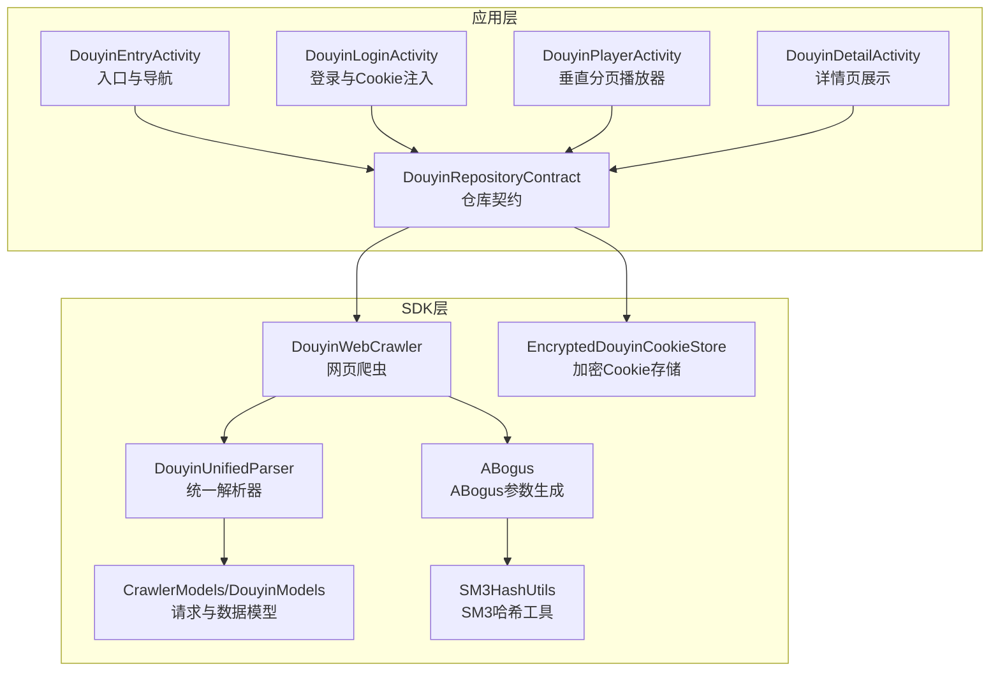
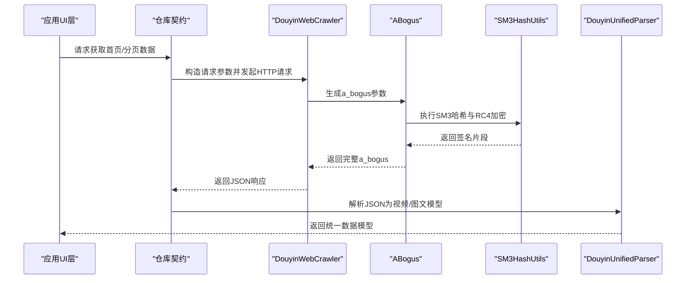
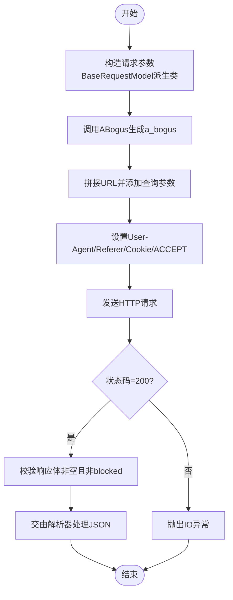
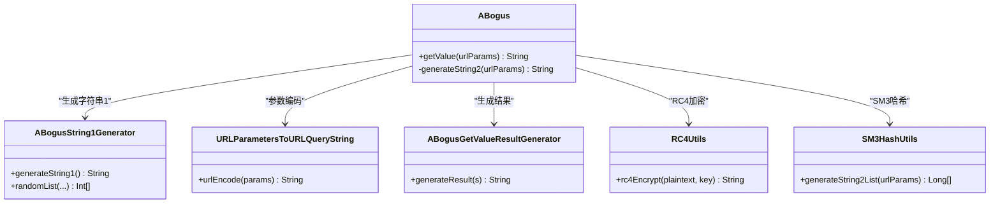
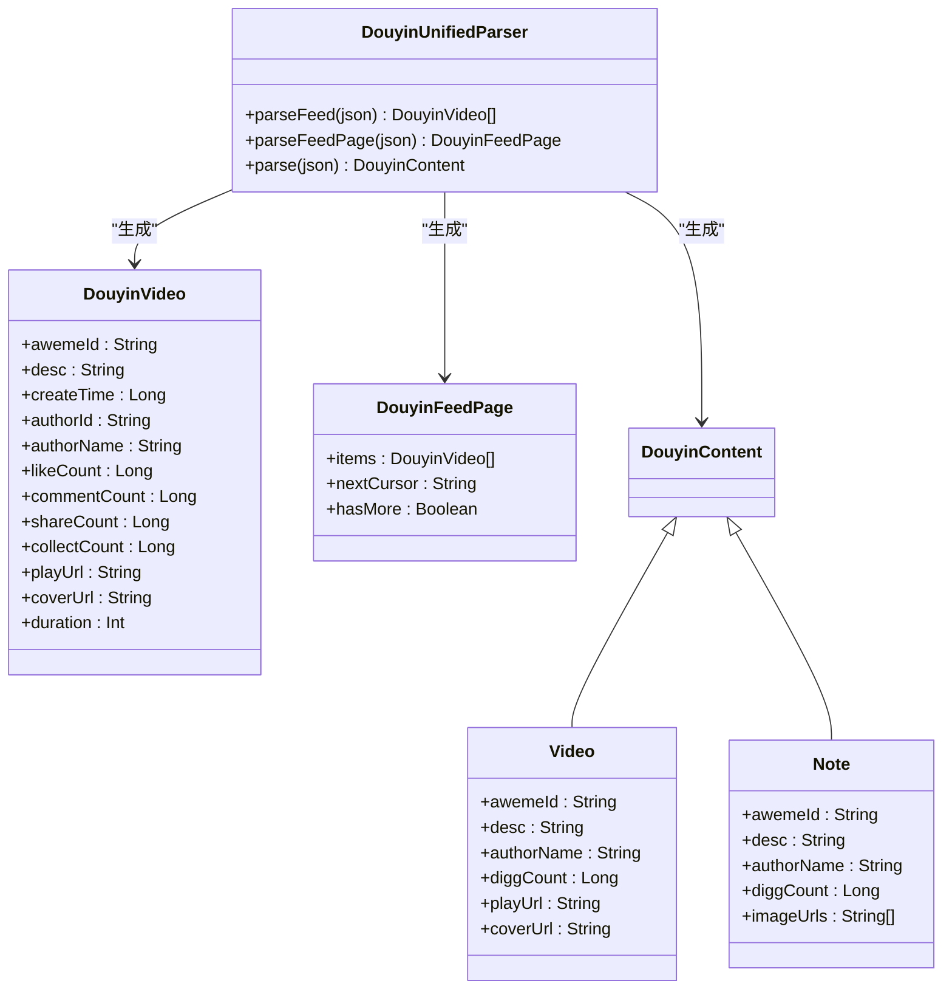
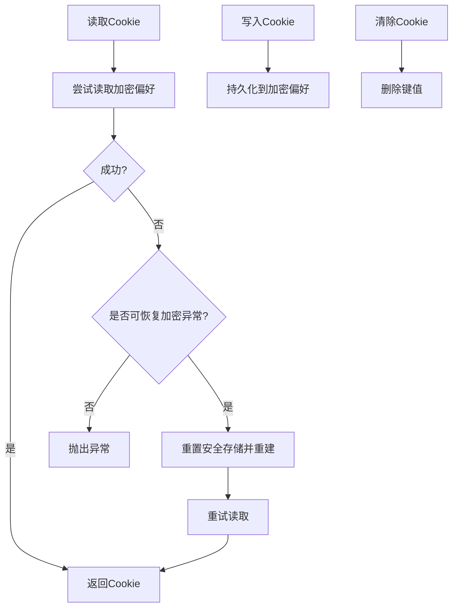
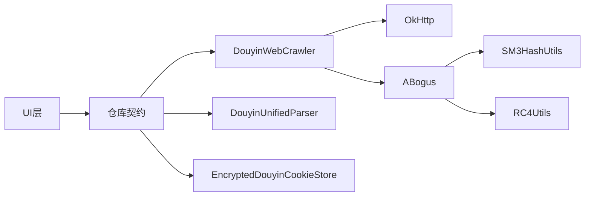

# 抖音轻量化浏览模块

<cite>
**本文档引用的文件**
- [DouyinWebCrawler.kt](file://sdk/douyin/src/main/java/com/lightningstudio/watchrss/sdk/douyin/DouyinWebCrawler.kt)
- [DouyinUnifiedParser.kt](file://sdk/douyin/src/main/java/com/lightningstudio/watchrss/sdk/douyin/DouyinUnifiedParser.kt)
- [CrawlerModels.kt](file://sdk/douyin/src/main/java/com/lightningstudio/watchrss/sdk/douyin/CrawlerModels.kt)
- [DouyinModels.kt](file://sdk/douyin/src/main/java/com/lightningstudio/watchrss/sdk/douyin/DouyinModels.kt)
- [ABogus.kt](file://sdk/douyin/src/main/java/com/lightningstudio/watchrss/sdk/douyin/ABogus.kt)
- [SM3HashUtils.kt](file://sdk/douyin/src/main/java/com/lightningstudio/watchrss/sdk/douyin/utils/SM3HashUtils.kt)
- [EncryptedDouyinCookieStore.kt](file://sdk/douyin/src/main/java/com/lightningstudio/watchrss/sdk/douyin/EncryptedDouyinCookieStore.kt)
- [DouyinEntryActivity.kt](file://app/src/main/java/com/lightningstudio/watchrss/DouyinEntryActivity.kt)
- [DouyinDetailActivity.kt](file://app/src/main/java/com/lightningstudio/watchrss/DouyinDetailActivity.kt)
- [DouyinPlayerActivity.kt](file://app/src/main/java/com/lightningstudio/watchrss/DouyinPlayerActivity.kt)
- [DouyinLoginActivity.kt](file://app/src/main/java/com/lightningstudio/watchrss/DouyinLoginActivity.kt)
- [DouyinRepositoryContract.kt](file://app/src/main/java/com/lightningstudio/watchrss/data/douyin/DouyinRepositoryContract.kt)
- [FakeDouyinRepository.kt](file://app/src/androidTest/java/com/lightningstudio/watchrss/testutil/FakeDouyinRepository.kt)
</cite>

## 目录
1. [简介](#简介)
2. [项目结构](#项目结构)
3. [核心组件](#核心组件)
4. [架构总览](#架构总览)
5. [详细组件分析](#详细组件分析)
6. [依赖关系分析](#依赖关系分析)
7. [性能考量](#性能考量)
8. [故障排查指南](#故障排查指南)
9. [结论](#结论)
10. [附录](#附录)

## 简介
本模块为Android WatchRSS项目提供的抖音轻量化浏览能力，目标是在手表端以低资源占用的方式实现抖音内容的抓取、解析与播放。系统通过网页爬虫技术模拟浏览器请求，结合ABogus参数生成算法绕过反爬虫校验，并通过统一解析器将响应数据映射为可播放的视频或图文内容。模块同时提供Cookie安全存储、请求头伪装、错误处理与重试策略，以及基于Compose的轻量UI体验。

## 项目结构
抖音模块主要由两部分组成：
- SDK层（sdk/douyin）：负责网络爬取、参数签名、数据解析与模型定义
- 应用层（app）：负责UI入口、播放器、登录流程与仓库契约

图表来源
- [DouyinEntryActivity.kt:29-124](file://app/src/main/java/com/lightningstudio/watchrss/DouyinEntryActivity.kt#L29-L124)
- [DouyinLoginActivity.kt:18-71](file://app/src/main/java/com/lightningstudio/watchrss/DouyinLoginActivity.kt#L18-L71)
- [DouyinPlayerActivity.kt:30-193](file://app/src/main/java/com/lightningstudio/watchrss/DouyinPlayerActivity.kt#L30-L193)
- [DouyinDetailActivity.kt:23-215](file://app/src/main/java/com/lightningstudio/watchrss/DouyinDetailActivity.kt#L23-L215)
- [DouyinRepositoryContract.kt:11-24](file://app/src/main/java/com/lightningstudio/watchrss/data/douyin/DouyinRepositoryContract.kt#L11-L24)
- [DouyinWebCrawler.kt:11-99](file://sdk/douyin/src/main/java/com/lightningstudio/watchrss/sdk/douyin/DouyinWebCrawler.kt#L11-L99)
- [DouyinUnifiedParser.kt:6-101](file://sdk/douyin/src/main/java/com/lightningstudio/watchrss/sdk/douyin/DouyinUnifiedParser.kt#L6-L101)
- [CrawlerModels.kt:4-101](file://sdk/douyin/src/main/java/com/lightningstudio/watchrss/sdk/douyin/CrawlerModels.kt#L4-L101)
- [DouyinModels.kt:3-61](file://sdk/douyin/src/main/java/com/lightningstudio/watchrss/sdk/douyin/DouyinModels.kt#L3-L61)
- [ABogus.kt:8-48](file://sdk/douyin/src/main/java/com/lightningstudio/watchrss/sdk/douyin/ABogus.kt#L8-L48)
- [SM3HashUtils.kt:13-205](file://sdk/douyin/src/main/java/com/lightningstudio/watchrss/sdk/douyin/utils/SM3HashUtils.kt#L13-L205)
- [EncryptedDouyinCookieStore.kt:16-114](file://sdk/douyin/src/main/java/com/lightningstudio/watchrss/sdk/douyin/EncryptedDouyinCookieStore.kt#L16-L114)

章节来源
- [DouyinEntryActivity.kt:29-124](file://app/src/main/java/com/lightningstudio/watchrss/DouyinEntryActivity.kt#L29-L124)
- [DouyinLoginActivity.kt:18-71](file://app/src/main/java/com/lightningstudio/watchrss/DouyinLoginActivity.kt#L18-L71)
- [DouyinPlayerActivity.kt:30-193](file://app/src/main/java/com/lightningstudio/watchrss/DouyinPlayerActivity.kt#L30-L193)
- [DouyinDetailActivity.kt:23-215](file://app/src/main/java/com/lightningstudio/watchrss/DouyinDetailActivity.kt#L23-L215)
- [DouyinRepositoryContract.kt:11-24](file://app/src/main/java/com/lightningstudio/watchrss/data/douyin/DouyinRepositoryContract.kt#L11-L24)

## 核心组件
- 网页爬虫（DouyinWebCrawler）：封装OkHttp客户端，构造请求参数与URL，注入User-Agent、Referer、Cookie等头部，调用ABogus生成a_bogus参数，执行请求并校验响应有效性。
- 统一解析器（DouyinUnifiedParser）：将JSON响应解析为DouyinVideo列表或DouyinContent（视频/图文），提取关键字段如aweme_id、标题、作者、统计数据、播放/封面地址等。
- 请求与数据模型（CrawlerModels/DouyinModels）：定义基础请求参数（设备信息、浏览器信息、版本号等）及具体请求（单视频详情、精选推荐流），以及统一的数据模型（视频、图文、分页信息）。
- ABogus参数生成（ABogus/SM3HashUtils）：实现与上游Python实现对齐的SM3哈希、RC4加密与字符串拼接流程，生成a_bogus查询参数。
- Cookie安全存储（EncryptedDouyinCookieStore）：基于AndroidX EncryptedSharedPreferences与AES256-GCM，提供线程安全的读写与异常恢复机制。
- UI与播放（DouyinEntry/Login/Player/Detail）：提供登录引导、沉浸式列表、垂直分页播放器与详情页展示，支持从仓库契约注入Cookie与播放头信息。

章节来源
- [DouyinWebCrawler.kt:11-99](file://sdk/douyin/src/main/java/com/lightningstudio/watchrss/sdk/douyin/DouyinWebCrawler.kt#L11-L99)
- [DouyinUnifiedParser.kt:6-101](file://sdk/douyin/src/main/java/com/lightningstudio/watchrss/sdk/douyin/DouyinUnifiedParser.kt#L6-L101)
- [CrawlerModels.kt:4-101](file://sdk/douyin/src/main/java/com/lightningstudio/watchrss/sdk/douyin/CrawlerModels.kt#L4-L101)
- [DouyinModels.kt:3-61](file://sdk/douyin/src/main/java/com/lightningstudio/watchrss/sdk/douyin/DouyinModels.kt#L3-L61)
- [ABogus.kt:8-48](file://sdk/douyin/src/main/java/com/lightningstudio/watchrss/sdk/douyin/ABogus.kt#L8-L48)
- [SM3HashUtils.kt:13-205](file://sdk/douyin/src/main/java/com/lightningstudio/watchrss/sdk/douyin/utils/SM3HashUtils.kt#L13-L205)
- [EncryptedDouyinCookieStore.kt:16-114](file://sdk/douyin/src/main/java/com/lightningstudio/watchrss/sdk/douyin/EncryptedDouyinCookieStore.kt#L16-L114)
- [DouyinEntryActivity.kt:29-124](file://app/src/main/java/com/lightningstudio/watchrss/DouyinEntryActivity.kt#L29-L124)
- [DouyinLoginActivity.kt:18-71](file://app/src/main/java/com/lightningstudio/watchrss/DouyinLoginActivity.kt#L18-L71)
- [DouyinPlayerActivity.kt:30-193](file://app/src/main/java/com/lightningstudio/watchrss/DouyinPlayerActivity.kt#L30-L193)
- [DouyinDetailActivity.kt:23-215](file://app/src/main/java/com/lightningstudio/watchrss/DouyinDetailActivity.kt#L23-L215)

## 架构总览
抖音模块采用“仓库契约 + SDK爬虫 + 解析器 + 模型”的分层设计，UI通过仓库契约与SDK交互，SDK内部完成参数签名与数据解析，最终向UI层提供统一的数据模型。

图表来源
- [DouyinWebCrawler.kt:17-42](file://sdk/douyin/src/main/java/com/lightningstudio/watchrss/sdk/douyin/DouyinWebCrawler.kt#L17-L42)
- [ABogus.kt:37-43](file://sdk/douyin/src/main/java/com/lightningstudio/watchrss/sdk/douyin/ABogus.kt#L37-L43)
- [SM3HashUtils.kt:37-88](file://sdk/douyin/src/main/java/com/lightningstudio/watchrss/sdk/douyin/utils/SM3HashUtils.kt#L37-L88)
- [DouyinUnifiedParser.kt:11-59](file://sdk/douyin/src/main/java/com/lightningstudio/watchrss/sdk/douyin/DouyinUnifiedParser.kt#L11-L59)

## 详细组件分析

### 网络爬虫与反爬虫对抗
- 请求构建：爬虫根据具体接口（单视频详情、精选推荐流）构造BaseRequestModel派生类，填充通用设备/浏览器参数，并追加业务参数（如aweme_id、count、cursor等）。随后调用ABogus生成a_bogus查询参数，拼接到URL中。
- 请求头伪装：固定User-Agent与Referer，避免被识别为自动化客户端；同时携带Cookie以维持会话。
- 响应校验：仅接受HTTP 200；对空字符串与"blocked"进行特殊处理，抛出IO异常以便上层捕获与提示。

图表来源
- [DouyinWebCrawler.kt:17-42](file://sdk/douyin/src/main/java/com/lightningstudio/watchrss/sdk/douyin/DouyinWebCrawler.kt#L17-L42)
- [DouyinWebCrawler.kt:76-93](file://sdk/douyin/src/main/java/com/lightningstudio/watchrss/sdk/douyin/DouyinWebCrawler.kt#L76-L93)

章节来源
- [DouyinWebCrawler.kt:11-99](file://sdk/douyin/src/main/java/com/lightningstudio/watchrss/sdk/douyin/DouyinWebCrawler.kt#L11-L99)

### ABogus参数生成算法
- 字符串1生成：通过多个随机列表与字符编码生成初始字符串1。
- 字符串2生成：对URL参数进行编码后，调用SM3HashUtils生成参数编码序列，再与浏览器特征拼接并通过RC4加密得到字符串2。
- 结果生成：将字符串1与字符串2拼接，经字符表映射与填充生成最终的a_bogus参数。

图表来源
- [ABogus.kt:8-48](file://sdk/douyin/src/main/java/com/lightningstudio/watchrss/sdk/douyin/ABogus.kt#L8-L48)
- [ABogus.kt:125-136](file://sdk/douyin/src/main/java/com/lightningstudio/watchrss/sdk/douyin/ABogus.kt#L125-L136)
- [ABogus.kt:138-176](file://sdk/douyin/src/main/java/com/lightningstudio/watchrss/sdk/douyin/ABogus.kt#L138-L176)
- [ABogus.kt:178-210](file://sdk/douyin/src/main/java/com/lightningstudio/watchrss/sdk/douyin/ABogus.kt#L178-L210)
- [SM3HashUtils.kt:13-205](file://sdk/douyin/src/main/java/com/lightningstudio/watchrss/sdk/douyin/utils/SM3HashUtils.kt#L13-L205)

章节来源
- [ABogus.kt:8-211](file://sdk/douyin/src/main/java/com/lightningstudio/watchrss/sdk/douyin/ABogus.kt#L8-L211)
- [SM3HashUtils.kt:13-205](file://sdk/douyin/src/main/java/com/lightningstudio/watchrss/sdk/douyin/utils/SM3HashUtils.kt#L13-L205)

### 数据解析与模型
- 视频流解析：解析aweme_list数组，提取视频元数据（标题、作者、统计、时长、播放/封面地址），过滤无效项后返回分页对象（包含下一页游标与是否还有更多）。
- 单视频解析：根据aweme_type区分视频与图文，分别提取播放地址/封面或图片列表，包装为统一内容模型。
- 数据模型：DouyinVideo用于列表展示，DouyinContent为视频/图文统一载体，DouyinFeedPage承载分页信息。

图表来源
- [DouyinUnifiedParser.kt:6-101](file://sdk/douyin/src/main/java/com/lightningstudio/watchrss/sdk/douyin/DouyinUnifiedParser.kt#L6-L101)
- [DouyinModels.kt:3-61](file://sdk/douyin/src/main/java/com/lightningstudio/watchrss/sdk/douyin/DouyinModels.kt#L3-L61)

章节来源
- [DouyinUnifiedParser.kt:6-101](file://sdk/douyin/src/main/java/com/lightningstudio/watchrss/sdk/douyin/DouyinUnifiedParser.kt#L6-L101)
- [DouyinModels.kt:3-61](file://sdk/douyin/src/main/java/com/lightningstudio/watchrss/sdk/douyin/DouyinModels.kt#L3-L61)

### Cookie管理策略
- 加密存储：使用EncryptedSharedPreferences与AES256-GCM，确保Cookie在设备侧安全持久化。
- 并发安全：内部使用Mutex保证并发读写一致性。
- 异常恢复：捕获可恢复的加密异常（如Keystore损坏、解密失败），自动清理并重建安全存储。
- 生命周期：提供读取、写入、清除与登出清理接口，配合仓库契约统一管理。

图表来源
- [EncryptedDouyinCookieStore.kt:24-53](file://sdk/douyin/src/main/java/com/lightningstudio/watchrss/sdk/douyin/EncryptedDouyinCookieStore.kt#L24-L53)
- [EncryptedDouyinCookieStore.kt:69-102](file://sdk/douyin/src/main/java/com/lightningstudio/watchrss/sdk/douyin/EncryptedDouyinCookieStore.kt#L69-L102)

章节来源
- [EncryptedDouyinCookieStore.kt:16-114](file://sdk/douyin/src/main/java/com/lightningstudio/watchrss/sdk/douyin/EncryptedDouyinCookieStore.kt#L16-L114)

### 热门推荐与分页机制
- 推荐流接口：通过JingxuanFeed构造请求参数，支持cursor与count控制分页。
- 分页游标：解析响应中的max_cursor或cursor作为下一页起点；has_more指示是否继续拉取。
- 列表渲染：UI层根据has_more与nextCursor触发加载更多，实现轻量化的滚动体验。

章节来源
- [CrawlerModels.kt:86-101](file://sdk/douyin/src/main/java/com/lightningstudio/watchrss/sdk/douyin/CrawlerModels.kt#L86-L101)
- [DouyinWebCrawler.kt:44-74](file://sdk/douyin/src/main/java/com/lightningstudio/watchrss/sdk/douyin/DouyinWebCrawler.kt#L44-L74)
- [DouyinUnifiedParser.kt:55-58](file://sdk/douyin/src/main/java/com/lightningstudio/watchrss/sdk/douyin/DouyinUnifiedParser.kt#L55-L58)

### 用户行为与播放体验
- 登录流程：通过DouyinLoginActivity启动登录WebView，完成后回调注入Cookie至仓库契约。
- 播放器：DouyinPlayerActivity使用垂直分页实现上下滑动切换视频，支持从仓库契约读取播放头信息，点击卡片打开原网页。
- 详情页：DouyinDetailActivity将视频信息转换为RSS条目，展示作者、摘要与视频卡片，便于收藏与分享。

章节来源
- [DouyinLoginActivity.kt:18-71](file://app/src/main/java/com/lightningstudio/watchrss/DouyinLoginActivity.kt#L18-L71)
- [DouyinPlayerActivity.kt:30-193](file://app/src/main/java/com/lightningstudio/watchrss/DouyinPlayerActivity.kt#L30-L193)
- [DouyinDetailActivity.kt:23-215](file://app/src/main/java/com/lightningstudio/watchrss/DouyinDetailActivity.kt#L23-L215)

### 错误处理机制
- 爬虫层：状态码非200或响应体为空/被标记为blocked时抛出IO异常，便于上层统一处理。
- 解析层：对缺失字段或类型不匹配进行健壮性处理，必要时抛出JSON异常并给出明确提示。
- 仓库契约：未实现的方法统一抛出UnsupportedOperationException，避免误用。

章节来源
- [DouyinWebCrawler.kt:76-93](file://sdk/douyin/src/main/java/com/lightningstudio/watchrss/sdk/douyin/DouyinWebCrawler.kt#L76-L93)
- [DouyinUnifiedParser.kt:61-99](file://sdk/douyin/src/main/java/com/lightningstudio/watchrss/sdk/douyin/DouyinUnifiedParser.kt#L61-L99)
- [DouyinRepositoryContract.kt:7-9](file://app/src/main/java/com/lightningstudio/watchrss/data/douyin/DouyinRepositoryContract.kt#L7-L9)

## 依赖关系分析
- 组件耦合：UI层仅依赖仓库契约，SDK层内部完成参数签名与解析，降低UI复杂度。
- 外部依赖：OkHttp用于HTTP请求，BouncyCastle SM3用于哈希计算，AndroidX EncryptedSharedPreferences用于安全存储。
- 可能的循环依赖：未发现直接循环依赖；仓库契约与SDK通过接口隔离。

图表来源
- [DouyinWebCrawler.kt:13-15](file://sdk/douyin/src/main/java/com/lightningstudio/watchrss/sdk/douyin/DouyinWebCrawler.kt#L13-L15)
- [ABogus.kt:5-6](file://sdk/douyin/src/main/java/com/lightningstudio/watchrss/sdk/douyin/ABogus.kt#L5-L6)
- [SM3HashUtils.kt:7-8](file://sdk/douyin/src/main/java/com/lightningstudio/watchrss/sdk/douyin/utils/SM3HashUtils.kt#L7-L8)
- [EncryptedDouyinCookieStore.kt:6-7](file://sdk/douyin/src/main/java/com/lightningstudio/watchrss/sdk/douyin/EncryptedDouyinCookieStore.kt#L6-L7)

## 性能考量
- 轻量化请求：使用精简的请求头与最小化参数集，减少带宽与CPU消耗。
- 参数签名开销：ABogus生成涉及SM3与RC4，建议在后台线程执行并复用实例。
- 缓存策略：结合预加载与分页游标，避免重复请求；播放器采用垂直分页减少内存峰值。
- UI渲染：Compose主题密度适配与轻量组件组合，提升手表端流畅度。

## 故障排查指南
- Cookie无效：检查Cookie是否过期或被拦截，确认EncryptedSharedPreferences读写正常；必要时触发重置安全存储。
- 状态码异常：若出现非200，检查User-Agent/Referer/Cookie是否正确注入，确认a_bogus参数生成流程。
- 解析失败：核对JSON结构变化，关注缺失字段与类型差异，必要时更新解析逻辑。
- 登录失败：确认WebView初始化与回调链路，检查初始错误消息提示。

章节来源
- [EncryptedDouyinCookieStore.kt:40-53](file://sdk/douyin/src/main/java/com/lightningstudio/watchrss/sdk/douyin/EncryptedDouyinCookieStore.kt#L40-L53)
- [DouyinWebCrawler.kt:76-93](file://sdk/douyin/src/main/java/com/lightningstudio/watchrss/sdk/douyin/DouyinWebCrawler.kt#L76-L93)
- [DouyinUnifiedParser.kt:61-99](file://sdk/douyin/src/main/java/com/lightningstudio/watchrss/sdk/douyin/DouyinUnifiedParser.kt#L61-L99)

## 结论
抖音轻量化浏览模块通过严谨的参数签名、稳健的数据解析与安全的Cookie管理，在手表端实现了低资源占用的抖音内容浏览。模块以仓库契约解耦UI与SDK，具备良好的扩展性与可维护性；同时提供完善的错误处理与性能优化策略，满足手表端的实时性与稳定性需求。

## 附录
- 使用示例（路径参考）
  - 抓取单个视频详情：[fetchOneVideo:17-42](file://sdk/douyin/src/main/java/com/lightningstudio/watchrss/sdk/douyin/DouyinWebCrawler.kt#L17-L42)
  - 获取精选推荐流：[fetchJingxuanFeed:44-74](file://sdk/douyin/src/main/java/com/lightningstudio/watchrss/sdk/douyin/DouyinWebCrawler.kt#L44-L74)
  - 解析视频列表：[parseFeedPage:11-59](file://sdk/douyin/src/main/java/com/lightningstudio/watchrss/sdk/douyin/DouyinUnifiedParser.kt#L11-L59)
  - 解析单条内容：[parse:61-99](file://sdk/douyin/src/main/java/com/lightningstudio/watchrss/sdk/douyin/DouyinUnifiedParser.kt#L61-L99)
  - 生成ABogus参数：[getValue:37-43](file://sdk/douyin/src/main/java/com/lightningstudio/watchrss/sdk/douyin/ABogus.kt#L37-L43)
  - SM3哈希与RC4加密：[generateString2List:37-88](file://sdk/douyin/src/main/java/com/lightningstudio/watchrss/sdk/douyin/utils/SM3HashUtils.kt#L37-L88)
  - Cookie读写与恢复：[readCookie/writeCookie/resetSecureStorage:24-80](file://sdk/douyin/src/main/java/com/lightningstudio/watchrss/sdk/douyin/EncryptedDouyinCookieStore.kt#L24-L80)
  - 登录注入Cookie：[applyCookieHeader:70-76](file://app/src/androidTest/java/com/lightningstudio/watchrss/testutil/FakeDouyinRepository.kt#L70-L76)
  - 构建播放头信息：[buildPlayHeaders:95-95](file://app/src/androidTest/java/com/lightningstudio/watchrss/testutil/FakeDouyinRepository.kt#L95-L95)