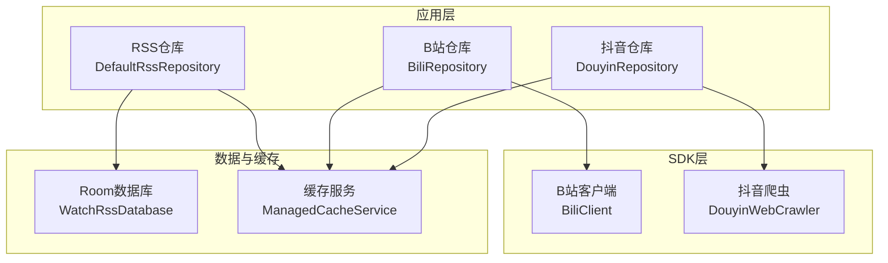
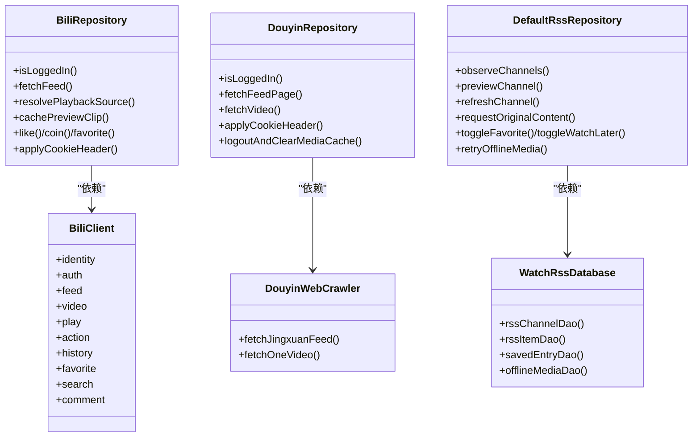
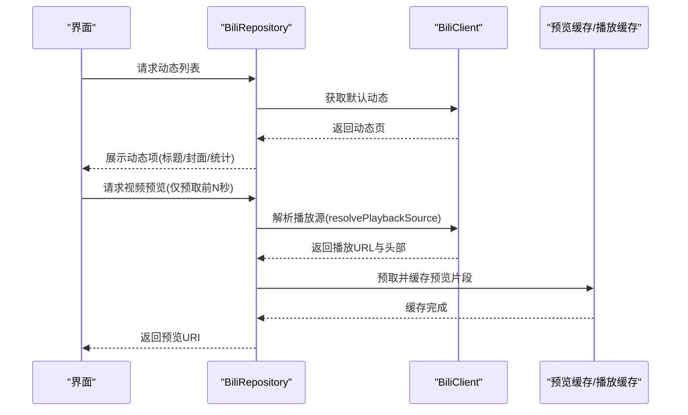
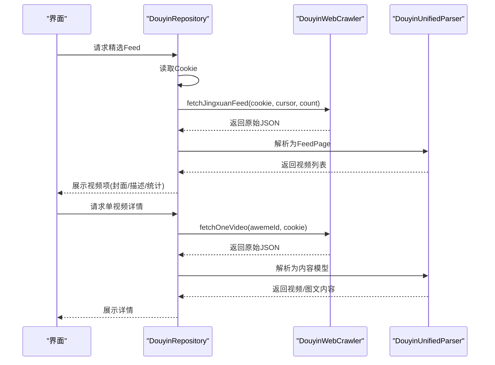
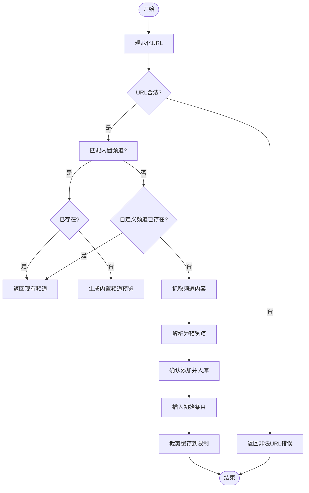
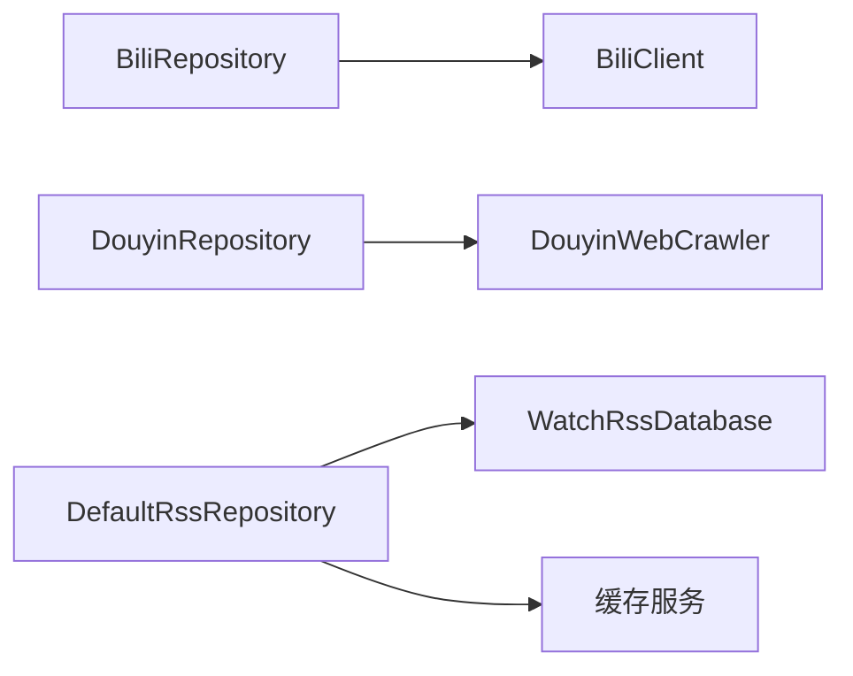

# 核心功能模块

<cite>
**本文引用的文件**   
- [README.md](file://README.md)
- [BiliRepository.kt](file://app/src/main/java/com/lightningstudio/watchrss/data/bili/BiliRepository.kt)
- [DouyinRepository.kt](file://app/src/main/java/com/lightningstudio/watchrss/data/douyin/DouyinRepository.kt)
- [DefaultRssRepository.kt](file://app/src/main/java/com/lightningstudio/watchrss/data/rss/DefaultRssRepository.kt)
- [BiliClient.kt](file://sdk/bili/src/main/java/com/lightningstudio/watchrss/sdk/bili/BiliClient.kt)
- [DouyinWebCrawler.kt](file://sdk/douyin/src/main/java/com/lightningstudio/watchrss/sdk/douyin/DouyinWebCrawler.kt)
- [RssModels.kt](file://app/src/main/java/com/lightningstudio/watchrss/data/rss/RssModels.kt)
- [DouyinModels.kt](file://sdk/douyin/src/main/java/com/lightningstudio/watchrss/sdk/douyin/DouyinModels.kt)
- [WatchRssDatabase.kt](file://app/src/main/java/com/lightningstudio/watchrss/data/db/WatchRssDatabase.kt)
</cite>

## 目录
1. [引言](#引言)
2. [项目结构](#项目结构)
3. [核心组件](#核心组件)
4. [架构总览](#架构总览)
5. [详细组件分析](#详细组件分析)
6. [依赖分析](#依赖分析)
7. [性能考虑](#性能考虑)
8. [故障排查指南](#故障排查指南)
9. [结论](#结论)
10. [附录](#附录)

## 引言
本项目面向可穿戴智能手表，提供“腕上RSS”轻量化内容消费入口，覆盖B站、抖音与通用RSS三大模块。设计目标是在手表端以小屏、低功耗、低交互成本的方式呈现核心信息，避免视频播放以节省电量并优化体验；同时通过离线缓存与摘要生成提升可用性。

## 项目结构
- 应用层模块
  - B站模块：数据层负责账号、互动状态、播放源解析与预览缓存；SDK层封装API调用。
  - 抖音模块：数据层负责Cookie管理、爬取与解析；SDK层提供Web抓取与反爬参数生成。
  - RSS模块：数据层负责订阅管理、内容解析、摘要生成、离线媒体下载与缓存维护。
- SDK层模块
  - B站SDK：按业务域拆分客户端组件（认证、动态、视频、播放、互动、搜索、评论等）。
  - 抖音SDK：提供Web端爬虫、统一解析器与Cookie存储。
- 数据库与缓存
  - Room数据库定义RSS相关实体与索引迁移。
  - 缓存服务负责跨模块的预览/离线媒体缓存清理与维护。

**图表来源**
- [BiliRepository.kt:66-1116](file://app/src/main/java/com/lightningstudio/watchrss/data/bili/BiliRepository.kt#L66-L1116)
- [DouyinRepository.kt:21-204](file://app/src/main/java/com/lightningstudio/watchrss/data/douyin/DouyinRepository.kt#L21-L204)
- [DefaultRssRepository.kt:32-971](file://app/src/main/java/com/lightningstudio/watchrss/data/rss/DefaultRssRepository.kt#L32-L971)
- [BiliClient.kt:3-19](file://sdk/bili/src/main/java/com/lightningstudio/watchrss/sdk/bili/BiliClient.kt#L3-L19)
- [DouyinWebCrawler.kt:11-99](file://sdk/douyin/src/main/java/com/lightningstudio/watchrss/sdk/douyin/DouyinWebCrawler.kt#L11-L99)
- [WatchRssDatabase.kt:9-25](file://app/src/main/java/com/lightningstudio/watchrss/data/db/WatchRssDatabase.kt#L9-L25)

**章节来源**
- [README.md:1-40](file://README.md#L1-L40)

## 核心组件
- B站轻量化浏览
  - 动态预览与播放源解析：通过播放URL解析与预览片段缓存，避免直接播放视频。
  - 互动状态与收藏同步：读写本地互动状态与收藏夹，支持与手机端联动。
  - 登录与Cookie：支持二维码登录与Cookie注入，构建带Cookie的请求头。
- 抖音轻量化浏览
  - 爬虫实现：基于OkHttp抓取精选Feed与单视频详情，生成a_bogus参数绕过风控。
  - Cookie管理：加密存储Cookie，清理WebView会话残留。
  - 数据解析：统一解析器输出视频/图文内容模型。
- RSS订阅管理
  - 订阅管理：支持内置频道与自定义RSS源，预览与确认添加流程。
  - 内容解析与摘要：解析标题、描述、图片、音频、视频链接，异步生成摘要与预览图。
  - 离线支持：离线媒体下载与缓存维护，支持收藏/稍后再看的离线媒体同步。

**章节来源**
- [BiliRepository.kt:136-146](file://app/src/main/java/com/lightningstudio/watchrss/data/bili/BiliRepository.kt#L136-L146)
- [BiliRepository.kt:315-384](file://app/src/main/java/com/lightningstudio/watchrss/data/bili/BiliRepository.kt#L315-L384)
- [BiliRepository.kt:594-700](file://app/src/main/java/com/lightningstudio/watchrss/data/bili/BiliRepository.kt#L594-L700)
- [DouyinRepository.kt:57-112](file://app/src/main/java/com/lightningstudio/watchrss/data/douyin/DouyinRepository.kt#L57-L112)
- [DouyinRepository.kt:114-124](file://app/src/main/java/com/lightningstudio/watchrss/data/douyin/DouyinRepository.kt#L114-L124)
- [DefaultRssRepository.kt:154-196](file://app/src/main/java/com/lightningstudio/watchrss/data/rss/DefaultRssRepository.kt#L154-L196)
- [DefaultRssRepository.kt:312-405](file://app/src/main/java/com/lightningstudio/watchrss/data/rss/DefaultRssRepository.kt#L312-L405)
- [DefaultRssRepository.kt:510-554](file://app/src/main/java/com/lightningstudio/watchrss/data/rss/DefaultRssRepository.kt#L510-L554)
- [DefaultRssRepository.kt:556-567](file://app/src/main/java/com/lightningstudio/watchrss/data/rss/DefaultRssRepository.kt#L556-L567)

## 架构总览
三大模块均采用“数据层仓库 + SDK层服务”的分层设计：
- B站：仓库负责账号、互动、播放源与预览缓存；SDK封装HTTP客户端与业务域模块。
- 抖音：仓库负责Cookie与爬取结果；SDK封装OkHttp请求与a_bogus参数生成。
- RSS：仓库负责数据库访问、缓存调度与离线媒体；数据库定义实体与索引。

**图表来源**
- [BiliRepository.kt:66-1116](file://app/src/main/java/com/lightningstudio/watchrss/data/bili/BiliRepository.kt#L66-L1116)
- [BiliClient.kt:3-19](file://sdk/bili/src/main/java/com/lightningstudio/watchrss/sdk/bili/BiliClient.kt#L3-L19)
- [DouyinRepository.kt:21-204](file://app/src/main/java/com/lightningstudio/watchrss/data/douyin/DouyinRepository.kt#L21-L204)
- [DouyinWebCrawler.kt:11-99](file://sdk/douyin/src/main/java/com/lightningstudio/watchrss/sdk/douyin/DouyinWebCrawler.kt#L11-L99)
- [DefaultRssRepository.kt:32-971](file://app/src/main/java/com/lightningstudio/watchrss/data/rss/DefaultRssRepository.kt#L32-L971)
- [WatchRssDatabase.kt:9-25](file://app/src/main/java/com/lightningstudio/watchrss/data/db/WatchRssDatabase.kt#L9-L25)

## 详细组件分析

### B站模块：动态预览、视频摘要与收藏同步
- 设计目标
  - 在手表端仅展示文字+缩略图，避免视频播放，降低功耗与交互复杂度。
  - 提供收藏夹同步、点赞/投币/三连等互动能力，保持与手机端一致体验。
- 技术实现
  - 动态预览与播放源解析：通过解析播放URL与预览片段缓存，仅在需要时预取前若干毫秒的媒体数据，避免完整播放。
  - 互动状态：本地持久化互动记录（点赞/投币/收藏），并从远端获取实时状态进行校准。
  - 登录与Cookie：支持二维码登录与Cookie注入，构建带Cookie的请求头以访问登录态资源。
- 手表端适配策略
  - 小屏优先：列表项仅显示标题、封面缩略图与必要统计信息。
  - 低交互：滑动切换，一次只加载一条内容，减少内存占用。
  - 省电：不触发视频播放，仅在用户明确点击时进行预取与展示。

**图表来源**
- [BiliRepository.kt:136-146](file://app/src/main/java/com/lightningstudio/watchrss/data/bili/BiliRepository.kt#L136-L146)
- [BiliRepository.kt:315-384](file://app/src/main/java/com/lightningstudio/watchrss/data/bili/BiliRepository.kt#L315-L384)
- [BiliRepository.kt:594-700](file://app/src/main/java/com/lightningstudio/watchrss/data/bili/BiliRepository.kt#L594-L700)
- [BiliClient.kt:3-19](file://sdk/bili/src/main/java/com/lightningstudio/watchrss/sdk/bili/BiliClient.kt#L3-L19)

**章节来源**
- [BiliRepository.kt:85-108](file://app/src/main/java/com/lightningstudio/watchrss/data/bili/BiliRepository.kt#L85-L108)
- [BiliRepository.kt:179-218](file://app/src/main/java/com/lightningstudio/watchrss/data/bili/BiliRepository.kt#L179-L218)
- [BiliRepository.kt:428-483](file://app/src/main/java/com/lightningstudio/watchrss/data/bili/BiliRepository.kt#L428-L483)
- [BiliRepository.kt:110-124](file://app/src/main/java/com/lightningstudio/watchrss/data/bili/BiliRepository.kt#L110-L124)

### 抖音模块：爬虫实现、Cookie管理与数据解析
- 设计目标
  - 通过Web端爬取精选Feed与单视频详情，输出统一内容模型，支持视频与图文两类内容。
  - 提供极简操作：点赞/收藏等动作在手表端以滑动或轻触完成。
- 技术实现
  - 爬虫实现：基于OkHttp向抖音Web接口发起请求，生成a_bogus参数以绕过风控。
  - Cookie管理：加密存储Cookie，清理WebView会话残留，确保登录态稳定。
  - 数据解析：统一解析器将原始JSON转换为视频/图文内容模型。
- 手表端适配策略
  - 单条加载：每次仅加载一条内容，降低内存占用。
  - 低交互：滑动切换，支持点赞/收藏等轻量操作。

**图表来源**
- [DouyinRepository.kt:66-88](file://app/src/main/java/com/lightningstudio/watchrss/data/douyin/DouyinRepository.kt#L66-L88)
- [DouyinRepository.kt:90-112](file://app/src/main/java/com/lightningstudio/watchrss/data/douyin/DouyinRepository.kt#L90-L112)
- [DouyinWebCrawler.kt:44-74](file://sdk/douyin/src/main/java/com/lightningstudio/watchrss/sdk/douyin/DouyinWebCrawler.kt#L44-L74)
- [DouyinWebCrawler.kt:17-42](file://sdk/douyin/src/main/java/com/lightningstudio/watchrss/sdk/douyin/DouyinWebCrawler.kt#L17-L42)

**章节来源**
- [DouyinRepository.kt:30-46](file://app/src/main/java/com/lightningstudio/watchrss/data/douyin/DouyinRepository.kt#L30-L46)
- [DouyinRepository.kt:48-55](file://app/src/main/java/com/lightningstudio/watchrss/data/douyin/DouyinRepository.kt#L48-L55)
- [DouyinRepository.kt:114-124](file://app/src/main/java/com/lightningstudio/watchrss/data/douyin/DouyinRepository.kt#L114-L124)
- [DouyinModels.kt:3-61](file://sdk/douyin/src/main/java/com/lightningstudio/watchrss/sdk/douyin/DouyinModels.kt#L3-L61)

### RSS模块：订阅管理、内容解析与离线支持
- 设计目标
  - 支持自定义RSS源与内置频道；提供标题+摘要展示与已读/未读标记。
  - 提供离线媒体下载与缓存维护，支持收藏/稍后再看的离线媒体同步。
- 技术实现
  - 订阅管理：预览URL合法性与内置频道识别，确认后入库并插入初始条目。
  - 内容解析：解析标题、描述、图片、音频、视频链接，异步生成摘要与预览图。
  - 离线支持：根据收藏/稍后再看状态触发离线媒体下载，结合缓存服务进行维护。
- 手表端适配策略
  - 输入友好：支持手动输入与扫码添加RSS地址。
  - 展示优化：仅展示标题与摘要，必要时再加载原文。

**图表来源**
- [DefaultRssRepository.kt:154-196](file://app/src/main/java/com/lightningstudio/watchrss/data/rss/DefaultRssRepository.kt#L154-L196)
- [DefaultRssRepository.kt:198-265](file://app/src/main/java/com/lightningstudio/watchrss/data/rss/DefaultRssRepository.kt#L198-L265)
- [DefaultRssRepository.kt:267-310](file://app/src/main/java/com/lightningstudio/watchrss/data/rss/DefaultRssRepository.kt#L267-L310)

**章节来源**
- [DefaultRssRepository.kt:54-100](file://app/src/main/java/com/lightningstudio/watchrss/data/rss/DefaultRssRepository.kt#L54-L100)
- [DefaultRssRepository.kt:312-405](file://app/src/main/java/com/lightningstudio/watchrss/data/rss/DefaultRssRepository.kt#L312-L405)
- [DefaultRssRepository.kt:420-476](file://app/src/main/java/com/lightningstudio/watchrss/data/rss/DefaultRssRepository.kt#L420-L476)
- [DefaultRssRepository.kt:510-554](file://app/src/main/java/com/lightningstudio/watchrss/data/rss/DefaultRssRepository.kt#L510-L554)
- [DefaultRssRepository.kt:556-567](file://app/src/main/java/com/lightningstudio/watchrss/data/rss/DefaultRssRepository.kt#L556-L567)
- [RssModels.kt:3-34](file://app/src/main/java/com/lightningstudio/watchrss/data/rss/RssModels.kt#L3-L34)

## 依赖分析
- 组件耦合
  - B站仓库依赖B站SDK的客户端组件，按业务域解耦，职责清晰。
  - 抖音仓库依赖抖音爬虫与解析器，Cookie由加密存储提供。
  - RSS仓库依赖数据库与缓存服务，通过DAO与服务层解耦。
- 外部依赖
  - RSS解析使用RSS-Parser（Kotlin Multiplatform），支持RSS/Atom/RDF。
  - OkHttp用于网络请求与Cookie管理。
- 潜在循环依赖
  - 当前仓库与SDK之间为单向依赖，未见循环依赖迹象。

**图表来源**
- [BiliRepository.kt:74-74](file://app/src/main/java/com/lightningstudio/watchrss/data/bili/BiliRepository.kt#L74-L74)
- [DouyinRepository.kt:28-28](file://app/src/main/java/com/lightningstudio/watchrss/data/douyin/DouyinRepository.kt#L28-L28)
- [DefaultRssRepository.kt:38-43](file://app/src/main/java/com/lightningstudio/watchrss/data/rss/DefaultRssRepository.kt#L38-L43)
- [WatchRssDatabase.kt:9-25](file://app/src/main/java/com/lightningstudio/watchrss/data/db/WatchRssDatabase.kt#L9-L25)

**章节来源**
- [README.md:28-31](file://README.md#L28-L31)

## 性能考虑
- 预取与缓存
  - B站：预览片段按最大时长与字节估算进行预取，并在缓存服务调度下定期维护。
  - 抖音：预取与缓存桶管理，登出时清理媒体缓存。
  - RSS：按缓存上限进行裁剪，避免无限增长。
- IO与并发
  - 使用IO调度器执行磁盘与网络IO，避免阻塞主线程。
  - 对播放源解析加锁，避免重复解析同一视频。
- 展示优化
  - 列表项仅加载必要字段，减少渲染压力。
  - 摘要与预览图异步生成，避免阻塞首屏。

**章节来源**
- [BiliRepository.kt:618-622](file://app/src/main/java/com/lightningstudio/watchrss/data/bili/BiliRepository.kt#L618-L622)
- [BiliRepository.kt:784-790](file://app/src/main/java/com/lightningstudio/watchrss/data/bili/BiliRepository.kt#L784-L790)
- [DefaultRssRepository.kt:618-622](file://app/src/main/java/com/lightningstudio/watchrss/data/rss/DefaultRssRepository.kt#L618-L622)

## 故障排查指南
- B站登录与Cookie
  - 若Cookie缺失或无效，将导致登录态相关接口失败。可通过二维码登录或重新注入Cookie解决。
  - 清理预览缓存与播放缓存有助于恢复异常状态。
- 抖音登录与Cookie
  - 若返回“Cookie无效”，需重新登录或更新Cookie；同时清理WebView会话残留。
  - 网络请求失败或解析失败时，检查网络状态与返回体。
- RSS订阅
  - URL非法或解析失败时，检查URL格式与站点可达性。
  - 原文内容加载失败时，可回退至摘要或稍后再试。

**章节来源**
- [BiliRepository.kt:110-124](file://app/src/main/java/com/lightningstudio/watchrss/data/bili/BiliRepository.kt#L110-L124)
- [BiliRepository.kt:96-108](file://app/src/main/java/com/lightningstudio/watchrss/data/bili/BiliRepository.kt#L96-L108)
- [DouyinRepository.kt:48-55](file://app/src/main/java/com/lightningstudio/watchrss/data/douyin/DouyinRepository.kt#L48-L55)
- [DouyinRepository.kt:126-148](file://app/src/main/java/com/lightningstudio/watchrss/data/douyin/DouyinRepository.kt#L126-L148)
- [DefaultRssRepository.kt:156-158](file://app/src/main/java/com/lightningstudio/watchrss/data/rss/DefaultRssRepository.kt#L156-L158)
- [DefaultRssRepository.kt:183-196](file://app/src/main/java/com/lightningstudio/watchrss/data/rss/DefaultRssRepository.kt#L183-L196)

## 结论
本项目通过三层架构与模块化设计，在手表端实现了B站、抖音与RSS的轻量化内容消费。B站侧重预览与互动同步，抖音强调爬虫与反风控，RSS聚焦订阅与离线能力。通过缓存与摘要策略，显著降低了功耗与交互成本，满足手表“碎片化、便捷化”的使用场景。

## 附录
- API与数据模型参考
  - B站：动态、视频、播放、互动、收藏、搜索、评论等模型与方法参见B站SDK与仓库实现。
  - 抖音：视频/图文内容模型与爬取接口参见抖音SDK与仓库实现。
  - RSS：频道与条目模型、DAO与仓库方法参见RSS仓库与数据库定义。

**章节来源**
- [BiliClient.kt:3-19](file://sdk/bili/src/main/java/com/lightningstudio/watchrss/sdk/bili/BiliClient.kt#L3-L19)
- [DouyinWebCrawler.kt:11-99](file://sdk/douyin/src/main/java/com/lightningstudio/watchrss/sdk/douyin/DouyinWebCrawler.kt#L11-L99)
- [RssModels.kt:3-34](file://app/src/main/java/com/lightningstudio/watchrss/data/rss/RssModels.kt#L3-L34)
- [WatchRssDatabase.kt:9-25](file://app/src/main/java/com/lightningstudio/watchrss/data/db/WatchRssDatabase.kt#L9-L25)