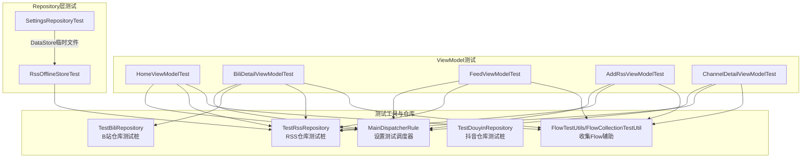
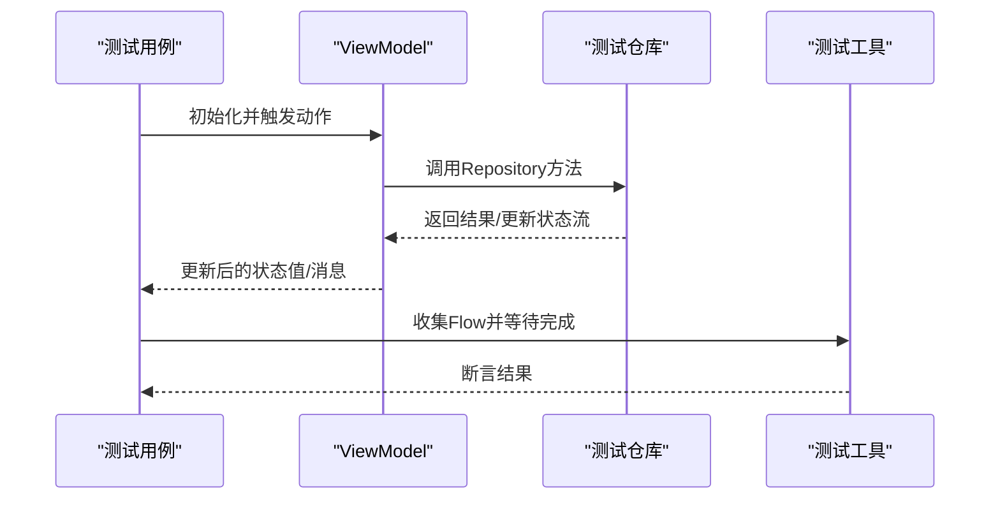
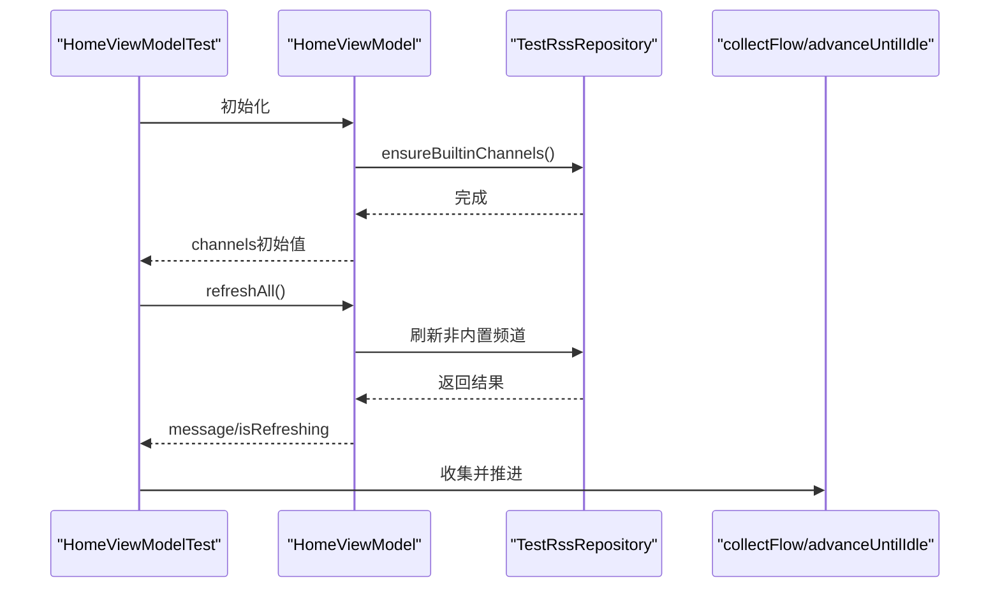
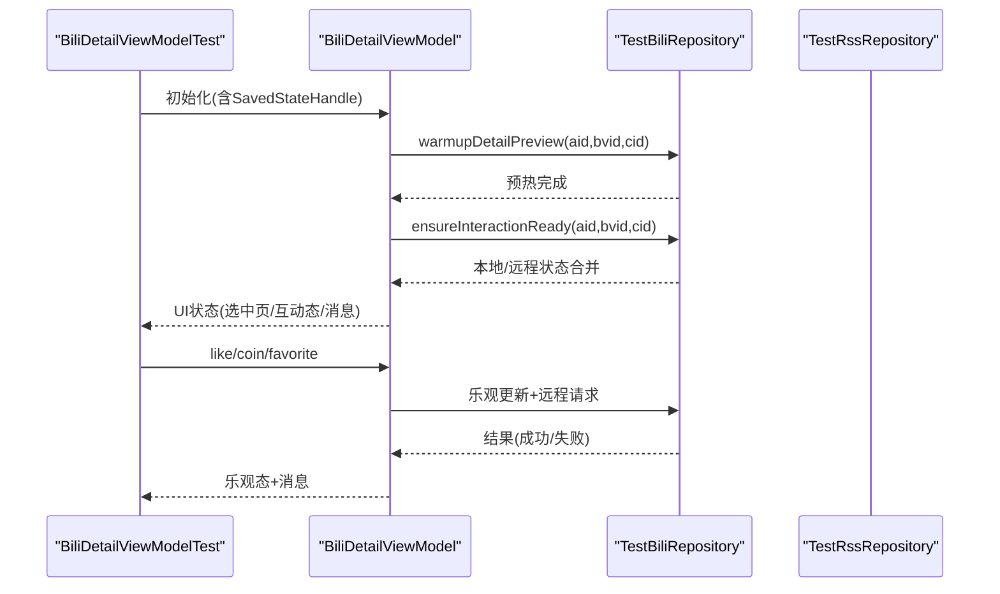
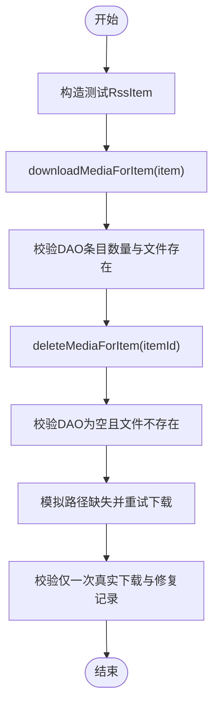
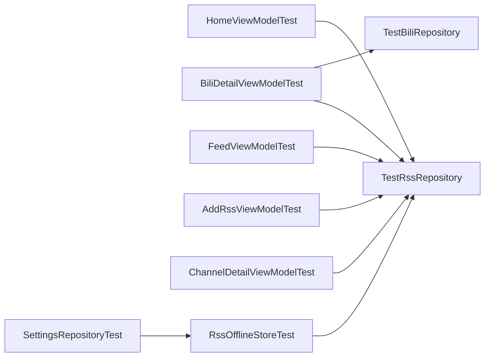

# 单元测试

<cite>
**本文引用的文件**
- [app/src/test/java/com/lightningstudio/watchrss/ui/viewmodel/HomeViewModelTest.kt](file://app/src/test/java/com/lightningstudio/watchrss/ui/viewmodel/HomeViewModelTest.kt)
- [app/src/test/java/com/lightningstudio/watchrss/ui/viewmodel/BiliDetailViewModelTest.kt](file://app/src/test/java/com/lightningstudio/watchrss/ui/viewmodel/BiliDetailViewModelTest.kt)
- [app/src/test/java/com/lightningstudio/watchrss/data/rss/RssOfflineStoreTest.kt](file://app/src/test/java/com/lightningstudio/watchrss/data/rss/RssOfflineStoreTest.kt)
- [app/src/test/java/com/lightningstudio/watchrss/testutil/TestPlatformRepositories.kt](file://app/src/test/java/com/lightningstudio/watchrss/testutil/TestPlatformRepositories.kt)
- [app/src/test/java/com/lightningstudio/watchrss/testutil/TestRssRepository.kt](file://app/src/test/java/com/lightningstudio/watchrss/testutil/TestRssRepository.kt)
- [app/src/test/java/com/lightningstudio/watchrss/testutil/MainDispatcherRule.kt](file://app/src/test/java/com/lightningstudio/watchrss/testutil/MainDispatcherRule.kt)
- [app/src/test/java/com/lightningstudio/watchrss/testutil/FlowTestUtils.kt](file://app/src/test/java/com/lightningstudio/watchrss/testutil/FlowTestUtils.kt)
- [app/src/test/java/com/lightningstudio/watchrss/testutil/FlowCollectionTestUtil.kt](file://app/src/test/java/com/lightningstudio/watchrss/testutil/FlowCollectionTestUtil.kt)
- [app/src/test/java/com/lightningstudio/watchrss/ui/viewmodel/FeedViewModelTest.kt](file://app/src/test/java/com/lightningstudio/watchrss/ui/viewmodel/FeedViewModelTest.kt)
- [app/src/test/java/com/lightningstudio/watchrss/ui/viewmodel/AddRssViewModelTest.kt](file://app/src/test/java/com/lightningstudio/watchrss/ui/viewmodel/AddRssViewModelTest.kt)
- [app/src/test/java/com/lightningstudio/watchrss/ui/viewmodel/ChannelDetailViewModelTest.kt](file://app/src/test/java/com/lightningstudio/watchrss/ui/viewmodel/ChannelDetailViewModelTest.kt)
- [app/src/test/java/com/lightningstudio/watchrss/data/settings/SettingsRepositoryTest.kt](file://app/src/test/java/com/lightningstudio/watchrss/data/settings/SettingsRepositoryTest.kt)
- [app/src/androidTest/java/com/lightningstudio/watchrss/testutil/FakeRssRepository.kt](file://app/src/androidTest/java/com/lightningstudio/watchrss/testutil/FakeRssRepository.kt)
</cite>

## 目录
1. [引言](#引言)
2. [项目结构](#项目结构)
3. [核心组件](#核心组件)
4. [架构总览](#架构总览)
5. [详细组件分析](#详细组件分析)
6. [依赖关系分析](#依赖关系分析)
7. [性能考量](#性能考量)
8. [故障排查指南](#故障排查指南)
9. [结论](#结论)
10. [附录](#附录)

## 引言
本指南面向Android WatchRSS项目的单元测试实施，聚焦以下目标：
- ViewModel测试策略：以HomeViewModel、BiliDetailViewModel等为代表，说明如何通过可配置的测试仓库与工具类验证状态流、交互行为与错误处理。
- Repository层测试设计：以RssOfflineStoreTest为例，展示数据访问层的隔离测试方法与边界条件覆盖。
- 协程测试最佳实践：系统性介绍runTest、advanceUntilIdle等工具的使用时机与注意事项。
- 测试数据准备策略：基于sampleRssChannel、sampleRssItem、sampleBiliItem等构造器，统一构建稳定可重复的测试用例。
- 断言策略与边界条件：通过多场景断言（成功/失败、乐观更新、幂等操作）确保行为正确。
- Mock与替代方案：优先使用轻量Fake/Stub实现，必要时采用外部依赖的临时目录或内存存储。
- 覆盖率与质量标准：给出可执行的质量门槛建议，便于持续改进。

## 项目结构
测试代码主要分布在app模块的test与androidTest两个源集：
- test：纯JVM环境下的单元测试，常用于验证业务逻辑、ViewModel状态与Repository行为。
- androidTest：基于Instrumentation的集成测试，常用于UI与平台依赖场景，包含Fake仓库与测试容器。

下图展示了测试相关的关键文件与角色映射：

**图表来源**
- [app/src/test/java/com/lightningstudio/watchrss/ui/viewmodel/HomeViewModelTest.kt:1-87](file://app/src/test/java/com/lightningstudio/watchrss/ui/viewmodel/HomeViewModelTest.kt#L1-L87)
- [app/src/test/java/com/lightningstudio/watchrss/ui/viewmodel/BiliDetailViewModelTest.kt:1-508](file://app/src/test/java/com/lightningstudio/watchrss/ui/viewmodel/BiliDetailViewModelTest.kt#L1-L508)
- [app/src/test/java/com/lightningstudio/watchrss/data/rss/RssOfflineStoreTest.kt:1-198](file://app/src/test/java/com/lightningstudio/watchrss/data/rss/RssOfflineStoreTest.kt#L1-L198)
- [app/src/test/java/com/lightningstudio/watchrss/testutil/TestPlatformRepositories.kt:1-486](file://app/src/test/java/com/lightningstudio/watchrss/testutil/TestPlatformRepositories.kt#L1-L486)
- [app/src/test/java/com/lightningstudio/watchrss/testutil/TestRssRepository.kt:1-394](file://app/src/test/java/com/lightningstudio/watchrss/testutil/TestRssRepository.kt#L1-L394)
- [app/src/test/java/com/lightningstudio/watchrss/testutil/MainDispatcherRule.kt:1-24](file://app/src/test/java/com/lightningstudio/watchrss/testutil/MainDispatcherRule.kt#L1-L24)
- [app/src/test/java/com/lightningstudio/watchrss/testutil/FlowTestUtils.kt:1-15](file://app/src/test/java/com/lightningstudio/watchrss/testutil/FlowTestUtils.kt#L1-L15)
- [app/src/test/java/com/lightningstudio/watchrss/testutil/FlowCollectionTestUtil.kt:1-15](file://app/src/test/java/com/lightningstudio/watchrss/testutil/FlowCollectionTestUtil.kt#L1-L15)
- [app/src/test/java/com/lightningstudio/watchrss/ui/viewmodel/FeedViewModelTest.kt:1-80](file://app/src/test/java/com/lightningstudio/watchrss/ui/viewmodel/FeedViewModelTest.kt#L1-L80)
- [app/src/test/java/com/lightningstudio/watchrss/ui/viewmodel/AddRssViewModelTest.kt:1-80](file://app/src/test/java/com/lightningstudio/watchrss/ui/viewmodel/AddRssViewModelTest.kt#L1-L80)
- [app/src/test/java/com/lightningstudio/watchrss/ui/viewmodel/ChannelDetailViewModelTest.kt:1-52](file://app/src/test/java/com/lightningstudio/watchrss/ui/viewmodel/ChannelDetailViewModelTest.kt#L1-L52)
- [app/src/test/java/com/lightningstudio/watchrss/data/settings/SettingsRepositoryTest.kt:1-138](file://app/src/test/java/com/lightningstudio/watchrss/data/settings/SettingsRepositoryTest.kt#L1-L138)

**章节来源**
- [app/src/test/java/com/lightningstudio/watchrss/ui/viewmodel/HomeViewModelTest.kt:1-87](file://app/src/test/java/com/lightningstudio/watchrss/ui/viewmodel/HomeViewModelTest.kt#L1-L87)
- [app/src/test/java/com/lightningstudio/watchrss/ui/viewmodel/BiliDetailViewModelTest.kt:1-508](file://app/src/test/java/com/lightningstudio/watchrss/ui/viewmodel/BiliDetailViewModelTest.kt#L1-L508)
- [app/src/test/java/com/lightningstudio/watchrss/data/rss/RssOfflineStoreTest.kt:1-198](file://app/src/test/java/com/lightningstudio/watchrss/data/rss/RssOfflineStoreTest.kt#L1-L198)
- [app/src/test/java/com/lightningstudio/watchrss/testutil/TestPlatformRepositories.kt:1-486](file://app/src/test/java/com/lightningstudio/watchrss/testutil/TestPlatformRepositories.kt#L1-L486)
- [app/src/test/java/com/lightningstudio/watchrss/testutil/TestRssRepository.kt:1-394](file://app/src/test/java/com/lightningstudio/watchrss/testutil/TestRssRepository.kt#L1-L394)
- [app/src/test/java/com/lightningstudio/watchrss/testutil/MainDispatcherRule.kt:1-24](file://app/src/test/java/com/lightningstudio/watchrss/testutil/MainDispatcherRule.kt#L1-L24)
- [app/src/test/java/com/lightningstudio/watchrss/testutil/FlowTestUtils.kt:1-15](file://app/src/test/java/com/lightningstudio/watchrss/testutil/FlowTestUtils.kt#L1-L15)
- [app/src/test/java/com/lightningstudio/watchrss/testutil/FlowCollectionTestUtil.kt:1-15](file://app/src/test/java/com/lightningstudio/watchrss/testutil/FlowCollectionTestUtil.kt#L1-L15)
- [app/src/test/java/com/lightningstudio/watchrss/ui/viewmodel/FeedViewModelTest.kt:1-80](file://app/src/test/java/com/lightningstudio/watchrss/ui/viewmodel/FeedViewModelTest.kt#L1-L80)
- [app/src/test/java/com/lightningstudio/watchrss/ui/viewmodel/AddRssViewModelTest.kt:1-80](file://app/src/test/java/com/lightningstudio/watchrss/ui/viewmodel/AddRssViewModelTest.kt#L1-L80)
- [app/src/test/java/com/lightningstudio/watchrss/ui/viewmodel/ChannelDetailViewModelTest.kt:1-52](file://app/src/test/java/com/lightningstudio/watchrss/ui/viewmodel/ChannelDetailViewModelTest.kt#L1-L52)
- [app/src/test/java/com/lightningstudio/watchrss/data/settings/SettingsRepositoryTest.kt:1-138](file://app/src/test/java/com/lightningstudio/watchrss/data/settings/SettingsRepositoryTest.kt#L1-L138)

## 核心组件
- 测试调度器与协程控制
  - 使用MainDispatcherRule在测试中替换主线程调度器，确保测试可预测且无UI线程依赖。
  - 使用runTest启动测试协程作用域，结合advanceUntilIdle推进挂起操作完成。
- 测试仓库
  - TestRssRepository：集中管理RSS相关状态流与副作用调用记录，便于断言。
  - TestBiliRepository/TestDouyinRepository：模拟第三方平台接口返回与交互状态，支持乐观更新与失败路径。
- Flow收集工具
  - FlowTestUtils与FlowCollectionTestUtil提供统一的Flow收集封装，避免重复样板代码。

**章节来源**
- [app/src/test/java/com/lightningstudio/watchrss/testutil/MainDispatcherRule.kt:1-24](file://app/src/test/java/com/lightningstudio/watchrss/testutil/MainDispatcherRule.kt#L1-L24)
- [app/src/test/java/com/lightningstudio/watchrss/testutil/FlowTestUtils.kt:1-15](file://app/src/test/java/com/lightningstudio/watchrss/testutil/FlowTestUtils.kt#L1-L15)
- [app/src/test/java/com/lightningstudio/watchrss/testutil/FlowCollectionTestUtil.kt:1-15](file://app/src/test/java/com/lightningstudio/watchrss/testutil/FlowCollectionTestUtil.kt#L1-L15)
- [app/src/test/java/com/lightningstudio/watchrss/testutil/TestRssRepository.kt:1-394](file://app/src/test/java/com/lightningstudio/watchrss/testutil/TestRssRepository.kt#L1-L394)
- [app/src/test/java/com/lightningstudio/watchrss/testutil/TestPlatformRepositories.kt:1-486](file://app/src/test/java/com/lightningstudio/watchrss/testutil/TestPlatformRepositories.kt#L1-L486)

## 架构总览
下图展示了ViewModel测试中的典型调用链路与断言点位：

**图表来源**
- [app/src/test/java/com/lightningstudio/watchrss/ui/viewmodel/HomeViewModelTest.kt:24-36](file://app/src/test/java/com/lightningstudio/watchrss/ui/viewmodel/HomeViewModelTest.kt#L24-L36)
- [app/src/test/java/com/lightningstudio/watchrss/ui/viewmodel/BiliDetailViewModelTest.kt:32-62](file://app/src/test/java/com/lightningstudio/watchrss/ui/viewmodel/BiliDetailViewModelTest.kt#L32-L62)
- [app/src/test/java/com/lightningstudio/watchrss/testutil/FlowTestUtils.kt:10-14](file://app/src/test/java/com/lightningstudio/watchrss/testutil/FlowTestUtils.kt#L10-L14)

## 详细组件分析

### HomeViewModel 测试策略
- 关键目标
  - 初始化确保内置频道并暴露频道列表。
  - 刷新所有频道时跳过内置频道，并正确上报首个失败。
  - 频道操作委托给仓库，清空消息后状态重置。
- 实施要点
  - 使用TestRssRepository注入初始频道与刷新结果。
  - 通过collectFlow收集channels与message状态流，配合advanceUntilIdle保证异步完成。
  - 断言仓库调用记录与UI消息状态。
- 边界条件
  - 内置频道URL类型识别与跳过逻辑。
  - 多个频道并发刷新时仅记录非内置频道请求。
  - 清空消息后message应为null且列表不被误删。

**图表来源**
- [app/src/test/java/com/lightningstudio/watchrss/ui/viewmodel/HomeViewModelTest.kt:38-60](file://app/src/test/java/com/lightningstudio/watchrss/ui/viewmodel/HomeViewModelTest.kt#L38-L60)

**章节来源**
- [app/src/test/java/com/lightningstudio/watchrss/ui/viewmodel/HomeViewModelTest.kt:1-87](file://app/src/test/java/com/lightningstudio/watchrss/ui/viewmodel/HomeViewModelTest.kt#L1-L87)
- [app/src/test/java/com/lightningstudio/watchrss/testutil/TestRssRepository.kt:145-164](file://app/src/test/java/com/lightningstudio/watchrss/testutil/TestRssRepository.kt#L145-L164)
- [app/src/test/java/com/lightningstudio/watchrss/testutil/FlowTestUtils.kt:10-14](file://app/src/test/java/com/lightningstudio/watchrss/testutil/FlowTestUtils.kt#L10-L14)

### BiliDetailViewModel 测试策略
- 关键目标
  - 加载详情时根据播放进度与参数选择最优cid进行预热。
  - 成功加载后合并本地与远程互动状态，未登录时保持本地状态。
  - 点赞/投币/收藏等交互采用乐观更新，失败时维持乐观态并显示成功消息。
  - 页面切换时重启预热，避免陈旧cid影响体验。
- 实施要点
  - 使用TestBiliRepository配置视频详情、互动状态与播放源解析结果。
  - 通过SavedStateHandle传入aid/bvid/cid等参数，验证选择页与预热顺序。
  - 断言callLog、本地/远程交互写入与预热请求序列。
- 边界条件
  - 未登录时不应发起远程同步。
  - 取消点赞后清理本地持久化状态。
  - 预期失败时仍需正确调度预热。

**图表来源**
- [app/src/test/java/com/lightningstudio/watchrss/ui/viewmodel/BiliDetailViewModelTest.kt:312-346](file://app/src/test/java/com/lightningstudio/watchrss/ui/viewmodel/BiliDetailViewModelTest.kt#L312-L346)
- [app/src/test/java/com/lightningstudio/watchrss/testutil/TestPlatformRepositories.kt:126-131](file://app/src/test/java/com/lightningstudio/watchrss/testutil/TestPlatformRepositories.kt#L126-L131)

**章节来源**
- [app/src/test/java/com/lightningstudio/watchrss/ui/viewmodel/BiliDetailViewModelTest.kt:1-508](file://app/src/test/java/com/lightningstudio/watchrss/ui/viewmodel/BiliDetailViewModelTest.kt#L1-L508)
- [app/src/test/java/com/lightningstudio/watchrss/testutil/TestPlatformRepositories.kt:1-486](file://app/src/test/java/com/lightningstudio/watchrss/testutil/TestPlatformRepositories.kt#L1-L486)

### Repository层测试：RssOfflineStore
- 关键目标
  - 下载媒体资源到本地并插入离线表，重复下载时去重与幂等。
  - 删除媒体时清理文件与数据库记录。
  - 当本地路径缺失时重试下载并修复记录。
- 实施要点
  - 使用FakeOfflineMediaDao与FakeDownloadClient模拟DAO与下载器。
  - 通过TemporaryFolder提供临时根目录，确保测试隔离。
- 边界条件
  - 已缓存资源不再重复下载。
  - 删除后文件不存在且DAO记录为空。

**图表来源**
- [app/src/test/java/com/lightningstudio/watchrss/data/rss/RssOfflineStoreTest.kt:24-114](file://app/src/test/java/com/lightningstudio/watchrss/data/rss/RssOfflineStoreTest.kt#L24-L114)

**章节来源**
- [app/src/test/java/com/lightningstudio/watchrss/data/rss/RssOfflineStoreTest.kt:1-198](file://app/src/test/java/com/lightningstudio/watchrss/data/rss/RssOfflineStoreTest.kt#L1-L198)

### 其他ViewModel测试要点
- FeedViewModel
  - 分页加载与剩余项判断。
  - 刷新失败时的消息展示与原始内容请求批处理去重。
  - 收藏/稍后再看切换委托仓库并验证调用。
- AddRssViewModel
  - 输入校验与步骤流转（输入/预览/现有/二维码）。
  - 预览与确认添加流程的端到端验证。
- ChannelDetailViewModel
  - 无效频道ID的校验。
  - 刷新、标记已读、启用原内容、删除等动作委托仓库并触发后台刷新。

**章节来源**
- [app/src/test/java/com/lightningstudio/watchrss/ui/viewmodel/FeedViewModelTest.kt:1-80](file://app/src/test/java/com/lightningstudio/watchrss/ui/viewmodel/FeedViewModelTest.kt#L1-L80)
- [app/src/test/java/com/lightningstudio/watchrss/ui/viewmodel/AddRssViewModelTest.kt:1-80](file://app/src/test/java/com/lightningstudio/watchrss/ui/viewmodel/AddRssViewModelTest.kt#L1-L80)
- [app/src/test/java/com/lightningstudio/watchrss/ui/viewmodel/ChannelDetailViewModelTest.kt:1-52](file://app/src/test/java/com/lightningstudio/watchrss/ui/viewmodel/ChannelDetailViewModelTest.kt#L1-L52)

## 依赖关系分析
- 测试仓库与ViewModel的耦合度低，通过接口契约解耦，便于替换与扩展。
- Flow收集工具与MainDispatcherRule提升测试一致性与可维护性。
- Repository层测试通过Fake实现隔离外部依赖，提高稳定性与速度。

**图表来源**
- [app/src/test/java/com/lightningstudio/watchrss/ui/viewmodel/HomeViewModelTest.kt:25-29](file://app/src/test/java/com/lightningstudio/watchrss/ui/viewmodel/HomeViewModelTest.kt#L25-L29)
- [app/src/test/java/com/lightningstudio/watchrss/ui/viewmodel/BiliDetailViewModelTest.kt:47-56](file://app/src/test/java/com/lightningstudio/watchrss/ui/viewmodel/BiliDetailViewModelTest.kt#L47-L56)
- [app/src/test/java/com/lightningstudio/watchrss/data/rss/RssOfflineStoreTest.kt:25-28](file://app/src/test/java/com/lightningstudio/watchrss/data/rss/RssOfflineStoreTest.kt#L25-L28)
- [app/src/test/java/com/lightningstudio/watchrss/data/settings/SettingsRepositoryTest.kt:119-130](file://app/src/test/java/com/lightningstudio/watchrss/data/settings/SettingsRepositoryTest.kt#L119-L130)

**章节来源**
- [app/src/test/java/com/lightningstudio/watchrss/ui/viewmodel/HomeViewModelTest.kt:1-87](file://app/src/test/java/com/lightningstudio/watchrss/ui/viewmodel/HomeViewModelTest.kt#L1-L87)
- [app/src/test/java/com/lightningstudio/watchrss/ui/viewmodel/BiliDetailViewModelTest.kt:1-508](file://app/src/test/java/com/lightningstudio/watchrss/ui/viewmodel/BiliDetailViewModelTest.kt#L1-L508)
- [app/src/test/java/com/lightningstudio/watchrss/data/rss/RssOfflineStoreTest.kt:1-198](file://app/src/test/java/com/lightningstudio/watchrss/data/rss/RssOfflineStoreTest.kt#L1-L198)
- [app/src/test/java/com/lightningstudio/watchrss/data/settings/SettingsRepositoryTest.kt:1-138](file://app/src/test/java/com/lightningstudio/watchrss/data/settings/SettingsRepositoryTest.kt#L1-L138)

## 性能考量
- 使用runTest而非runBlocking，避免阻塞测试线程。
- 合理使用advanceUntilIdle推进挂起任务，减少不必要的等待。
- 尽量使用内存型Fake仓库与临时文件，避免磁盘IO与网络请求。
- 对高频调用的Flow收集采用一次性断言，避免过度收集导致的开销。

## 故障排查指南
- 协程调度问题
  - 若出现主线程依赖导致的不稳定，检查是否正确应用MainDispatcherRule。
- Flow未更新
  - 确认使用collectFlow收集状态流并在适当位置调用advanceUntilIdle。
- 仓库调用未断言
  - 检查测试仓库的调用记录列表是否被正确填充与断言。
- 数据持久化异常
  - SettingsRepositoryTest通过TemporaryFolder与DataStore临时文件验证持久化行为，若失败可检查文件路径与作用域生命周期。

**章节来源**
- [app/src/test/java/com/lightningstudio/watchrss/testutil/MainDispatcherRule.kt:12-23](file://app/src/test/java/com/lightningstudio/watchrss/testutil/MainDispatcherRule.kt#L12-L23)
- [app/src/test/java/com/lightningstudio/watchrss/testutil/FlowTestUtils.kt:10-14](file://app/src/test/java/com/lightningstudio/watchrss/testutil/FlowTestUtils.kt#L10-L14)
- [app/src/test/java/com/lightningstudio/watchrss/data/settings/SettingsRepositoryTest.kt:19-30](file://app/src/test/java/com/lightningstudio/watchrss/data/settings/SettingsRepositoryTest.kt#L19-L30)

## 结论
本指南总结了WatchRSS项目单元测试的实施策略与最佳实践，涵盖ViewModel、Repository与设置模块的测试方法。通过统一的测试仓库、Flow收集工具与协程控制，能够高效验证复杂交互与边界条件。建议在后续迭代中持续完善覆盖率与质量门槛，确保测试对业务变更的及时反馈能力。

## 附录

### 协程测试工具与用法
- runTest：启动测试协程作用域，推荐用于所有协程相关测试。
- advanceUntilIdle：推进所有可调度的任务，确保挂起操作完成。
- collectFlow：收集Flow并返回Job以便在测试结束后取消收集。

**章节来源**
- [app/src/test/java/com/lightningstudio/watchrss/ui/viewmodel/HomeViewModelTest.kt:24-31](file://app/src/test/java/com/lightningstudio/watchrss/ui/viewmodel/HomeViewModelTest.kt#L24-L31)
- [app/src/test/java/com/lightningstudio/watchrss/ui/viewmodel/BiliDetailViewModelTest.kt:32-58](file://app/src/test/java/com/lightningstudio/watchrss/ui/viewmodel/BiliDetailViewModelTest.kt#L32-L58)
- [app/src/test/java/com/lightningstudio/watchrss/testutil/FlowTestUtils.kt:10-14](file://app/src/test/java/com/lightningstudio/watchrss/testutil/FlowTestUtils.kt#L10-L14)

### 测试数据构造器
- sampleRssChannel / sampleRssItem / sampleRssPreviewItem / sampleChannelPreview / sampleSavedItem / sampleOfflineMedia
- sampleBiliItem / sampleBiliVideoDetail / sampleDouyinVideo
- 用途：快速构建稳定、可重复的测试用例，减少样板数据编写成本。

**章节来源**
- [app/src/test/java/com/lightningstudio/watchrss/testutil/TestRssRepository.kt:288-394](file://app/src/test/java/com/lightningstudio/watchrss/testutil/TestRssRepository.kt#L288-L394)
- [app/src/test/java/com/lightningstudio/watchrss/testutil/TestPlatformRepositories.kt:432-485](file://app/src/test/java/com/lightningstudio/watchrss/testutil/TestPlatformRepositories.kt#L432-L485)

### Mock与替代方案
- 优先使用Fake/Stub实现（如TestRssRepository、TestBiliRepository），便于精确控制行为与断言。
- 对于需要真实文件系统的场景（如RssOfflineStoreTest），使用TemporaryFolder提供隔离的临时目录。
- 对于平台依赖（如DataStore），在测试环境中使用临时文件与独立作用域，避免污染真实环境。

**章节来源**
- [app/src/test/java/com/lightningstudio/watchrss/data/rss/RssOfflineStoreTest.kt:20-28](file://app/src/test/java/com/lightningstudio/watchrss/data/rss/RssOfflineStoreTest.kt#L20-L28)
- [app/src/test/java/com/lightningstudio/watchrss/data/settings/SettingsRepositoryTest.kt:119-130](file://app/src/test/java/com/lightningstudio/watchrss/data/settings/SettingsRepositoryTest.kt#L119-L130)
- [app/src/androidTest/java/com/lightningstudio/watchrss/testutil/FakeRssRepository.kt:1-117](file://app/src/androidTest/java/com/lightningstudio/watchrss/testutil/FakeRssRepository.kt#L1-L117)

### 断言策略与边界条件
- 成功/失败路径：验证UI消息、状态流与仓库调用记录。
- 乐观更新：断言UI即时变化与后续远程请求。
- 幂等与去重：批量请求去重、重复下载去重。
- 跳过内置频道：确保刷新与操作不涉及内置频道。

**章节来源**
- [app/src/test/java/com/lightningstudio/watchrss/ui/viewmodel/HomeViewModelTest.kt:38-60](file://app/src/test/java/com/lightningstudio/watchrss/ui/viewmodel/HomeViewModelTest.kt#L38-L60)
- [app/src/test/java/com/lightningstudio/watchrss/ui/viewmodel/BiliDetailViewModelTest.kt:312-346](file://app/src/test/java/com/lightningstudio/watchrss/ui/viewmodel/BiliDetailViewModelTest.kt#L312-L346)
- [app/src/test/java/com/lightningstudio/watchrss/ui/viewmodel/FeedViewModelTest.kt:43-61](file://app/src/test/java/com/lightningstudio/watchrss/ui/viewmodel/FeedViewModelTest.kt#L43-L61)

### 覆盖率与质量标准（建议）
- 建议目标
  - 关键业务路径覆盖率≥80%，核心ViewModel与Repository≥90%。
  - 单元测试通过率100%，无悬挂协程与未断言的副作用。
- 质量门禁
  - 新增功能必须配套单元测试；修改涉及状态流与交互的逻辑需补充边界条件测试。
  - 对协程相关代码强制使用runTest与advanceUntilIdle，避免阻塞式等待。