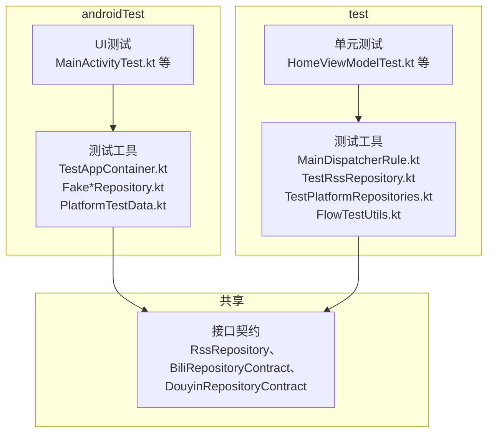
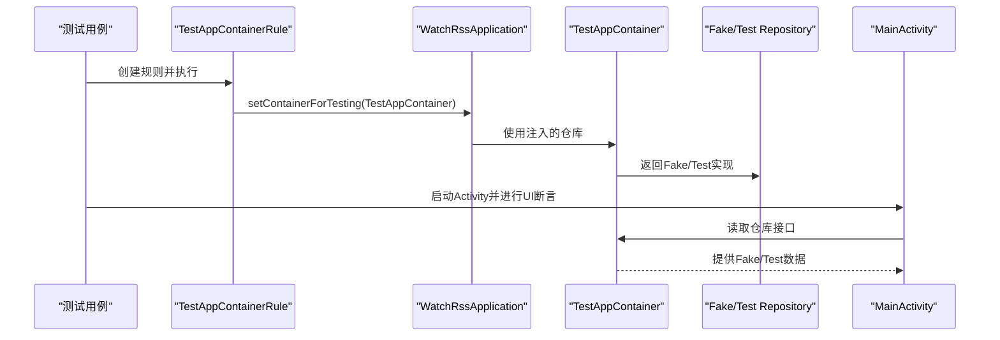
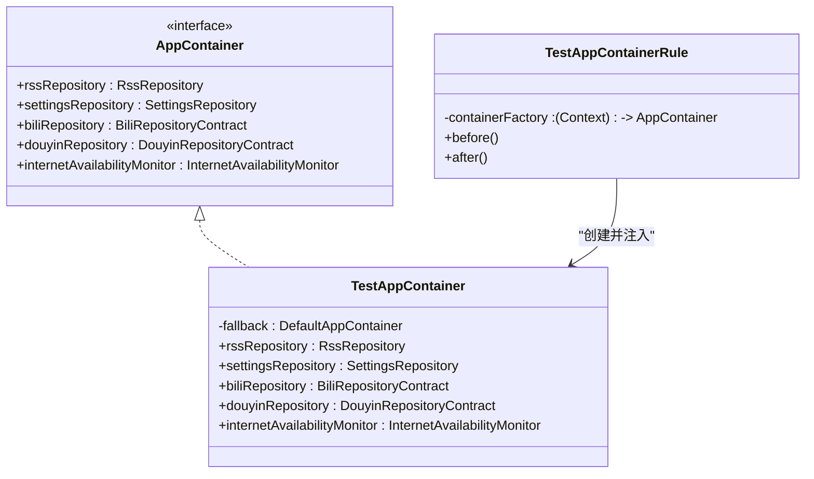
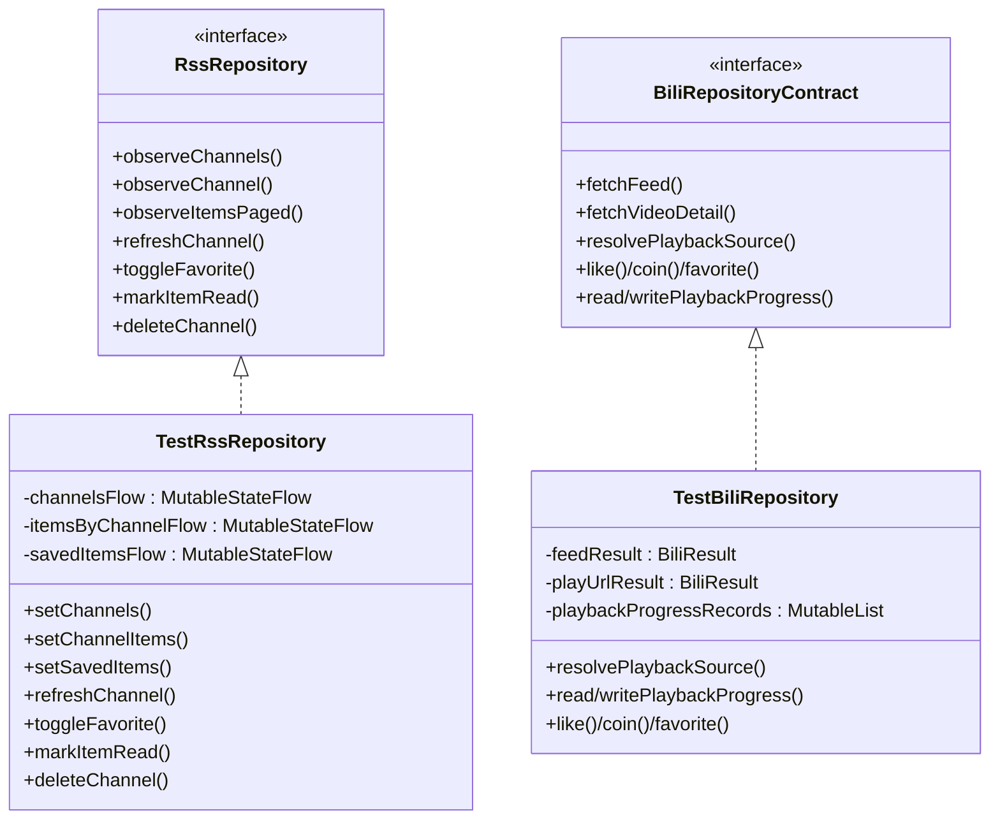
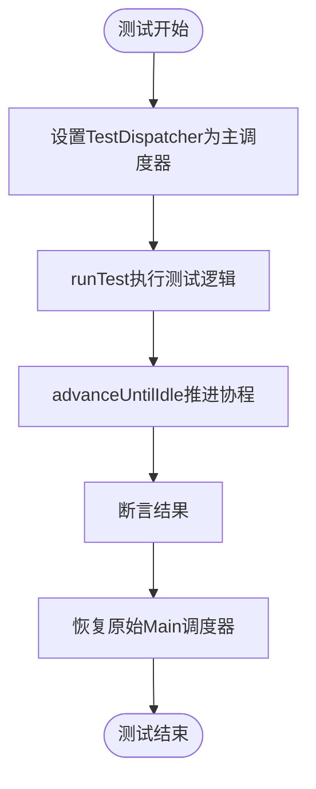
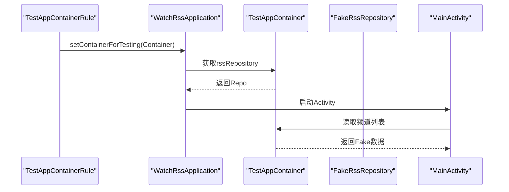
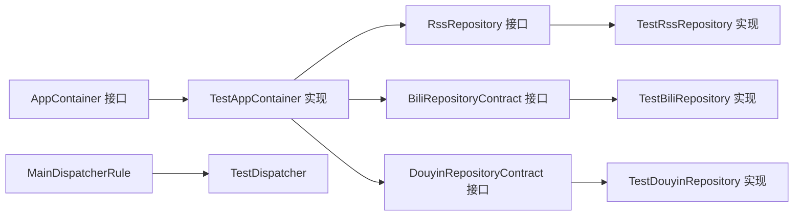

# 测试架构设计

<cite>
**本文档引用的文件**
- [TestAppContainer.kt](file://app/src/androidTest/java/com/lightningstudio/watchrss/testutil/TestAppContainer.kt)
- [FakeRssRepository.kt](file://app/src/androidTest/java/com/lightningstudio/watchrss/testutil/FakeRssRepository.kt)
- [FakeBiliRepository.kt](file://app/src/androidTest/java/com/lightningstudio/watchrss/testutil/FakeBiliRepository.kt)
- [FakeDouyinRepository.kt](file://app/src/androidTest/java/com/lightningstudio/watchrss/testutil/FakeDouyinRepository.kt)
- [MainDispatcherRule.kt](file://app/src/test/java/com/lightningstudio/watchrss/testutil/MainDispatcherRule.kt)
- [PlatformTestData.kt](file://app/src/androidTest/java/com/lightningstudio/watchrss/testutil/PlatformTestData.kt)
- [TestRssRepository.kt](file://app/src/test/java/com/lightningstudio/watchrss/testutil/TestRssRepository.kt)
- [TestPlatformRepositories.kt](file://app/src/test/java/com/lightningstudio/watchrss/testutil/TestPlatformRepositories.kt)
- [MainActivityTest.kt](file://app/src/androidTest/java/com/lightningstudio/watchrss/ui/activity/MainActivityTest.kt)
- [HomeViewModelTest.kt](file://app/src/test/java/com/lightningstudio/watchrss/ui/viewmodel/HomeViewModelTest.kt)
- [libs.versions.toml](file://gradle/libs.versions.toml)
- [FlowTestUtils.kt](file://app/src/test/java/com/lightningstudio/watchrss/testutil/FlowTestUtils.kt)
- [FlowCollectionTestUtil.kt](file://app/src/test/java/com/lightningstudio/watchrss/testutil/FlowCollectionTestUtil.kt)
</cite>

## 目录
1. [引言](#引言)
2. [项目结构](#项目结构)
3. [核心组件](#核心组件)
4. [架构总览](#架构总览)
5. [详细组件分析](#详细组件分析)
6. [依赖关系分析](#依赖关系分析)
7. [性能考虑](#性能考虑)
8. [故障排除指南](#故障排除指南)
9. [结论](#结论)
10. [附录](#附录)

## 引言
本文件面向Android WatchRSS项目的测试架构设计，重点阐述测试容器(TestAppContainer)的设计理念与实现原理，说明如何通过依赖注入实现测试环境的隔离与可替换性；同时系统梳理测试工具链（JUnit、Kotlinx Coroutines Testing、Mockito等）的集成方式，解释测试规则(MainDispatcherRule)的作用与协程测试最佳实践；介绍测试仓库(TestRssRepository、TestBiliRepository等)的设计模式与模拟数据策略，并给出测试架构的扩展性设计与维护策略，帮助开发者高效构建稳定可靠的测试体系。

## 项目结构
测试相关代码主要分布在以下位置：
- androidTest：UI层面的端到端测试与集成测试，使用Compose UI测试与Activity测试
- test：单元测试与协程测试，覆盖ViewModel、Repository等逻辑层
- testutil：测试工具与基础设施，包含测试容器、测试仓库、测试数据、协程调度器规则等

图表来源
- [MainActivityTest.kt:1-88](file://app/src/androidTest/java/com/lightningstudio/watchrss/ui/activity/MainActivityTest.kt#L1-L88)
- [HomeViewModelTest.kt:1-87](file://app/src/test/java/com/lightningstudio/watchrss/ui/viewmodel/HomeViewModelTest.kt#L1-L87)
- [TestAppContainer.kt:1-81](file://app/src/androidTest/java/com/lightningstudio/watchrss/testutil/TestAppContainer.kt#L1-L81)
- [TestRssRepository.kt:1-394](file://app/src/test/java/com/lightningstudio/watchrss/testutil/TestRssRepository.kt#L1-L394)
- [TestPlatformRepositories.kt:1-486](file://app/src/test/java/com/lightningstudio/watchrss/testutil/TestPlatformRepositories.kt#L1-L486)

章节来源
- [MainActivityTest.kt:1-88](file://app/src/androidTest/java/com/lightningstudio/watchrss/ui/activity/MainActivityTest.kt#L1-L88)
- [HomeViewModelTest.kt:1-87](file://app/src/test/java/com/lightningstudio/watchrss/ui/viewmodel/HomeViewModelTest.kt#L1-L87)

## 核心组件
- 测试容器(TestAppContainer)：通过实现应用容器(AppContainer)接口，注入可替换的仓库实现，实现测试环境隔离
- 测试仓库(TestRssRepository、TestBiliRepository、TestDouyinRepository)：以内存状态驱动的模拟实现，支持断言调用轨迹与返回值
- 测试工具(TestAppContainerRule、MainDispatcherRule、FlowTestUtils)：提供测试生命周期管理与协程调度控制
- 平台测试数据(PlatformTestData)：提供B站/抖音/订阅源的标准样例数据，便于快速构造测试场景

章节来源
- [TestAppContainer.kt:21-48](file://app/src/androidTest/java/com/lightningstudio/watchrss/testutil/TestAppContainer.kt#L21-L48)
- [TestRssRepository.kt:19-286](file://app/src/test/java/com/lightningstudio/watchrss/testutil/TestRssRepository.kt#L19-L286)
- [TestPlatformRepositories.kt:52-430](file://app/src/test/java/com/lightningstudio/watchrss/testutil/TestPlatformRepositories.kt#L52-L430)
- [MainDispatcherRule.kt:13-23](file://app/src/test/java/com/lightningstudio/watchrss/testutil/MainDispatcherRule.kt#L13-L23)
- [PlatformTestData.kt:34-239](file://app/src/androidTest/java/com/lightningstudio/watchrss/testutil/PlatformTestData.kt#L34-L239)

## 架构总览
测试架构采用“依赖注入 + 模拟实现”的分层设计：
- 应用层通过AppContainer统一注入各仓库接口
- 测试阶段用Fake/Test实现替换真实仓库，保证测试隔离
- 协程测试通过MainDispatcherRule固定调度器，确保可预测性
- UI测试通过TestAppContainerRule在Activity启动前注入测试容器

图表来源
- [TestAppContainer.kt:50-66](file://app/src/androidTest/java/com/lightningstudio/watchrss/testutil/TestAppContainer.kt#L50-L66)
- [MainActivityTest.kt:45-61](file://app/src/androidTest/java/com/lightningstudio/watchrss/ui/activity/MainActivityTest.kt#L45-L61)

## 详细组件分析

### 测试容器(TestAppContainer)设计
- 设计理念
  - 通过实现AppContainer接口，将真实仓库替换为Fake/Test实现，实现测试环境隔离
  - 支持选择性覆盖：仅对需要测试的模块注入Fake，其他模块沿用默认实现
  - 提供TestAppContainerRule简化测试生命周期管理，自动在before/after中注入与清理

- 关键实现要点
  - 通过构造函数接收Fake仓库实例，若未提供则回退到DefaultAppContainer
  - 重写仓库属性访问器，按需返回Fake或默认实现
  - 提供createTestSettingsRepository辅助方法，使用临时文件创建独立的设置存储

图表来源
- [TestAppContainer.kt:21-48](file://app/src/androidTest/java/com/lightningstudio/watchrss/testutil/TestAppContainer.kt#L21-L48)
- [TestAppContainer.kt:50-66](file://app/src/androidTest/java/com/lightningstudio/watchrss/testutil/TestAppContainer.kt#L50-L66)

章节来源
- [TestAppContainer.kt:21-81](file://app/src/androidTest/java/com/lightningstudio/watchrss/testutil/TestAppContainer.kt#L21-L81)

### 测试仓库设计模式
- TestRssRepository
  - 基于内存状态流(MutableStateFlow)模拟观察者模式，支持断言操作轨迹
  - 提供丰富的配置入口：设置频道、项、收藏、离线媒体、缓存使用量等
  - 支持批量操作与单个操作的断言，便于验证业务流程

- TestBiliRepository / TestDouyinRepository
  - 以可配置的结果队列与延迟机制模拟网络行为
  - 记录调用轨迹(请求参数、调用顺序)，便于断言交互正确性
  - 支持播放进度、互动状态、预览缓存等复杂场景的模拟

- FakeRssRepository / FakeBiliRepository / FakeDouyinRepository
  - 面向androidTest的Fake实现，直接实现接口契约，适合UI测试
  - 提供默认行为与错误场景，便于覆盖边界条件

图表来源
- [TestRssRepository.kt:19-286](file://app/src/test/java/com/lightningstudio/watchrss/testutil/TestRssRepository.kt#L19-L286)
- [TestPlatformRepositories.kt:52-381](file://app/src/test/java/com/lightningstudio/watchrss/testutil/TestPlatformRepositories.kt#L52-L381)

章节来源
- [TestRssRepository.kt:19-394](file://app/src/test/java/com/lightningstudio/watchrss/testutil/TestRssRepository.kt#L19-L394)
- [TestPlatformRepositories.kt:52-486](file://app/src/test/java/com/lightningstudio/watchrss/testutil/TestPlatformRepositories.kt#L52-L486)
- [FakeRssRepository.kt:18-117](file://app/src/androidTest/java/com/lightningstudio/watchrss/testutil/FakeRssRepository.kt#L18-L117)
- [FakeBiliRepository.kt:40-444](file://app/src/androidTest/java/com/lightningstudio/watchrss/testutil/FakeBiliRepository.kt#L40-L444)
- [FakeDouyinRepository.kt:10-105](file://app/src/androidTest/java/com/lightningstudio/watchrss/testutil/FakeDouyinRepository.kt#L10-L105)

### 协程测试与MainDispatcherRule
- MainDispatcherRule作用
  - 在测试开始时将Dispatchers.Main替换为TestDispatcher，确保所有主线程调度可预测
  - 在测试结束时恢复原始Main调度器，避免影响其他测试
  - 与runTest/advanceUntilIdle配合，实现精确的协程执行控制

- 最佳实践
  - 所有协程相关测试均应使用MainDispatcherRule
  - 使用runTest包裹测试逻辑，结合advanceUntilIdle推进挂起操作
  - 对于需要延迟的场景，使用TestBiliRepository的延迟配置模拟真实网络行为

图表来源
- [MainDispatcherRule.kt:13-23](file://app/src/test/java/com/lightningstudio/watchrss/testutil/MainDispatcherRule.kt#L13-L23)
- [HomeViewModelTest.kt:24-36](file://app/src/test/java/com/lightningstudio/watchrss/ui/viewmodel/HomeViewModelTest.kt#L24-L36)

章节来源
- [MainDispatcherRule.kt:13-23](file://app/src/test/java/com/lightningstudio/watchrss/testutil/MainDispatcherRule.kt#L13-L23)
- [HomeViewModelTest.kt:24-36](file://app/src/test/java/com/lightningstudio/watchrss/ui/viewmodel/HomeViewModelTest.kt#L24-L36)

### UI测试与TestAppContainerRule
- TestAppContainerRule工作流
  - 在测试启动前，通过InstrumentationRegistry获取目标Context
  - 调用WatchRssApplication.setContainerForTesting注入TestAppContainer
  - 测试结束后清理，恢复默认容器

- MainActivityTest示例
  - 使用RuleChain组合TestAppContainerRule与Compose测试规则
  - 通过FakeRssRepository提供固定频道数据，验证导航与交互
  - 断言Activity切换与Intent参数传递

图表来源
- [TestAppContainer.kt:50-66](file://app/src/androidTest/java/com/lightningstudio/watchrss/testutil/TestAppContainer.kt#L50-L66)
- [MainActivityTest.kt:45-61](file://app/src/androidTest/java/com/lightningstudio/watchrss/ui/activity/MainActivityTest.kt#L45-L61)

章节来源
- [TestAppContainer.kt:50-66](file://app/src/androidTest/java/com/lightningstudio/watchrss/testutil/TestAppContainer.kt#L50-L66)
- [MainActivityTest.kt:45-87](file://app/src/androidTest/java/com/lightningstudio/watchrss/ui/activity/MainActivityTest.kt#L45-L87)

### 测试工具链集成
- JUnit
  - 作为测试运行框架，提供@Test、@Rule、@RunWith注解
  - 与TestWatcher配合实现MainDispatcherRule的生命周期管理

- Kotlinx Coroutines Testing
  - 通过StandardTestDispatcher与TestDispatcher控制协程调度
  - 与runTest、advanceUntilIdle配合，实现精确的异步测试

- Mockito
  - 版本在libs.versions.toml中定义，可用于部分单元测试场景
  - 注意：当前项目主要使用Fake/Test实现而非Mockito Mock对象

章节来源
- [libs.versions.toml:38-101](file://gradle/libs.versions.toml#L38-L101)
- [MainDispatcherRule.kt:13-23](file://app/src/test/java/com/lightningstudio/watchrss/testutil/MainDispatcherRule.kt#L13-L23)

## 依赖关系分析
测试架构的关键依赖关系如下：
- TestAppContainer依赖AppContainer接口，通过构造函数注入Fake仓库
- Fake/Test仓库实现各自平台的RepositoryContract接口
- 协程测试依赖MainDispatcherRule与TestDispatcher
- UI测试依赖TestAppContainerRule与Compose测试规则

图表来源
- [TestAppContainer.kt:21-48](file://app/src/androidTest/java/com/lightningstudio/watchrss/testutil/TestAppContainer.kt#L21-L48)
- [TestRssRepository.kt:19-286](file://app/src/test/java/com/lightningstudio/watchrss/testutil/TestRssRepository.kt#L19-L286)
- [TestPlatformRepositories.kt:52-381](file://app/src/test/java/com/lightningstudio/watchrss/testutil/TestPlatformRepositories.kt#L52-L381)
- [MainDispatcherRule.kt:13-23](file://app/src/test/java/com/lightningstudio/watchrss/testutil/MainDispatcherRule.kt#L13-L23)

章节来源
- [TestAppContainer.kt:21-48](file://app/src/androidTest/java/com/lightningstudio/watchrss/testutil/TestAppContainer.kt#L21-L48)
- [TestRssRepository.kt:19-286](file://app/src/test/java/com/lightningstudio/watchrss/testutil/TestRssRepository.kt#L19-L286)
- [TestPlatformRepositories.kt:52-381](file://app/src/test/java/com/lightningstudio/watchrss/testutil/TestPlatformRepositories.kt#L52-L381)
- [MainDispatcherRule.kt:13-23](file://app/src/test/java/com/lightningstudio/watchrss/testutil/MainDispatcherRule.kt#L13-L23)

## 性能考虑
- 内存状态驱动的仓库实现避免了真实网络与IO开销，提升测试执行速度
- 协程测试使用TestDispatcher避免主线程阻塞，提高并发测试效率
- 通过延迟配置模拟真实网络行为，平衡测试稳定性与性能
- 建议在大规模测试中复用相同Fake仓库实例，减少重复初始化成本

## 故障排除指南
- 协程测试不稳定
  - 确认已使用MainDispatcherRule并正确调用advanceUntilIdle
  - 检查TestDispatcher是否被其他测试污染，必要时在测试间添加resetMain

- UI测试导航异常
  - 确认TestAppContainerRule已在RuleChain中正确组合
  - 检查Fake仓库提供的数据是否满足Activity期望

- 数据断言不准确
  - 使用TestRssRepository/TestBiliRepository的调用轨迹字段进行断言
  - 对于异步操作，确保在advanceUntilIdle后进行断言

章节来源
- [MainDispatcherRule.kt:13-23](file://app/src/test/java/com/lightningstudio/watchrss/testutil/MainDispatcherRule.kt#L13-L23)
- [TestRssRepository.kt:30-56](file://app/src/test/java/com/lightningstudio/watchrss/testutil/TestRssRepository.kt#L30-L56)
- [TestPlatformRepositories.kt:56-118](file://app/src/test/java/com/lightningstudio/watchrss/testutil/TestPlatformRepositories.kt#L56-L118)

## 结论
Android WatchRSS的测试架构通过“依赖注入 + 模拟实现”实现了测试环境的高度隔离与可控性。TestAppContainer与TestAppContainerRule提供了简洁的容器替换机制；Fake/Test仓库以内存状态驱动，既保证了测试稳定性，又便于断言业务流程；协程测试通过MainDispatcherRule与TestDispatcher确保了可预测性。该架构易于扩展，能够支持新测试类型的添加与现有测试的维护。

## 附录

### 新测试类型添加指南
- 单元测试
  - 使用TestRssRepository/TestPlatformRepositories作为依赖注入
  - 通过MainDispatcherRule与runTest编写协程测试
  - 利用FlowTestUtils/FlowCollectionTestUtil收集Flow状态

- UI测试
  - 使用TestAppContainerRule注入Fake仓库
  - 通过Compose测试规则进行界面断言
  - 使用PlatformTestData快速构造测试数据

- 集成测试
  - 复用TestAppContainer与Fake仓库
  - 通过InstrumentationRegistry获取上下文
  - 注意清理TestAppContainer，避免跨测试污染

### 现有测试维护策略
- 统一使用Fake/Test仓库替代真实实现，保持测试独立性
- 协程测试必须包含MainDispatcherRule，确保调度一致性
- 对于复杂交互，优先使用调用轨迹断言而非Mock对象
- 定期更新PlatformTestData，确保测试数据与接口契约一致