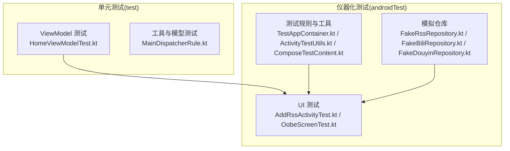
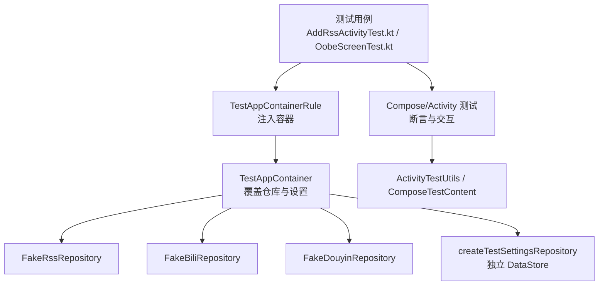
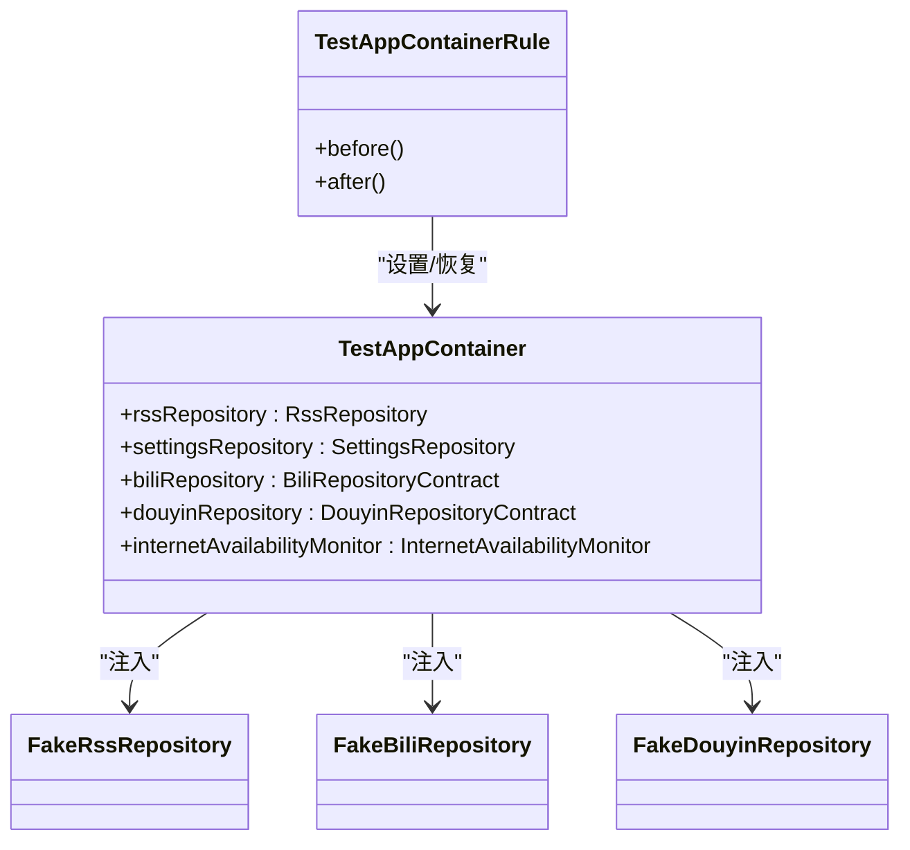
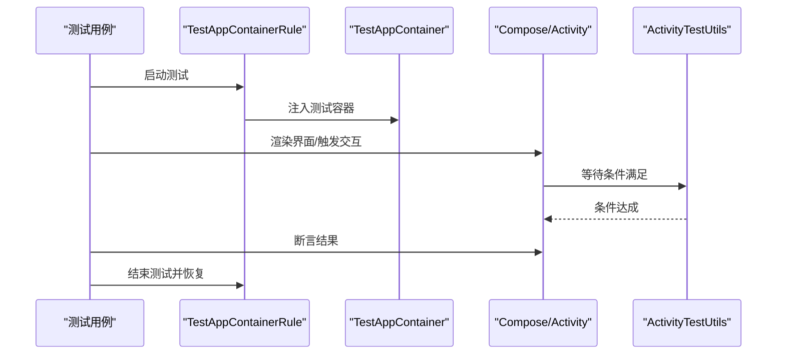
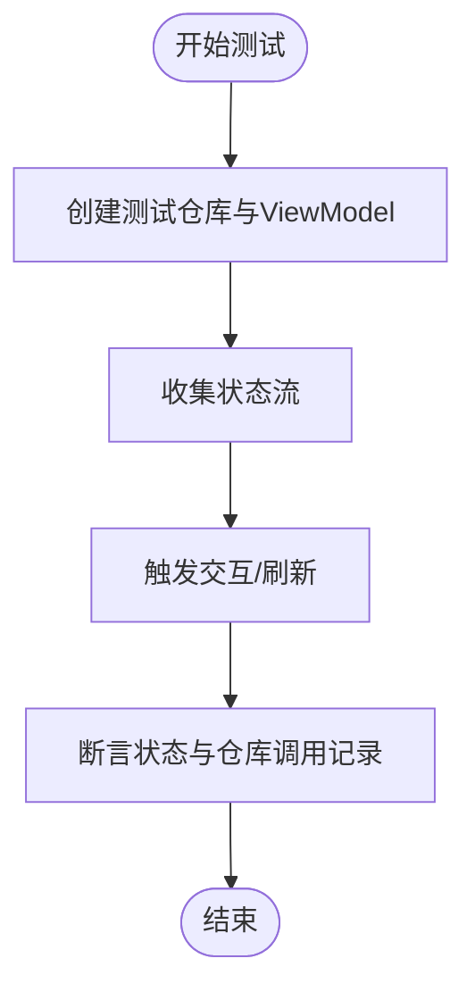
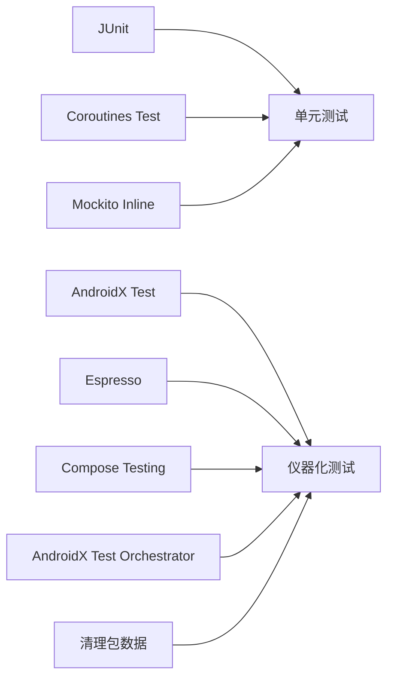

# 测试策略

<cite>
**本文引用的文件**
- [TestAppContainer.kt](file://app/src/androidTest/java/com/lightningstudio/watchrss/testutil/TestAppContainer.kt)
- [FakeRssRepository.kt](file://app/src/androidTest/java/com/lightningstudio/watchrss/testutil/FakeRssRepository.kt)
- [FakeBiliRepository.kt](file://app/src/androidTest/java/com/lightningstudio/watchrss/testutil/FakeBiliRepository.kt)
- [FakeDouyinRepository.kt](file://app/src/androidTest/java/com/lightningstudio/watchrss/testutil/FakeDouyinRepository.kt)
- [PlatformTestData.kt](file://app/src/androidTest/java/com/lightningstudio/watchrss/testutil/PlatformTestData.kt)
- [ActivityTestUtils.kt](file://app/src/androidTest/java/com/lightningstudio/watchrss/testutil/ActivityTestUtils.kt)
- [ComposeTestContent.kt](file://app/src/androidTest/java/com/lightningstudio/watchrss/testutil/ComposeTestContent.kt)
- [AddRssActivityTest.kt](file://app/src/androidTest/java/com/lightningstudio/watchrss/ui/activity/AddRssActivityTest.kt)
- [OobeScreenTest.kt](file://app/src/androidTest/java/com/lightningstudio/watchrss/ui/screen/OobeScreenTest.kt)
- [HomeViewModelTest.kt](file://app/src/test/java/com/lightningstudio/watchrss/ui/viewmodel/HomeViewModelTest.kt)
- [MainDispatcherRule.kt](file://app/src/test/java/com/lightningstudio/watchrss/testutil/MainDispatcherRule.kt)
- [build.gradle.kts](file://app/build.gradle.kts)
- [android-real-device.yml](file://.github/workflows/android-real-device.yml)
</cite>

## 目录
1. [引言](#引言)
2. [项目结构与测试组织](#项目结构与测试组织)
3. [核心组件与测试工具链](#核心组件与测试工具链)
4. [架构总览](#架构总览)
5. [详细组件分析](#详细组件分析)
6. [依赖关系分析](#依赖关系分析)
7. [性能与稳定性考量](#性能与稳定性考量)
8. [故障排查指南](#故障排查指南)
9. [结论](#结论)
10. [附录：测试用例设计与质量标准](#附录测试用例设计与质量标准)

## 引言
本测试策略文档面向 Android WatchRSS 项目，系统化阐述测试架构与实施方法，覆盖单元测试、集成测试与 UI 测试（含 Compose 与 Activity）。文档重点解释测试容器 TestAppContainer 的设计与依赖注入机制，说明如何通过规则与模拟仓库隔离真实外部依赖；并给出 ViewModel、Repository、UI 组件与端到端测试的实现策略、断言与覆盖率建议、持续集成中的自动化流程与报告生成路径，以及调试技巧与常见问题处理。

## 项目结构与测试组织
项目采用按层次与功能混合的组织方式：
- 单元测试（test）：主要针对 ViewModel、数据模型与工具类，使用 JUnit 与 Kotlin Coroutines Test，配合 MainDispatcherRule 控制调度器。
- 仪器化测试（androidTest）：覆盖 Activity 与 Compose 屏幕，使用 AndroidX Test、Espresso、Compose Testing，结合 TestAppContainer 注入测试依赖。

图表来源
- [HomeViewModelTest.kt:1-87](file://app/src/test/java/com/lightningstudio/watchrss/ui/viewmodel/HomeViewModelTest.kt#L1-L87)
- [AddRssActivityTest.kt:1-52](file://app/src/androidTest/java/com/lightningstudio/watchrss/ui/activity/AddRssActivityTest.kt#L1-L52)
- [OobeScreenTest.kt:1-101](file://app/src/androidTest/java/com/lightningstudio/watchrss/ui/screen/OobeScreenTest.kt#L1-L101)
- [TestAppContainer.kt:1-81](file://app/src/androidTest/java/com/lightningstudio/watchrss/testutil/TestAppContainer.kt#L1-L81)
- [ActivityTestUtils.kt:1-28](file://app/src/androidTest/java/com/lightningstudio/watchrss/testutil/ActivityTestUtils.kt#L1-L28)
- [ComposeTestContent.kt:1-14](file://app/src/androidTest/java/com/lightningstudio/watchrss/testutil/ComposeTestContent.kt#L1-L14)
- [FakeRssRepository.kt:1-117](file://app/src/androidTest/java/com/lightningstudio/watchrss/testutil/FakeRssRepository.kt#L1-L117)
- [FakeBiliRepository.kt:1-481](file://app/src/androidTest/java/com/lightningstudio/watchrss/testutil/FakeBiliRepository.kt#L1-L481)
- [FakeDouyinRepository.kt:1-105](file://app/src/androidTest/java/com/lightningstudio/watchrss/testutil/FakeDouyinRepository.kt#L1-L105)

章节来源
- [HomeViewModelTest.kt:1-87](file://app/src/test/java/com/lightningstudio/watchrss/ui/viewmodel/HomeViewModelTest.kt#L1-L87)
- [AddRssActivityTest.kt:1-52](file://app/src/androidTest/java/com/lightningstudio/watchrss/ui/activity/AddRssActivityTest.kt#L1-L52)
- [OobeScreenTest.kt:1-101](file://app/src/androidTest/java/com/lightningstudio/watchrss/ui/screen/OobeScreenTest.kt#L1-L101)
- [TestAppContainer.kt:1-81](file://app/src/androidTest/java/com/lightningstudio/watchrss/testutil/TestAppContainer.kt#L1-L81)
- [ActivityTestUtils.kt:1-28](file://app/src/androidTest/java/com/lightningstudio/watchrss/testutil/ActivityTestUtils.kt#L1-L28)
- [ComposeTestContent.kt:1-14](file://app/src/androidTest/java/com/lightningstudio/watchrss/testutil/ComposeTestContent.kt#L1-L14)
- [FakeRssRepository.kt:1-117](file://app/src/androidTest/java/com/lightningstudio/watchrss/testutil/FakeRssRepository.kt#L1-L117)
- [FakeBiliRepository.kt:1-481](file://app/src/androidTest/java/com/lightningstudio/watchrss/testutil/FakeBiliRepository.kt#L1-L481)
- [FakeDouyinRepository.kt:1-105](file://app/src/androidTest/java/com/lightningstudio/watchrss/testutil/FakeDouyinRepository.kt#L1-L105)

## 核心组件与测试工具链
- 测试容器与依赖注入
  - TestAppContainer：在测试运行时替换应用的 AppContainer，注入 Fake 或测试专用仓库与设置存储，确保测试环境与生产环境隔离。
  - TestAppContainerRule：JUnit 规则，在测试前后注入/恢复容器，保证每个测试的独立性。
  - createTestSettingsRepository：为测试创建独立的 DataStore 文件，避免跨测试污染。
- 模拟仓库
  - FakeRssRepository：提供 RSS 通道、缓存、收藏、离线媒体等观察与操作的可控实现。
  - FakeBiliRepository：提供 B 站登录、推荐、播放、互动、搜索、评论等完整模拟。
  - FakeDouyinRepository：提供抖音登录、推荐、播放等模拟。
  - PlatformTestData：提供可复用的样本数据构造函数，便于快速构建测试场景。
- UI 测试工具
  - ActivityTestUtils：等待条件满足与获取当前 Resumed Activity，辅助稳定等待。
  - ComposeTestContent：统一 Compose 测试主题包装，确保 UI 断言一致性。
- 单元测试工具
  - MainDispatcherRule：统一替换 Main 调度器，确保协程测试确定性。
- 构建与运行
  - build.gradle.kts：声明 JUnit、Espresso、Compose Testing、Coroutines Test、Mockito Inline 等依赖，并支持 AndroidX Test Orchestrator 与包数据清理。
  - GitHub Actions 工作流：在真实设备上执行连接测试，支持过滤测试类、清理应用数据与收集产物。

章节来源
- [TestAppContainer.kt:1-81](file://app/src/androidTest/java/com/lightningstudio/watchrss/testutil/TestAppContainer.kt#L1-L81)
- [FakeRssRepository.kt:1-117](file://app/src/androidTest/java/com/lightningstudio/watchrss/testutil/FakeRssRepository.kt#L1-L117)
- [FakeBiliRepository.kt:1-481](file://app/src/androidTest/java/com/lightningstudio/watchrss/testutil/FakeBiliRepository.kt#L1-L481)
- [FakeDouyinRepository.kt:1-105](file://app/src/androidTest/java/com/lightningstudio/watchrss/testutil/FakeDouyinRepository.kt#L1-L105)
- [PlatformTestData.kt:1-239](file://app/src/androidTest/java/com/lightningstudio/watchrss/testutil/PlatformTestData.kt#L1-L239)
- [ActivityTestUtils.kt:1-28](file://app/src/androidTest/java/com/lightningstudio/watchrss/testutil/ActivityTestUtils.kt#L1-L28)
- [ComposeTestContent.kt:1-14](file://app/src/androidTest/java/com/lightningstudio/watchrss/testutil/ComposeTestContent.kt#L1-L14)
- [MainDispatcherRule.kt:1-24](file://app/src/test/java/com/lightningstudio/watchrss/testutil/MainDispatcherRule.kt#L1-L24)
- [build.gradle.kts:93-147](file://app/build.gradle.kts#L93-L147)
- [android-real-device.yml:1-110](file://.github/workflows/android-real-device.yml#L1-L110)

## 架构总览
下图展示测试容器如何在仪器化测试中注入依赖，隔离真实网络与数据库，使 UI 与业务逻辑测试稳定可靠。

图表来源
- [AddRssActivityTest.kt:20-39](file://app/src/androidTest/java/com/lightningstudio/watchrss/ui/activity/AddRssActivityTest.kt#L20-L39)
- [OobeScreenTest.kt:16-40](file://app/src/androidTest/java/com/lightningstudio/watchrss/ui/screen/OobeScreenTest.kt#L16-L40)
- [TestAppContainer.kt:50-66](file://app/src/androidTest/java/com/lightningstudio/watchrss/testutil/TestAppContainer.kt#L50-L66)
- [FakeRssRepository.kt:18-117](file://app/src/androidTest/java/com/lightningstudio/watchrss/testutil/FakeRssRepository.kt#L18-L117)
- [FakeBiliRepository.kt:40-481](file://app/src/androidTest/java/com/lightningstudio/watchrss/testutil/FakeBiliRepository.kt#L40-L481)
- [FakeDouyinRepository.kt:10-105](file://app/src/androidTest/java/com/lightningstudio/watchrss/testutil/FakeDouyinRepository.kt#L10-L105)
- [ActivityTestUtils.kt:9-28](file://app/src/androidTest/java/com/lightningstudio/watchrss/testutil/ActivityTestUtils.kt#L9-L28)
- [ComposeTestContent.kt:7-14](file://app/src/androidTest/java/com/lightningstudio/watchrss/testutil/ComposeTestContent.kt#L7-L14)

## 详细组件分析

### 测试容器与依赖注入（TestAppContainer）
- 设计目标
  - 在测试生命周期内替换应用的 AppContainer，注入 Fake 仓库与独立设置存储，避免真实网络与持久化影响。
  - 提供 TestAppContainerRule，自动在测试前注入、测试后恢复，保证测试隔离。
- 关键点
  - 可选覆盖：允许对特定仓库或网络监控进行显式替换，其余使用默认容器。
  - 独立设置：通过 createTestSettingsRepository 创建基于临时文件的 DataStore，避免跨测试污染。
- 使用模式
  - 在测试类中组合 TestAppContainerRule 与 Compose/Activity 规则，形成 RuleChain，确保注入顺序正确。

图表来源
- [TestAppContainer.kt:21-48](file://app/src/androidTest/java/com/lightningstudio/watchrss/testutil/TestAppContainer.kt#L21-L48)
- [TestAppContainer.kt:50-66](file://app/src/androidTest/java/com/lightningstudio/watchrss/testutil/TestAppContainer.kt#L50-L66)
- [FakeRssRepository.kt:18-117](file://app/src/androidTest/java/com/lightningstudio/watchrss/testutil/FakeRssRepository.kt#L18-L117)
- [FakeBiliRepository.kt:40-481](file://app/src/androidTest/java/com/lightningstudio/watchrss/testutil/FakeBiliRepository.kt#L40-L481)
- [FakeDouyinRepository.kt:10-105](file://app/src/androidTest/java/com/lightningstudio/watchrss/testutil/FakeDouyinRepository.kt#L10-L105)

章节来源
- [TestAppContainer.kt:1-81](file://app/src/androidTest/java/com/lightningstudio/watchrss/testutil/TestAppContainer.kt#L1-L81)
- [AddRssActivityTest.kt:20-39](file://app/src/androidTest/java/com/lightningstudio/watchrss/ui/activity/AddRssActivityTest.kt#L20-L39)
- [OobeScreenTest.kt:16-40](file://app/src/androidTest/java/com/lightningstudio/watchrss/ui/screen/OobeScreenTest.kt#L16-L40)

### UI 组件测试（Compose 与 Activity）
- Compose 测试
  - 使用 createComposeRule 或 createAndroidComposeRule，结合 setWatchContent 包裹主题，确保渲染一致。
  - 通过标签与文本断言验证 UI 呈现与交互行为。
- Activity 测试
  - 使用 AndroidX Test 与 Espresso，结合 TestAppContainerRule 注入测试环境。
  - 使用 waitUntil 辅助等待异步加载完成，提升稳定性。
- 示例
  - AddRssActivityTest：验证输入框与远程入口按钮存在。
  - OobeScreenTest：验证引导页切换、协议页同意与错误提示。

图表来源
- [AddRssActivityTest.kt:20-50](file://app/src/androidTest/java/com/lightningstudio/watchrss/ui/activity/AddRssActivityTest.kt#L20-L50)
- [OobeScreenTest.kt:16-100](file://app/src/androidTest/java/com/lightningstudio/watchrss/ui/screen/OobeScreenTest.kt#L16-L100)
- [ActivityTestUtils.kt:9-28](file://app/src/androidTest/java/com/lightningstudio/watchrss/testutil/ActivityTestUtils.kt#L9-L28)
- [ComposeTestContent.kt:7-14](file://app/src/androidTest/java/com/lightningstudio/watchrss/testutil/ComposeTestContent.kt#L7-L14)

章节来源
- [AddRssActivityTest.kt:1-52](file://app/src/androidTest/java/com/lightningstudio/watchrss/ui/activity/AddRssActivityTest.kt#L1-L52)
- [OobeScreenTest.kt:1-101](file://app/src/androidTest/java/com/lightningstudio/watchrss/ui/screen/OobeScreenTest.kt#L1-L101)
- [ActivityTestUtils.kt:1-28](file://app/src/androidTest/java/com/lightningstudio/watchrss/testutil/ActivityTestUtils.kt#L1-L28)
- [ComposeTestContent.kt:1-14](file://app/src/androidTest/java/com/lightningstudio/watchrss/testutil/ComposeTestContent.kt#L1-L14)

### ViewModel 测试策略
- 目标
  - 验证状态流转、消息与错误传播、与仓库交互的正确性。
- 方法
  - 使用 MainDispatcherRule 替换调度器，确保协程确定性。
  - 以 Test*Repository 作为仓库桩，控制返回值与副作用。
  - 收集 StateFlow/SharedFlow 并断言最终状态。
- 示例
  - HomeViewModelTest：验证内置频道初始化、刷新失败传播、频道动作委托与消息清空。

图表来源
- [HomeViewModelTest.kt:18-87](file://app/src/test/java/com/lightningstudio/watchrss/ui/viewmodel/HomeViewModelTest.kt#L18-L87)
- [MainDispatcherRule.kt:12-24](file://app/src/test/java/com/lightningstudio/watchrss/testutil/MainDispatcherRule.kt#L12-L24)

章节来源
- [HomeViewModelTest.kt:1-87](file://app/src/test/java/com/lightningstudio/watchrss/ui/viewmodel/HomeViewModelTest.kt#L1-L87)
- [MainDispatcherRule.kt:1-24](file://app/src/test/java/com/lightningstudio/watchrss/testutil/MainDispatcherRule.kt#L1-L24)

### Repository 测试策略
- 目标
  - 隔离网络与本地存储，验证数据层行为与错误处理。
- 方法
  - 使用 Fake*Repository 提供可控响应与副作用记录（如请求次数、参数、缓存命中等）。
  - 对于 RSS 仓库，验证分页、搜索、收藏、离线媒体等观察与命令接口。
  - 对于 B 站/抖音仓库，验证登录、QR 登录轮询、播放源解析、互动、历史、收藏夹、搜索、评论等。
- 数据准备
  - 使用 PlatformTestData 快速构造样本数据，减少重复代码。

章节来源
- [FakeRssRepository.kt:1-117](file://app/src/androidTest/java/com/lightningstudio/watchrss/testutil/FakeRssRepository.kt#L1-L117)
- [FakeBiliRepository.kt:1-481](file://app/src/androidTest/java/com/lightningstudio/watchrss/testutil/FakeBiliRepository.kt#L1-L481)
- [FakeDouyinRepository.kt:1-105](file://app/src/androidTest/java/com/lightningstudio/watchrss/testutil/FakeDouyinRepository.kt#L1-L105)
- [PlatformTestData.kt:1-239](file://app/src/androidTest/java/com/lightningstudio/watchrss/testutil/PlatformTestData.kt#L1-L239)

### 端到端测试策略
- 目标
  - 在真实设备上验证从启动到关键路径的完整流程。
- 方法
  - 使用 GitHub Actions 在自建真实设备 Runner 上执行 connectedDebugAndroidTest。
  - 支持过滤测试类、清理应用数据、收集日志与截图等产物。
- 关键配置
  - Gradle 属性：watchrss.instrumentation.orchestrator、watchrss.instrumentation.clearPackageData。
  - 工作流：构建、预检、冒烟、连接测试、产物收集。

章节来源
- [android-real-device.yml:1-110](file://.github/workflows/android-real-device.yml#L1-L110)
- [build.gradle.kts:17-27](file://app/build.gradle.kts#L17-L27)
- [build.gradle.kts:85-90](file://app/build.gradle.kts#L85-L90)

## 依赖关系分析
- 测试依赖
  - 单元测试：JUnit、Kotlin Coroutines Test、Mockito Inline。
  - 仪器化测试：AndroidX Test、Espresso、Compose Testing、Orchestrator。
- 运行时隔离
  - 通过 TestAppContainerRule 与独立 SettingsRepository，避免共享状态干扰。
- CI 集成
  - 工作流中启用清理与隔离选项，确保测试稳定性与可重复性。

图表来源
- [build.gradle.kts:135-147](file://app/build.gradle.kts#L135-L147)

章节来源
- [build.gradle.kts:93-147](file://app/build.gradle.kts#L93-L147)

## 性能与稳定性考量
- 动画禁用：在测试配置中关闭动画，避免布局测量抖动。
- 调度器控制：使用 MainDispatcherRule 固定主线程调度，避免并发不确定性。
- 等待策略：使用 waitUntil 与 waitForIdleSync，确保 UI 与后台任务稳定。
- 设备隔离：CI 中启用 AndroidX Test Orchestrator 与包数据清理，降低设备间干扰。

章节来源
- [build.gradle.kts:85-90](file://app/build.gradle.kts#L85-L90)
- [MainDispatcherRule.kt:12-24](file://app/src/test/java/com/lightningstudio/watchrss/testutil/MainDispatcherRule.kt#L12-L24)
- [ActivityTestUtils.kt:9-28](file://app/src/androidTest/java/com/lightningstudio/watchrss/testutil/ActivityTestUtils.kt#L9-L28)
- [android-real-device.yml:40-41](file://.github/workflows/android-real-device.yml#L40-L41)

## 故障排查指南
- 测试不稳定（UI 未就绪）
  - 使用 waitUntil 包装条件判断，避免过早断言。
  - 在 Compose 测试中使用 setWatchContent 包裹主题，确保渲染一致。
- 容器未注入或恢复异常
  - 确认 TestAppContainerRule 位于 RuleChain 首位，且测试结束后会恢复容器。
- 数据污染或状态残留
  - 使用 createTestSettingsRepository 创建独立设置存储；必要时开启清理包数据。
- 设备相关问题
  - 在工作流中启用 Orchestrator 与清理选项；检查设备序列号与日志采集脚本。

章节来源
- [ActivityTestUtils.kt:9-28](file://app/src/androidTest/java/com/lightningstudio/watchrss/testutil/ActivityTestUtils.kt#L9-L28)
- [ComposeTestContent.kt:7-14](file://app/src/androidTest/java/com/lightningstudio/watchrss/testutil/ComposeTestContent.kt#L7-L14)
- [TestAppContainer.kt:50-66](file://app/src/androidTest/java/com/lightningstudio/watchrss/testutil/TestAppContainer.kt#L50-L66)
- [android-real-device.yml:74-97](file://.github/workflows/android-real-device.yml#L74-L97)

## 结论
本测试策略通过 TestAppContainer 实现测试环境隔离，结合 Fake 仓库与统一的 UI/Activity 测试工具，覆盖了 ViewModel、Repository、UI 组件与端到端场景。配合 CI 的隔离与清理配置，能够稳定地在真实设备上执行自动化测试。建议持续完善覆盖率与断言策略，逐步引入更多集成测试与性能回归用例。

## 附录：测试用例设计与质量标准
- 设计原则
  - 单一职责：每个测试聚焦一个行为或边界条件。
  - 可重现：使用固定种子与独立设置存储，避免随机性。
  - 可维护：优先使用 PlatformTestData 构造样本数据，减少重复。
- 覆盖率要求（建议）
  - 单元测试：核心 ViewModel 与工具类达到高行/分支覆盖率。
  - 集成测试：关键仓库接口与 UI 关键路径覆盖。
  - 端到端：核心用户旅程（如添加 RSS、引导流程）覆盖。
- 质量标准
  - 断言明确：状态、消息、仓库调用记录均应断言。
  - 错误处理：对失败场景与异常路径进行断言。
  - 性能回归：对关键页面渲染与交互延迟建立基线。
- 持续集成
  - 自动化：工作流中自动构建、预检、连接测试与产物收集。
  - 报告：结合日志与截图，定位失败原因并归档。