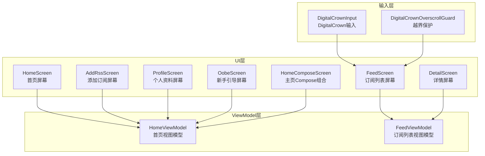
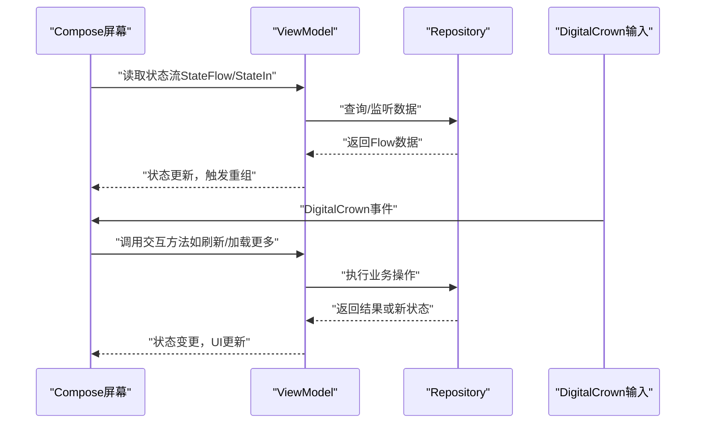
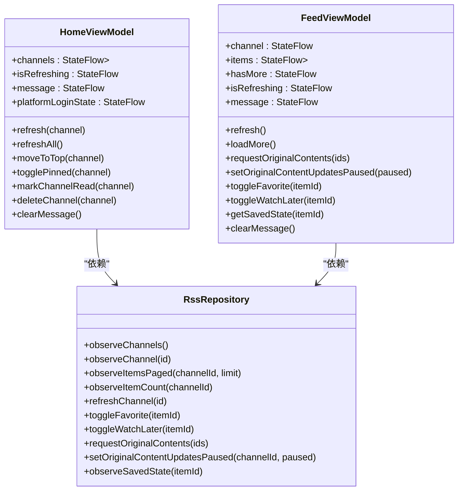
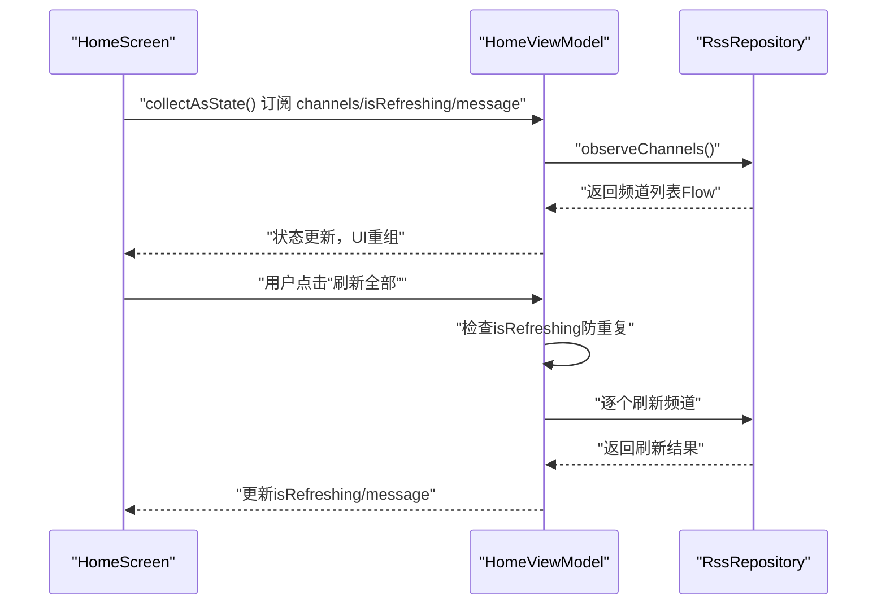
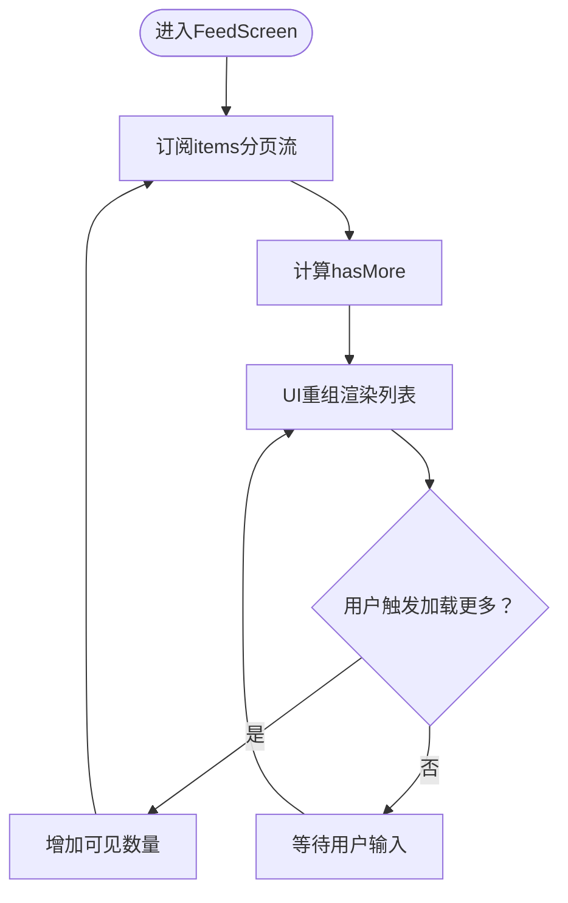
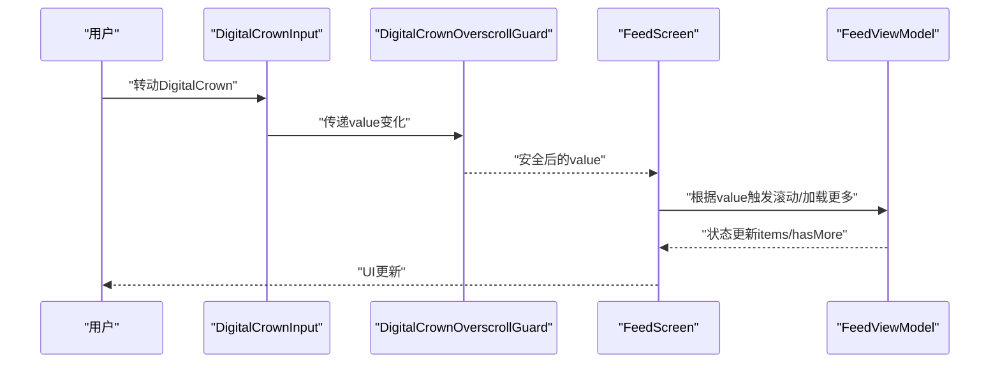
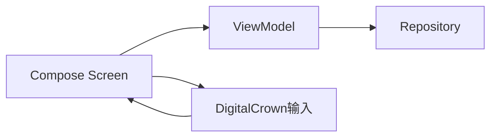

# Compose架构设计

<cite>
**本文档引用的文件**
- [FeedViewModel.kt](file://app/src/main/java/com/lightningstudio/watchrss/ui/viewmodel/FeedViewModel.kt)
- [HomeViewModel.kt](file://app/src/main/java/com/lightningstudio/watchrss/ui/viewmodel/HomeViewModel.kt)
- [HomeScreen.kt](file://app/src/main/java/com/lightningstudio/watchrss/ui/screen/rss/HomeScreen.kt)
- [FeedScreen.kt](file://app/src/main/java/com/lightningstudio/watchrss/ui/screen/rss/FeedScreen.kt)
- [DigitalCrownInput.kt](file://app/src/main/java/com/lightningstudio/watchrss/ui/input/DigitalCrownInput.kt)
- [DigitalCrownOverscrollGuard.kt](file://app/src/main/java/com/lightningstudio/watchrss/ui/input/DigitalCrownOverscrollGuard.kt)
- [AddRssScreen.kt](file://app/src/main/java/com/lightningstudio/watchrss/ui/screen/rss/AddRssScreen.kt)
- [DetailScreen.kt](file://app/src/main/java/com/lightningstudio/watchrss/ui/screen/rss/DetailScreen.kt)
- [ProfileScreen.kt](file://app/src/main/java/com/lightningstudio/watchrss/ui/screen/ProfileScreen.kt)
- [OobeScreen.kt](file://app/src/main/java/com/lightningstudio/watchrss/ui/screen/OobeScreen.kt)
- [HomeComposeScreen.kt](file://app/src/main/java/com/lightningstudio/watchrss/ui/screen/home/HomeComposeScreen.kt)
</cite>

## 目录
1. [引言](#引言)
2. [项目结构](#项目结构)
3. [核心组件](#核心组件)
4. [架构总览](#架构总览)
5. [详细组件分析](#详细组件分析)
6. [依赖关系分析](#依赖关系分析)
7. [性能考虑](#性能考虑)
8. [故障排除指南](#故障排除指南)
9. [结论](#结论)

## 引言
本文件面向Android WatchRSS项目的Jetpack Compose UI层，系统性阐述MVVM模式在手表端的实现方式，重点覆盖以下主题：
- ViewModel与UI组件的绑定机制与状态管理策略
- Compose函数的设计原则：无状态与有状态组件、状态提升（State Hoisting）、副作用处理（LaunchedEffect）
- 响应式编程模型：State、DerivedState、remember的使用场景与性能优化
- 手势处理机制：DigitalCrown输入、拖拽、点击事件
- 性能优化策略：重组优化、key参数、remember的正确使用
- 具体代码示例路径，展示手表端高效UI交互的实现思路

## 项目结构
WatchRSS采用MVVM分层与Compose UI结合的架构。UI层以screen包下的Compose屏幕为核心，通过ViewModel暴露状态流，实现数据驱动的UI更新；输入层提供DigitalCrown等手表特有输入支持。

图表来源
- [HomeScreen.kt](file://app/src/main/java/com/lightningstudio/watchrss/ui/screen/rss/HomeScreen.kt)
- [FeedScreen.kt](file://app/src/main/java/com/lightningstudio/watchrss/ui/screen/rss/FeedScreen.kt)
- [DetailScreen.kt](file://app/src/main/java/com/lightningstudio/watchrss/ui/screen/rss/DetailScreen.kt)
- [AddRssScreen.kt](file://app/src/main/java/com/lightningstudio/watchrss/ui/screen/rss/AddRssScreen.kt)
- [ProfileScreen.kt](file://app/src/main/java/com/lightningstudio/watchrss/ui/screen/ProfileScreen.kt)
- [OobeScreen.kt](file://app/src/main/java/com/lightningstudio/watchrss/ui/screen/OobeScreen.kt)
- [HomeComposeScreen.kt](file://app/src/main/java/com/lightningstudio/watchrss/ui/screen/home/HomeComposeScreen.kt)
- [HomeViewModel.kt](file://app/src/main/java/com/lightningstudio/watchrss/ui/viewmodel/HomeViewModel.kt)
- [FeedViewModel.kt](file://app/src/main/java/com/lightningstudio/watchrss/ui/viewmodel/FeedViewModel.kt)
- [DigitalCrownInput.kt](file://app/src/main/java/com/lightningstudio/watchrss/ui/input/DigitalCrownInput.kt)
- [DigitalCrownOverscrollGuard.kt](file://app/src/main/java/com/lightningstudio/watchrss/ui/input/DigitalCrownOverscrollGuard.kt)

章节来源
- [HomeScreen.kt](file://app/src/main/java/com/lightningstudio/watchrss/ui/screen/rss/HomeScreen.kt)
- [FeedScreen.kt](file://app/src/main/java/com/lightningstudio/watchrss/ui/screen/rss/FeedScreen.kt)
- [HomeViewModel.kt](file://app/src/main/java/com/lightningstudio/watchrss/ui/viewmodel/HomeViewModel.kt)
- [FeedViewModel.kt](file://app/src/main/java/com/lightningstudio/watchrss/ui/viewmodel/FeedViewModel.kt)
- [DigitalCrownInput.kt](file://app/src/main/java/com/lightningstudio/watchrss/ui/input/DigitalCrownInput.kt)
- [DigitalCrownOverscrollGuard.kt](file://app/src/main/java/com/lightningstudio/watchrss/ui/input/DigitalCrownOverscrollGuard.kt)

## 核心组件
- 视图模型（ViewModel）
  - HomeViewModel：负责频道列表、平台登录状态、批量刷新、置顶/收藏/删除等操作的状态管理与业务逻辑。
  - FeedViewModel：负责单个频道的分页数据流、加载更多、原始内容请求、收藏/稍后观看切换、消息提示等。
- 屏幕（Screen）
  - HomeScreen/FeedScreen/DetailScreen等作为Compose屏幕，接收来自ViewModel的状态流，渲染UI并触发用户交互。
- 输入（Input）
  - DigitalCrownInput：封装DigitalCrown输入事件，提供滚动/调节的统一接口。
  - DigitalCrownOverscrollGuard：防止越界滚动导致的异常行为，保证滚动边界安全。

章节来源
- [HomeViewModel.kt](file://app/src/main/java/com/lightningstudio/watchrss/ui/viewmodel/HomeViewModel.kt)
- [FeedViewModel.kt](file://app/src/main/java/com/lightningstudio/watchrss/ui/viewmodel/FeedViewModel.kt)
- [HomeScreen.kt](file://app/src/main/java/com/lightningstudio/watchrss/ui/screen/rss/HomeScreen.kt)
- [FeedScreen.kt](file://app/src/main/java/com/lightningstudio/watchrss/ui/screen/rss/FeedScreen.kt)
- [DigitalCrownInput.kt](file://app/src/main/java/com/lightningstudio/watchrss/ui/input/DigitalCrownInput.kt)
- [DigitalCrownOverscrollGuard.kt](file://app/src/main/java/com/lightningstudio/watchrss/ui/input/DigitalCrownOverscrollGuard.kt)

## 架构总览
MVVM在Compose中的典型流程：
- 数据源（Repository）通过Flow暴露状态变化
- ViewModel将数据转换为可观察的状态（StateFlow/StateIn），并提供交互方法
- Screen通过可观察状态直接渲染UI，并通过回调触发ViewModel操作
- 输入层（如DigitalCrown）将手表端输入转化为UI动作，驱动状态变化

图表来源
- [HomeViewModel.kt](file://app/src/main/java/com/lightningstudio/watchrss/ui/viewmodel/HomeViewModel.kt)
- [FeedViewModel.kt](file://app/src/main/java/com/lightningstudio/watchrss/ui/viewmodel/FeedViewModel.kt)
- [HomeScreen.kt](file://app/src/main/java/com/lightningstudio/watchrss/ui/screen/rss/HomeScreen.kt)
- [FeedScreen.kt](file://app/src/main/java/com/lightningstudio/watchrss/ui/screen/rss/FeedScreen.kt)
- [DigitalCrownInput.kt](file://app/src/main/java/com/lightningstudio/watchrss/ui/input/DigitalCrownInput.kt)

## 详细组件分析

### ViewModel类关系与职责

图表来源
- [HomeViewModel.kt](file://app/src/main/java/com/lightningstudio/watchrss/ui/viewmodel/HomeViewModel.kt)
- [FeedViewModel.kt](file://app/src/main/java/com/lightningstudio/watchrss/ui/viewmodel/FeedViewModel.kt)

章节来源
- [HomeViewModel.kt](file://app/src/main/java/com/lightningstudio/watchrss/ui/viewmodel/HomeViewModel.kt)
- [FeedViewModel.kt](file://app/src/main/java/com/lightningstudio/watchrss/ui/viewmodel/FeedViewModel.kt)

### 状态管理与数据流（HomeScreen）
- 状态来源
  - channels：订阅频道列表，通过repository.observeChannels()提供
  - isRefreshing/message/platformLoginState：用于控制刷新动画、错误提示与平台登录状态
- 绑定机制
  - Screen通过collectAsState()收集StateFlow，自动触发重组
  - 用户操作（如刷新全部、置顶、删除）通过ViewModel方法触发，内部使用viewModelScope.launch
- 错误处理
  - 刷新失败时设置message，供UI显示

图表来源
- [HomeScreen.kt](file://app/src/main/java/com/lightningstudio/watchrss/ui/screen/rss/HomeScreen.kt)
- [HomeViewModel.kt](file://app/src/main/java/com/lightningstudio/watchrss/ui/viewmodel/HomeViewModel.kt)

章节来源
- [HomeScreen.kt](file://app/src/main/java/com/lightningstudio/watchrss/ui/screen/rss/HomeScreen.kt)
- [HomeViewModel.kt](file://app/src/main/java/com/lightningstudio/watchrss/ui/viewmodel/HomeViewModel.kt)

### 分页加载与增量扩展（FeedScreen）
- 状态来源
  - items：基于_visibleCount的分页数据流，通过flatMapLatest动态切换limit
  - hasMore：根据总数与limit比较得出是否还有更多
  - isRefreshing/message：控制刷新状态与错误提示
- 绑定机制
  - 使用stateIn将冷流转为热流，避免重复订阅
  - loadMore()通过增加_visibleCount触发新的分页查询
- 性能要点
  - 使用SharingStarted.WhileSubscribed避免无订阅时的资源浪费
  - 通过combine计算hasMore，减少不必要的重组

图表来源
- [FeedScreen.kt](file://app/src/main/java/com/lightningstudio/watchrss/ui/screen/rss/FeedScreen.kt)
- [FeedViewModel.kt](file://app/src/main/java/com/lightningstudio/watchrss/ui/viewmodel/FeedViewModel.kt)

章节来源
- [FeedScreen.kt](file://app/src/main/java/com/lightningstudio/watchrss/ui/screen/rss/FeedScreen.kt)
- [FeedViewModel.kt](file://app/src/main/java/com/lightningstudio/watchrss/ui/viewmodel/FeedViewModel.kt)

### 状态提升（State Hoisting）实践
- 在Compose中，将状态上提到父级（如HomeScreen/FeedScreen）管理，子组件仅负责渲染与回调，有利于：
  - 减少子组件内部状态，降低复杂度
  - 提高测试性与可复用性
  - 明确数据流向，便于调试
- 实践建议
  - 将可变状态（如选中项、展开状态、输入框文本）提升至最近公共祖先
  - 子组件通过回调（onClick/onValueChange）通知父组件更新状态

（本节为概念性说明，不直接分析具体文件）

### 副作用处理（LaunchedEffect/LaunchedEffect+DisposableEffect）
- LaunchedEffect：在重组时执行一次性副作用（如首次加载数据）
- rememberUpdatedState：在副作用中捕获最新值，避免闭包陷阱
- DisposableEffect：注册/注销外部资源（如传感器、定时器）
- 在WatchRSS中，ViewModel已通过viewModelScope.launch处理协程副作用；Screen层可配合LaunchedEffect进行初始化加载或监听外部事件

（本节为概念性说明，不直接分析具体文件）

### 响应式编程模型与性能优化
- State：用于可变UI状态，如isRefreshing、selectedItem
- DerivedState：派生状态，避免不必要的重组（如hasMore）
- remember：缓存昂贵对象或中间结果，减少重复计算
- rememberSaveable：保存UI状态（如滚动位置、输入框内容），在配置变更后恢复
- 关键优化点
  - 使用stateIn共享流，避免重复订阅
  - 合理使用key参数，确保列表项稳定标识
  - 将复杂计算放入remember中，避免每次重组都执行

（本节为概念性说明，不直接分析具体文件）

### 手势处理机制（DigitalCrown、拖拽、点击）
- DigitalCrown输入
  - DigitalCrownInput封装滚轮事件，提供value与onValueChange回调
  - DigitalCrownOverscrollGuard提供越界保护，避免滚动超出范围
- 拖拽与点击
  - 使用PointerInput修饰符处理触摸/指针事件
  - 结合手势库（如detectDragGestures）实现拖拽滚动
- 在FeedScreen中，可通过DigitalCrown驱动loadMore或滚动列表

图表来源
- [DigitalCrownInput.kt](file://app/src/main/java/com/lightningstudio/watchrss/ui/input/DigitalCrownInput.kt)
- [DigitalCrownOverscrollGuard.kt](file://app/src/main/java/com/lightningstudio/watchrss/ui/input/DigitalCrownOverscrollGuard.kt)
- [FeedScreen.kt](file://app/src/main/java/com/lightningstudio/watchrss/ui/screen/rss/FeedScreen.kt)
- [FeedViewModel.kt](file://app/src/main/java/com/lightningstudio/watchrss/ui/viewmodel/FeedViewModel.kt)

章节来源
- [DigitalCrownInput.kt](file://app/src/main/java/com/lightningstudio/watchrss/ui/input/DigitalCrownInput.kt)
- [DigitalCrownOverscrollGuard.kt](file://app/src/main/java/com/lightningstudio/watchrss/ui/input/DigitalCrownOverscrollGuard.kt)
- [FeedScreen.kt](file://app/src/main/java/com/lightningstudio/watchrss/ui/screen/rss/FeedScreen.kt)
- [FeedViewModel.kt](file://app/src/main/java/com/lightningstudio/watchrss/ui/viewmodel/FeedViewModel.kt)

### 代码示例路径（展示手表端高效UI交互）
- 首页状态收集与刷新
  - [HomeScreen.kt](file://app/src/main/java/com/lightningstudio/watchrss/ui/screen/rss/HomeScreen.kt)
  - [HomeViewModel.kt](file://app/src/main/java/com/lightningstudio/watchrss/ui/viewmodel/HomeViewModel.kt)
- 订阅列表分页与加载更多
  - [FeedScreen.kt](file://app/src/main/java/com/lightningstudio/watchrss/ui/screen/rss/FeedScreen.kt)
  - [FeedViewModel.kt](file://app/src/main/java/com/lightningstudio/watchrss/ui/viewmodel/FeedViewModel.kt)
- DigitalCrown输入与越界保护
  - [DigitalCrownInput.kt](file://app/src/main/java/com/lightningstudio/watchrss/ui/input/DigitalCrownInput.kt)
  - [DigitalCrownOverscrollGuard.kt](file://app/src/main/java/com/lightningstudio/watchrss/ui/input/DigitalCrownOverscrollGuard.kt)
- 添加订阅与详情交互
  - [AddRssScreen.kt](file://app/src/main/java/com/lightningstudio/watchrss/ui/screen/rss/AddRssScreen.kt)
  - [DetailScreen.kt](file://app/src/main/java/com/lightningstudio/watchrss/ui/screen/rss/DetailScreen.kt)

章节来源
- [HomeScreen.kt](file://app/src/main/java/com/lightningstudio/watchrss/ui/screen/rss/HomeScreen.kt)
- [FeedScreen.kt](file://app/src/main/java/com/lightningstudio/watchrss/ui/screen/rss/FeedScreen.kt)
- [AddRssScreen.kt](file://app/src/main/java/com/lightningstudio/watchrss/ui/screen/rss/AddRssScreen.kt)
- [DetailScreen.kt](file://app/src/main/java/com/lightningstudio/watchrss/ui/screen/rss/DetailScreen.kt)
- [DigitalCrownInput.kt](file://app/src/main/java/com/lightningstudio/watchrss/ui/input/DigitalCrownInput.kt)
- [DigitalCrownOverscrollGuard.kt](file://app/src/main/java/com/lightningstudio/watchrss/ui/input/DigitalCrownOverscrollGuard.kt)

## 依赖关系分析
- ViewModel依赖Repository提供数据流，Repository内部可能依赖网络/数据库/缓存
- Screen依赖ViewModel提供的状态流，同时依赖输入层（DigitalCrown）处理手表端输入
- 低耦合高内聚：ViewModel只关心业务状态，Screen只关心UI渲染与交互

图表来源
- [HomeViewModel.kt](file://app/src/main/java/com/lightningstudio/watchrss/ui/viewmodel/HomeViewModel.kt)
- [FeedViewModel.kt](file://app/src/main/java/com/lightningstudio/watchrss/ui/viewmodel/FeedViewModel.kt)
- [HomeScreen.kt](file://app/src/main/java/com/lightningstudio/watchrss/ui/screen/rss/HomeScreen.kt)
- [FeedScreen.kt](file://app/src/main/java/com/lightningstudio/watchrss/ui/screen/rss/FeedScreen.kt)
- [DigitalCrownInput.kt](file://app/src/main/java/com/lightningstudio/watchrss/ui/input/DigitalCrownInput.kt)

章节来源
- [HomeViewModel.kt](file://app/src/main/java/com/lightningstudio/watchrss/ui/viewmodel/HomeViewModel.kt)
- [FeedViewModel.kt](file://app/src/main/java/com/lightningstudio/watchrss/ui/viewmodel/FeedViewModel.kt)
- [HomeScreen.kt](file://app/src/main/java/com/lightningstudio/watchrss/ui/screen/rss/HomeScreen.kt)
- [FeedScreen.kt](file://app/src/main/java/com/lightningstudio/watchrss/ui/screen/rss/FeedScreen.kt)
- [DigitalCrownInput.kt](file://app/src/main/java/com/lightningstudio/watchrss/ui/input/DigitalCrownInput.kt)

## 性能考虑
- 重组优化
  - 使用LazyColumn/remember等避免不必要的重组
  - 将复杂计算移出组合函数，放入remember或本地变量
- 流与状态
  - 使用stateIn共享Flow，避免重复订阅
  - 合理设置SharingStarted，平衡内存与性能
- 输入处理
  - DigitalCrown事件应节流或去抖，避免频繁触发重组
- 列表渲染
  - 使用key稳定列表项标识，减少重绘
  - 对图片等资源使用合适的占位与缓存策略

（本节为通用指导，不直接分析具体文件）

## 故障排除指南
- 刷新失败提示
  - HomeViewModel/FeedViewModel在刷新失败时设置message，Screen侧应显示错误提示
  - 参考路径：[HomeViewModel.kt](file://app/src/main/java/com/lightningstudio/watchrss/ui/viewmodel/HomeViewModel.kt)，[FeedViewModel.kt](file://app/src/main/java/com/lightningstudio/watchrss/ui/viewmodel/FeedViewModel.kt)
- 加载更多无效
  - 检查_visibleCount与MAX_VISIBLE_ITEMS限制，确认stateIn与flatMapLatest正确使用
  - 参考路径：[FeedViewModel.kt](file://app/src/main/java/com/lightningstudio/watchrss/ui/viewmodel/FeedViewModel.kt)
- DigitalCrown无响应
  - 确认DigitalCrownInput与OverscrollGuard正确集成，事件未被拦截
  - 参考路径：[DigitalCrownInput.kt](file://app/src/main/java/com/lightningstudio/watchrss/ui/input/DigitalCrownInput.kt)，[DigitalCrownOverscrollGuard.kt](file://app/src/main/java/com/lightningstudio/watchrss/ui/input/DigitalCrownOverscrollGuard.kt)

章节来源
- [HomeViewModel.kt](file://app/src/main/java/com/lightningstudio/watchrss/ui/viewmodel/HomeViewModel.kt)
- [FeedViewModel.kt](file://app/src/main/java/com/lightningstudio/watchrss/ui/viewmodel/FeedViewModel.kt)
- [DigitalCrownInput.kt](file://app/src/main/java/com/lightningstudio/watchrss/ui/input/DigitalCrownInput.kt)
- [DigitalCrownOverscrollGuard.kt](file://app/src/main/java/com/lightningstudio/watchrss/ui/input/DigitalCrownOverscrollGuard.kt)

## 结论
WatchRSS的Compose架构以MVVM为核心，通过ViewModel提供稳定的可观察状态流，Screen专注UI渲染与交互，输入层适配手表端特性。遵循状态提升、合理使用State/DerivedState/remember、以及流的共享与生命周期管理，可在手表端实现高效、流畅且易维护的UI体验。建议在后续迭代中持续关注重组开销与输入延迟，结合实际性能数据进行针对性优化。