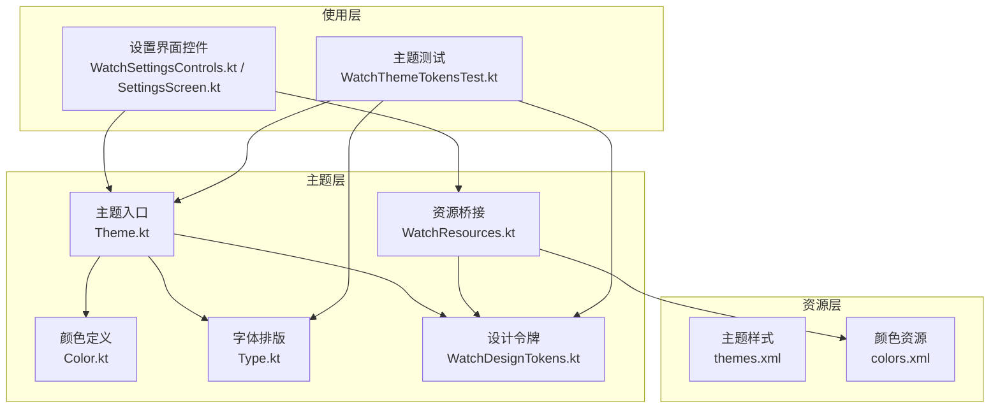
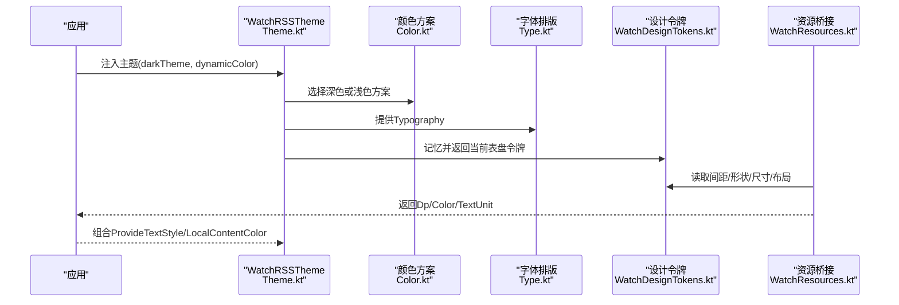
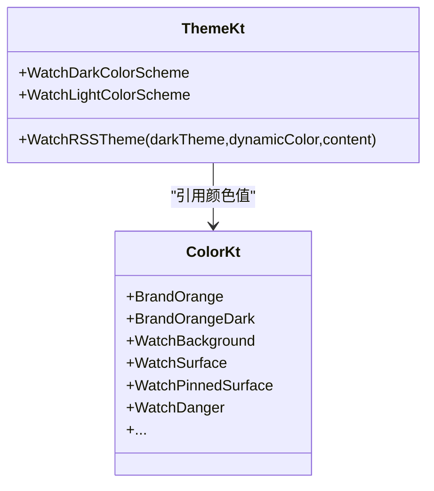
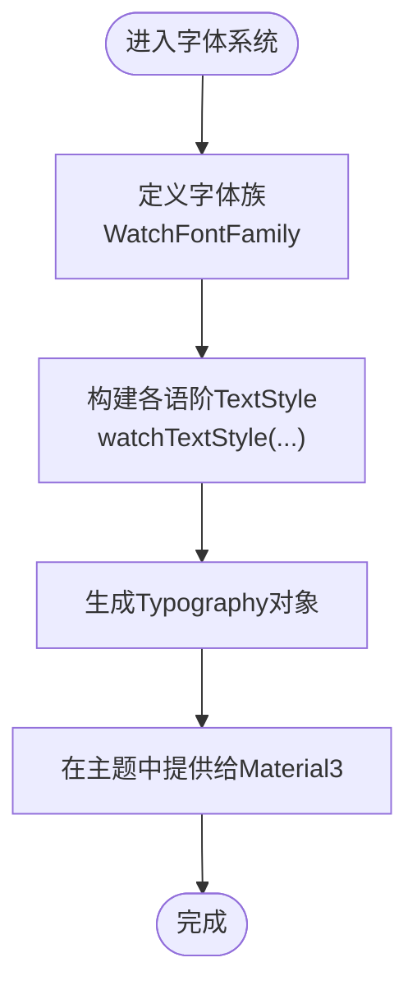
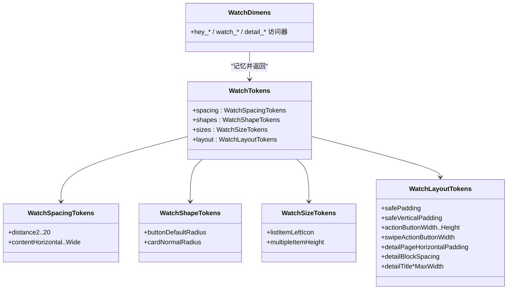
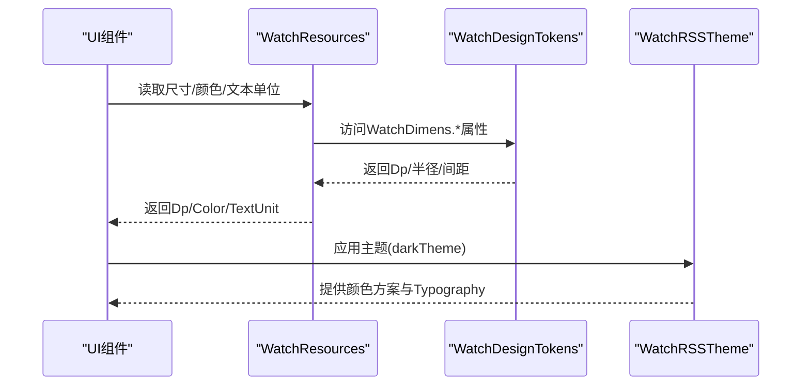
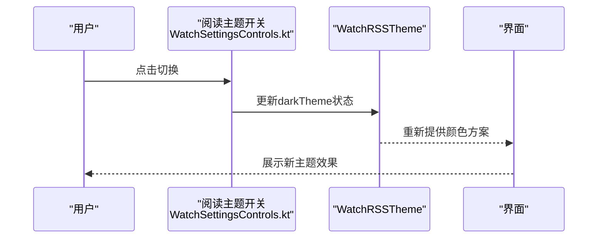
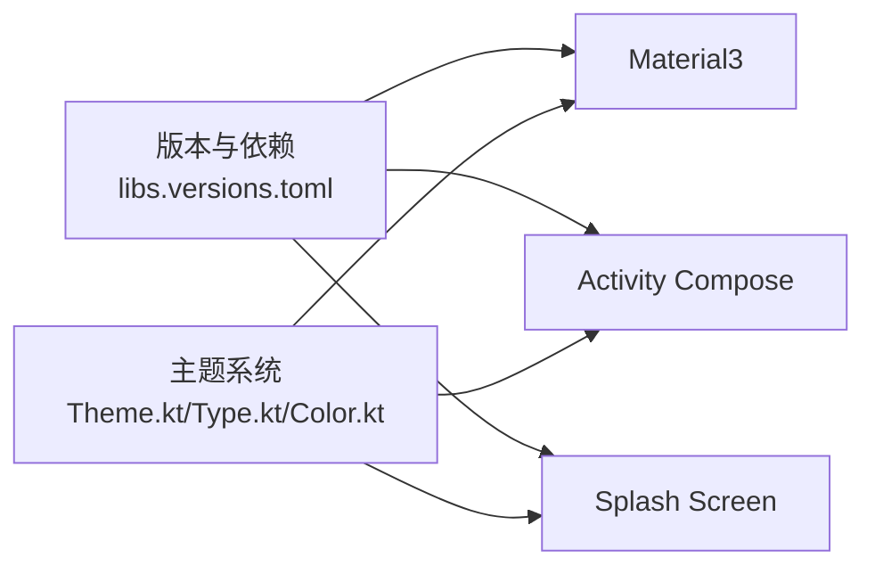

# 主题系统

<cite>
**本文引用的文件**   
- [Theme.kt](file://app/src/main/java/com/lightningstudio/watchrss/ui/theme/Theme.kt)
- [Color.kt](file://app/src/main/java/com/lightningstudio/watchrss/ui/theme/Color.kt)
- [Type.kt](file://app/src/main/java/com/lightningstudio/watchrss/ui/theme/Type.kt)
- [WatchDesignTokens.kt](file://app/src/main/java/com/lightningstudio/watchrss/ui/theme/WatchDesignTokens.kt)
- [WatchResources.kt](file://app/src/main/java/com/lightningstudio/watchrss/ui/theme/WatchResources.kt)
- [themes.xml](file://app/src/main/res/values/themes.xml)
- [colors.xml](file://app/src/main/res/values/colors.xml)
- [WatchThemeTokensTest.kt](file://app/src/test/java/com/lightningstudio/watchrss/ui/theme/WatchThemeTokensTest.kt)
- [WatchSettingsControls.kt](file://app/src/main/java/com/lightningstudio/watchrss/ui/settings/WatchSettingsControls.kt)
- [SettingsScreen.kt](file://app/src/main/java/com/lightningstudio/watchrss/ui/screen/rss/SettingsScreen.kt)
- [libs.versions.toml](file://gradle/libs.versions.toml)
</cite>

## 目录
1. [简介](#简介)
2. [项目结构](#项目结构)
3. [核心组件](#核心组件)
4. [架构总览](#架构总览)
5. [详细组件分析](#详细组件分析)
6. [依赖关系分析](#依赖关系分析)
7. [性能考量](#性能考量)
8. [故障排查指南](#故障排查指南)
9. [结论](#结论)
10. [附录](#附录)

## 简介
本文件系统化梳理 WatchRSS 项目的主题系统，围绕 Material3 的主题架构展开，重点覆盖以下方面：
- 颜色系统：品牌色、语义色、状态色的定义与使用
- 字体排版：文本样式、字号与行高规范
- 形状系统：圆角等视觉令牌
- 尺寸适配：方形表盘与圆形表盘的差异化设计令牌
- 主题切换：深色/浅色模式与可选的动态颜色支持
- 资源组织：颜色与尺寸资源的映射与 Compose 侧的统一访问
- 定制指南：如何扩展设计令牌、新增颜色变体、修改字体样式
- 测试与最佳实践：主题一致性校验与常见问题排查

## 项目结构
主题系统主要由以下模块构成：
- 主题入口与颜色方案：定义深/浅两套颜色方案，并通过主题组合器对外提供
- 设计令牌：封装间距、形状、尺寸、布局等视觉令牌，并按圆形/方形表盘进行差异化
- 字体系统：集中定义字体族与各语阶的 TextStyle
- 资源桥接：将 XML 资源与 Compose 侧的令牌进行映射
- 切换与使用：在设置界面中提供阅读主题开关，并在应用启动时注入主题

**图表来源**
- [Theme.kt:1-263](file://app/src/main/java/com/lightningstudio/watchrss/ui/theme/Theme.kt#L1-L263)
- [Color.kt:1-23](file://app/src/main/java/com/lightningstudio/watchrss/ui/theme/Color.kt#L1-L23)
- [Type.kt:1-113](file://app/src/main/java/com/lightningstudio/watchrss/ui/theme/Type.kt#L1-L113)
- [WatchDesignTokens.kt:1-244](file://app/src/main/java/com/lightningstudio/watchrss/ui/theme/WatchDesignTokens.kt#L1-L244)
- [WatchResources.kt:1-42](file://app/src/main/java/com/lightningstudio/watchrss/ui/theme/WatchResources.kt#L1-L42)
- [themes.xml:1-40](file://app/src/main/res/values/themes.xml#L1-L40)
- [colors.xml:1-18](file://app/src/main/res/values/colors.xml#L1-L18)
- [WatchSettingsControls.kt:35-75](file://app/src/main/java/com/lightningstudio/watchrss/ui/settings/WatchSettingsControls.kt#L35-L75)
- [SettingsScreen.kt:624-642](file://app/src/main/java/com/lightningstudio/watchrss/ui/screen/rss/SettingsScreen.kt#L624-L642)
- [WatchThemeTokensTest.kt:1-73](file://app/src/test/java/com/lightningstudio/watchrss/ui/theme/WatchThemeTokensTest.kt#L1-L73)

**章节来源**
- [Theme.kt:1-263](file://app/src/main/java/com/lightningstudio/watchrss/ui/theme/Theme.kt#L1-L263)
- [WatchDesignTokens.kt:1-244](file://app/src/main/java/com/lightningstudio/watchrss/ui/theme/WatchDesignTokens.kt#L1-L244)
- [Type.kt:1-113](file://app/src/main/java/com/lightningstudio/watchrss/ui/theme/Type.kt#L1-L113)
- [WatchResources.kt:1-42](file://app/src/main/java/com/lightningstudio/watchrss/ui/theme/WatchResources.kt#L1-L42)
- [themes.xml:1-40](file://app/src/main/res/values/themes.xml#L1-L40)
- [colors.xml:1-18](file://app/src/main/res/values/colors.xml#L1-L18)

## 核心组件
- 颜色系统
  - 品牌色：橙色系作为主色与次色
  - 表面色：背景、卡片、胶囊、固定项等
  - 文本与分隔：主/次要文本、分割线
  - 语义色：错误色与容器色
  - 深色/浅色方案：分别映射到 Material3 的颜色槽位
- 字体排版
  - 使用自定义字体家族，统一字号与行高
  - 提供标题、正文、标签等多级语阶
- 设计令牌
  - 间距、形状、尺寸、布局四类令牌
  - 方形与圆形表盘差异化：圆形增加垂直安全边距
- 资源桥接
  - 将 XML 维度与颜色资源映射到 Compose 侧令牌
  - 提供尺寸与文本单位的便捷访问
- 主题注入
  - 在应用根部提供 WatchRSSTheme，支持深色/浅色与可选动态颜色参数
  - 默认提供 Overscroll 回弹容器以优化滚动体验

**章节来源**
- [Color.kt:1-23](file://app/src/main/java/com/lightningstudio/watchrss/ui/theme/Color.kt#L1-L23)
- [Theme.kt:39-111](file://app/src/main/java/com/lightningstudio/watchrss/ui/theme/Theme.kt#L39-L111)
- [Type.kt:11-104](file://app/src/main/java/com/lightningstudio/watchrss/ui/theme/Type.kt#L11-L104)
- [WatchDesignTokens.kt:12-86](file://app/src/main/java/com/lightningstudio/watchrss/ui/theme/WatchDesignTokens.kt#L12-L86)
- [WatchResources.kt:14-41](file://app/src/main/java/com/lightningstudio/watchrss/ui/theme/WatchResources.kt#L14-L41)

## 架构总览
下图展示主题系统从资源到 UI 的整体流程：应用启动时注入主题，UI 通过资源桥接访问令牌，最终渲染出一致的视觉风格。

**图表来源**
- [Theme.kt:87-111](file://app/src/main/java/com/lightningstudio/watchrss/ui/theme/Theme.kt#L87-L111)
- [WatchDesignTokens.kt:97-108](file://app/src/main/java/com/lightningstudio/watchrss/ui/theme/WatchDesignTokens.kt#L97-L108)
- [WatchResources.kt:14-41](file://app/src/main/java/com/lightningstudio/watchrss/ui/theme/WatchResources.kt#L14-L41)

## 详细组件分析

### 颜色系统与语义槽位
- 品牌色与表面色
  - 主色与次色用于强调与交互元素
  - 表面色体系包含背景、卡片、胶囊、固定项等，确保在不同模式下的对比度与层次
- 语义色
  - 错误色与容器色用于提示失败状态
  - 在深/浅色方案中分别映射到 Material3 的 error/errorContainer/onError/onErrorContainer 槽位
- 文本与轮廓
  - onSurface/onBackground/onSurfaceVariant 保证文本可读性
  - outline 用于分隔与边框
- 动态颜色
  - 主题入口提供 dynamicColor 参数，可在满足条件时启用系统动态色（需 Android 12+）

**图表来源**
- [Color.kt:5-22](file://app/src/main/java/com/lightningstudio/watchrss/ui/theme/Color.kt#L5-L22)
- [Theme.kt:39-85](file://app/src/main/java/com/lightningstudio/watchrss/ui/theme/Theme.kt#L39-L85)

**章节来源**
- [Color.kt:1-23](file://app/src/main/java/com/lightningstudio/watchrss/ui/theme/Color.kt#L1-L23)
- [Theme.kt:39-85](file://app/src/main/java/com/lightningstudio/watchrss/ui/theme/Theme.kt#L39-L85)
- [WatchThemeTokensTest.kt:28-37](file://app/src/test/java/com/lightningstudio/watchrss/ui/theme/WatchThemeTokensTest.kt#L28-L37)

### 字体排版系统
- 字体族
  - 使用自定义 WatchSans 字体族，覆盖 Normal/Medium/SemiBold
- 语阶规范
  - 提供 display/headline/title/body/label 多级语阶
  - 每个语阶指定字号与行高，确保在小屏幕上的可读性
- 统一样式
  - 通过 watchTextStyle 统一生成 TextStyle，避免分散定义

**图表来源**
- [Type.kt:11-104](file://app/src/main/java/com/lightningstudio/watchrss/ui/theme/Type.kt#L11-L104)

**章节来源**
- [Type.kt:11-104](file://app/src/main/java/com/lightningstudio/watchrss/ui/theme/Type.kt#L11-L104)
- [WatchThemeTokensTest.kt:12-26](file://app/src/test/java/com/lightningstudio/watchrss/ui/theme/WatchThemeTokensTest.kt#L12-L26)

### 设计令牌（方形/圆形表盘）
- 令牌分类
  - 间距：距离与内容横向间距
  - 形状：按钮默认圆角、卡片圆角
  - 尺寸：列表左侧图标高度、多行项高度
  - 布局：安全边距、动作按钮宽高、滑动操作宽度、详情页内边距与标题最大宽度
- 差异化策略
  - 圆形表盘在垂直方向增加安全边距，提升可读性
  - 提供计算函数以根据可用空间动态调整按钮与二维码尺寸
- 便捷访问
  - WatchDimens 对象将令牌暴露为 Compose 可记忆属性，便于在 UI 中直接使用

**图表来源**
- [WatchDesignTokens.kt:12-86](file://app/src/main/java/com/lightningstudio/watchrss/ui/theme/WatchDesignTokens.kt#L12-L86)
- [WatchDesignTokens.kt:110-179](file://app/src/main/java/com/lightningstudio/watchrss/ui/theme/WatchDesignTokens.kt#L110-L179)

**章节来源**
- [WatchDesignTokens.kt:12-86](file://app/src/main/java/com/lightningstudio/watchrss/ui/theme/WatchDesignTokens.kt#L12-L86)
- [WatchDesignTokens.kt:97-108](file://app/src/main/java/com/lightningstudio/watchrss/ui/theme/WatchDesignTokens.kt#L97-L108)
- [WatchThemeTokensTest.kt:40-53](file://app/src/test/java/com/lightningstudio/watchrss/ui/theme/WatchThemeTokensTest.kt#L40-L53)

### 资源桥接与主题注入
- 颜色与尺寸资源映射
  - watchDimensionResource 将常用维度映射到 Compose 令牌，其余走原生资源
  - watchColorResource 直接桥接颜色资源
  - watchTextUnitResource 将 Dp 转换为 Sp
- 主题注入
  - WatchRSSTheme 根据 darkTheme 选择颜色方案，并提供 Typography 与默认文本样式
  - 内置 Overscroll 回弹容器，优化滚动体验

**图表来源**
- [WatchResources.kt:14-41](file://app/src/main/java/com/lightningstudio/watchrss/ui/theme/WatchResources.kt#L14-L41)
- [WatchDesignTokens.kt:110-179](file://app/src/main/java/com/lightningstudio/watchrss/ui/theme/WatchDesignTokens.kt#L110-L179)
- [Theme.kt:87-111](file://app/src/main/java/com/lightningstudio/watchrss/ui/theme/Theme.kt#L87-L111)

**章节来源**
- [WatchResources.kt:14-41](file://app/src/main/java/com/lightningstudio/watchrss/ui/theme/WatchResources.kt#L14-L41)
- [Theme.kt:87-111](file://app/src/main/java/com/lightningstudio/watchrss/ui/theme/Theme.kt#L87-L111)

### 主题切换机制与动态颜色
- 切换入口
  - 设置界面提供阅读主题开关，内部使用令牌与颜色资源进行绘制
- 模式选择
  - WatchRSSTheme 支持 darkTheme 参数，默认深色
  - dynamicColor 参数预留动态颜色能力（Android 12+）
- 无障碍与可访问性
  - 开关状态通过语义描述提供可读性

**图表来源**
- [WatchSettingsControls.kt:35-75](file://app/src/main/java/com/lightningstudio/watchrss/ui/settings/WatchSettingsControls.kt#L35-L75)
- [SettingsScreen.kt:624-642](file://app/src/main/java/com/lightningstudio/watchrss/ui/screen/rss/SettingsScreen.kt#L624-L642)
- [Theme.kt:87-111](file://app/src/main/java/com/lightningstudio/watchrss/ui/theme/Theme.kt#L87-L111)

**章节来源**
- [WatchSettingsControls.kt:35-75](file://app/src/main/java/com/lightningstudio/watchrss/ui/settings/WatchSettingsControls.kt#L35-L75)
- [SettingsScreen.kt:624-642](file://app/src/main/java/com/lightningstudio/watchrss/ui/screen/rss/SettingsScreen.kt#L624-L642)
- [Theme.kt:87-111](file://app/src/main/java/com/lightningstudio/watchrss/ui/theme/Theme.kt#L87-L111)

## 依赖关系分析
- 版本与依赖
  - Compose BOM 版本：2024.09.00
  - Material3：material3
  - Activity Compose：activity-compose
  - Splash Screen：core-splashscreen
- 主题系统对 Compose 的依赖集中在 Material3 的颜色与排版能力

**图表来源**
- [libs.versions.toml:38-91](file://gradle/libs.versions.toml#L38-L91)
- [Theme.kt:1-38](file://app/src/main/java/com/lightningstudio/watchrss/ui/theme/Theme.kt#L1-L38)

**章节来源**
- [libs.versions.toml:38-91](file://gradle/libs.versions.toml#L38-L91)

## 性能考量
- 令牌记忆化
  - 使用 rememberWatchTokens 与 Compose 可记忆属性减少重组开销
- 滚动回弹
  - 自定义 NestedScrollConnection 与动画回弹，避免过度重组与闪烁
- 字体与尺寸
  - 统一字体族与尺寸计算，减少布局抖动
- 动态颜色
  - 在满足系统版本要求时启用，避免在旧设备上引入额外逻辑

[本节为通用指导，无需列出具体文件来源]

## 故障排查指南
- 字体未生效
  - 确认字体资源已正确打包且字体族定义完整
  - 检查 Typography 是否被正确提供给 MaterialTheme
- 颜色不一致
  - 校验颜色方案是否映射到正确的语义槽位
  - 使用测试用例验证错误色与容器色在深/浅色中的预期值
- 圆形表盘显示异常
  - 检查 isScreenRound 判定与令牌差异化的逻辑
  - 确认安全边距在圆形表盘上的增量
- 尺寸计算偏差
  - 使用 watchActionButtonWidthFor/watchSwipeActionButtonWidthFor 等计算函数，结合实际可用宽度进行调试
- 主题切换无效
  - 确保开关状态更新后重新注入主题
  - 检查无障碍描述与交互状态的一致性

**章节来源**
- [WatchThemeTokensTest.kt:1-73](file://app/src/test/java/com/lightningstudio/watchrss/ui/theme/WatchThemeTokensTest.kt#L1-L73)
- [WatchDesignTokens.kt:181-243](file://app/src/main/java/com/lightningstudio/watchrss/ui/theme/WatchDesignTokens.kt#L181-L243)
- [WatchSettingsControls.kt:35-75](file://app/src/main/java/com/lightningstudio/watchrss/ui/settings/WatchSettingsControls.kt#L35-L75)

## 结论
WatchRSS 的主题系统以 Material3 为基础，结合手表端的圆形/方形表盘特性，提供了清晰的颜色语义、统一的字体排版与可记忆的设计令牌。通过资源桥接与主题注入，UI 能够稳定地获取一致的视觉表现；同时，测试用例保障了主题的一致性与可维护性。未来扩展时，建议遵循现有命名与组织方式，确保新增令牌与颜色变体与既有体系保持兼容。

[本节为总结性内容，无需列出具体文件来源]

## 附录

### 主题定制指南
- 扩展设计令牌
  - 新增数据类字段或在现有数据类中追加属性
  - 在 watchTokensFor 中按 isRound 分支返回差异化实例
  - 在 WatchDimens 中提供 Compose 可记忆访问器
- 添加新的颜色变体
  - 在 Color.kt 中定义新颜色常量
  - 在颜色方案中映射到对应语义槽位
  - 如需语义扩展，补充测试用例验证
- 修改字体样式
  - 在 Type.kt 中调整 watchTextStyle 或新增语阶
  - 确保所有使用到的语阶均采用统一字体族
- 资源映射
  - 在 WatchResources.kt 中扩展 watchDimensionResource 的分支映射
  - 保持与 XML 资源的命名与含义一致

**章节来源**
- [WatchDesignTokens.kt:12-86](file://app/src/main/java/com/lightningstudio/watchrss/ui/theme/WatchDesignTokens.kt#L12-L86)
- [WatchDesignTokens.kt:110-179](file://app/src/main/java/com/lightningstudio/watchrss/ui/theme/WatchDesignTokens.kt#L110-L179)
- [Color.kt:1-23](file://app/src/main/java/com/lightningstudio/watchrss/ui/theme/Color.kt#L1-L23)
- [Type.kt:11-104](file://app/src/main/java/com/lightningstudio/watchrss/ui/theme/Type.kt#L11-L104)
- [WatchResources.kt:14-41](file://app/src/main/java/com/lightningstudio/watchrss/ui/theme/WatchResources.kt#L14-L41)

### 主题测试方法与最佳实践
- 单元测试
  - 使用 WatchThemeTokensTest 验证字体族一致性、颜色语义槽位映射、圆形/方形令牌差异
- UI 测试
  - 在设置界面中验证主题切换的交互与可访问性
- 最佳实践
  - 优先使用令牌而非硬编码数值
  - 保持颜色语义与 Material3 槽位一致
  - 在圆形表盘上优先考虑可读性与触控可达性

**章节来源**
- [WatchThemeTokensTest.kt:1-73](file://app/src/test/java/com/lightningstudio/watchrss/ui/theme/WatchThemeTokensTest.kt#L1-L73)
- [WatchSettingsControls.kt:35-75](file://app/src/main/java/com/lightningstudio/watchrss/ui/settings/WatchSettingsControls.kt#L35-L75)