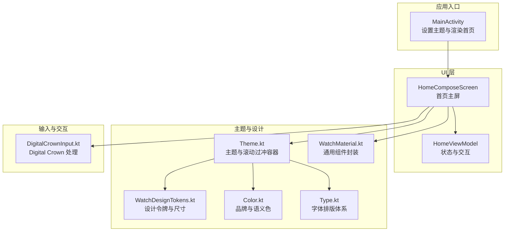
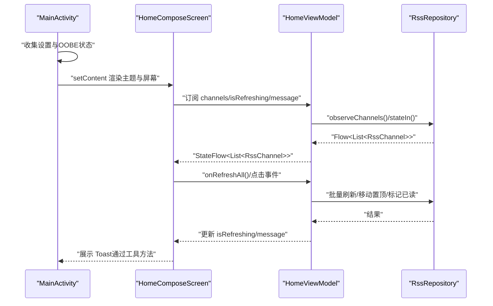
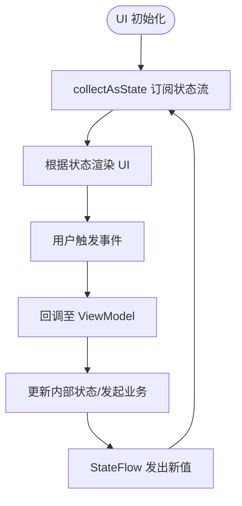
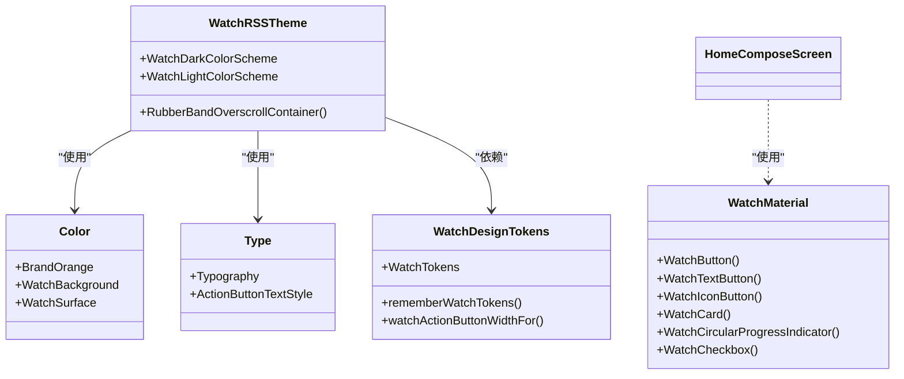
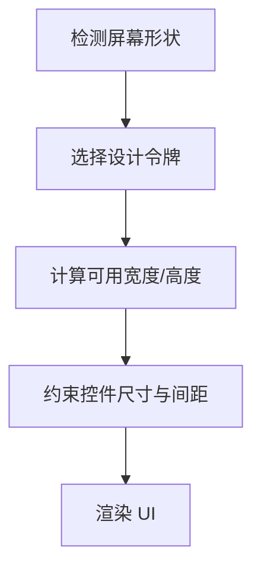
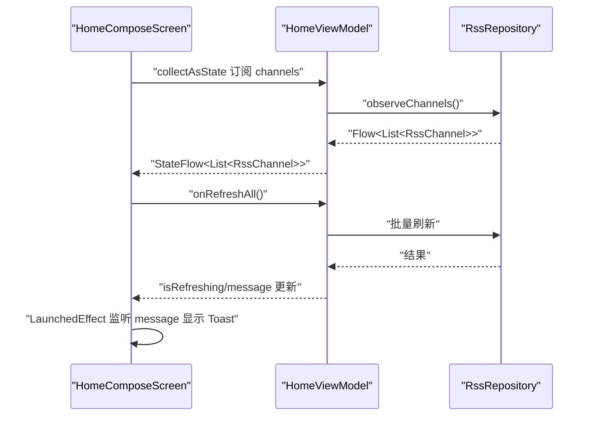
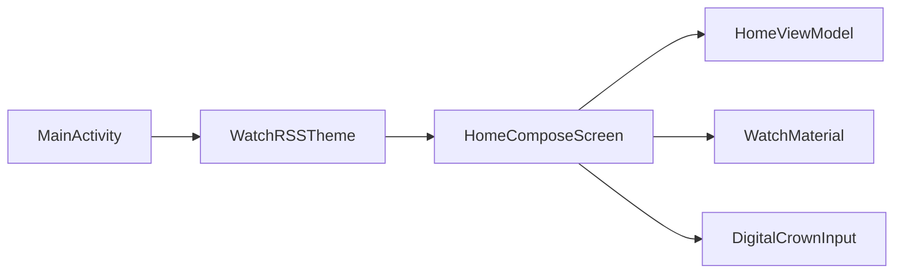
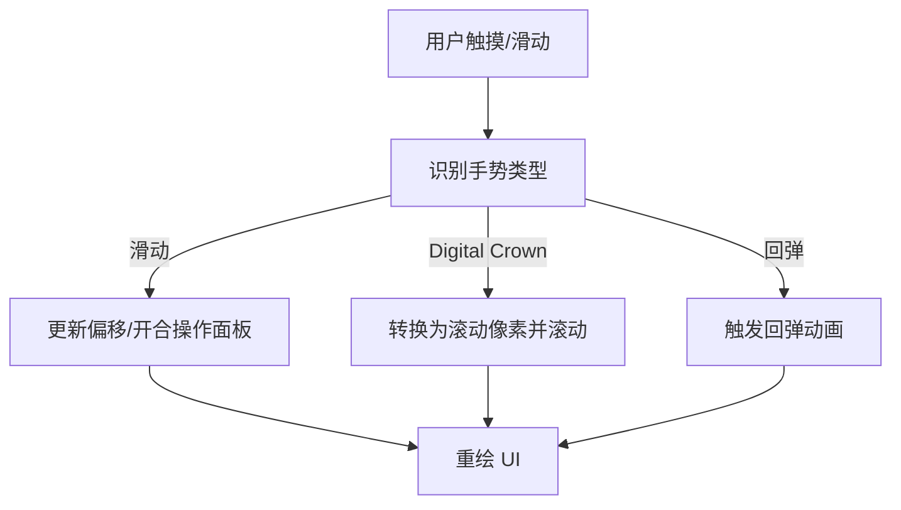
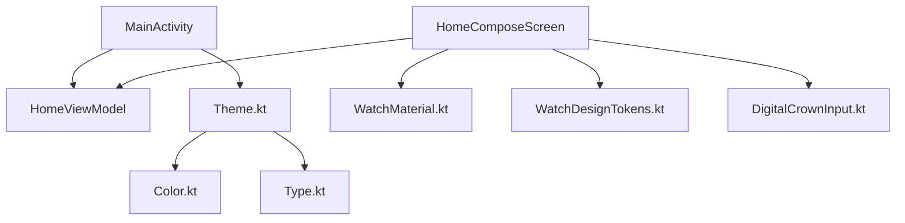

# 用户界面架构

<cite>
**本文引用的文件**
- [MainActivity.kt](file://app/src/main/java/com/lightningstudio/watchrss/MainActivity.kt)
- [HomeComposeScreen.kt](file://app/src/main/java/com/lightningstudio/watchrss/ui/screen/home/HomeComposeScreen.kt)
- [HomeViewModel.kt](file://app/src/main/java/com/lightningstudio/watchrss/ui/viewmodel/HomeViewModel.kt)
- [Theme.kt](file://app/src/main/java/com/lightningstudio/watchrss/ui/theme/Theme.kt)
- [WatchDesignTokens.kt](file://app/src/main/java/com/lightningstudio/watchrss/ui/theme/WatchDesignTokens.kt)
- [Color.kt](file://app/src/main/java/com/lightningstudio/watchrss/ui/theme/Color.kt)
- [Type.kt](file://app/src/main/java/com/lightningstudio/watchrss/ui/theme/Type.kt)
- [WatchMaterial.kt](file://app/src/main/java/com/lightningstudio/watchrss/ui/components/WatchMaterial.kt)
- [DigitalCrownInput.kt](file://app/src/main/java/com/lightningstudio/watchrss/ui/input/DigitalCrownInput.kt)
- [PlatformUiCompat.kt](file://app/src/main/java/com/lightningstudio/watchrss/ui/util/PlatformUiCompat.kt)
</cite>

## 目录
1. [简介](#简介)
2. [项目结构](#项目结构)
3. [核心组件](#核心组件)
4. [架构总览](#架构总览)
5. [组件详解](#组件详解)
6. [依赖关系分析](#依赖关系分析)
7. [性能考量](#性能考量)
8. [故障排查指南](#故障排查指南)
9. [结论](#结论)
10. [附录](#附录)

## 简介
本文件系统化梳理 WatchRSS 在 Android 平台上的用户界面架构，重点覆盖基于 Jetpack Compose 的 UI 设计与实现，包括 MVVM 在 UI 层的落地、ViewModel 与 UI 组件的绑定机制、Compose 组件库与主题系统、手表端 UI 适配策略、状态管理（State Hoisting、Flow 集成与 UI 同步）、导航与屏幕组织、组件复用策略、样式定制与性能优化、以及 UI 测试与调试实践。目标是帮助开发者快速理解并高效扩展 WatchRSS 的 UI 层。

## 项目结构
UI 相关代码主要集中在 app/src/main/java/com/lightningstudio/watchrss/ui 下，按职责划分为：
- screen：各业务页面与屏幕组件
- viewmodel：UI 层 ViewModel，封装状态与交互逻辑
- theme：主题、颜色、字体与设计令牌
- components：通用 UI 组件封装
- input：手表端输入（如 Digital Crown）处理
- util：UI 工具与兼容层
- widget：轻量 UI 小部件

**图表来源**
- [MainActivity.kt:94-159](file://app/src/main/java/com/lightningstudio/watchrss/MainActivity.kt#L94-L159)
- [HomeComposeScreen.kt:85-203](file://app/src/main/java/com/lightningstudio/watchrss/ui/screen/home/HomeComposeScreen.kt#L85-L203)
- [Theme.kt:89-111](file://app/src/main/java/com/lightningstudio/watchrss/ui/theme/Theme.kt#L89-L111)
- [WatchDesignTokens.kt:98-179](file://app/src/main/java/com/lightningstudio/watchrss/ui/theme/WatchDesignTokens.kt#L98-L179)
- [Color.kt:1-23](file://app/src/main/java/com/lightningstudio/watchrss/ui/theme/Color.kt#L1-L23)
- [Type.kt:11-104](file://app/src/main/java/com/lightningstudio/watchrss/ui/theme/Type.kt#L11-L104)
- [WatchMaterial.kt:34-171](file://app/src/main/java/com/lightningstudio/watchrss/ui/components/WatchMaterial.kt#L34-L171)
- [DigitalCrownInput.kt:28-95](file://app/src/main/java/com/lightningstudio/watchrss/ui/input/DigitalCrownInput.kt#L28-L95)

**章节来源**
- [MainActivity.kt:94-159](file://app/src/main/java/com/lightningstudio/watchrss/MainActivity.kt#L94-L159)
- [HomeComposeScreen.kt:85-203](file://app/src/main/java/com/lightningstudio/watchrss/ui/screen/home/HomeComposeScreen.kt#L85-L203)

## 核心组件
- 主入口与渲染：MainActivity 负责安装启动页、判断 OOBE、决定是否跳转引导页，并通过 setContent 渲染 WatchRSSTheme 与 HomeComposeScreen。
- 首页主屏：HomeComposeScreen 作为根 UI 组件，负责组织 Profile、推荐、RSS 列表、添加入口与备案信息等区域；内置滑动操作、下拉刷新、Digital Crown 滚动等交互。
- 状态与交互：HomeViewModel 提供 channels、isRefreshing、message、platformLoginState 等状态流，封装刷新、置顶、标记已读、删除等动作。
- 主题与设计：Theme.kt 定义深浅色方案与全局样式；WatchDesignTokens.kt 提供圆角、间距、尺寸与布局令牌；Color.kt 与 Type.kt 提供品牌与排版。
- 通用组件：WatchMaterial.kt 封装按钮、卡片、图标按钮、进度指示器与复选框，统一风格与尺寸。
- 输入处理：DigitalCrownInput.kt 提供对 ScrollState、LazyListState、PagerState 与音量的 Digital Crown 处理能力。

**章节来源**
- [MainActivity.kt:27-91](file://app/src/main/java/com/lightningstudio/watchrss/MainActivity.kt#L27-L91)
- [HomeViewModel.kt:22-115](file://app/src/main/java/com/lightningstudio/watchrss/ui/viewmodel/HomeViewModel.kt#L22-L115)
- [Theme.kt:39-111](file://app/src/main/java/com/lightningstudio/watchrss/ui/theme/Theme.kt#L39-L111)
- [WatchDesignTokens.kt:54-108](file://app/src/main/java/com/lightningstudio/watchrss/ui/theme/WatchDesignTokens.kt#L54-L108)
- [WatchMaterial.kt:34-171](file://app/src/main/java/com/lightningstudio/watchrss/ui/components/WatchMaterial.kt#L34-L171)
- [DigitalCrownInput.kt:28-95](file://app/src/main/java/com/lightningstudio/watchrss/ui/input/DigitalCrownInput.kt#L28-L95)

## 架构总览
WatchRSS 的 UI 采用 MVVM 模式在 UI 层落地：
- Model：由数据层提供的仓库（Repository）与实体（如 RssChannel）构成，ViewModel 通过 Flow 暴露状态。
- View：Compose Screen（如 HomeComposeScreen）负责声明式 UI 与交互事件分发。
- ViewModel：HomeViewModel 负责状态聚合、业务动作与副作用（如消息提示），并通过 StateFlow 对外暴露。

**图表来源**
- [MainActivity.kt:94-159](file://app/src/main/java/com/lightningstudio/watchrss/MainActivity.kt#L94-L159)
- [HomeComposeScreen.kt:119-202](file://app/src/main/java/com/lightningstudio/watchrss/ui/screen/home/HomeComposeScreen.kt#L119-L202)
- [HomeViewModel.kt:27-84](file://app/src/main/java/com/lightningstudio/watchrss/ui/viewmodel/HomeViewModel.kt#L27-L84)

## 组件详解

### MVVM 在 UI 层的实现与绑定
- 状态来源：HomeViewModel 使用 stateIn 将仓库的 Flow 转换为可共享的状态流，确保 UI 订阅后自动更新。
- 绑定机制：HomeComposeScreen 通过 collectAsState 收集 ViewModel 的状态流，实现单向数据流与响应式 UI。
- 事件处理：Screen 通过回调函数将用户交互传递给 ViewModel，避免直接持有上下文或副作用。

**图表来源**
- [HomeComposeScreen.kt:97-107](file://app/src/main/java/com/lightningstudio/watchrss/ui/screen/home/HomeComposeScreen.kt#L97-L107)
- [HomeViewModel.kt:27-37](file://app/src/main/java/com/lightningstudio/watchrss/ui/viewmodel/HomeViewModel.kt#L27-L37)

**章节来源**
- [HomeViewModel.kt:27-84](file://app/src/main/java/com/lightningstudio/watchrss/ui/viewmodel/HomeViewModel.kt#L27-L84)
- [HomeComposeScreen.kt:97-107](file://app/src/main/java/com/lightningstudio/watchrss/ui/screen/home/HomeComposeScreen.kt#L97-L107)

### Compose 组件库与主题系统
- 主题：WatchRSSTheme 提供深色/浅色配色方案与全局 Typography，RubberBandOverscrollContainer 自定义过冲效果，适配手表滚动体验。
- 设计令牌：WatchDesignTokens.kt 抽象间距、圆角、尺寸与布局，支持方形/圆形表盘差异化适配。
- 品牌与排版：Color.kt 定义品牌色与语义色；Type.kt 定义字体家族与各级排版样式。
- 通用组件：WatchMaterial.kt 封装按钮、文本按钮、图标按钮、卡片与进度指示器，统一尺寸与颜色策略。

**图表来源**
- [Theme.kt:39-111](file://app/src/main/java/com/lightningstudio/watchrss/ui/theme/Theme.kt#L39-L111)
- [WatchDesignTokens.kt:54-108](file://app/src/main/java/com/lightningstudio/watchrss/ui/theme/WatchDesignTokens.kt#L54-L108)
- [Color.kt:1-23](file://app/src/main/java/com/lightningstudio/watchrss/ui/theme/Color.kt#L1-L23)
- [Type.kt:11-104](file://app/src/main/java/com/lightningstudio/watchrss/ui/theme/Type.kt#L11-L104)
- [WatchMaterial.kt:34-171](file://app/src/main/java/com/lightningstudio/watchrss/ui/components/WatchMaterial.kt#L34-L171)

**章节来源**
- [Theme.kt:89-111](file://app/src/main/java/com/lightningstudio/watchrss/ui/theme/Theme.kt#L89-L111)
- [WatchDesignTokens.kt:98-179](file://app/src/main/java/com/lightningstudio/watchrss/ui/theme/WatchDesignTokens.kt#L98-L179)
- [WatchMaterial.kt:34-171](file://app/src/main/java/com/lightningstudio/watchrss/ui/components/WatchMaterial.kt#L34-L171)

### 响应式设计与手表端适配
- 尺寸与布局：通过 rememberWatchTokens 与 watchActionButtonWidthFor 等函数动态适配方形/圆形表盘，保障在不同屏幕下的可用性。
- 可读性：Typography 与颜色体系确保在手表小屏上具备高对比度与清晰的层级。
- 过冲与滚动：RubberBandOverscrollContainer 提供弹性过冲与回弹，改善滚动手感；Digital Crown 滚动处理器提供精确、顺滑的手表端滚动体验。

**图表来源**
- [WatchDesignTokens.kt:98-179](file://app/src/main/java/com/lightningstudio/watchrss/ui/theme/WatchDesignTokens.kt#L98-L179)
- [Theme.kt:114-262](file://app/src/main/java/com/lightningstudio/watchrss/ui/theme/Theme.kt#L114-L262)

**章节来源**
- [WatchDesignTokens.kt:98-244](file://app/src/main/java/com/lightningstudio/watchrss/ui/theme/WatchDesignTokens.kt#L98-L244)
- [Theme.kt:114-262](file://app/src/main/java/com/lightningstudio/watchrss/ui/theme/Theme.kt#L114-L262)

### 状态管理：State Hoisting、Flow 集成与 UI 同步
- State Hoisting：HomeComposeScreen 将复杂状态（如打开的滑动项、拖拽状态）向上提升，避免子组件内部持有可变状态，降低耦合。
- Flow 集成：ViewModel 使用 stateIn 将仓库的 Flow 转为可共享状态；UI 侧通过 collectAsState 订阅，实现 UI 与数据的强一致同步。
- UI 同步：通过 LaunchedEffect 监听 message 并触发 Toast 提示，确保副作用在 UI 上及时反馈。

**图表来源**
- [HomeComposeScreen.kt:97-107](file://app/src/main/java/com/lightningstudio/watchrss/ui/screen/home/HomeComposeScreen.kt#L97-L107)
- [HomeViewModel.kt:27-84](file://app/src/main/java/com/lightningstudio/watchrss/ui/viewmodel/HomeViewModel.kt#L27-L84)

**章节来源**
- [HomeComposeScreen.kt:97-107](file://app/src/main/java/com/lightningstudio/watchrss/ui/screen/home/HomeComposeScreen.kt#L97-L107)
- [HomeViewModel.kt:27-84](file://app/src/main/java/com/lightningstudio/watchrss/ui/viewmodel/HomeViewModel.kt#L27-L84)

### 导航架构与屏幕组织
- 入口与主题：MainActivity 负责安装启动页、判断 OOBE、决定是否跳转引导页，并渲染 WatchRSSTheme 与 HomeComposeScreen。
- 屏幕组织：screen 目录按功能域划分（home、rss、bili、douyin、phoneconnection 等），每个屏幕独立实现，便于复用与测试。
- 组件复用：通用组件（WatchMaterial.kt）与设计令牌（WatchDesignTokens.kt）在多屏幕中复用，保持视觉与交互一致性。

**图表来源**
- [MainActivity.kt:94-159](file://app/src/main/java/com/lightningstudio/watchrss/MainActivity.kt#L94-L159)
- [HomeComposeScreen.kt:85-203](file://app/src/main/java/com/lightningstudio/watchrss/ui/screen/home/HomeComposeScreen.kt#L85-L203)
- [WatchMaterial.kt:34-171](file://app/src/main/java/com/lightningstudio/watchrss/ui/components/WatchMaterial.kt#L34-L171)
- [DigitalCrownInput.kt:28-95](file://app/src/main/java/com/lightningstudio/watchrss/ui/input/DigitalCrownInput.kt#L28-L95)

**章节来源**
- [MainActivity.kt:94-159](file://app/src/main/java/com/lightningstudio/watchrss/MainActivity.kt#L94-L159)
- [HomeComposeScreen.kt:85-203](file://app/src/main/java/com/lightningstudio/watchrss/ui/screen/home/HomeComposeScreen.kt#L85-L203)

### 手表端交互与手势设计
- 滑动操作：HomeSwipeRow 实现左右滑动手势，支持打开操作面板、拖拽阈值与回弹动画，同时支持从右向左的返回滑动。
- Digital Crown：InstallDigitalCrownLazyListHandler 将手表旋转圈滚轮映射为列表滚动，支持反向滚动与步进控制。
- 过冲与回弹：RubberBandOverscrollContainer 提供弹性过冲与回弹，改善滚动手感，避免“撞墙”感。

**图表来源**
- [HomeComposeScreen.kt:540-656](file://app/src/main/java/com/lightningstudio/watchrss/ui/screen/home/HomeComposeScreen.kt#L540-L656)
- [DigitalCrownInput.kt:49-67](file://app/src/main/java/com/lightningstudio/watchrss/ui/input/DigitalCrownInput.kt#L49-L67)
- [Theme.kt:114-262](file://app/src/main/java/com/lightningstudio/watchrss/ui/theme/Theme.kt#L114-L262)

**章节来源**
- [HomeComposeScreen.kt:540-656](file://app/src/main/java/com/lightningstudio/watchrss/ui/screen/home/HomeComposeScreen.kt#L540-L656)
- [DigitalCrownInput.kt:28-95](file://app/src/main/java/com/lightningstudio/watchrss/ui/input/DigitalCrownInput.kt#L28-L95)
- [Theme.kt:114-262](file://app/src/main/java/com/lightningstudio/watchrss/ui/theme/Theme.kt#L114-L262)

### 组件复用策略
- 通用组件：WatchMaterial.kt 中的 WatchButton、WatchCard、WatchIconButton 等统一样式与尺寸，减少重复实现。
- 设计令牌：WatchDesignTokens.kt 将尺寸、间距、圆角抽象为可复用的资源，跨屏幕共享。
- 屏幕拆分：screen 下按功能域拆分，每个屏幕专注单一职责，便于复用与测试。

**章节来源**
- [WatchMaterial.kt:34-171](file://app/src/main/java/com/lightningstudio/watchrss/ui/components/WatchMaterial.kt#L34-L171)
- [WatchDesignTokens.kt:98-179](file://app/src/main/java/com/lightningstudio/watchrss/ui/theme/WatchDesignTokens.kt#L98-L179)

## 依赖关系分析
- MainActivity 依赖 HomeViewModel 与 WatchRSSTheme，负责入口渲染与导航。
- HomeComposeScreen 依赖 HomeViewModel、WatchMaterial、WatchDesignTokens、DigitalCrownInput 与主题系统。
- Theme.kt 依赖 Color.kt、Type.kt 与设计令牌，形成主题闭环。
- WatchMaterial.kt 依赖 Design Tokens 与 Material3 组件，统一 UI 基元。

**图表来源**
- [MainActivity.kt:94-159](file://app/src/main/java/com/lightningstudio/watchrss/MainActivity.kt#L94-L159)
- [HomeComposeScreen.kt:85-203](file://app/src/main/java/com/lightningstudio/watchrss/ui/screen/home/HomeComposeScreen.kt#L85-L203)
- [Theme.kt:39-111](file://app/src/main/java/com/lightningstudio/watchrss/ui/theme/Theme.kt#L39-L111)

**章节来源**
- [MainActivity.kt:94-159](file://app/src/main/java/com/lightningstudio/watchrss/MainActivity.kt#L94-L159)
- [HomeComposeScreen.kt:85-203](file://app/src/main/java/com/lightningstudio/watchrss/ui/screen/home/HomeComposeScreen.kt#L85-L203)
- [Theme.kt:39-111](file://app/src/main/java/com/lightningstudio/watchrss/ui/theme/Theme.kt#L39-L111)

## 性能考量
- 列表滚动优化：HomeComposeScreen 使用 LazyColumn 与 rememberLazyListState，结合 Digital Crown 滚动处理器，减少不必要的重组。
- 状态提升与派生状态：通过 derivedStateOf 与 remember 将昂贵计算缓存，避免在滚动过程中频繁重组。
- 过冲回弹：RubberBandOverscrollContainer 使用 Animatable 与 spring 动画，避免主线程阻塞。
- 尺寸计算：watchActionButtonWidthFor 等函数在 Compose 中进行尺寸计算，减少运行时布局抖动。

**章节来源**
- [HomeComposeScreen.kt:115-117](file://app/src/main/java/com/lightningstudio/watchrss/ui/screen/home/HomeComposeScreen.kt#L115-L117)
- [Theme.kt:153-164](file://app/src/main/java/com/lightningstudio/watchrss/ui/theme/Theme.kt#L153-L164)
- [WatchDesignTokens.kt:182-208](file://app/src/main/java/com/lightningstudio/watchrss/ui/theme/WatchDesignTokens.kt#L182-L208)

## 故障排查指南
- 消息提示：当 ViewModel 的 message 非空时，MainActivity 通过 LaunchedEffect 触发 Toast 提示。若未出现提示，检查 message 是否被正确清空。
- 平台登录状态：HomeViewModel.refreshPlatformLoginState 会更新平台登录状态，影响部分渠道的展示文案。若文案异常，确认仓库返回的登录状态。
- Digital Crown 无效：确认设备支持 Digital Crown，且 InstallDigitalCrownHandler 正确注册；检查 onDigitalCrownInput 回调是否被消费。
- 过冲异常：若滚动过冲无回弹或卡顿，检查 RubberBandOverscrollContainer 的 nestedScroll 配置与 Animatable 动画参数。

**章节来源**
- [MainActivity.kt:102-107](file://app/src/main/java/com/lightningstudio/watchrss/MainActivity.kt#L102-L107)
- [HomeViewModel.kt:46-53](file://app/src/main/java/com/lightningstudio/watchrss/ui/viewmodel/HomeViewModel.kt#L46-L53)
- [DigitalCrownInput.kt:154-175](file://app/src/main/java/com/lightningstudio/watchrss/ui/input/DigitalCrownInput.kt#L154-L175)
- [Theme.kt:167-239](file://app/src/main/java/com/lightningstudio/watchrss/ui/theme/Theme.kt#L167-L239)

## 结论
WatchRSS 的 UI 架构以 MVVM 为核心，结合 Compose 的声明式特性与主题/设计令牌体系，在手表端实现了高可读性、可复用与高性能的界面。通过 State Hoisting 与 Flow 集成，UI 与数据保持强一致；通过 Digital Crown 与自定义过冲容器，提供符合手表交互习惯的流畅体验。未来可在导航图、深层页面与复杂交互场景中进一步沉淀通用组件与测试策略，持续提升可维护性与扩展性。

## 附录
- 使用示例路径参考：
  - 首页渲染与状态绑定：[MainActivity.kt:94-159](file://app/src/main/java/com/lightningstudio/watchrss/MainActivity.kt#L94-L159)
  - 首页主屏与滑动操作：[HomeComposeScreen.kt:85-203](file://app/src/main/java/com/lightningstudio/watchrss/ui/screen/home/HomeComposeScreen.kt#L85-L203)
  - ViewModel 状态与动作：[HomeViewModel.kt:22-115](file://app/src/main/java/com/lightningstudio/watchrss/ui/viewmodel/HomeViewModel.kt#L22-L115)
  - 主题与设计令牌：[Theme.kt:89-111](file://app/src/main/java/com/lightningstudio/watchrss/ui/theme/Theme.kt#L89-L111)、[WatchDesignTokens.kt:98-179](file://app/src/main/java/com/lightningstudio/watchrss/ui/theme/WatchDesignTokens.kt#L98-L179)
  - 通用组件封装：[WatchMaterial.kt:34-171](file://app/src/main/java/com/lightningstudio/watchrss/ui/components/WatchMaterial.kt#L34-L171)
  - Digital Crown 处理：[DigitalCrownInput.kt:28-95](file://app/src/main/java/com/lightningstudio/watchrss/ui/input/DigitalCrownInput.kt#L28-L95)
  - Toast 工具：[PlatformUiCompat.kt:6-13](file://app/src/main/java/com/lightningstudio/watchrss/ui/util/PlatformUiCompat.kt#L6-L13)