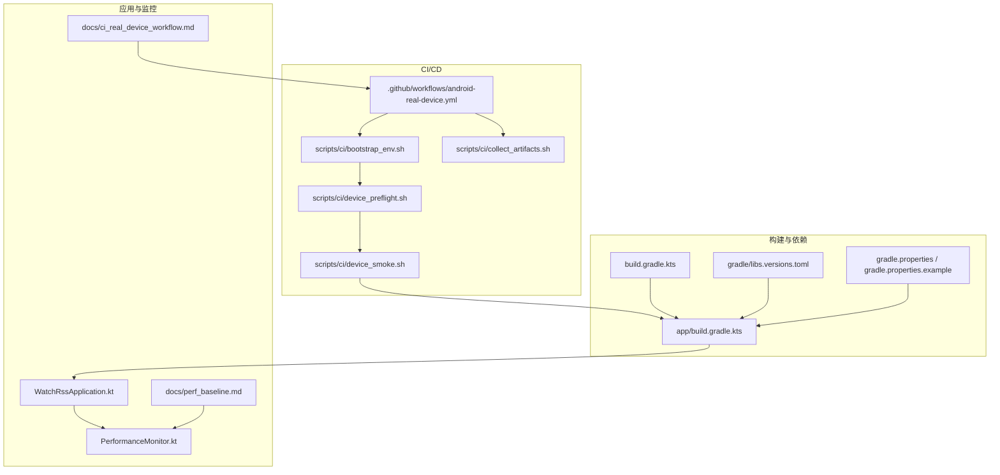
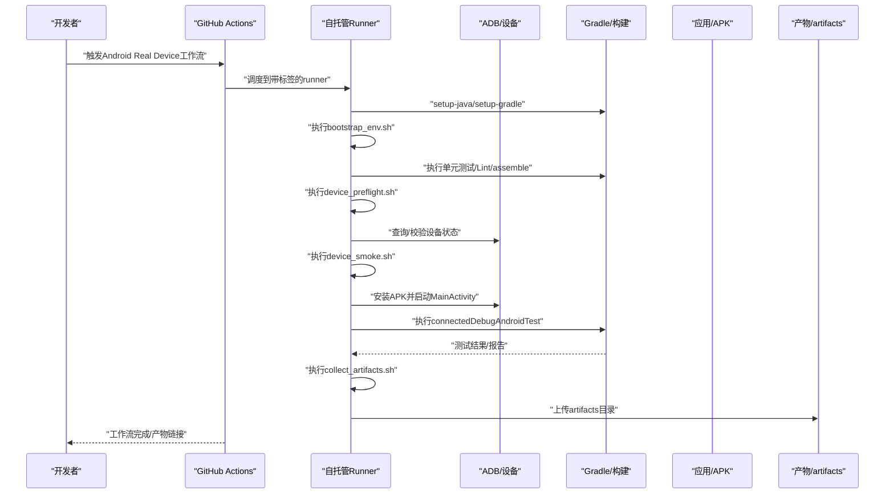
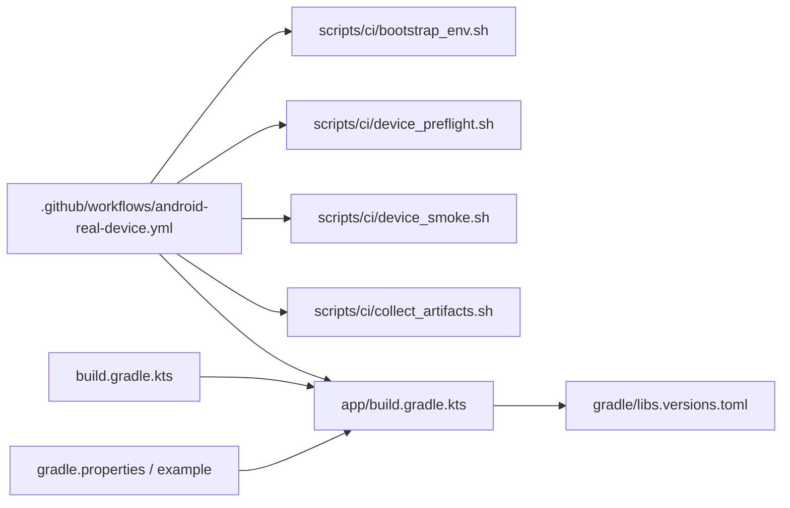

# 部署与运维

<cite>
**本文引用的文件**
- [.github/workflows/android-real-device.yml](file://.github/workflows/android-real-device.yml)
- [app/build.gradle.kts](file://app/build.gradle.kts)
- [build.gradle.kts](file://build.gradle.kts)
- [gradle/libs.versions.toml](file://gradle/libs.versions.toml)
- [gradle.properties](file://gradle.properties)
- [gradle.properties.example](file://gradle.properties.example)
- [scripts/ci/bootstrap_env.sh](file://scripts/ci/bootstrap_env.sh)
- [scripts/ci/device_preflight.sh](file://scripts/ci/device_preflight.sh)
- [scripts/ci/device_smoke.sh](file://scripts/ci/device_smoke.sh)
- [scripts/ci/collect_artifacts.sh](file://scripts/ci/collect_artifacts.sh)
- [docs/ci_real_device_workflow.md](file://docs/ci_real_device_workflow.md)
- [docs/perf_baseline.md](file://docs/perf_baseline.md)
- [app/src/main/java/com/lightningstudio/watchrss/WatchRssApplication.kt](file://app/src/main/java/com/lightningstudio/watchrss/WatchRssApplication.kt)
- [app/src/main/java/com/lightningstudio/watchrss/debug/PerformanceMonitor.kt](file://app/src/main/java/com/lightningstudio/watchrss/debug/PerformanceMonitor.kt)
- [README.md](file://README.md)
</cite>

## 目录
1. [简介](#简介)
2. [项目结构](#项目结构)
3. [核心组件](#核心组件)
4. [架构总览](#架构总览)
5. [详细组件分析](#详细组件分析)
6. [依赖关系分析](#依赖关系分析)
7. [性能考量](#性能考量)
8. [故障排查指南](#故障排查指南)
9. [结论](#结论)
10. [附录](#附录)

## 简介
本文件面向Android WatchRSS项目的部署与运维，围绕CI/CD流水线、构建与测试、打包与发布、监控与告警、日志与分析、回滚与应急响应等方面进行系统化说明。重点基于仓库中的GitHub Actions工作流与CI脚本，结合Gradle构建配置与应用层日志/性能监控能力，给出可落地的实践建议与操作指引。

## 项目结构
- CI/CD与脚本
  - GitHub Actions工作流：.github/workflows/android-real-device.yml
  - CI脚本：scripts/ci/*.sh（环境引导、设备预检、冒烟测试、产物收集）
- 构建与依赖
  - 应用级构建：app/build.gradle.kts
  - 顶层构建：build.gradle.kts
  - 版本与依赖：gradle/libs.versions.toml
  - Gradle全局属性：gradle.properties、gradle.properties.example
- 文档与说明
  - 真机CI工作流说明：docs/ci_real_device_workflow.md
  - 性能基线与调试：docs/perf_baseline.md
- 应用与监控
  - 应用入口与日志初始化：app/src/main/java/com/lightningstudio/watchrss/WatchRssApplication.kt
  - 性能监控与帧统计：app/src/main/java/com/lightningstudio/watchrss/debug/PerformanceMonitor.kt
- 项目说明
  - README.md

**图表来源**
- [.github/workflows/android-real-device.yml:1-110](file://.github/workflows/android-real-device.yml#L1-L110)
- [scripts/ci/bootstrap_env.sh:1-33](file://scripts/ci/bootstrap_env.sh#L1-L33)
- [scripts/ci/device_preflight.sh:1-93](file://scripts/ci/device_preflight.sh#L1-L93)
- [scripts/ci/device_smoke.sh:1-78](file://scripts/ci/device_smoke.sh#L1-L78)
- [scripts/ci/collect_artifacts.sh:1-79](file://scripts/ci/collect_artifacts.sh#L1-L79)
- [app/build.gradle.kts:1-152](file://app/build.gradle.kts#L1-L152)
- [build.gradle.kts:1-10](file://build.gradle.kts#L1-L10)
- [gradle/libs.versions.toml:1-101](file://gradle/libs.versions.toml#L1-L101)
- [gradle.properties:1-30](file://gradle.properties#L1-L30)
- [gradle.properties.example:1-32](file://gradle.properties.example#L1-L32)
- [app/src/main/java/com/lightningstudio/watchrss/WatchRssApplication.kt:1-47](file://app/src/main/java/com/lightningstudio/watchrss/WatchRssApplication.kt#L1-L47)
- [app/src/main/java/com/lightningstudio/watchrss/debug/PerformanceMonitor.kt:34-168](file://app/src/main/java/com/lightningstudio/watchrss/debug/PerformanceMonitor.kt#L34-L168)
- [docs/ci_real_device_workflow.md:1-193](file://docs/ci_real_device_workflow.md#L1-L193)
- [docs/perf_baseline.md:1-47](file://docs/perf_baseline.md#L1-L47)

**章节来源**
- [.github/workflows/android-real-device.yml:1-110](file://.github/workflows/android-real-device.yml#L1-L110)
- [docs/ci_real_device_workflow.md:1-193](file://docs/ci_real_device_workflow.md#L1-L193)

## 核心组件
- GitHub Actions工作流
  - 触发方式：workflow_dispatch与workflow_call，支持手动指定设备序列号与测试类/包过滤
  - 运行环境：自托管Linux runner，标签包含self-hosted、linux、android-real-device
  - 关键步骤：环境引导、单元测试、Lint、构建APK、安装测试APK、设备预检、冒烟测试、仪器化测试、产物收集与上传
- CI脚本体系
  - 引导环境：校验SDK、生成local.properties、记录环境信息
  - 设备预检：ADB服务、设备状态、授权/离线校验、设备属性与诊断信息采集
  - 冒烟测试：安装APK、启动MainActivity、进程与栈校验、抓取logcat与截图
  - 产物收集：设备最终状态、logcat、测试报告归档
- 构建与签名
  - 通过keystore.properties动态注入签名配置
  - 支持开启混淆与资源收缩
  - 通过Gradle属性控制测试隔离与清包数据
- 应用日志与性能监控
  - 应用启动初始化日志系统
  - 性能监控：基于JankStats与帧指标统计，支持场景标注与详细帧日志

**章节来源**
- [.github/workflows/android-real-device.yml:1-110](file://.github/workflows/android-real-device.yml#L1-L110)
- [scripts/ci/bootstrap_env.sh:1-33](file://scripts/ci/bootstrap_env.sh#L1-L33)
- [scripts/ci/device_preflight.sh:1-93](file://scripts/ci/device_preflight.sh#L1-L93)
- [scripts/ci/device_smoke.sh:1-78](file://scripts/ci/device_smoke.sh#L1-L78)
- [scripts/ci/collect_artifacts.sh:1-79](file://scripts/ci/collect_artifacts.sh#L1-L79)
- [app/build.gradle.kts:1-152](file://app/build.gradle.kts#L1-L152)
- [app/src/main/java/com/lightningstudio/watchrss/WatchRssApplication.kt:1-47](file://app/src/main/java/com/lightningstudio/watchrss/WatchRssApplication.kt#L1-L47)
- [app/src/main/java/com/lightningstudio/watchrss/debug/PerformanceMonitor.kt:34-168](file://app/src/main/java/com/lightningstudio/watchrss/debug/PerformanceMonitor.kt#L34-L168)

## 架构总览
下图展示了从代码提交到真机测试与产物产出的端到端流程，以及各环节的输入输出与依赖关系。

**图表来源**
- [.github/workflows/android-real-device.yml:1-110](file://.github/workflows/android-real-device.yml#L1-L110)
- [scripts/ci/bootstrap_env.sh:1-33](file://scripts/ci/bootstrap_env.sh#L1-L33)
- [scripts/ci/device_preflight.sh:1-93](file://scripts/ci/device_preflight.sh#L1-L93)
- [scripts/ci/device_smoke.sh:1-78](file://scripts/ci/device_smoke.sh#L1-L78)
- [scripts/ci/collect_artifacts.sh:1-79](file://scripts/ci/collect_artifacts.sh#L1-L79)

## 详细组件分析

### GitHub Actions工作流（android-real-device.yml）
- 触发与权限
  - 支持workflow_dispatch与workflow_call，具备contents: read权限
- 运行环境与并发
  - 自托管Linux runner，标签：self-hosted、linux、android-real-device
  - 并发组：android-real-device，取消同组进行中的任务
- 环境变量
  - GRADLE_USER_HOME指向工作区内的缓存目录
  - ANDROID_SERIAL来自输入或仓库变量
  - INSTRUMENTATION_CLASS用于筛选测试类/包
  - WATCHRSS_CLEAR_APP_DATA与WATCHRSS_USE_ISOLATED_INSTRUMENTATION用于测试隔离与清包
- 步骤分解
  - checkout、setup-java、setup-gradle
  - bootstrap_env.sh：生成local.properties并记录环境信息
  - 构建与验证：单元测试、Lint、assembleDebug、assembleDebugAndroidTest
  - device_preflight.sh：ADB服务、设备状态、诊断信息采集、唤醒/解锁
  - device_smoke.sh：安装APK、启动MainActivity、进程与栈校验、抓取logcat与截图
  - connectedDebugAndroidTest：按类/包过滤执行仪器化测试
  - collect_artifacts.sh：采集设备最终状态、logcat、测试报告
  - 上传artifacts

**章节来源**
- [.github/workflows/android-real-device.yml:1-110](file://.github/workflows/android-real-device.yml#L1-L110)
- [docs/ci_real_device_workflow.md:1-193](file://docs/ci_real_device_workflow.md#L1-L193)

### CI脚本职责与流程

#### 环境引导（bootstrap_env.sh）
- 校验ANDROID_SDK_ROOT或ANDROID_HOME
- 生成local.properties，写入sdk.dir
- 记录环境信息：操作系统、Java版本、adb版本、Gradle版本

**章节来源**
- [scripts/ci/bootstrap_env.sh:1-33](file://scripts/ci/bootstrap_env.sh#L1-L33)

#### 设备预检（device_preflight.sh）
- 启动ADB服务并捕获设备列表
- 校验是否存在unauthorized或offline设备
- 解析设备serial，写入selected-serial.txt并注入GITHUB_ENV
- 采集设备属性、电池、分辨率、窗口与Activity栈
- 尝试唤醒/解锁设备

**章节来源**
- [scripts/ci/device_preflight.sh:1-93](file://scripts/ci/device_preflight.sh#L1-L93)

#### 冒烟测试（device_smoke.sh）
- 可选清包数据（由环境变量控制）
- 安装debug与debugAndroidTest APK
- 启动MainActivity并等待
- 校验进程存在、顶层Activity包含应用包名
- 截图与抓取logcat
- 若发现致命错误（ANR、崩溃、fatal信号等）则失败

**章节来源**
- [scripts/ci/device_smoke.sh:1-78](file://scripts/ci/device_smoke.sh#L1-L78)

#### 产物收集（collect_artifacts.sh）
- 在always阶段执行，采集最终设备状态、logcat
- 归档单元测试、Lint、仪器化测试报告
- 若instrumentation阶段logcat含致命错误，则标记失败

**章节来源**
- [scripts/ci/collect_artifacts.sh:1-79](file://scripts/ci/collect_artifacts.sh#L1-L79)

### 构建与签名配置（app/build.gradle.kts）
- 签名配置
  - 通过根目录keystore.properties动态注入release签名参数
  - debug类型若存在签名配置则复用release配置
- 构建类型
  - release启用混淆与资源收缩，并应用Proguard规则
- 测试选项
  - 支持通过Gradle属性启用AndroidX Test Orchestrator与清包数据
- 依赖与版本
  - 通过libs.versions.toml集中管理版本
  - 开启Compose与BuildConfig

**章节来源**
- [app/build.gradle.kts:1-152](file://app/build.gradle.kts#L1-L152)
- [gradle/libs.versions.toml:1-101](file://gradle/libs.versions.toml#L1-L101)

### 应用日志与性能监控
- 应用启动日志
  - WatchRssApplication初始化日志系统，记录应用启动时间戳
  - debuggable时启用DebugLogBuffer并设置B站SDK日志桥接
- 性能监控
  - PerformanceMonitor基于JankStats与帧指标统计，生命周期内开始/停止跟踪
  - 支持场景标注与详细帧日志输出，便于定位UI卡顿与渲染瓶颈

**章节来源**
- [app/src/main/java/com/lightningstudio/watchrss/WatchRssApplication.kt:1-47](file://app/src/main/java/com/lightningstudio/watchrss/WatchRssApplication.kt#L1-L47)
- [app/src/main/java/com/lightningstudio/watchrss/debug/PerformanceMonitor.kt:34-168](file://app/src/main/java/com/lightningstudio/watchrss/debug/PerformanceMonitor.kt#L34-L168)
- [docs/perf_baseline.md:1-47](file://docs/perf_baseline.md#L1-L47)

## 依赖关系分析
- 工作流与脚本
  - android-real-device.yml依赖所有CI脚本与Gradle任务
  - device_preflight.sh依赖ADB命令与设备状态
  - device_smoke.sh依赖已构建的APK与ADB命令
  - collect_artifacts.sh依赖Gradle报告与ADB命令
- 构建与依赖
  - app/build.gradle.kts依赖libs.versions.toml中的版本声明
  - 顶层build.gradle.kts统一插件版本
  - gradle.properties与gradle.properties.example影响构建JVM参数与Android SDK路径

**图表来源**
- [.github/workflows/android-real-device.yml:1-110](file://.github/workflows/android-real-device.yml#L1-L110)
- [scripts/ci/bootstrap_env.sh:1-33](file://scripts/ci/bootstrap_env.sh#L1-L33)
- [scripts/ci/device_preflight.sh:1-93](file://scripts/ci/device_preflight.sh#L1-L93)
- [scripts/ci/device_smoke.sh:1-78](file://scripts/ci/device_smoke.sh#L1-L78)
- [scripts/ci/collect_artifacts.sh:1-79](file://scripts/ci/collect_artifacts.sh#L1-L79)
- [app/build.gradle.kts:1-152](file://app/build.gradle.kts#L1-L152)
- [build.gradle.kts:1-10](file://build.gradle.kts#L1-L10)
- [gradle/libs.versions.toml:1-101](file://gradle/libs.versions.toml#L1-L101)
- [gradle.properties:1-30](file://gradle.properties#L1-L30)
- [gradle.properties.example:1-32](file://gradle.properties.example#L1-L32)

**章节来源**
- [.github/workflows/android-real-device.yml:1-110](file://.github/workflows/android-real-device.yml#L1-L110)
- [app/build.gradle.kts:1-152](file://app/build.gradle.kts#L1-L152)
- [build.gradle.kts:1-10](file://build.gradle.kts#L1-L10)
- [gradle/libs.versions.toml:1-101](file://gradle/libs.versions.toml#L1-L101)
- [gradle.properties:1-30](file://gradle.properties#L1-L30)
- [gradle.properties.example:1-32](file://gradle.properties.example#L1-L32)

## 性能考量
- 真机回归优先于模拟器兼容，确保UI交互与性能表现真实可靠
- 仪器化测试默认启用隔离模式与清包数据，降低用例间状态污染
- 性能监控通过JankStats与帧指标统计，支持场景化标注与详细日志输出
- 建议在CI中保留性能基线文档，定期对比关键场景的帧率与卡顿比例

**章节来源**
- [docs/ci_real_device_workflow.md:1-193](file://docs/ci_real_device_workflow.md#L1-L193)
- [docs/perf_baseline.md:1-47](file://docs/perf_baseline.md#L1-L47)
- [app/src/main/java/com/lightningstudio/watchrss/debug/PerformanceMonitor.kt:34-168](file://app/src/main/java/com/lightningstudio/watchrss/debug/PerformanceMonitor.kt#L34-L168)

## 故障排查指南
- 找不到设备
  - 检查artifacts/device/adb-devices.txt
  - 确认runner上adb devices -l可见设备
  - 多设备时设置ANDROID_SERIAL
  - device_preflight.sh已尝试重启ADB服务
- 设备unauthorized或offline
  - 重新插拔USB或重连adb
  - 在设备上确认adb授权弹窗
  - 再次触发工作流
- 应用启动即崩
  - 查看artifacts/logs/logcat-smoke.txt
  - 检查顶层Activity与窗口栈
  - device_smoke.sh在检测到致命错误时会直接失败
- connectedDebugAndroidTest找不到设备
  - 确认device_preflight.sh已生成selected-serial.txt
  - 检查ANDROID_SERIAL是否被后续步骤继承
  - 避免runner被其他任务抢占ADB
- 仪器化测试过慢
  - CI默认隔离模式逐条用例独立拉起，降低状态污染
  - 可通过instrumentation_class缩小测试范围
- Gradle找不到SDK
  - 检查ANDROID_SDK_ROOT/ANDROID_HOME
  - bootstrap_env.sh会写入local.properties
  - SDK目录不存在会导致引导阶段失败

**章节来源**
- [docs/ci_real_device_workflow.md:151-193](file://docs/ci_real_device_workflow.md#L151-L193)
- [scripts/ci/device_preflight.sh:1-93](file://scripts/ci/device_preflight.sh#L1-L93)
- [scripts/ci/device_smoke.sh:1-78](file://scripts/ci/device_smoke.sh#L1-L78)
- [scripts/ci/collect_artifacts.sh:1-79](file://scripts/ci/collect_artifacts.sh#L1-L79)

## 结论
本项目通过GitHub Actions与自托管Runner实现了稳定的真机CI闭环，配合完善的脚本体系与日志/性能监控能力，能够有效保障应用质量与用户体验。建议在实际运维中持续完善以下方面：
- 明确签名与版本管理策略，规范发布流程
- 建立监控与告警机制，结合应用日志与性能指标进行异常预警
- 完善回滚与应急响应流程，确保快速恢复
- 持续优化测试矩阵与覆盖率，提升自动化质量门禁

## 附录
- 本地构建配置
  - 参考README中的本地构建说明，首次拉取后复制示例属性文件并按需调整
- 仓库变量与输入
  - ANDROID_SERIAL建议配置为仓库变量
  - device_serial与instrumentation_class支持手动覆盖与筛选

**章节来源**
- [README.md:33-40](file://README.md#L33-L40)
- [docs/ci_real_device_workflow.md:59-76](file://docs/ci_real_device_workflow.md#L59-L76)