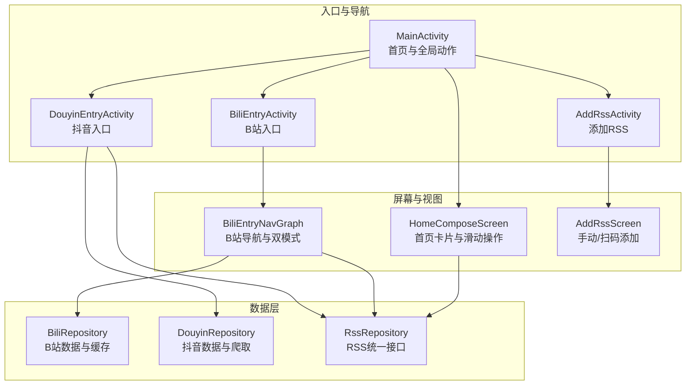
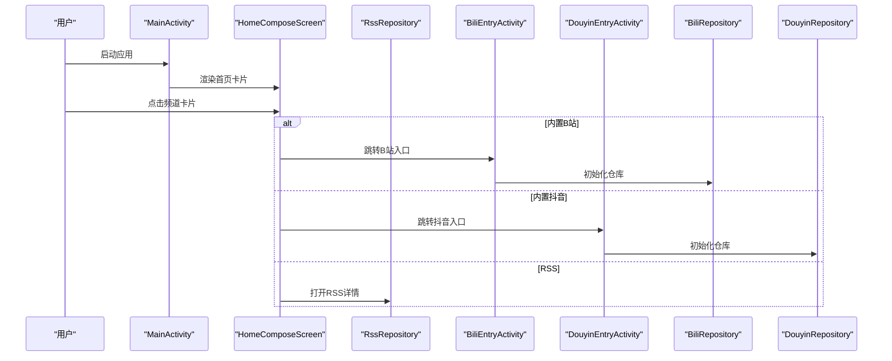
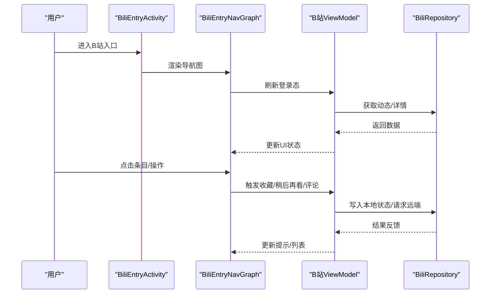
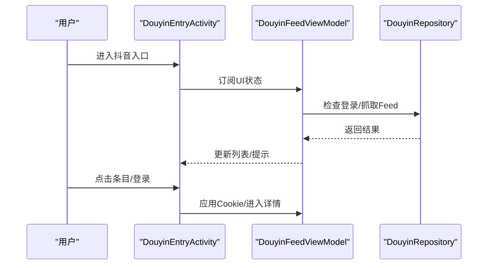
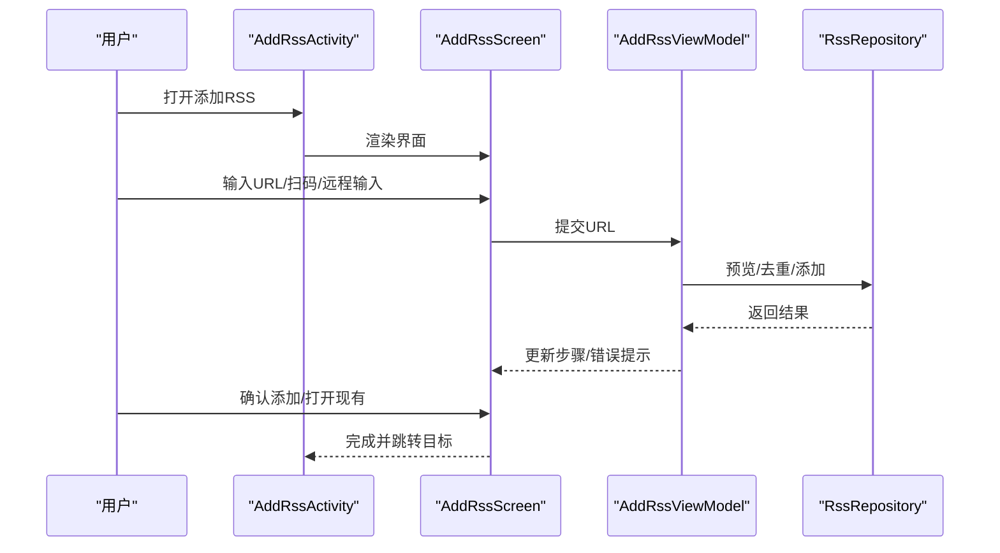
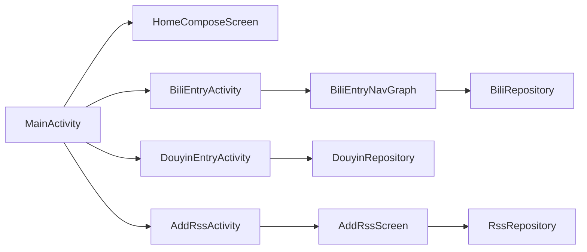

# 核心功能模块

<cite>
**本文引用的文件**
- [MainActivity.kt](file://app/src/main/java/com/lightningstudio/watchrss/MainActivity.kt)
- [BiliEntryActivity.kt](file://app/src/main/java/com/lightningstudio/watchrss/BiliEntryActivity.kt)
- [DouyinEntryActivity.kt](file://app/src/main/java/com/lightningstudio/watchrss/DouyinEntryActivity.kt)
- [AddRssActivity.kt](file://app/src/main/java/com/lightningstudio/watchrss/AddRssActivity.kt)
- [HomeComposeScreen.kt](file://app/src/main/java/com/lightningstudio/watchrss/ui/screen/home/HomeComposeScreen.kt)
- [BiliEntryNavGraph.kt](file://app/src/main/java/com/lightningstudio/watchrss/ui/screen/bili/BiliEntryNavGraph.kt)
- [AddRssScreen.kt](file://app/src/main/java/com/lightningstudio/watchrss/ui/screen/rss/AddRssScreen.kt)
- [BiliRepository.kt](file://app/src/main/java/com/lightningstudio/watchrss/data/bili/BiliRepository.kt)
- [DouyinRepository.kt](file://app/src/main/java/com/lightningstudio/watchrss/data/douyin/DouyinRepository.kt)
- [RssRepository.kt](file://app/src/main/java/com/lightningstudio/watchrss/data/rss/RssRepository.kt)
</cite>

## 目录
1. [引言](#引言)
2. [项目结构](#项目结构)
3. [核心组件](#核心组件)
4. [架构总览](#架构总览)
5. [详细组件分析](#详细组件分析)
6. [依赖分析](#依赖分析)
7. [性能考虑](#性能考虑)
8. [故障排查指南](#故障排查指南)
9. [结论](#结论)
10. [附录](#附录)

## 引言
本文件面向Android WatchRSS项目，系统性梳理三大核心功能模块：B站轻量化浏览、抖音轻量化浏览与通用RSS阅读器。文档聚焦手表端适配策略与技术创新点，解释如何在小屏设备上优化用户交互体验，避免高功耗视频播放，提供简洁高效的浏览与操作路径，并给出功能对比与使用场景示例。

## 项目结构
应用采用分层与模块化组织：
- 入口与导航：主界面与平台入口（B站/抖音）通过活动（Activity）承载，Compose渲染UI。
- 数据层：B站与抖音分别提供Repository接口与实现，RSS统一通过RssRepository抽象。
- 屏幕与视图模型：各模块以NavGraph/Screen形式组织，配合ViewModel驱动状态。
- 设计与交互：Home屏幕提供统一入口与快捷操作，针对手表端进行密度与手势优化。

图表来源
- [MainActivity.kt:93-205](file://app/src/main/java/com/lightningstudio/watchrss/MainActivity.kt#L93-L205)
- [HomeComposeScreen.kt:84-203](file://app/src/main/java/com/lightningstudio/watchrss/ui/screen/home/HomeComposeScreen.kt#L84-L203)
- [BiliEntryActivity.kt:11-27](file://app/src/main/java/com/lightningstudio/watchrss/BiliEntryActivity.kt#L11-L27)
- [BiliEntryNavGraph.kt:43-181](file://app/src/main/java/com/lightningstudio/watchrss/ui/screen/bili/BiliEntryNavGraph.kt#L43-L181)
- [AddRssActivity.kt:21-122](file://app/src/main/java/com/lightningstudio/watchrss/AddRssActivity.kt#L21-L122)
- [AddRssScreen.kt:55-477](file://app/src/main/java/com/lightningstudio/watchrss/ui/screen/rss/AddRssScreen.kt#L55-L477)
- [BiliRepository.kt:66-1116](file://app/src/main/java/com/lightningstudio/watchrss/data/bili/BiliRepository.kt#L66-L1116)
- [DouyinRepository.kt:21-204](file://app/src/main/java/com/lightningstudio/watchrss/data/douyin/DouyinRepository.kt#L21-L204)
- [RssRepository.kt:5-44](file://app/src/main/java/com/lightningstudio/watchrss/data/rss/RssRepository.kt#L5-L44)

章节来源
- [MainActivity.kt:27-205](file://app/src/main/java/com/lightningstudio/watchrss/MainActivity.kt#L27-L205)
- [HomeComposeScreen.kt:84-203](file://app/src/main/java/com/lightningstudio/watchrss/ui/screen/home/HomeComposeScreen.kt#L84-L203)

## 核心组件
- 首页与全局动作：首页卡片列表、滑动操作、刷新与快捷入口，适配手表端密度与手势。
- B站入口：双模式切换（原生沉浸/轻量RSS），支持登录、搜索、稍后再看、历史、收藏等。
- 抖音入口：登录态控制与两种呈现（原生/轻量），支持预加载与历史记录。
- RSS添加：手动输入、扫码添加、预览与去重，支持远程输入（手机协助）。

章节来源
- [HomeComposeScreen.kt:84-203](file://app/src/main/java/com/lightningstudio/watchrss/ui/screen/home/HomeComposeScreen.kt#L84-L203)
- [BiliEntryNavGraph.kt:43-181](file://app/src/main/java/com/lightningstudio/watchrss/ui/screen/bili/BiliEntryNavGraph.kt#L43-L181)
- [DouyinEntryActivity.kt:29-124](file://app/src/main/java/com/lightningstudio/watchrss/DouyinEntryActivity.kt#L29-L124)
- [AddRssScreen.kt:55-477](file://app/src/main/java/com/lightningstudio/watchrss/ui/screen/rss/AddRssScreen.kt#L55-L477)

## 架构总览
整体采用“活动承载、Compose渲染、Repository驱动”的分层架构。首页作为中枢，根据内置类型路由到对应入口；B站与抖音各自维护登录态与数据缓存；RSS通过统一仓库抽象接入。

图表来源
- [MainActivity.kt:195-205](file://app/src/main/java/com/lightningstudio/watchrss/MainActivity.kt#L195-L205)
- [HomeComposeScreen.kt:180-196](file://app/src/main/java/com/lightningstudio/watchrss/ui/screen/home/HomeComposeScreen.kt#L180-L196)
- [BiliEntryActivity.kt:11-27](file://app/src/main/java/com/lightningstudio/watchrss/BiliEntryActivity.kt#L11-L27)
- [DouyinEntryActivity.kt:29-124](file://app/src/main/java/com/lightningstudio/watchrss/DouyinEntryActivity.kt#L29-L124)
- [BiliRepository.kt:66-1116](file://app/src/main/java/com/lightningstudio/watchrss/data/bili/BiliRepository.kt#L66-L1116)
- [DouyinRepository.kt:21-204](file://app/src/main/java/com/lightningstudio/watchrss/data/douyin/DouyinRepository.kt#L21-L204)
- [RssRepository.kt:5-44](file://app/src/main/java/com/lightningstudio/watchrss/data/rss/RssRepository.kt#L5-L44)

## 详细组件分析

### B站轻量化浏览
- 核心能力
  - 登录态管理与二维码登录流程，支持Cookie注入与清理。
  - 动态流抓取与缓存，支持预览缓存与播放源解析缓存。
  - 互动状态读写（点赞/投币/收藏）、历史与稍后再看查询。
  - 视频详情与评论/回复子页面导航。
- 手表端适配
  - 密度放大：在入口处通过密度提供器将Compose密度放大，提升可读性。
  - 双模式：根据RSS设置决定是否启用原生沉浸模式或轻量RSS模式。
  - 交互简化：移除视频播放，仅提供文字摘要与必要操作入口。
- 技术创新点
  - 播放源解析缓存与并发锁，避免重复请求与抖动。
  - 预览片段下载与缓存，缩短首帧时间。
  - 本地交互状态与播放进度持久化，保证离线可用性。

图表来源
- [BiliEntryActivity.kt:11-27](file://app/src/main/java/com/lightningstudio/watchrss/BiliEntryActivity.kt#L11-L27)
- [BiliEntryNavGraph.kt:43-181](file://app/src/main/java/com/lightningstudio/watchrss/ui/screen/bili/BiliEntryNavGraph.kt#L43-L181)
- [BiliRepository.kt:66-1116](file://app/src/main/java/com/lightningstudio/watchrss/data/bili/BiliRepository.kt#L66-L1116)

章节来源
- [BiliEntryActivity.kt:11-27](file://app/src/main/java/com/lightningstudio/watchrss/BiliEntryActivity.kt#L11-L27)
- [BiliEntryNavGraph.kt:43-181](file://app/src/main/java/com/lightningstudio/watchrss/ui/screen/bili/BiliEntryNavGraph.kt#L43-L181)
- [BiliRepository.kt:66-1116](file://app/src/main/java/com/lightningstudio/watchrss/data/bili/BiliRepository.kt#L66-L1116)

### 抖音轻量化浏览
- 核心能力
  - 登录态检测与Cookie注入，支持登出与媒体缓存清理。
  - 爬虫抓取精选Feed与单视频内容，解析为统一模型。
  - 支持构建播放请求头，保障后续播放（如需）。
- 手表端适配
  - 登录态控制：未登录时强制显示登录界面，避免无意义操作。
  - 两种呈现：原生沉浸或RSS轻量列表，后者更贴近手表小屏。
  - 预加载与历史：提供预加载管理与观看历史存储。
- 技术创新点
  - 加密Cookie存储与WebView会话清理，降低安全风险。
  - 统一解析器与爬虫分离，便于扩展与维护。
  - 错误码格式化与可读提示，改善用户感知。

图表来源
- [DouyinEntryActivity.kt:29-124](file://app/src/main/java/com/lightningstudio/watchrss/DouyinEntryActivity.kt#L29-L124)
- [DouyinRepository.kt:21-204](file://app/src/main/java/com/lightningstudio/watchrss/data/douyin/DouyinRepository.kt#L21-L204)

章节来源
- [DouyinEntryActivity.kt:29-124](file://app/src/main/java/com/lightningstudio/watchrss/DouyinEntryActivity.kt#L29-L124)
- [DouyinRepository.kt:21-204](file://app/src/main/java/com/lightningstudio/watchrss/data/douyin/DouyinRepository.kt#L21-L204)

### 通用RSS阅读器
- 核心能力
  - 订阅管理：手动输入、扫码添加、预览与去重、远程输入（手机协助）。
  - 内容展示：标题+摘要，已读/未读标记，分页与搜索。
  - 行为扩展：收藏、稍后再看、外部保存项同步、离线媒体重试。
- 手表端适配
  - 顶部标签页与下拉刷新，适配手表端手势。
  - 数字滚轮与滑动手势处理，提升滚动体验。
  - 密集信息的两行摘要与指示器，兼顾可读性与空间利用。
- 技术创新点
  - 步骤化添加流程：输入→预览→确认/去重→完成，降低误操作。
  - 扫码添加：生成二维码，手机侧输入后回传至手表。
  - 缓存与后台刷新：统一仓库负责缓存与后台刷新策略。

图表来源
- [AddRssActivity.kt:21-122](file://app/src/main/java/com/lightningstudio/watchrss/AddRssActivity.kt#L21-L122)
- [AddRssScreen.kt:55-477](file://app/src/main/java/com/lightningstudio/watchrss/ui/screen/rss/AddRssScreen.kt#L55-L477)
- [RssRepository.kt:5-44](file://app/src/main/java/com/lightningstudio/watchrss/data/rss/RssRepository.kt#L5-L44)

章节来源
- [AddRssActivity.kt:21-122](file://app/src/main/java/com/lightningstudio/watchrss/AddRssActivity.kt#L21-L122)
- [AddRssScreen.kt:55-477](file://app/src/main/java/com/lightningstudio/watchrss/ui/screen/rss/AddRssScreen.kt#L55-L477)
- [RssRepository.kt:5-44](file://app/src/main/java/com/lightningstudio/watchrss/data/rss/RssRepository.kt#L5-L44)

## 依赖分析
- 组件耦合
  - 首页与各模块通过内置类型解耦，避免强耦合。
  - B站/抖音入口与数据层通过Repository契约解耦，便于替换实现。
  - RSS添加与仓库接口解耦，支持未来扩展不同协议。
- 外部依赖
  - B站：SDK客户端与Cookie存储。
  - 抖音：爬虫与解析器、加密Cookie存储。
  - 通用：OkHttp下载器用于预览片段缓存。

图表来源
- [MainActivity.kt:195-205](file://app/src/main/java/com/lightningstudio/watchrss/MainActivity.kt#L195-L205)
- [HomeComposeScreen.kt:180-196](file://app/src/main/java/com/lightningstudio/watchrss/ui/screen/home/HomeComposeScreen.kt#L180-L196)
- [BiliEntryActivity.kt:11-27](file://app/src/main/java/com/lightningstudio/watchrss/BiliEntryActivity.kt#L11-L27)
- [BiliEntryNavGraph.kt:43-181](file://app/src/main/java/com/lightningstudio/watchrss/ui/screen/bili/BiliEntryNavGraph.kt#L43-L181)
- [DouyinEntryActivity.kt:29-124](file://app/src/main/java/com/lightningstudio/watchrss/DouyinEntryActivity.kt#L29-L124)
- [AddRssActivity.kt:21-122](file://app/src/main/java/com/lightningstudio/watchrss/AddRssActivity.kt#L21-L122)
- [AddRssScreen.kt:55-477](file://app/src/main/java/com/lightningstudio/watchrss/ui/screen/rss/AddRssScreen.kt#L55-L477)
- [BiliRepository.kt:66-1116](file://app/src/main/java/com/lightningstudio/watchrss/data/bili/BiliRepository.kt#L66-L1116)
- [DouyinRepository.kt:21-204](file://app/src/main/java/com/lightningstudio/watchrss/data/douyin/DouyinRepository.kt#L21-L204)
- [RssRepository.kt:5-44](file://app/src/main/java/com/lightningstudio/watchrss/data/rss/RssRepository.kt#L5-L44)

章节来源
- [MainActivity.kt:195-205](file://app/src/main/java/com/lightningstudio/watchrss/MainActivity.kt#L195-L205)
- [HomeComposeScreen.kt:180-196](file://app/src/main/java/com/lightningstudio/watchrss/ui/screen/home/HomeComposeScreen.kt#L180-L196)
- [BiliEntryNavGraph.kt:43-181](file://app/src/main/java/com/lightningstudio/watchrss/ui/screen/bili/BiliEntryNavGraph.kt#L43-L181)
- [DouyinEntryActivity.kt:29-124](file://app/src/main/java/com/lightningstudio/watchrss/DouyinEntryActivity.kt#L29-L124)
- [AddRssScreen.kt:55-477](file://app/src/main/java/com/lightningstudio/watchrss/ui/screen/rss/AddRssScreen.kt#L55-L477)

## 性能考虑
- 避免视频播放：三模块均不直接播放视频，减少CPU/GPU与电量消耗。
- 预加载与缓存：B站预览片段与播放源缓存、抖音媒体缓存，降低网络与解析成本。
- 低功耗交互：数字滚轮与滑动操作，减少触摸与动画开销。
- 登录态与错误提示：及时提示与降级，避免无效重试与资源浪费。

## 故障排查指南
- B站
  - 登录失败：检查Cookie完整性与有效期；必要时清理预览缓存与播放进度。
  - 解析异常：查看日志与错误码，确认网络与WBI参数。
- 抖音
  - 未登录：先执行登录流程再抓取；清理WebView会话以避免旧会话干扰。
  - 解析失败：检查返回内容与JSON结构，确认爬虫与解析器版本。
- RSS
  - 添加失败：检查URL合法性与网络连通性；使用扫码或远程输入辅助。
  - 无法刷新：检查后台刷新策略与缓存限制，必要时手动触发刷新。

章节来源
- [BiliRepository.kt:96-124](file://app/src/main/java/com/lightningstudio/watchrss/data/bili/BiliRepository.kt#L96-L124)
- [DouyinRepository.kt:34-55](file://app/src/main/java/com/lightningstudio/watchrss/data/douyin/DouyinRepository.kt#L34-L55)
- [AddRssScreen.kt:192-225](file://app/src/main/java/com/lightningstudio/watchrss/ui/screen/rss/AddRssScreen.kt#L192-L225)

## 结论
WatchRSS通过“入口解耦、双模式呈现、轻量化交互”三大策略，在手表端实现了高效稳定的多源内容消费体验。B站与抖音模块在不牺牲核心能力的前提下，避免了高功耗视频播放；RSS模块提供简洁可靠的订阅与阅读流程。整体架构清晰、扩展性强，适合持续演进与功能增强。

## 附录

### 功能对比表
- B站轻量化浏览
  - 主要能力：动态流、视频详情、评论/回复、收藏/稍后再看、历史
  - 手表适配：密度放大、双模式、无视频播放
  - 技术亮点：预览缓存、播放源缓存、本地交互状态
- 抖音轻量化浏览
  - 主要能力：精选Feed、视频内容、登录态管理
  - 手表适配：登录态控制、两种呈现模式
  - 技术亮点：爬虫与解析分离、加密Cookie存储
- 通用RSS阅读器
  - 主要能力：手动/扫码添加、标题+摘要、已读/未读、收藏/稍后再看
  - 手表适配：步骤化添加、数字滚轮、两行摘要
  - 技术亮点：预览去重、远程输入、后台刷新

### 使用场景示例
- 忙里偷闲：手表端快速浏览B站动态摘要与抖音热门短视频文字+封面预览。
- 通勤路上：通过RSS订阅技术类博客，仅看标题与摘要，标记未读并稍后阅读。
- 多端协作：在手机上扫码或远程输入RSS地址，手表端一键添加并开始阅读。