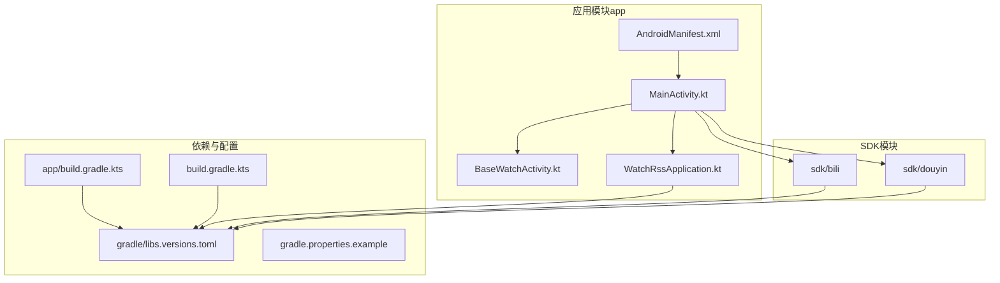
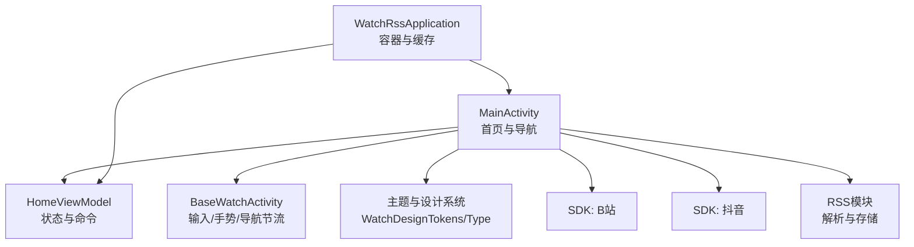
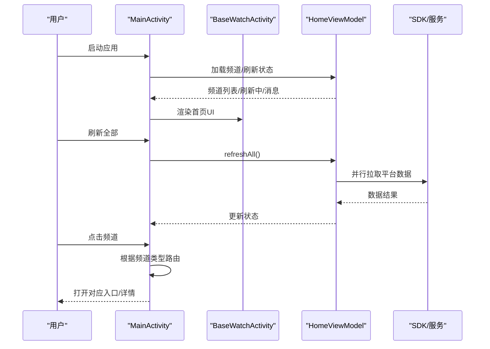
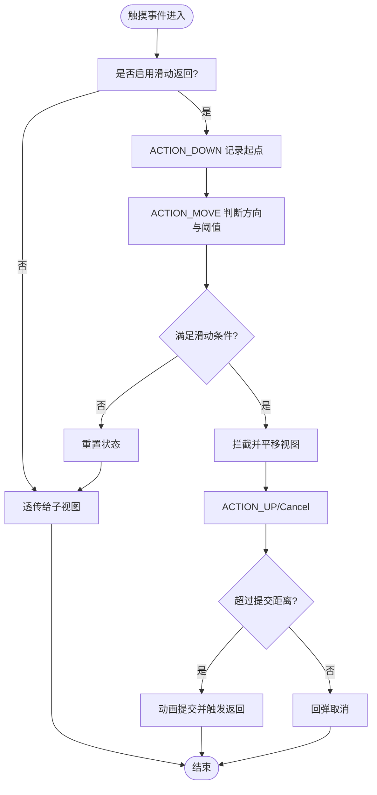
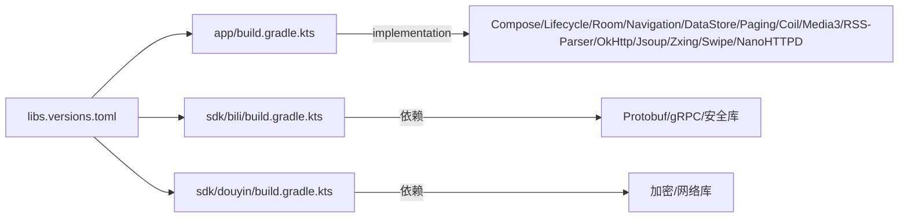

# 项目概述

<cite>
**本文引用的文件**
- [README.md](file://README.md)
- [MainActivity.kt](file://app/src/main/java/com/lightningstudio/watchrss/MainActivity.kt)
- [WatchRssApplication.kt](file://app/src/main/java/com/lightningstudio/watchrss/WatchRssApplication.kt)
- [BaseWatchActivity.kt](file://app/src/main/java/com/lightningstudio/watchrss/BaseWatchActivity.kt)
- [AndroidManifest.xml](file://app/src/main/AndroidManifest.xml)
- [build.gradle.kts（应用模块）](file://app/build.gradle.kts)
- [build.gradle.kts（根工程）](file://build.gradle.kts)
- [libs.versions.toml](file://gradle/libs.versions.toml)
- [gradle.properties.example](file://gradle.properties.example)
- [bili 构建脚本](file://sdk/bili/build.gradle.kts)
- [douyin 构建脚本](file://sdk/douyin/build.gradle.kts)
- [WatchDesignTokens.kt](file://app/src/main/java/com/lightningstudio/watchrss/ui/theme/WatchDesignTokens.kt)
- [Type.kt](file://app/src/main/java/com/lightningstudio/watchrss/ui/theme/Type.kt)
</cite>

## 目录
1. [引言](#引言)
2. [项目结构](#项目结构)
3. [核心组件](#核心组件)
4. [架构总览](#架构总览)
5. [详细组件分析](#详细组件分析)
6. [依赖关系分析](#依赖关系分析)
7. [性能考量](#性能考量)
8. [故障排查指南](#故障排查指南)
9. [结论](#结论)
10. [附录](#附录)

## 引言
本项目名为“腕上RSS”，面向可穿戴智能手表，致力于为用户提供轻量化、场景化的“腕上内容消费入口”。项目聚焦三大核心模块：B站轻量化浏览、抖音轻量化浏览与通用RSS订阅管理，并针对手表端的屏幕尺寸、交互方式与资源约束进行深度优化，实现“抬手即看”的碎片化阅读体验。

- 项目背景：随着可穿戴设备普及，用户对轻量化、即时性的内容消费需求增长；传统手机端应用难以适配手表的“小屏、滑动、单手操作”场景。
- 核心目标：打造轻量化、高效化的腕上内容聚合平台。
- 产品愿景：让信息获取回归“最小必要”，在手腕方寸之间尽览万象。

章节来源
- [README.md:1-40](file://README.md#L1-L40)

## 项目结构
应用采用多模块结构，核心应用模块依赖两个平台SDK模块（B站与抖音），并通过统一的依赖版本管理与构建配置支撑开发与发布。

- 应用模块（app）：包含UI、业务逻辑、主题与活动（Activity）等。
- 平台SDK模块（sdk/bili、sdk/douyin）：封装平台接口与协议处理，供应用模块调用。
- 依赖与版本：通过libs.versions.toml集中管理第三方库版本，确保一致性与可维护性。
- 构建与签名：应用模块支持按需签名配置，测试运行参数可由Gradle属性控制。

图表来源
- [MainActivity.kt:1-207](file://app/src/main/java/com/lightningstudio/watchrss/MainActivity.kt#L1-L207)
- [BaseWatchActivity.kt:1-552](file://app/src/main/java/com/lightningstudio/watchrss/BaseWatchActivity.kt#L1-L552)
- [WatchRssApplication.kt:1-47](file://app/src/main/java/com/lightningstudio/watchrss/WatchRssApplication.kt#L1-L47)
- [AndroidManifest.xml:1-265](file://app/src/main/AndroidManifest.xml#L1-L265)
- [build.gradle.kts（应用模块）:1-152](file://app/build.gradle.kts#L1-L152)
- [build.gradle.kts（根工程）:1-10](file://build.gradle.kts#L1-L10)
- [libs.versions.toml:1-101](file://gradle/libs.versions.toml#L1-L101)
- [bili 构建脚本:1-87](file://sdk/bili/build.gradle.kts#L1-L87)
- [douyin 构建脚本:1-32](file://sdk/douyin/build.gradle.kts#L1-L32)

章节来源
- [build.gradle.kts（应用模块）:1-152](file://app/build.gradle.kts#L1-L152)
- [build.gradle.kts（根工程）:1-10](file://build.gradle.kts#L1-L10)
- [libs.versions.toml:1-101](file://gradle/libs.versions.toml#L1-L101)
- [bili 构建脚本:1-87](file://sdk/bili/build.gradle.kts#L1-L87)
- [douyin 构建脚本:1-32](file://sdk/douyin/build.gradle.kts#L1-L32)

## 核心组件
- 应用入口与生命周期
  - MainActivity：负责引导OOBE、渲染首页、分发导航与刷新等操作，并根据频道类型路由到对应平台入口或RSS详情页。
  - WatchRssApplication：全局容器初始化、日志系统与缓存维护调度。
  - BaseWatchActivity：统一的手表端输入与手势处理（滑动返回、数字表冠滚动、硬件返回键映射）、页面状态重置与导航节流。
- 主题与设计系统
  - WatchDesignTokens：基于方形/圆形表盘的间距、形状、尺寸与布局参数，适配不同表盘形态。
  - Type：针对手表端的排版体系，确保在小屏上的可读性与层级感。
- 平台SDK
  - B站SDK：集成网络、序列化、安全与gRPC/Protobuf相关依赖，支持平台协议与加密处理。
  - 抖音SDK：集成网络与安全依赖，支持平台爬虫与解析所需能力。

章节来源
- [MainActivity.kt:1-207](file://app/src/main/java/com/lightningstudio/watchrss/MainActivity.kt#L1-L207)
- [WatchRssApplication.kt:1-47](file://app/src/main/java/com/lightningstudio/watchrss/WatchRssApplication.kt#L1-L47)
- [BaseWatchActivity.kt:1-552](file://app/src/main/java/com/lightningstudio/watchrss/BaseWatchActivity.kt#L1-L552)
- [WatchDesignTokens.kt:54-208](file://app/src/main/java/com/lightningstudio/watchrss/ui/theme/WatchDesignTokens.kt#L54-L208)
- [Type.kt:28-112](file://app/src/main/java/com/lightningstudio/watchrss/ui/theme/Type.kt#L28-L112)
- [bili 构建脚本:1-87](file://sdk/bili/build.gradle.kts#L1-L87)
- [douyin 构建脚本:1-32](file://sdk/douyin/build.gradle.kts#L1-L32)

## 架构总览
整体采用“应用模块 + SDK模块”的分层架构，应用模块通过统一容器与视图模型协调业务流程，SDK模块封装平台差异，主题与设计系统保障跨表盘一致性。

图表来源
- [MainActivity.kt:1-207](file://app/src/main/java/com/lightningstudio/watchrss/MainActivity.kt#L1-L207)
- [BaseWatchActivity.kt:1-552](file://app/src/main/java/com/lightningstudio/watchrss/BaseWatchActivity.kt#L1-L552)
- [WatchRssApplication.kt:1-47](file://app/src/main/java/com/lightningstudio/watchrss/WatchRssApplication.kt#L1-L47)
- [WatchDesignTokens.kt:54-208](file://app/src/main/java/com/lightningstudio/watchrss/ui/theme/WatchDesignTokens.kt#L54-L208)
- [Type.kt:28-112](file://app/src/main/java/com/lightningstudio/watchrss/ui/theme/Type.kt#L28-L112)

## 详细组件分析

### 组件A：MainActivity（首页与导航）
职责与行为
- 引导OOBE与首页渲染，处理刷新、消息提示、平台登录状态更新。
- 基于频道类型路由至B站/抖音入口或RSS详情页。
- 与BaseWatchActivity协作实现滑动返回、拖拽状态与导航节流。

图表来源
- [MainActivity.kt:1-207](file://app/src/main/java/com/lightningstudio/watchrss/MainActivity.kt#L1-L207)
- [BaseWatchActivity.kt:1-552](file://app/src/main/java/com/lightningstudio/watchrss/BaseWatchActivity.kt#L1-L552)

章节来源
- [MainActivity.kt:1-207](file://app/src/main/java/com/lightningstudio/watchrss/MainActivity.kt#L1-L207)

### 组件B：BaseWatchActivity（输入与手势）
职责与行为
- 统一处理滑动返回、数字表冠滚动事件、硬件返回键映射。
- 页面状态重置与导航节流，避免频繁页面切换导致的卡顿。
- 在调试模式下注入遮罩布局辅助可视化调试。

图表来源
- [BaseWatchActivity.kt:1-552](file://app/src/main/java/com/lightningstudio/watchrss/BaseWatchActivity.kt#L1-L552)

章节来源
- [BaseWatchActivity.kt:1-552](file://app/src/main/java/com/lightningstudio/watchrss/BaseWatchActivity.kt#L1-L552)

### 组件C：主题与设计系统（WatchDesignTokens/Type）
职责与行为
- 提供方形/圆形表盘的间距、形状半径、按钮尺寸与布局参数。
- 定义排版体系，确保在小屏与不同圆角下的可读性与一致性。
- 提供计算函数，依据可用宽度动态分配操作按钮与滑动操作区域宽度。

章节来源
- [WatchDesignTokens.kt:54-208](file://app/src/main/java/com/lightningstudio/watchrss/ui/theme/WatchDesignTokens.kt#L54-L208)
- [Type.kt:28-112](file://app/src/main/java/com/lightningstudio/watchrss/ui/theme/Type.kt#L28-L112)

### 组件D：平台SDK（B站与抖音）
职责与行为
- B站SDK：集成网络、序列化、安全与gRPC/Protobuf相关依赖，支持平台协议与加密处理。
- 抖音SDK：集成网络与安全依赖，支持平台爬虫与解析所需能力。
- 两者均以Android Library形式提供，供应用模块按需依赖。

章节来源
- [bili 构建脚本:1-87](file://sdk/bili/build.gradle.kts#L1-L87)
- [douyin 构建脚本:1-32](file://sdk/douyin/build.gradle.kts#L1-L32)

## 依赖关系分析
- 版本集中管理：libs.versions.toml统一声明版本，应用与SDK模块共享依赖清单，减少冲突。
- 应用模块依赖：Compose UI/Material、Lifecycle、Room、Navigation、DataStore、Paging、Coil、Media3、RSS-Parser、OkHttp、Jsoup、Zxing、SwipeRevealLayout、NanoHTTPD 等。
- SDK模块依赖：B站SDK引入 Protobuf、gRPC 与安全库；抖音SDK引入加密与网络库。
- 构建插件：应用模块启用 Compose、KSP、Kotlin Serialization；根工程统一声明插件版本。

图表来源
- [libs.versions.toml:1-101](file://gradle/libs.versions.toml#L1-L101)
- [build.gradle.kts（应用模块）:1-152](file://app/build.gradle.kts#L1-L152)
- [bili 构建脚本:1-87](file://sdk/bili/build.gradle.kts#L1-L87)
- [douyin 构建脚本:1-32](file://sdk/douyin/build.gradle.kts#L1-L32)

章节来源
- [libs.versions.toml:1-101](file://gradle/libs.versions.toml#L1-L101)
- [build.gradle.kts（应用模块）:1-152](file://app/build.gradle.kts#L1-L152)
- [bili 构建脚本:1-87](file://sdk/bili/build.gradle.kts#L1-L87)
- [douyin 构建脚本:1-32](file://sdk/douyin/build.gradle.kts#L1-L32)

## 性能考量
- UI渲染与交互
  - 使用Jetpack Compose替代传统RecyclerView/Adapter，降低布局嵌套与过度绘制风险。
  - 设计系统参数与排版体系确保在小屏与不同圆角下的渲染效率。
- 网络与数据
  - 依赖RSS-Parser与OkHttp，结合DataStore与Room，平衡离线可用性与实时性。
  - Paging与Coil用于长列表与图片加载的内存与带宽优化。
- 媒体与音频
  - Media3用于媒体播放与UI解耦，避免在手表端播放视频带来的功耗与体验问题。
- 构建与体积
  - Release开启混淆与资源收缩，配合KSP生成Room代码，减少运行时开销。

章节来源
- [README.md:28-40](file://README.md#L28-L40)
- [build.gradle.kts（应用模块）:62-72](file://app/build.gradle.kts#L62-L72)
- [libs.versions.toml:1-101](file://gradle/libs.versions.toml#L1-L101)

## 故障排查指南
- 日志与调试
  - 应用启动时初始化日志系统，调试模式下启用调试缓冲与B站SDK日志桥接。
  - BaseWatchActivity在调试模式下注入遮罩布局，便于观察布局边界。
- 输入与手势
  - 若滑动返回无效，检查是否启用滑动返回与阈值设置；确认导航节流窗口是否被占用。
  - 数字表冠滚动无响应时，确认注册的处理器是否支持Digital Crown。
- 页面状态异常
  - 页面暂停/销毁时会清理状态，若出现UI残留，检查是否自定义了跳过重置的标记。
- 权限与网络
  - Manifest中声明了网络、录音、位置与明文流量权限，若出现连接问题，核对网络配置与安全策略。

章节来源
- [WatchRssApplication.kt:26-41](file://app/src/main/java/com/lightningstudio/watchrss/WatchRssApplication.kt#L26-L41)
- [BaseWatchActivity.kt:1-552](file://app/src/main/java/com/lightningstudio/watchrss/BaseWatchActivity.kt#L1-L552)
- [AndroidManifest.xml:5-26](file://app/src/main/AndroidManifest.xml#L5-L26)

## 结论
“腕上RSS”通过轻量化的UI与交互、统一的设计系统与严格的性能约束，为可穿戴设备用户提供了高效、稳定的“腕上内容消费入口”。三大核心模块（B站、抖音、RSS）在手表端得到适配，既保留信息密度又兼顾能耗与体验。依托模块化架构与集中版本管理，项目具备良好的扩展性与可维护性。

## 附录

### 快速开始指南
- 环境准备
  - 复制示例配置文件并按需填写本地路径与JDK路径。
- 本地构建
  - 应用模块支持按需签名配置；可通过Gradle属性控制测试运行参数。
- 运行与调试
  - 使用Android Studio或命令行构建安装；调试模式下可查看日志与布局遮罩。
- 基本使用
  - 首次启动进入引导流程；完成引导后进入首页，点击频道进入对应内容入口；支持滑动返回与数字表冠滚动。

章节来源
- [README.md:33-40](file://README.md#L33-L40)
- [gradle.properties.example:1-32](file://gradle.properties.example#L1-L32)
- [build.gradle.kts（应用模块）:10-26](file://app/build.gradle.kts#L10-L26)