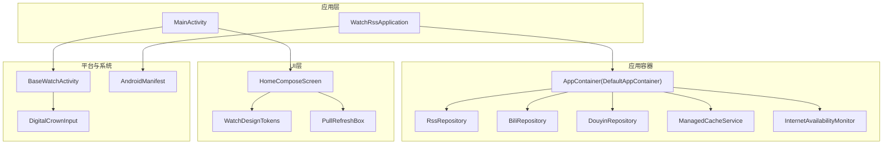
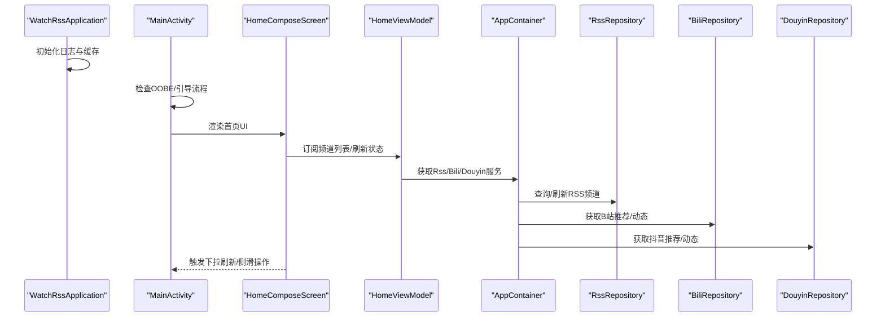
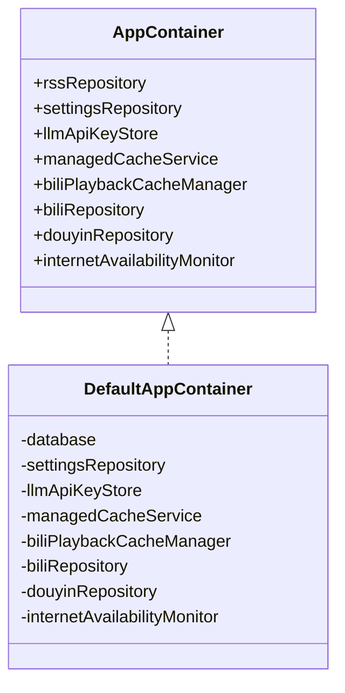
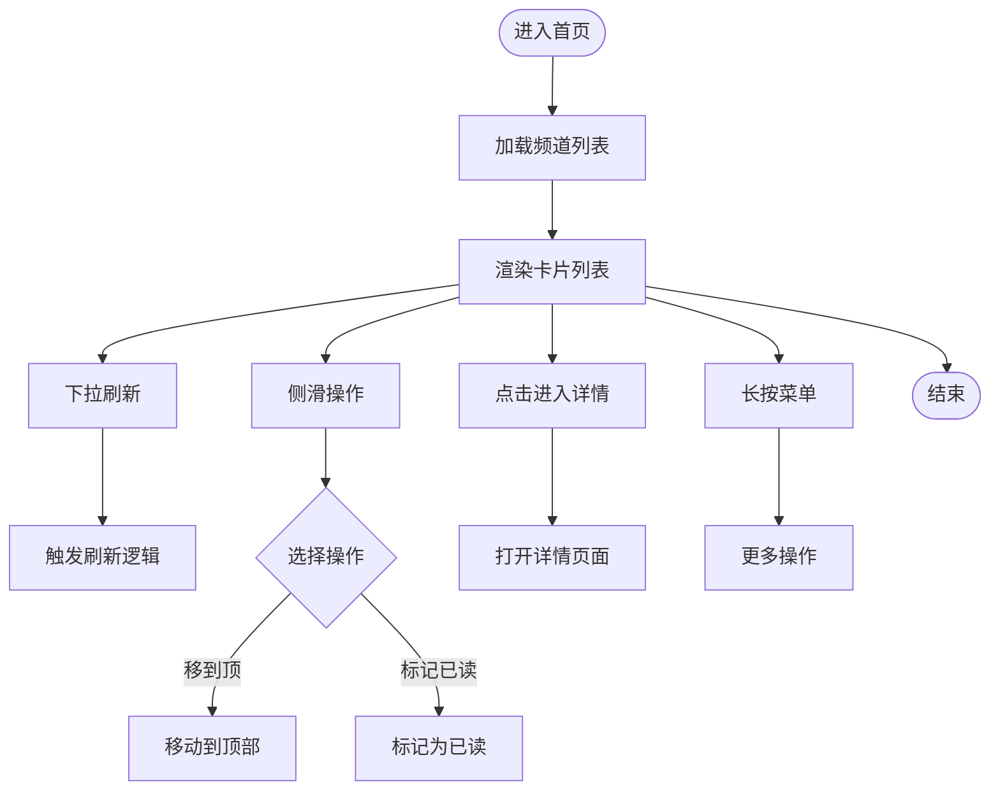
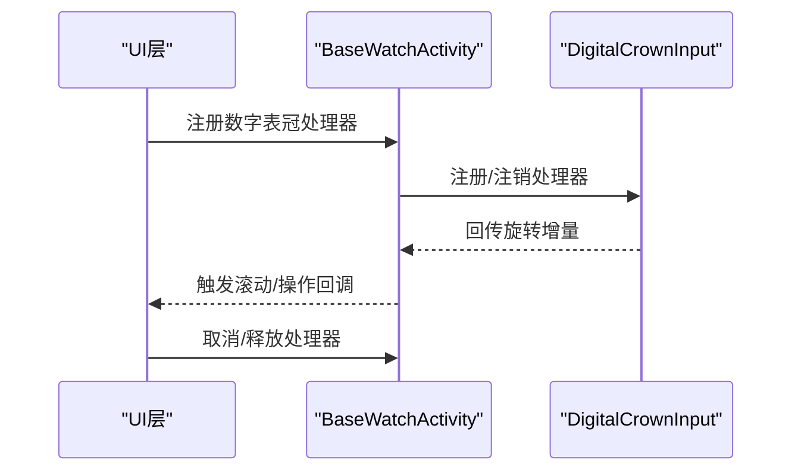
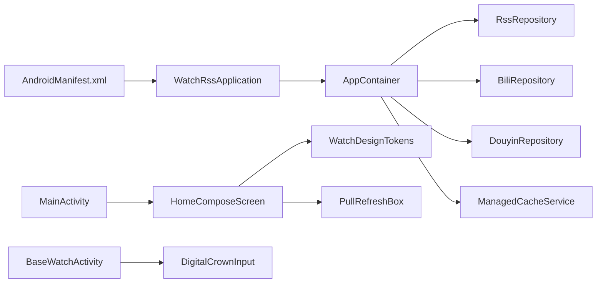

# 项目背景与定位

<cite>
**本文引用的文件**
- [README.md](file://README.md)
- [WatchRssApplication.kt](file://app/src/main/java/com/lightningstudio/watchrss/WatchRssApplication.kt)
- [MainActivity.kt](file://app/src/main/java/com/lightningstudio/watchrss/MainActivity.kt)
- [HomeComposeScreen.kt](file://app/src/main/java/com/lightningstudio/watchrss/ui/screen/home/HomeComposeScreen.kt)
- [AppContainer.kt](file://app/src/main/java/com/lightningstudio/watchrss/data/AppContainer.kt)
- [WatchDesignTokens.kt](file://app/src/main/java/com/lightningstudio/watchrss/ui/theme/WatchDesignTokens.kt)
- [PullRefreshBox.kt](file://app/src/main/java/com/lightningstudio/watchrss/ui/components/PullRefreshBox.kt)
- [DigitalCrownInput.kt](file://app/src/main/java/com/lightningstudio/watchrss/ui/input/DigitalCrownInput.kt)
- [BaseWatchActivity.kt](file://app/src/main/java/com/lightningstudio/watchrss/BaseWatchActivity.kt)
- [AndroidManifest.xml](file://app/src/main/AndroidManifest.xml)
- [user_agreement.txt](file://app/src/main/res/raw/user_agreement.txt)
- [LocalHttpServer.kt](file://app/src/main/java/com/lightningstudio/watchrss/phoneconnection/LocalHttpServer.kt)
- [BiliBili_SDK_Engineering.md](file://docs/BiliBili_SDK_Engineering.md)
</cite>

## 目录
1. [引言](#引言)
2. [项目结构](#项目结构)
3. [核心组件](#核心组件)
4. [架构总览](#架构总览)
5. [详细组件分析](#详细组件分析)
6. [依赖关系分析](#依赖关系分析)
7. [性能考量](#性能考量)
8. [故障排查指南](#故障排查指南)
9. [结论](#结论)
10. [附录](#附录)

## 引言
本项目名为“腕上RSS”，定位为面向可穿戴智能手表的轻量化内容消费入口，聚焦于在手表“碎片化、便捷化”的使用场景下，帮助用户在抬手间获取核心信息。项目以“B站、抖音与RSS”三大内容源为核心，强调小屏适配、低功耗与高效率，满足可穿戴设备用户的即时信息触达需求。

- 项目背景与定位
  - 随着可穿戴智能手表的普及，用户对轻量化、场景化的内容消费需求日益增长。传统手机端应用在手表场景下存在操作成本高、交互复杂、功耗大等问题，难以满足手表“碎片化、便捷化”的使用诉求。
  - “腕上RSS”旨在打造一款专为可穿戴手表定制的应用，聚合B站、抖音轻量化浏览与通用RSS订阅功能，让用户在抬手间即可获取核心信息。

- 产品slogan与品牌理念
  - 产品slogan：腕间方寸，尽览万象
  - 品牌理念：以“轻量化、高效化”为核心，围绕手表端的交互与性能进行深度优化，提供稳定可靠的信息入口，兼顾内容多样性与使用体验。

- 市场定位与目标用户
  - 核心目标：轻量化、高效化的腕上内容消费入口
  - 目标用户：可穿戴设备用户、内容爱好者、碎片化阅读需求人群
  - 应用商店上架：明确计划上架应用商店，具备商业化与分发基础

**章节来源**
- [README.md:1-40](file://README.md#L1-L40)

## 项目结构
项目采用模块化与分层架构，围绕“应用容器-数据层-UI层-平台集成”展开，重点体现以下组织方式：
- 应用容器与依赖注入：通过 AppContainer 提供统一的数据与服务依赖，便于测试与替换
- UI层：采用 Jetpack Compose，围绕手表屏幕尺寸与交互方式进行主题与布局适配
- 平台集成：针对可穿戴设备的数字表冠、手势与系统行为进行适配
- 功能模块：RSS、B站、抖音三大模块并行，各自独立且可插拔

**图表来源**
- [WatchRssApplication.kt:15-46](file://app/src/main/java/com/lightningstudio/watchrss/WatchRssApplication.kt#L15-L46)
- [MainActivity.kt:27-91](file://app/src/main/java/com/lightningstudio/watchrss/MainActivity.kt#L27-L91)
- [AppContainer.kt:29-124](file://app/src/main/java/com/lightningstudio/watchrss/data/AppContainer.kt#L29-L124)
- [HomeComposeScreen.kt:84-203](file://app/src/main/java/com/lightningstudio/watchrss/ui/screen/home/HomeComposeScreen.kt#L84-L203)
- [WatchDesignTokens.kt:97-108](file://app/src/main/java/com/lightningstudio/watchrss/ui/theme/WatchDesignTokens.kt#L97-L108)
- [PullRefreshBox.kt:17-46](file://app/src/main/java/com/lightningstudio/watchrss/ui/components/PullRefreshBox.kt#L17-L46)
- [BaseWatchActivity.kt:404-551](file://app/src/main/java/com/lightningstudio/watchrss/BaseWatchActivity.kt#L404-L551)
- [AndroidManifest.xml:15-52](file://app/src/main/AndroidManifest.xml#L15-L52)

**章节来源**
- [WatchRssApplication.kt:15-46](file://app/src/main/java/com/lightningstudio/watchrss/WatchRssApplication.kt#L15-L46)
- [MainActivity.kt:27-91](file://app/src/main/java/com/lightningstudio/watchrss/MainActivity.kt#L27-L91)
- [AppContainer.kt:29-124](file://app/src/main/java/com/lightningstudio/watchrss/data/AppContainer.kt#L29-L124)
- [HomeComposeScreen.kt:84-203](file://app/src/main/java/com/lightningstudio/watchrss/ui/screen/home/HomeComposeScreen.kt#L84-L203)
- [WatchDesignTokens.kt:97-108](file://app/src/main/java/com/lightningstudio/watchrss/ui/theme/WatchDesignTokens.kt#L97-L108)
- [PullRefreshBox.kt:17-46](file://app/src/main/java/com/lightningstudio/watchrss/ui/components/PullRefreshBox.kt#L17-L46)
- [BaseWatchActivity.kt:404-551](file://app/src/main/java/com/lightningstudio/watchrss/BaseWatchActivity.kt#L404-L551)
- [AndroidManifest.xml:15-52](file://app/src/main/AndroidManifest.xml#L15-L52)

## 核心组件
- 应用容器与依赖注入
  - AppContainer 提供 RSS、B站、抖音、缓存与网络监控等服务的统一装配，支持测试替换与作用域隔离
  - 通过 Room 数据库、DataStore 与协程作用域组织数据与任务生命周期

- UI与交互
  - HomeComposeScreen 采用 Compose 构建首页卡片列表，支持下拉刷新、滑动侧栏、长按操作等
  - WatchDesignTokens 提供圆/方形表盘的尺寸与间距适配，确保在不同表盘形态下的一致体验
  - PullRefreshBox 提供顶部下拉刷新指示器与阈值控制，适配手表端操作习惯

- 平台与系统
  - BaseWatchActivity 提供数字表冠注册、手势拦截与导航节流等机制，保障流畅的可穿戴交互
  - DigitalCrownInput 提供数字表冠输入标准化与方向处理，配合 UI 进行滚动与操作

- 应用生命周期与日志
  - WatchRssApplication 在启动时初始化日志系统、调试缓冲与缓存维护，确保运行稳定性

**章节来源**
- [AppContainer.kt:29-124](file://app/src/main/java/com/lightningstudio/watchrss/data/AppContainer.kt#L29-L124)
- [HomeComposeScreen.kt:84-203](file://app/src/main/java/com/lightningstudio/watchrss/ui/screen/home/HomeComposeScreen.kt#L84-L203)
- [WatchDesignTokens.kt:97-108](file://app/src/main/java/com/lightningstudio/watchrss/ui/theme/WatchDesignTokens.kt#L97-L108)
- [PullRefreshBox.kt:17-46](file://app/src/main/java/com/lightningstudio/watchrss/ui/components/PullRefreshBox.kt#L17-L46)
- [BaseWatchActivity.kt:404-551](file://app/src/main/java/com/lightningstudio/watchrss/BaseWatchActivity.kt#L404-L551)
- [DigitalCrownInput.kt:153-175](file://app/src/main/java/com/lightningstudio/watchrss/ui/input/DigitalCrownInput.kt#L153-L175)
- [WatchRssApplication.kt:26-41](file://app/src/main/java/com/lightningstudio/watchrss/WatchRssApplication.kt#L26-L41)

## 架构总览
项目采用“应用容器 + UI + 平台适配”的分层架构，核心数据流如下：
- 应用启动时初始化容器与缓存
- MainActivity 加载 OOBE/引导流程，随后渲染 Home 页面
- HomeComposeScreen 通过 ViewModel 订阅频道列表与刷新状态，触发下拉刷新与侧滑操作
- AppContainer 注入 RSS、B站、抖音与缓存服务，支撑数据获取与离线能力
- 平台层通过 BaseWatchActivity 与 DigitalCrownInput 提供可穿戴专用交互

**图表来源**
- [WatchRssApplication.kt:26-41](file://app/src/main/java/com/lightningstudio/watchrss/WatchRssApplication.kt#L26-L41)
- [MainActivity.kt:73-91](file://app/src/main/java/com/lightningstudio/watchrss/MainActivity.kt#L73-L91)
- [HomeComposeScreen.kt:93-159](file://app/src/main/java/com/lightningstudio/watchrss/ui/screen/home/HomeComposeScreen.kt#L93-L159)
- [AppContainer.kt:100-123](file://app/src/main/java/com/lightningstudio/watchrss/data/AppContainer.kt#L100-L123)

## 详细组件分析

### 组件A：应用容器与数据层
- 职责与边界
  - 提供 RSS、B站、抖音、缓存与网络监控服务的统一装配
  - 通过 DAO 与服务编排，实现频道、条目、离线媒体与设置的统一管理
- 关键点
  - Room 数据库迁移与离线存储
  - DataStore 与偏好存储的结合
  - 协程作用域与 SupervisorJob 的任务隔离

**图表来源**
- [AppContainer.kt:29-124](file://app/src/main/java/com/lightningstudio/watchrss/data/AppContainer.kt#L29-L124)

**章节来源**
- [AppContainer.kt:29-124](file://app/src/main/java/com/lightningstudio/watchrss/data/AppContainer.kt#L29-L124)

### 组件B：首页UI与交互
- 职责与边界
  - 构建首页卡片列表，支持下拉刷新、侧滑操作、长按菜单与点击进入详情
  - 适配圆形/方形表盘的尺寸与间距，保证在不同设备上的视觉一致性
- 关键点
  - HomeComposeScreen 通过 HomeEntry 构建“个人中心/推荐/添加RSS/频道列表/备案号”等入口
  - PullRefreshBox 提供顶部刷新指示器与阈值控制
  - 数字表冠与手势在 BaseWatchActivity 中统一处理

**图表来源**
- [HomeComposeScreen.kt:84-203](file://app/src/main/java/com/lightningstudio/watchrss/ui/screen/home/HomeComposeScreen.kt#L84-L203)
- [PullRefreshBox.kt:17-46](file://app/src/main/java/com/lightningstudio/watchrss/ui/components/PullRefreshBox.kt#L17-L46)
- [BaseWatchActivity.kt:404-551](file://app/src/main/java/com/lightningstudio/watchrss/BaseWatchActivity.kt#L404-L551)

**章节来源**
- [HomeComposeScreen.kt:84-203](file://app/src/main/java/com/lightningstudio/watchrss/ui/screen/home/HomeComposeScreen.kt#L84-L203)
- [PullRefreshBox.kt:17-46](file://app/src/main/java/com/lightningstudio/watchrss/ui/components/PullRefreshBox.kt#L17-L46)
- [BaseWatchActivity.kt:404-551](file://app/src/main/java/com/lightningstudio/watchrss/BaseWatchActivity.kt#L404-L551)

### 组件C：平台与系统适配
- 职责与边界
  - BaseWatchActivity 提供数字表冠注册、手势拦截与导航节流，保障可穿戴交互的流畅性
  - DigitalCrownInput 提供数字表冠输入标准化与方向处理
- 关键点
  - 通过注册/注销数字表冠处理器，将旋转事件转化为 UI 操作
  - 对 Back Gesture 与导航频率进行节流，避免误触

**图表来源**
- [BaseWatchActivity.kt:404-551](file://app/src/main/java/com/lightningstudio/watchrss/BaseWatchActivity.kt#L404-L551)
- [DigitalCrownInput.kt:153-175](file://app/src/main/java/com/lightningstudio/watchrss/ui/input/DigitalCrownInput.kt#L153-L175)

**章节来源**
- [BaseWatchActivity.kt:404-551](file://app/src/main/java/com/lightningstudio/watchrss/BaseWatchActivity.kt#L404-L551)
- [DigitalCrownInput.kt:153-175](file://app/src/main/java/com/lightningstudio/watchrss/ui/input/DigitalCrownInput.kt#L153-L175)

### 组件D：应用生命周期与日志
- 职责与边界
  - WatchRssApplication 在 onCreate 中初始化日志系统、调试缓冲与缓存维护
- 关键点
  - 根据是否为调试版本启用 DebugLogBuffer
  - 启动时调度缓存清理任务，保障存储空间与性能

**章节来源**
- [WatchRssApplication.kt:26-41](file://app/src/main/java/com/lightningstudio/watchrss/WatchRssApplication.kt#L26-L41)

### 组件E：服务端与协议说明
- 职责与边界
  - user_agreement.txt 明确服务范围与使用规则，涵盖 RSS、B站、抖音、局域网同步等能力
- 关键点
  - 服务内容包括 RSS 订阅、B站浏览与互动、抖音浏览、局域网同步等
  - 用户协议与隐私政策共同构成整体约定

**章节来源**
- [user_agreement.txt:1-28](file://app/src/main/res/raw/user_agreement.txt#L1-L28)

## 依赖关系分析
- 组件耦合与内聚
  - AppContainer 将数据层与服务解耦，提高可测试性与可替换性
  - UI 层通过 ViewModel 订阅状态，避免直接依赖具体服务
- 外部依赖与集成点
  - AndroidManifest 声明网络权限与活动，确保应用具备联网与页面跳转能力
  - 本地HTTP服务器用于手机端辅助功能（如扫码下载说明页）

**图表来源**
- [AndroidManifest.xml:15-52](file://app/src/main/AndroidManifest.xml#L15-L52)
- [WatchRssApplication.kt:15-46](file://app/src/main/java/com/lightningstudio/watchrss/WatchRssApplication.kt#L15-L46)
- [AppContainer.kt:29-124](file://app/src/main/java/com/lightningstudio/watchrss/data/AppContainer.kt#L29-L124)
- [MainActivity.kt:27-91](file://app/src/main/java/com/lightningstudio/watchrss/MainActivity.kt#L27-L91)
- [HomeComposeScreen.kt:84-203](file://app/src/main/java/com/lightningstudio/watchrss/ui/screen/home/HomeComposeScreen.kt#L84-L203)
- [WatchDesignTokens.kt:97-108](file://app/src/main/java/com/lightningstudio/watchrss/ui/theme/WatchDesignTokens.kt#L97-L108)
- [PullRefreshBox.kt:17-46](file://app/src/main/java/com/lightningstudio/watchrss/ui/components/PullRefreshBox.kt#L17-L46)
- [BaseWatchActivity.kt:404-551](file://app/src/main/java/com/lightningstudio/watchrss/BaseWatchActivity.kt#L404-L551)
- [DigitalCrownInput.kt:153-175](file://app/src/main/java/com/lightningstudio/watchrss/ui/input/DigitalCrownInput.kt#L153-L175)

**章节来源**
- [AndroidManifest.xml:15-52](file://app/src/main/AndroidManifest.xml#L15-L52)
- [WatchRssApplication.kt:15-46](file://app/src/main/java/com/lightningstudio/watchrss/WatchRssApplication.kt#L15-L46)
- [AppContainer.kt:29-124](file://app/src/main/java/com/lightningstudio/watchrss/data/AppContainer.kt#L29-L124)
- [MainActivity.kt:27-91](file://app/src/main/java/com/lightningstudio/watchrss/MainActivity.kt#L27-L91)
- [HomeComposeScreen.kt:84-203](file://app/src/main/java/com/lightningstudio/watchrss/ui/screen/home/HomeComposeScreen.kt#L84-L203)
- [WatchDesignTokens.kt:97-108](file://app/src/main/java/com/lightningstudio/watchrss/ui/theme/WatchDesignTokens.kt#L97-L108)
- [PullRefreshBox.kt:17-46](file://app/src/main/java/com/lightningstudio/watchrss/ui/components/PullRefreshBox.kt#L17-L46)
- [BaseWatchActivity.kt:404-551](file://app/src/main/java/com/lightningstudio/watchrss/BaseWatchActivity.kt#L404-L551)
- [DigitalCrownInput.kt:153-175](file://app/src/main/java/com/lightningstudio/watchrss/ui/input/DigitalCrownInput.kt#L153-L175)

## 性能考量
- 小屏与低功耗
  - UI 采用卡片式布局与紧凑间距，减少绘制与滚动开销
  - 下拉刷新阈值与指示器样式适配手表端操作习惯，避免误触与多余刷新
- 缓存与离线
  - ManagedCacheService 与离线存储 DAO 支撑离线阅读与图片缓存
  - 播放预览与播放源缓存策略降低重复加载与网络抖动影响
- 平台适配
  - 数字表冠输入标准化与手势节流，提升滚动与导航的响应性与稳定性

[本节为通用性能讨论，无需特定文件引用]

## 故障排查指南
- 日志与调试
  - WatchRssApplication 启动时初始化日志系统，调试版本启用 DebugLogBuffer
  - 可通过日志上传与排障协助功能定位问题
- 网络与权限
  - AndroidManifest 声明 INTERNET、ACCESS_NETWORK_STATE 等权限，确保网络可用
  - 局域网同步与手机连接功能依赖 WiFi 与相关权限
- 平台交互
  - 若数字表冠无响应，检查 BaseWatchActivity 的处理器注册与注销流程
  - 若手势冲突，确认是否处于滚动状态或 Back Gesture 开启状态

**章节来源**
- [WatchRssApplication.kt:26-41](file://app/src/main/java/com/lightningstudio/watchrss/WatchRssApplication.kt#L26-L41)
- [AndroidManifest.xml:5-13](file://app/src/main/AndroidManifest.xml#L5-L13)
- [BaseWatchActivity.kt:404-551](file://app/src/main/java/com/lightningstudio/watchrss/BaseWatchActivity.kt#L404-L551)

## 结论
“腕上RSS”以“轻量化、高效化”为核心目标，围绕可穿戴设备的使用场景进行深度优化，提供 B站、抖音与 RSS 的聚合入口。通过应用容器、Compose UI、平台适配与缓存策略，项目在保证功能完整性的同时，兼顾了手表端的交互体验与性能表现。产品slogan“腕间方寸，尽览万象”体现了在有限屏幕上承载丰富信息的能力与愿景。

[本节为总结性内容，无需特定文件引用]

## 附录
- 服务端与协议说明
  - user_agreement.txt 明确服务范围与使用规则，涵盖 RSS、B站、抖音、局域网同步等能力
- 本地HTTP服务器
  - LocalHttpServer 提供手机端辅助页面（如扫码下载说明），便于用户在手表端进行手机连接与配置

**章节来源**
- [user_agreement.txt:1-28](file://app/src/main/res/raw/user_agreement.txt#L1-L28)
- [LocalHttpServer.kt:163-259](file://app/src/main/java/com/lightningstudio/watchrss/phoneconnection/LocalHttpServer.kt#L163-L259)